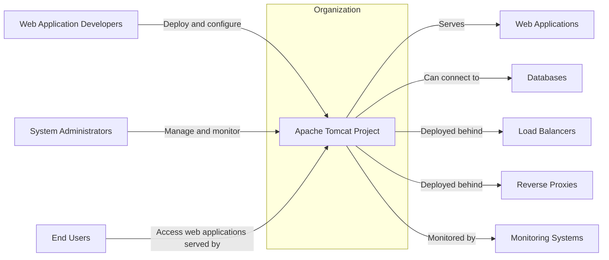
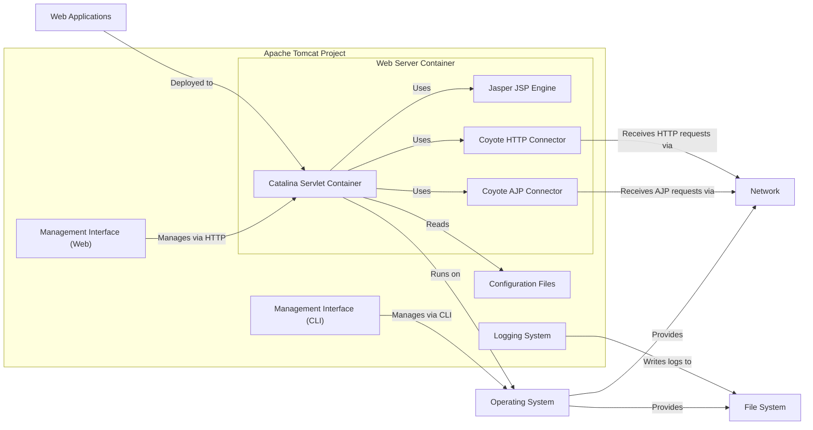
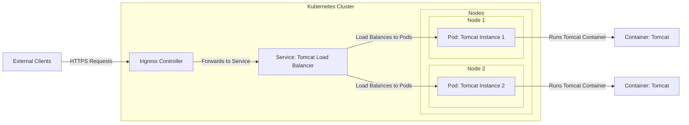

# BUSINESS POSTURE

- Business Priorities and Goals:
  - Provide a robust, reliable, and performant open-source web server and servlet container.
  - Adhere to Java Servlet and JSP specifications to ensure compatibility and interoperability.
  - Maintain a secure platform for deploying web applications.
  - Foster a strong community of users and contributors.
  - Ensure long-term stability and support for the project.
- Business Risks:
  - Security vulnerabilities in Tomcat could lead to data breaches, service disruptions, and reputational damage for users.
  - Performance issues could negatively impact user experience and application availability.
  - Lack of compliance with specifications could lead to application compatibility problems.
  - Community decline could result in slower development and reduced support.
  - Instability or lack of updates could make Tomcat less attractive compared to alternatives.

# SECURITY POSTURE

- Existing Security Controls:
  - security control: Regular security updates and patches are released to address identified vulnerabilities. (Described in Apache Tomcat Security documentation and release notes)
  - security control: Security configuration options are available to harden Tomcat installations, such as disabling default ports, restricting access to management interfaces, and configuring secure protocols. (Described in Apache Tomcat Configuration Reference)
  - security control: Documentation on security best practices is provided to guide users in securing their Tomcat deployments. (Available on the Apache Tomcat website and documentation)
  - accepted risk: As an open-source project, vulnerability disclosure and patching relies on community reporting and volunteer effort, which might introduce delays compared to commercial products with dedicated security teams.
  - accepted risk: Users are responsible for properly configuring and maintaining the security of their Tomcat deployments, and misconfigurations can lead to vulnerabilities.

- Recommended Security Controls:
  - security control: Implement automated security scanning (SAST and DAST) in the development and release pipeline to proactively identify vulnerabilities.
  - security control: Establish a formal Security Incident Response Plan to handle security incidents effectively.
  - security control: Conduct regular security audits and penetration testing to identify and address potential weaknesses.
  - security control: Promote and enforce secure coding practices among contributors.
  - security control: Enhance supply chain security by verifying dependencies and using secure build processes.

- Security Requirements:
  - Authentication:
    - Requirement: Implement robust authentication mechanisms for accessing Tomcat management interfaces (e.g., Manager, Host Manager).
    - Requirement: Support various authentication methods, including username/password, certificate-based authentication, and integration with external authentication providers (e.g., LDAP, Active Directory).
  - Authorization:
    - Requirement: Implement fine-grained role-based access control (RBAC) to restrict access to Tomcat resources and functionalities based on user roles.
    - Requirement: Ensure that only authorized users can deploy, undeploy, and manage web applications.
  - Input Validation:
    - Requirement: Implement comprehensive input validation for all data received by Tomcat, including HTTP requests, configuration files, and management commands.
    - Requirement: Protect against common injection attacks such as SQL injection, cross-site scripting (XSS), and command injection.
  - Cryptography:
    - Requirement: Enforce the use of strong cryptography for protecting sensitive data in transit and at rest.
    - Requirement: Support secure communication protocols such as TLS/SSL for HTTPS connections.
    - Requirement: Provide options for encrypting sensitive configuration data, such as passwords and private keys.

# DESIGN

## C4 CONTEXT

- Context Diagram Elements:
  - - Name: Apache Tomcat Project
    - Type: Software System
    - Description: Open-source web server and servlet container for deploying and serving Java web applications.
    - Responsibilities:
      - Provide a runtime environment for Java web applications.
      - Handle HTTP requests and responses.
      - Manage web application lifecycle.
      - Provide management interfaces for configuration and monitoring.
    - Security controls:
      - Authentication and authorization for management interfaces.
      - Input validation for HTTP requests.
      - TLS/SSL for HTTPS connections.
      - Security configuration options.
  - - Name: Web Application Developers
    - Type: Person
    - Description: Developers who create and deploy web applications to Tomcat.
    - Responsibilities:
      - Develop Java web applications.
      - Package web applications for deployment.
      - Configure web application deployment descriptors.
    - Security controls:
      - Secure coding practices in web application development.
      - Input validation in web applications.
      - Authentication and authorization in web applications.
  - - Name: System Administrators
    - Type: Person
    - Description: Administrators responsible for installing, configuring, and maintaining Tomcat servers.
    - Responsibilities:
      - Install and configure Tomcat.
      - Deploy and manage web applications.
      - Monitor Tomcat performance and security.
      - Apply security updates and patches.
    - Security controls:
      - Secure configuration of Tomcat.
      - Access control to Tomcat server and configuration files.
      - Monitoring and logging of Tomcat activity.
  - - Name: End Users
    - Type: Person
    - Description: Users who access web applications served by Tomcat through web browsers or other clients.
    - Responsibilities:
      - Use web applications for their intended purposes.
    - Security controls:
      - Client-side security practices (e.g., browser security settings).
  - - Name: Web Applications
    - Type: Software System
    - Description: Java web applications deployed and running within Tomcat.
    - Responsibilities:
      - Provide specific functionalities to end users.
      - Interact with databases and other backend systems.
    - Security controls:
      - Application-level security controls (authentication, authorization, input validation, etc.).
  - - Name: Databases
    - Type: Software System
    - Description: Databases used by web applications to store and retrieve data.
    - Responsibilities:
      - Store application data.
      - Provide data access to web applications.
    - Security controls:
      - Database access control.
      - Data encryption at rest and in transit.
      - Database security hardening.
  - - Name: Load Balancers
    - Type: Software System
    - Description: Distribute incoming traffic across multiple Tomcat instances for scalability and high availability.
    - Responsibilities:
      - Distribute traffic.
      - Improve application availability and performance.
    - Security controls:
      - Load balancer security configuration.
      - TLS/SSL termination.
  - - Name: Reverse Proxies
    - Type: Software System
    - Description: Front-end servers that handle incoming requests and forward them to Tomcat, often providing additional security and performance benefits.
    - Responsibilities:
      - Request routing.
      - Security filtering (e.g., WAF).
      - Caching.
    - Security controls:
      - Reverse proxy security configuration.
      - Web Application Firewall (WAF) rules.
      - TLS/SSL termination.
  - - Name: Monitoring Systems
    - Type: Software System
    - Description: Systems used to monitor Tomcat's performance, health, and security.
    - Responsibilities:
      - Collect metrics and logs.
      - Alert on anomalies and security events.
    - Security controls:
      - Secure access to monitoring data.
      - Secure communication channels for monitoring data.

## C4 CONTAINER

- Container Diagram Elements:
  - - Name: Catalina Servlet Container
    - Type: Container
    - Description: The core servlet container in Tomcat, responsible for managing servlet lifecycle and processing requests.
    - Responsibilities:
      - Servlet lifecycle management.
      - Request processing and dispatching.
      - Session management.
      - Security management within the container.
    - Security controls:
      - Servlet security constraints (declarative and programmatic).
      - Realm-based authentication and authorization.
      - Input validation within servlets and filters.
  - - Name: Jasper JSP Engine
    - Type: Container
    - Description: The JSP engine that compiles JSP pages into servlets.
    - Responsibilities:
      - JSP compilation and execution.
      - JSP tag library support.
    - Security controls:
      - JSP expression language injection prevention.
      - Secure handling of JSP includes and tag libraries.
  - - Name: Coyote HTTP Connector
    - Type: Container
    - Description: The HTTP connector that listens for HTTP requests on a configured port.
    - Responsibilities:
      - HTTP protocol handling.
      - Request parsing and response generation.
      - TLS/SSL termination for HTTPS.
    - Security controls:
      - TLS/SSL configuration (cipher suites, protocols).
      - HTTP header security (e.g., HSTS, X-Frame-Options).
      - Request size limits and timeouts.
  - - Name: Coyote AJP Connector
    - Type: Container
    - Description: The AJP connector used for communication with reverse proxies or load balancers via the Apache JServ Protocol.
    - Responsibilities:
      - AJP protocol handling.
      - Communication with front-end servers.
    - Security controls:
      - AJP connector security configuration (secret required).
      - Restricting AJP connector access to trusted networks.
  - - Name: Configuration Files
    - Type: Container
    - Description: XML configuration files (e.g., server.xml, web.xml) that define Tomcat's settings and web application deployments.
    - Responsibilities:
      - Tomcat server configuration.
      - Web application deployment configuration.
      - Security realm configuration.
    - Security controls:
      - Access control to configuration files (file system permissions).
      - Secure storage of sensitive configuration data (e.g., encrypted passwords).
      - Validation of configuration file syntax and content.
  - - Name: Logging System
    - Type: Container
    - Description: Tomcat's logging system that records server events, access logs, and application logs.
    - Responsibilities:
      - Logging server activity.
      - Logging application events.
      - Log rotation and management.
    - Security controls:
      - Secure log storage and access control.
      - Log integrity protection.
      - Monitoring of logs for security events.
  - - Name: Management Interface (Web)
    - Type: Container
    - Description: Web-based management application (Tomcat Manager) for deploying, undeploying, and managing web applications.
    - Responsibilities:
      - Web application management.
      - Server status monitoring.
      - User and role management.
    - Security controls:
      - Authentication and authorization for access.
      - HTTPS for secure communication.
      - Protection against CSRF and other web application vulnerabilities.
  - - Name: Management Interface (CLI)
    - Type: Container
    - Description: Command-line interface (using scripts or JMX) for managing Tomcat.
    - Responsibilities:
      - Server management via command line.
      - Automation of management tasks.
    - Security controls:
      - Authentication and authorization for CLI access.
      - Secure shell (SSH) for remote access.
  - - Name: Web Applications
    - Type: External System
    - Description: Java web applications deployed to Tomcat.
    - Responsibilities: As described in Context Diagram.
    - Security controls: As described in Context Diagram.
  - - Name: Operating System
    - Type: Infrastructure
    - Description: The operating system on which Tomcat is running.
    - Responsibilities:
      - Provide system resources to Tomcat.
      - File system access.
      - Network access.
    - Security controls:
      - Operating system security hardening.
      - User and process isolation.
      - Security updates and patching.
  - - Name: File System
    - Type: Infrastructure
    - Description: The file system used by Tomcat to store configuration files, web applications, and logs.
    - Responsibilities:
      - Storage for Tomcat files.
    - Security controls:
      - File system permissions and access control.
      - Encryption at rest (optional).
  - - Name: Network
    - Type: Infrastructure
    - Description: The network infrastructure that Tomcat uses for communication.
    - Responsibilities:
      - Network connectivity for Tomcat.
    - Security controls:
      - Network segmentation and firewalls.
      - Network intrusion detection and prevention.

## DEPLOYMENT

- Deployment Options:
  - Standalone Server: Tomcat deployed on a single server instance. Suitable for development, testing, and small-scale production environments.
  - Clustered Environment: Multiple Tomcat instances deployed behind a load balancer for high availability and scalability. Suitable for production environments requiring high uptime and performance.
  - Containerized Deployment: Tomcat deployed within containers (e.g., Docker) and orchestrated by container platforms (e.g., Kubernetes). Suitable for modern cloud-native deployments and microservices architectures.

- Detailed Deployment (Containerized Deployment with Kubernetes):

- Deployment Diagram Elements (Containerized Deployment with Kubernetes):
  - - Name: Kubernetes Cluster
    - Type: Environment
    - Description: Kubernetes cluster providing container orchestration and management.
    - Responsibilities:
      - Container orchestration and scheduling.
      - Service discovery and load balancing.
      - Scalability and high availability.
    - Security controls:
      - Kubernetes RBAC for access control.
      - Network policies for network segmentation.
      - Secrets management for sensitive data.
      - Security audits and vulnerability scanning of Kubernetes components.
  - - Name: Nodes (Node 1, Node 2)
    - Type: Infrastructure
    - Description: Worker nodes in the Kubernetes cluster where Tomcat pods are deployed.
    - Responsibilities:
      - Run container workloads.
      - Provide compute resources.
    - Security controls:
      - Operating system security hardening on nodes.
      - Container runtime security (e.g., Docker, containerd).
      - Node security monitoring and patching.
  - - Name: Pods (Tomcat Instance 1, Tomcat Instance 2)
    - Type: Container
    - Description: Kubernetes pods encapsulating Tomcat containers.
    - Responsibilities:
      - Run Tomcat instances.
      - Isolate Tomcat containers.
    - Security controls:
      - Container security best practices.
      - Resource limits and quotas for pods.
      - Security context for pods (user, group, capabilities).
  - - Name: Containers (Tomcat)
    - Type: Container
    - Description: Docker containers running the Tomcat application.
    - Responsibilities:
      - Run the Tomcat server.
      - Serve web applications.
    - Security controls:
      - Container image security scanning.
      - Minimal container image (base image, dependencies).
      - Immutable container images.
  - - Name: Service: Tomcat Load Balancer
    - Type: Software System
    - Description: Kubernetes service that acts as a load balancer for Tomcat pods within the cluster.
    - Responsibilities:
      - Load balancing traffic to Tomcat pods.
      - Service discovery for Tomcat pods.
    - Security controls:
      - Service account security.
      - Network policies to restrict access to the service.
  - - Name: Ingress Controller
    - Type: Software System
    - Description: Kubernetes Ingress controller that manages external access to services within the cluster.
    - Responsibilities:
      - External access point for Tomcat.
      - TLS/SSL termination.
      - Request routing based on hostnames or paths.
    - Security controls:
      - Ingress controller security configuration.
      - Web Application Firewall (WAF) integration (optional).
      - TLS/SSL certificate management.
  - - Name: External Clients
    - Type: External System
    - Description: Users or systems accessing Tomcat applications from outside the Kubernetes cluster.
    - Responsibilities:
      - Access web applications.
    - Security controls:
      - Client-side security practices.
      - Network security controls (firewalls).

## BUILD

```mermaid
flowchart LR
    A["Developer"] --> B["Code Changes"]
    B --> C["GitHub Repository"]
    C --> D["GitHub Actions Workflow"]
    subgraph "GitHub Actions Workflow"
        D --> E["Checkout Code"]
        E --> F["Build (Maven)"]
        F --> G["Unit Tests"]
        G --> H["Static Analysis Security Testing (SAST)"]
        H --> I["Dependency Check"]
        I --> J["Container Image Build (Docker)"]
        J --> K["Container Image Scan"]
        K --> L["Publish Artifacts (Container Registry, Maven Repository)"]
    end
    L --> M["Artifacts (Container Image, JAR/WAR)"]
```

- Build Process Description:
  - Developer commits code changes to the GitHub repository.
  - GitHub Actions workflow is triggered on code changes (e.g., push, pull request).
  - Workflow steps:
    - Checkout Code: Retrieves the latest code from the repository.
    - Build (Maven): Compiles the Java code using Maven, runs tests, and packages the application.
    - Unit Tests: Executes unit tests to ensure code quality and functionality.
    - Static Analysis Security Testing (SAST): Performs static code analysis to identify potential security vulnerabilities in the code.
    - Dependency Check: Analyzes project dependencies for known vulnerabilities.
    - Container Image Build (Docker): Builds a Docker container image for Tomcat.
    - Container Image Scan: Scans the Docker image for vulnerabilities.
    - Publish Artifacts: Publishes build artifacts (container image to a container registry, JAR/WAR files to a Maven repository).

- Build Process Elements:
  - - Name: Developer
    - Type: Person
    - Description: Software developer contributing to the Tomcat project.
    - Responsibilities:
      - Write and commit code changes.
      - Run local builds and tests.
    - Security controls:
      - Secure development environment.
      - Code review process.
      - Secure coding practices.
  - - Name: Code Changes
    - Type: Data
    - Description: Modifications to the source code.
    - Responsibilities:
      - Implement new features and bug fixes.
      - Address security vulnerabilities.
    - Security controls:
      - Version control (Git).
      - Code review.
  - - Name: GitHub Repository
    - Type: Software System
    - Description: GitHub repository hosting the Tomcat source code.
    - Responsibilities:
      - Version control.
      - Collaboration platform.
    - Security controls:
      - Access control to the repository.
      - Branch protection rules.
      - Audit logging.
  - - Name: GitHub Actions Workflow
    - Type: Software System
    - Description: Automated CI/CD pipeline defined in GitHub Actions.
    - Responsibilities:
      - Automated build process.
      - Automated testing.
      - Security checks.
      - Artifact publishing.
    - Security controls:
      - Secure workflow definition.
      - Secrets management for credentials.
      - Workflow execution isolation.
  - - Name: Checkout Code
    - Type: Build Step
    - Description: Step in the workflow to retrieve code from the repository.
    - Responsibilities:
      - Code retrieval.
    - Security controls:
      - Access control to the repository.
  - - Name: Build (Maven)
    - Type: Build Step
    - Description: Step in the workflow to compile and package the code using Maven.
    - Responsibilities:
      - Code compilation.
      - Dependency management.
      - Packaging.
    - Security controls:
      - Dependency vulnerability scanning (Maven plugins).
      - Build reproducibility.
  - - Name: Unit Tests
    - Type: Build Step
    - Description: Step in the workflow to execute unit tests.
    - Responsibilities:
      - Code quality assurance.
      - Functional testing.
    - Security controls:
      - Secure test environment.
  - - Name: Static Analysis Security Testing (SAST)
    - Type: Build Step
    - Description: Step in the workflow to perform static code analysis for security vulnerabilities.
    - Responsibilities:
      - Identify potential security flaws in code.
    - Security controls:
      - SAST tool configuration and updates.
      - Vulnerability reporting and tracking.
  - - Name: Dependency Check
    - Type: Build Step
    - Description: Step in the workflow to check dependencies for known vulnerabilities.
    - Responsibilities:
      - Identify vulnerable dependencies.
    - Security controls:
      - Dependency check tool configuration and updates.
      - Vulnerability reporting and tracking.
  - - Name: Container Image Build (Docker)
    - Type: Build Step
    - Description: Step in the workflow to build a Docker container image.
    - Responsibilities:
      - Container image creation.
    - Security controls:
      - Secure Dockerfile.
      - Minimal base image.
      - Build arguments and secrets management.
  - - Name: Container Image Scan
    - Type: Build Step
    - Description: Step in the workflow to scan the Docker image for vulnerabilities.
    - Responsibilities:
      - Identify vulnerabilities in container image layers and dependencies.
    - Security controls:
      - Container image scanning tool configuration and updates.
      - Vulnerability reporting and tracking.
  - - Name: Publish Artifacts (Container Registry, Maven Repository)
    - Type: Build Step
    - Description: Step in the workflow to publish build artifacts to repositories.
    - Responsibilities:
      - Artifact distribution.
    - Security controls:
      - Secure access to repositories.
      - Artifact signing and verification.
  - - Name: Artifacts (Container Image, JAR/WAR)
    - Type: Data
    - Description: Build outputs, including container images and JAR/WAR files.
    - Responsibilities:
      - Deployable artifacts.
    - Security controls:
      - Artifact integrity verification.
      - Secure storage of artifacts.

# RISK ASSESSMENT

- Critical Business Processes:
  - Serving web applications to end users.
  - Management and administration of the Tomcat server.
  - Development and maintenance of the Tomcat project itself.

- Data to Protect and Sensitivity:
  - Web Application Data: Sensitivity depends on the applications deployed on Tomcat. Could range from public information to highly sensitive personal or financial data.
  - Configuration Data: Includes sensitive information like passwords, keys, and connection strings. High sensitivity.
  - Log Data: May contain sensitive information depending on logging configuration. Medium to high sensitivity.
  - Source Code: Intellectual property of the Apache Software Foundation and contributors. Medium sensitivity (integrity and availability are key).
  - Build Artifacts: Deployable software components. Medium sensitivity (integrity and availability are key).

# QUESTIONS & ASSUMPTIONS

- BUSINESS POSTURE:
  - Assumption: Tomcat is used in a wide range of environments, from development to production, and by organizations of varying sizes and risk appetites.
  - Question: What are the specific compliance requirements (e.g., PCI DSS, HIPAA, GDPR) that Tomcat deployments might need to adhere to?

- SECURITY POSTURE:
  - Assumption: Basic security controls are in place, but there is always room for improvement, especially in areas like automated security testing and supply chain security.
  - Question: What is the current vulnerability management process for Tomcat? How quickly are security patches released and applied by users?

- DESIGN:
  - Assumption: The design is based on a standard web server architecture, with clear separation of concerns between the web server container, connectors, and management interfaces.
  - Question: Are there any specific architectural components or features in Tomcat that are known to be more complex or prone to security vulnerabilities?