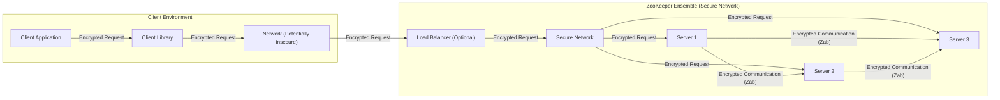
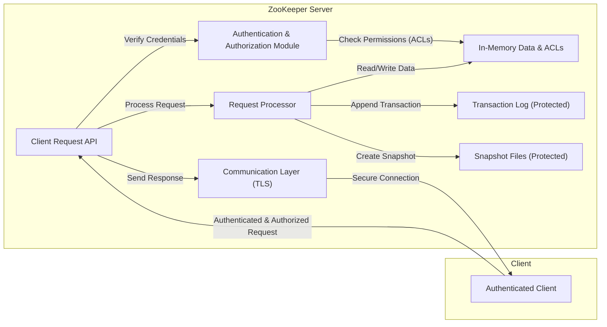

## Project Design Document: Apache ZooKeeper for Threat Modeling (Improved)

**1. Introduction**

This document provides an enhanced design overview of the Apache ZooKeeper project, specifically tailored for subsequent threat modeling activities. It aims to provide a clear and detailed understanding of the system's architecture, key components, data flow, and interactions, with a strong emphasis on aspects relevant to security considerations. This document is based on publicly available information from the Apache ZooKeeper project, primarily the source code repository: [https://github.com/apache/zookeeper](https://github.com/apache/zookeeper). The goal is to provide sufficient detail for security professionals to identify potential threats and vulnerabilities.

**2. System Overview**

Apache ZooKeeper is a foundational distributed coordination service. It provides a reliable and centralized way to manage configuration information, naming conventions, distributed synchronization primitives, and group membership for distributed applications. It enables developers to build complex distributed systems without having to implement these core coordination functionalities from scratch.

Key security-relevant characteristics of ZooKeeper include:

*   **Hierarchical Namespace with ACLs:** Data is organized in a hierarchical namespace (znodes), and access control is managed through Access Control Lists (ACLs) associated with each znode.
*   **Session Management:** Clients interact with ZooKeeper through sessions, which have associated authentication and authorization contexts.
*   **Watch Events:** The watch mechanism, while useful, can also be a target for manipulation or information leakage if not properly secured.
*   **Consensus-Based Updates:** Write operations rely on a consensus protocol (Zab), which has its own security considerations regarding message integrity and authenticity.
*   **Persistence and Recovery:** Data persistence mechanisms (transaction logs and snapshots) are critical for reliability but also represent potential targets for tampering.

**3. Component Details**

This section details the major components of the ZooKeeper system, with a focus on their security implications.

*   **ZooKeeper Server (Ensemble Member):** The fundamental building block of a ZooKeeper deployment.
    *   **Leader:**  Orchestrates write operations, ensuring consistency across the ensemble. Security considerations include protecting the leader election process and the leader's communication channels.
    *   **Follower:** Replicates data and participates in the consensus protocol. Security concerns involve ensuring the authenticity and integrity of messages from the leader.
    *   **Observer:** Serves read requests without participating in the quorum. While improving read scalability, observers need to be considered in the security model to prevent information leakage.
    *   **Request Processor Pipeline:** Handles incoming client requests. This pipeline includes stages for:
        *   **Authentication:** Verifying the identity of the client. Supports various schemes like SASL (e.g., Kerberos, Digest).
        *   **Authorization:** Checking if the authenticated client has the necessary permissions (based on ACLs) to perform the requested operation.
        *   **Mutation/Read Processing:**  Executing the requested operation on the in-memory data tree.
        *   **Persistence:** Writing changes to the transaction log.
*   **Client:**  Applications interact with the ZooKeeper ensemble through a client library.
    *   **Connection Management:** Establishes and maintains connections to the ensemble. Secure connection establishment (e.g., using TLS) is crucial.
    *   **Session Handling:** Manages client sessions, including authentication credentials and session timeouts.
    *   **Watch Management:** Registers and receives notifications for watches on znodes.
*   **Data Store:**  Manages the persistent state of ZooKeeper.
    *   **In-Memory Data Tree:** The primary, fast-access storage for the hierarchical namespace. Security relies on proper access control enforcement.
    *   **Transaction Log:** An append-only log of all write operations. Integrity of the transaction log is paramount for recovery and consistency.
    *   **Snapshot Files:** Periodic dumps of the in-memory data tree. Access control to snapshot files is important to prevent unauthorized data access.
*   **Zab (ZooKeeper Atomic Broadcast) Protocol:** The consensus protocol ensuring all non-faulty servers agree on the order of transactions. Security considerations include:
    *   **Message Authenticity:** Verifying the sender of messages between servers.
    *   **Message Integrity:** Ensuring messages haven't been tampered with during transmission.
    *   **Protection Against Replay Attacks:** Preventing malicious actors from replaying past messages.
*   **Networking Layer:** Handles communication between clients and servers, and between servers within the ensemble.
    *   **TCP Protocol:**  ZooKeeper primarily uses TCP. Security measures like TLS/SSL can be implemented to encrypt communication.

**4. Data Flow (Detailed Scenarios)**

This section describes the flow of data within the ZooKeeper system for different operations, highlighting potential security implications at each step.

*   **Secure Client Connection Establishment:**
    *   Client initiates a connection to a ZooKeeper server.
    *   If configured, a secure handshake (e.g., TLS) is performed to establish an encrypted channel.
    *   Client authenticates itself to the server (e.g., using SASL). Failure to establish a secure connection or authenticate properly can lead to unauthorized access.
*   **Authenticated Client Read Request:**
    *   Authenticated client sends a read request to a ZooKeeper server.
    *   The server checks the client's permissions against the ACL of the target znode. Insufficient permissions will result in an authorization failure.
    *   If authorized, the server retrieves the data from its in-memory data tree.
    *   The server sends the response back to the client over the established secure channel.
*   **Authenticated Client Write Request (Secure Path):**
    *   Authenticated client sends a write request to a ZooKeeper server.
    *   The receiving server forwards the request to the leader.
    *   The leader authenticates the request and checks the client's permissions against the target znode's ACL.
    *   The leader proposes the change to the followers via the Zab protocol. Secure communication channels are essential here to prevent tampering.
    *   Followers verify the integrity and authenticity of the proposal.
    *   Once a quorum acknowledges, the leader commits the change to its local data store and transaction log.
    *   The leader informs the followers to commit.
    *   Followers commit the change to their local data stores and transaction logs.
    *   The leader sends a success response to the client over the secure channel.
*   **Failed Write Request (Authorization Failure):**
    *   Authenticated client sends a write request.
    *   The leader (or the receiving follower) checks the client's permissions.
    *   If the client lacks the necessary permissions, the request is rejected, and an authorization error is returned to the client. Proper ACL configuration is crucial to prevent unauthorized modifications.
*   **Watch Notification Delivery:**
    *   When a watched znode is modified, the server generates a watch event.
    *   The server identifies the clients that have registered watches on that znode.
    *   The server sends the watch event notification to the registered clients. Ensuring the notification is delivered securely and only to authorized clients is important.
*   **Leader Election Process:**
    *   Servers communicate with each other using the Zab protocol to elect a leader. Security of this process is vital to prevent malicious actors from gaining control of the ensemble. Mechanisms for preventing Sybil attacks and ensuring message integrity are important.
*   **Data Synchronization (New Follower Joining):**
    *   A new follower connects to the leader.
    *   The leader authenticates the follower.
    *   The leader sends a snapshot of the current data to the follower. Secure transfer of the snapshot is necessary to maintain confidentiality and integrity.
    *   The leader sends subsequent transaction logs to the follower. Integrity checks on the transaction logs are important.

**5. Security Considerations (Detailed)**

This section expands on the initial security considerations, providing more specific examples of potential threats and vulnerabilities.

*   **Authentication and Authorization:**
    *   **Threat:** Unauthorized access to sensitive data or the ability to manipulate the system due to weak or misconfigured authentication mechanisms.
    *   **Vulnerability:** Using default credentials, insecure SASL configurations, or overly permissive ACLs.
*   **Data Confidentiality:**
    *   **Threat:** Exposure of sensitive data stored in znodes.
    *   **Vulnerability:** Lack of encryption for data at rest or in transit. Sniffing network traffic could reveal sensitive information.
*   **Data Integrity:**
    *   **Threat:** Tampering with data stored in znodes or in the transaction logs, leading to inconsistencies or incorrect system behavior.
    *   **Vulnerability:** Lack of integrity checks on data in transit or at rest. Compromised servers could modify data.
*   **Availability:**
    *   **Threat:** Denial of service attacks preventing legitimate clients from accessing the service.
    *   **Vulnerability:** Resource exhaustion due to excessive requests, network flooding, or vulnerabilities in the Zab protocol.
*   **Network Security:**
    *   **Threat:** Man-in-the-middle attacks, eavesdropping, and unauthorized access due to insecure network configurations.
    *   **Vulnerability:** Lack of encryption (TLS/SSL) for client-server and server-server communication, open ports, and inadequate firewall rules.
*   **Auditing:**
    *   **Threat:** Lack of visibility into who accessed or modified data, hindering incident response and forensic analysis.
    *   **Vulnerability:** Insufficient logging of security-relevant events.
*   **Denial of Service (DoS):**
    *   **Threat:** Overwhelming the ZooKeeper ensemble with requests, preventing it from serving legitimate clients.
    *   **Vulnerability:** Lack of rate limiting or other mechanisms to mitigate DoS attacks. Watcher exhaustion can also be a DoS vector.
*   **Vulnerabilities in Dependencies:**
    *   **Threat:** Exploitation of known vulnerabilities in the underlying libraries and frameworks used by ZooKeeper.
    *   **Vulnerability:** Using outdated or vulnerable versions of dependencies.
*   **Session Hijacking:**
    *   **Threat:** An attacker gaining control of a legitimate client's session.
    *   **Vulnerability:** Weak session management, lack of secure session identifiers.
*   **Replay Attacks:**
    *   **Threat:** An attacker intercepting and retransmitting valid requests to perform unauthorized actions.
    *   **Vulnerability:** Lack of mechanisms to prevent replay attacks, especially during authentication or write operations.

**6. Deployment Architecture (Security Focused)**

A secure ZooKeeper deployment should consider the following:

*   **Network Segmentation:** Isolating the ZooKeeper ensemble within a private network segment, limiting access from untrusted networks.
*   **Firewall Rules:** Implementing strict firewall rules to allow only necessary traffic to and from the ZooKeeper servers.
*   **Secure Communication:** Enabling TLS/SSL for both client-server and server-server communication to encrypt data in transit.
*   **Strong Authentication:** Utilizing robust authentication mechanisms like Kerberos for both client and inter-server authentication.
*   **Principle of Least Privilege:** Configuring ACLs with the minimum necessary permissions for each client and application.
*   **Regular Security Audits:** Periodically reviewing the configuration and access controls of the ZooKeeper ensemble.
*   **Secure Configuration Management:** Protecting configuration files and ensuring only authorized personnel can modify them.
*   **Monitoring and Alerting:** Implementing monitoring systems to detect suspicious activity and security breaches.
*   **Regular Patching:** Keeping the ZooKeeper software and its dependencies up-to-date with the latest security patches.

**7. Diagrams**

This section provides visual representations of the ZooKeeper architecture and data flow, highlighting security boundaries.

**8. Assumptions and Out of Scope**

*   **Assumptions:**
    *   This document assumes a basic understanding of distributed systems and security principles.
    *   The focus is on the core ZooKeeper functionality and does not delve into specific client library implementations.
    *   The deployment environment is assumed to be a standard network infrastructure.
*   **Out of Scope:**
    *   Detailed analysis of specific vulnerabilities in past ZooKeeper versions.
    *   Implementation details of specific authentication providers.
    *   Operating system-level security considerations for the servers hosting ZooKeeper.
    *   Detailed performance analysis.

**9. Conclusion**

This improved design document provides a more detailed and security-focused overview of Apache ZooKeeper. By outlining the key components, data flow with security considerations, and potential threats, this document serves as a valuable resource for conducting thorough threat modeling activities. Understanding these aspects is crucial for building secure and resilient applications that rely on ZooKeeper for distributed coordination.