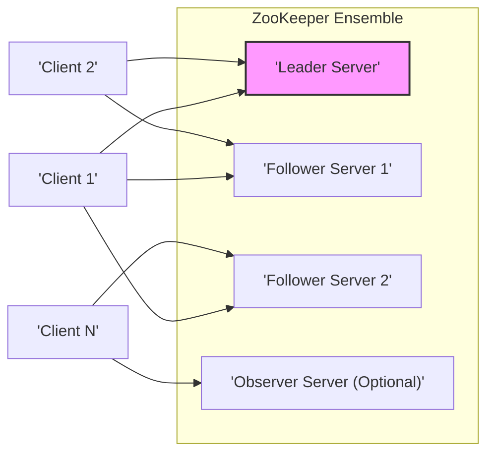
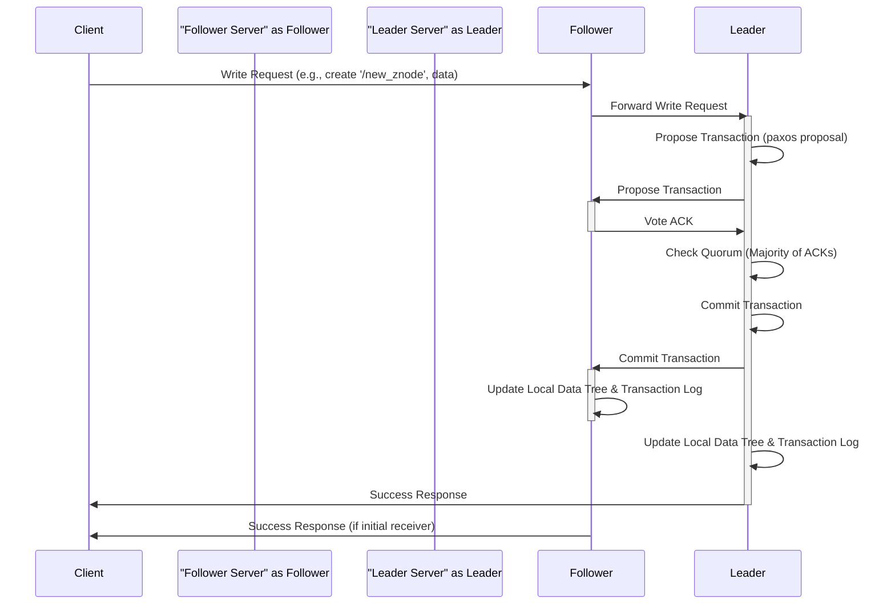
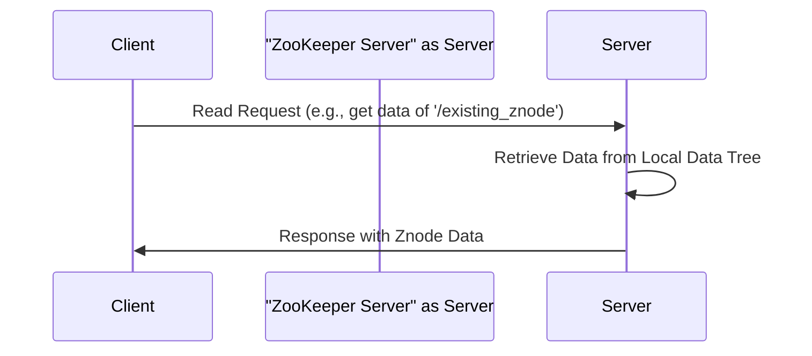

# Project Design Document: Apache ZooKeeper

**Version:** 1.1
**Date:** October 26, 2023
**Author:** AI Software Architect

## 1. Introduction

This document provides a detailed design overview of Apache ZooKeeper, a distributed, open-source coordination service for distributed applications. It exposes a simple set of primitives that distributed applications can build upon to implement higher-level synchronization, configuration management, group membership, and leader election services. This document aims to provide a comprehensive understanding of ZooKeeper's architecture, components, and interactions, serving as a robust foundation for subsequent threat modeling activities. A clear understanding of this design is crucial for identifying potential vulnerabilities and attack vectors.

## 2. Goals and Objectives

The primary goals of Apache ZooKeeper are:

*   **Simplified Distributed Coordination:** Provide a fundamental and reliable building block for distributed systems, abstracting away the complexities of maintaining consistent state across multiple nodes.
*   **High Availability and Fault Tolerance:** Ensure continuous operation and data consistency even in the face of server failures within the ensemble.
*   **Strictly Ordered Operations:** Guarantee that all updates to the ZooKeeper state are processed in a strict, globally consistent, and sequential order. This is fundamental for implementing distributed consensus.
*   **Data Reliability and Durability:** Persist data to stable storage and maintain consistency of the data across the entire ensemble.
*   **Scalable Read Performance:** Offer low-latency reads by allowing clients to read from any server in the ensemble.

This design document aims to:

*   Clearly and comprehensively describe the architectural components of ZooKeeper and their individual responsibilities.
*   Illustrate the detailed interactions and communication patterns between these components.
*   Detail the end-to-end data flow within the system for both read and write operations.
*   Thoroughly outline the built-in security considerations and potential areas of concern.
*   Provide a solid foundation for identifying potential security threats, attack surfaces, and vulnerabilities within the ZooKeeper system.

## 3. High-Level Architecture

ZooKeeper operates as a replicated service, forming a highly available cluster. A group of ZooKeeper servers, collectively known as an *ensemble*, maintains a shared, hierarchical namespace of data registers called *znodes*. Clients connect to any server within the ensemble. Within the ensemble, a leader-follower architecture is employed, where one server is dynamically elected as the *leader*, and the remaining servers function as *followers* (and optionally *observers*).

Key aspects of the high-level architecture:

*   **Ensemble:** A quorum-based group of ZooKeeper servers working in concert to provide the coordination service.
*   **Leader:** The single point of coordination for write requests, responsible for ordering and broadcasting updates to the followers.
*   **Followers:** Replicate the state from the leader, participate in leader election, and serve read requests from clients.
*   **Observers:** Replicate the state from the leader but do not participate in leader election or the quorum voting process for write operations. They primarily serve to improve read scalability.
*   **Clients:** External applications or services that interact with the ZooKeeper service to perform coordination tasks.

## 4. Detailed Design

### 4.1. ZooKeeper Server

Each ZooKeeper server within the ensemble runs the core ZooKeeper service. The server architecture can be broken down into the following key components:

*   **Request Processor:** The entry point for handling incoming client requests.
    *   Receives diverse types of requests from connected clients (e.g., create, read, update, delete znode, set/get watchers).
    *   Identifies the nature of the request (read or write operation).
    *   Forwards all write requests to the designated leader server if the receiving server is a follower or observer.
    *   Processes read requests locally by accessing the in-memory data tree, improving read performance.
*   **Atomic Broadcast (ZAB - ZooKeeper Atomic Broadcast) Protocol:** The core consensus protocol that guarantees all write operations are processed in the same order on all servers within the ensemble, ensuring data consistency. It consists of distinct phases:
    *   **Leader Election:** The process by which the ensemble selects a single server to act as the leader. This occurs during initial startup or when the current leader fails.
    *   **Discovery:**  When a new follower joins the ensemble or an existing follower restarts, it synchronizes its state with the current leader to ensure it has the latest committed data.
    *   **Synchronization:**  Ensures that all active servers in the ensemble have a consistent view of the committed transaction log before normal operation resumes after a leader election.
    *   **Broadcast:** The primary operational phase where the leader proposes changes (transactions), and followers vote to acknowledge these proposals. Once a quorum of acknowledgements is received, the leader commits the transaction.
*   **Data Tree (In-Memory):**  A hierarchical namespace residing in the server's memory, representing the current state of the ZooKeeper data. This structure is composed of znodes.
    *   Stores the entire hierarchical structure of znodes and their associated data.
    *   Provides extremely fast access for read operations, as data retrieval is performed directly from memory.
*   **Persistence:** Mechanisms to ensure data durability and recoverability in case of server failures.
    *   **Transaction Log:** A durable, append-only log on disk that records every committed transaction (write operation) in the order it was processed. This log is crucial for recovery.
    *   **Snapshots:** Periodic, full dumps of the entire in-memory data tree written to disk. Snapshots optimize recovery time by reducing the number of transaction logs that need to be replayed.
*   **Client Session Management:**  Responsible for managing active client connections and their associated sessions.
    *   Establishes and maintains persistent connections with clients.
    *   Manages session timeouts, automatically closing sessions if a client becomes unresponsive for a specified duration.
    *   Maintains session state information, including any ephemeral znodes created by the session.
*   **Authentication and Authorization:**  Components that handle security by controlling access to znodes based on client identity and permissions.
    *   **Authentication:** Verifies the identity of connecting clients using pluggable authentication schemes, primarily SASL (Simple Authentication and Security Layer).
    *   **Authorization:** Enforces access control lists (ACLs) defined on each znode, determining which clients or groups have permissions to perform specific operations (read, write, create, delete, admin).
*   **Watchers:** A notification mechanism that allows clients to register their interest in specific znodes and receive asynchronous notifications when those znodes change.
    *   Watcher information is stored on the server that the client is connected to.
    *   Notifications are triggered when a watched znode is created, deleted, or its data or metadata is modified.

### 4.2. Client

ZooKeeper clients are libraries that provide applications with the necessary tools to interact with the ZooKeeper ensemble. Key aspects of the client:

*   **Connection Management:** Handles the establishment and maintenance of connections to the ZooKeeper ensemble.
    *   Automatically attempts to reconnect to other servers in the ensemble if the currently connected server becomes unavailable, providing resilience.
    *   Maintains a list of available servers in the ensemble to facilitate failover.
*   **API:**  Provides a rich set of methods for interacting with the ZooKeeper service.
    *   Fundamental CRUD operations for znodes: `create()`, `getData()`, `setData()`, `delete()`.
    *   Methods for managing watchers: `exists()`, `getData()`, `getChildren()` with a `watch` flag.
    *   Session management operations.
    *   Methods for managing ACLs.
*   **Local Cache (Optional):** Some client implementations may employ a local cache to store recently accessed znode data, potentially improving read performance for repeated requests. However, clients must be aware of potential staleness.
*   **Event Handling:**  Provides mechanisms for receiving and processing asynchronous notifications from ZooKeeper servers, primarily watcher events.

### 4.3. Data Model (Znodes)

ZooKeeper's data is organized in a hierarchical namespace, much like a file system. The fundamental data unit is the *znode*.

*   **Hierarchical Tree Structure:**  Znodes are arranged in a tree-like structure, with a single root node ("/").
*   **Data Storage:**  Each znode can store a small amount of data (typically up to 1 MB, though smaller sizes are recommended for performance).
*   **Metadata (Stat):** Each znode has associated metadata, providing information about the znode:
    *   **ACL (Access Control List):** Defines the permissions for accessing the znode.
    *   **ctime (Creation Time):** Timestamp indicating when the znode was created.
    *   **mtime (Modification Time):** Timestamp indicating the last time the znode's data was modified.
    *   **dataVersion:**  The number of times the znode's data has been changed.
    *   **aclVersion:** The number of times the znode's ACL has been changed.
    *   **cversion:** The number of child znodes created under this znode.
    *   **ephemeralOwner:** The session ID of the client that created an ephemeral znode.
    *   **dataLength:** The size of the data stored in the znode.
    *   **numChildren:** The number of immediate child znodes.
*   **Types of Znodes:**
    *   **Persistent:** The most common type of znode. These znodes remain in ZooKeeper even after the client that created them disconnects. They must be explicitly deleted.
    *   **Ephemeral:** These znodes are automatically deleted by ZooKeeper when the session of the client that created them expires (due to disconnection or timeout). They are often used for leader election and presence detection.
    *   **Sequential:**  These znodes can be either persistent or ephemeral. When a client creates a sequential znode, ZooKeeper appends a monotonically increasing counter to the znode's name. This is useful for implementing fair queuing and ordering.

## 5. Data Flow

### 5.1. Write Request Flow

The following diagram illustrates the detailed flow of a write request (e.g., creating a znode) in ZooKeeper:

Key steps in the write request flow:

1. A client sends a write request (e.g., creating a znode) to a ZooKeeper server. This can be any server in the ensemble.
2. If the receiving server is a follower, it forwards the request to the current leader.
3. The leader initiates the ZAB protocol by creating a proposal for the transaction.
4. The leader broadcasts the proposal to all followers.
5. Each follower that accepts the proposal writes it to its transaction log and sends an acknowledgement (ACK) back to the leader.
6. The leader waits until it receives acknowledgements from a quorum (majority) of followers.
7. Once a quorum is reached, the leader commits the transaction.
8. The leader informs all followers to commit the transaction.
9. Followers commit the transaction by writing it to their transaction logs and updating their in-memory data trees.
10. The leader updates its own in-memory data tree and transaction log.
11. The leader sends a success response back to the client. If the client initially connected to a follower, the follower also forwards the success response.

### 5.2. Read Request Flow

Read requests are generally simpler and faster as they are typically served locally:

Key steps in the read request flow:

1. A client sends a read request to any ZooKeeper server in the ensemble.
2. The receiving server retrieves the requested data directly from its local in-memory data tree.
3. The server sends the znode data back to the client. This avoids the overhead of the ZAB protocol.

## 6. Security Considerations

ZooKeeper incorporates several security mechanisms, but it's crucial to understand their limitations and potential vulnerabilities for effective threat modeling:

*   **Authentication:** Verifies the identity of clients connecting to the ensemble.
    *   **SASL (Simple Authentication and Security Layer):** The primary mechanism for client authentication, supporting various pluggable authentication methods like Kerberos, Digest, and others. Misconfiguration or weak SASL configurations can lead to unauthorized access.
    *   Clients must provide valid credentials during the session establishment phase. Compromised credentials can allow attackers to impersonate legitimate clients.
*   **Authorization:** Controls which authenticated clients have permission to perform specific operations on individual znodes.
    *   **ACLs (Access Control Lists):**  Associated with each znode, defining granular permissions (read, write, create, delete, admin) for different authenticated users or groups (using various schemes like `auth`, `ip`, `world`, `digest`). Incorrectly configured or overly permissive ACLs are a common source of vulnerabilities.
    *   Authorization checks are performed on the server-side before any operation is executed.
*   **Data Integrity:**  Guaranteed by the ZAB protocol, ensuring that all servers agree on the order of transactions. The transaction log and snapshots also contribute to data integrity. However, vulnerabilities in the ZAB implementation itself could compromise integrity.
*   **Data Confidentiality:**  This is an area where ZooKeeper's built-in features are limited.
    *   **No Native Encryption at Rest:** ZooKeeper does not inherently encrypt the data stored in znodes on disk. Organizations handling sensitive data must implement external encryption mechanisms at the storage layer.
    *   **Encryption in Transit (TLS/SSL):** ZooKeeper supports encrypting client-server communication using TLS/SSL. This is crucial for protecting sensitive data transmitted over the network. However, enabling and properly configuring TLS is essential.
*   **Auditing:** ZooKeeper logs significant server events, which can be valuable for security auditing and incident response. However, the level of detail and retention policies for these logs should be carefully considered.
*   **Denial of Service (DoS):**  ZooKeeper ensembles are susceptible to DoS attacks.
    *   **Connection Exhaustion:** Attackers could attempt to exhaust server resources by opening a large number of connections.
    *   **Write Request Floods:**  Flooding the leader with write requests can overwhelm the system.
    *   **Read Request Floods:** While reads are generally scalable, excessive read requests can still impact performance.
*   **ZooKeeper Itself as a Target:**  Compromising a ZooKeeper server can have significant consequences for the applications relying on it. Security hardening of the underlying operating system and ZooKeeper processes is crucial.

## 7. Deployment Considerations

*   **Ensemble Size and Quorum:**  Deploying with an odd number of servers (typically 3 or 5) is recommended for optimal fault tolerance and to avoid split-brain scenarios during leader election. The quorum size (majority of servers) determines the number of failures the ensemble can tolerate.
*   **Network Latency:** Low and consistent network latency between servers is critical for the performance of the ZAB protocol and overall system responsiveness.
*   **Resource Allocation:** Each ZooKeeper server requires adequate CPU, memory (especially for the in-memory data tree), and fast disk I/O for transaction logs and snapshots.
*   **Firewall Configuration:**  Appropriate firewall rules should be in place to restrict access to ZooKeeper ports (default 2181 for client connections, 2888 and 3888 for inter-server communication).
*   **Monitoring and Alerting:**  Implementing robust monitoring of key metrics (leader state, latency, connection counts, disk space, etc.) and setting up alerts for anomalies is essential for operational stability and early detection of potential issues.
*   **Security Hardening:**  Following security best practices for the underlying operating system, Java Virtual Machine (JVM), and ZooKeeper configuration is crucial. This includes keeping software up-to-date with security patches.

## 8. Assumptions and Constraints

*   The network infrastructure between ZooKeeper servers is assumed to be reasonably reliable, with occasional transient network partitions being the primary concern for fault tolerance mechanisms.
*   ZooKeeper is generally optimized for read-heavy workloads, with the expectation that the number of write operations is significantly lower than read operations.
*   The size of data stored in individual znodes is expected to be relatively small (kilobytes), as storing large amounts of data can impact performance.
*   Clients interacting with ZooKeeper are assumed to be well-behaved and adhere to the defined ZooKeeper API and protocols. Malicious or poorly implemented clients can potentially cause issues.

## 9. Conclusion

This enhanced design document provides a comprehensive and detailed overview of Apache ZooKeeper's architecture, components, data flow, and security considerations. This information serves as a vital resource for conducting thorough threat modeling to identify potential vulnerabilities and design appropriate security mitigations. A deep understanding of ZooKeeper's internal workings and security features is paramount for building secure and reliable distributed applications that leverage its powerful coordination capabilities. Recognizing the inherent limitations, particularly regarding data confidentiality, is crucial for implementing supplementary security measures where necessary.