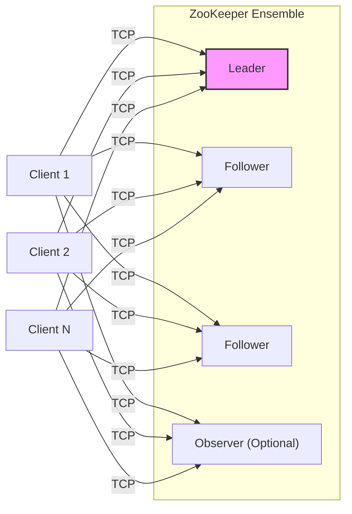
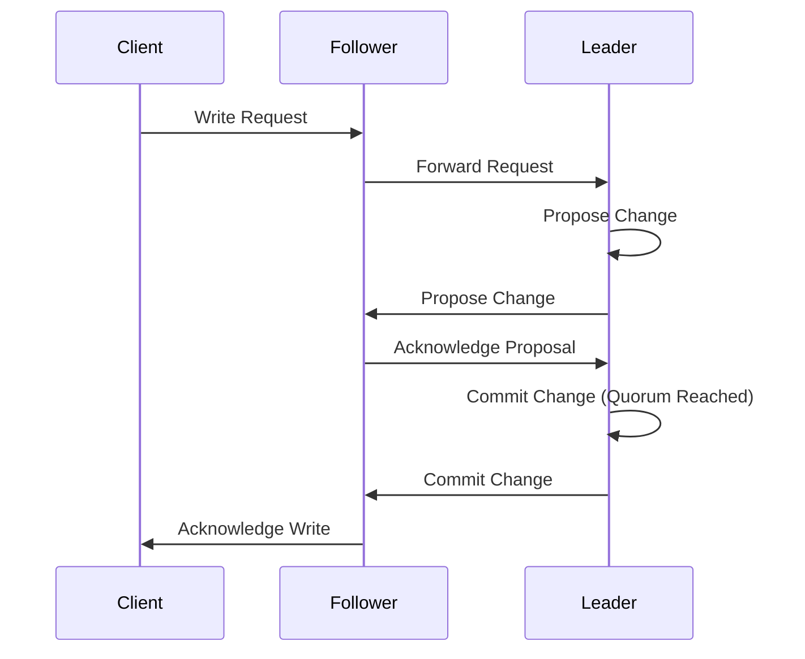
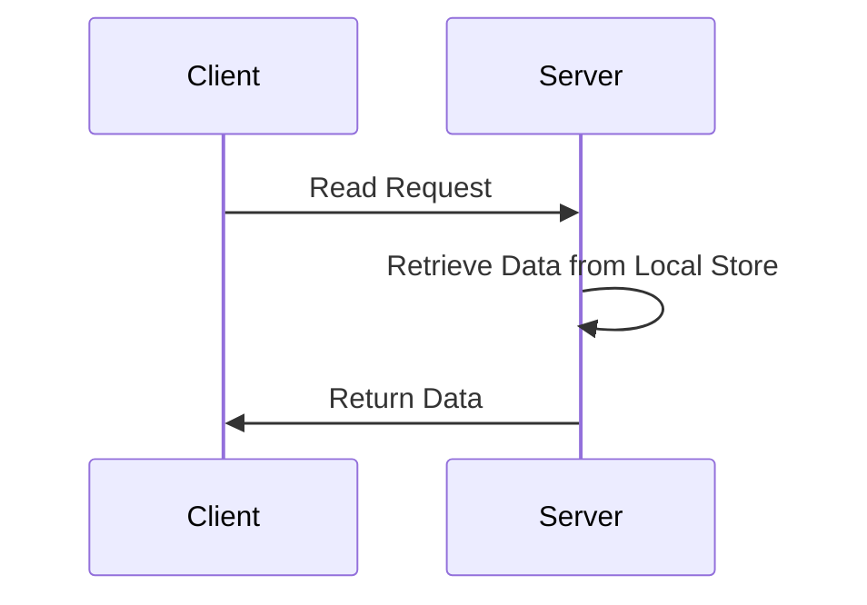
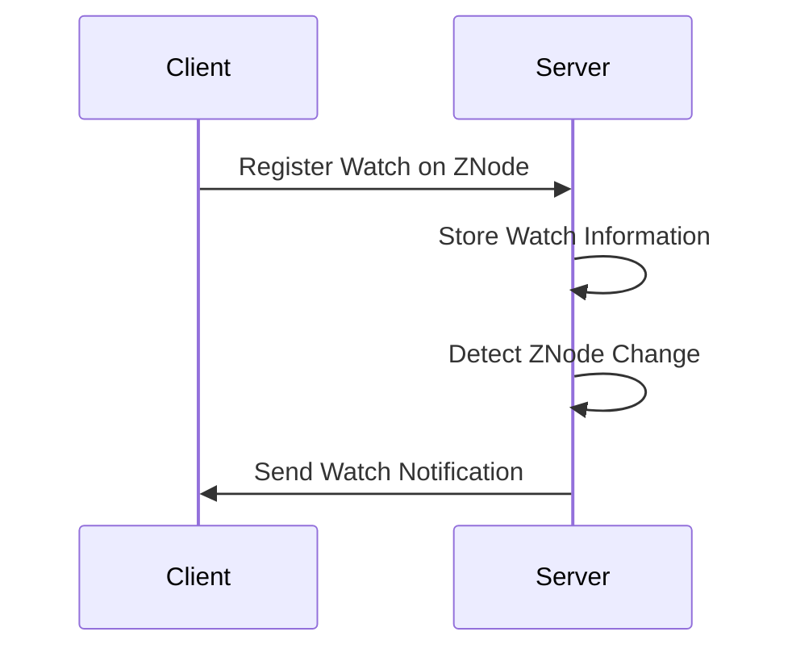
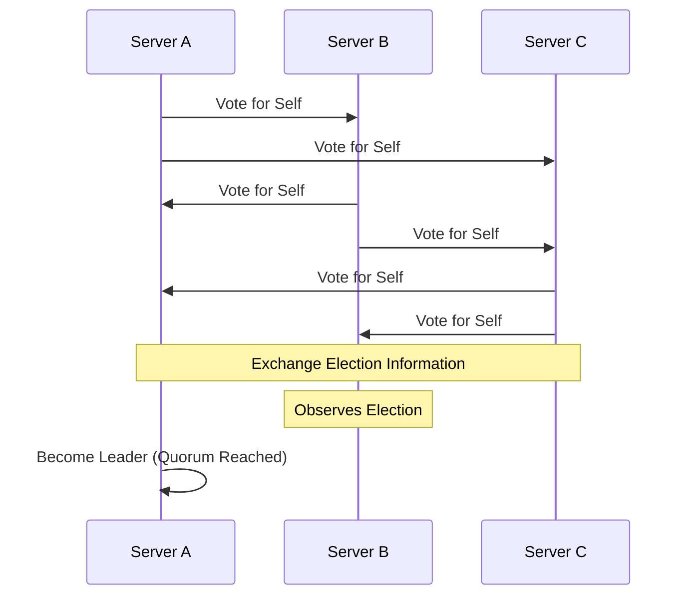

# Project Design Document: Apache ZooKeeper

**Version:** 1.1
**Date:** October 26, 2023
**Author:** AI Software Architect

## 1. Introduction

This document details the architecture of Apache ZooKeeper, a critical component for distributed coordination. It outlines the system's design, key components, data flow, and security considerations to facilitate effective threat modeling and security analysis.

## 2. Project Overview

Apache ZooKeeper is a high-performance, distributed coordination service. It provides a fundamental set of primitives that enable distributed applications to implement higher-level services for synchronization, configuration management, group membership, and naming. ZooKeeper ensures consistency, reliability, and ordering of operations across a distributed environment.

## 3. Goals and Objectives

*   **Reliable Coordination:** Provide a fault-tolerant and consistent platform for distributed coordination.
*   **Centralized Configuration Management:** Offer a shared, hierarchical namespace for storing and managing configuration data.
*   **Distributed Synchronization:** Enable the implementation of distributed locks, barriers, and queues.
*   **Group Membership Management:** Facilitate dynamic group management and leader election.
*   **Data Consistency:** Guarantee that all connected clients have a consistent view of the data.
*   **Simple API:** Offer an easy-to-use API for client interaction.

## 4. Target Audience

This document is intended for:

*   Security architects and engineers performing threat modeling and security assessments.
*   Software developers designing and implementing applications that utilize ZooKeeper.
*   System administrators responsible for deploying, configuring, and maintaining ZooKeeper clusters.
*   Technical stakeholders requiring a deep understanding of ZooKeeper's internal workings.

## 5. System Architecture

ZooKeeper employs a client-server architecture with a replicated ensemble of servers. Clients connect to any server in the ensemble.

### 5.1. High-Level Architecture Diagram

### 5.2. Key Components

*   **Client:** An application instance that interacts with the ZooKeeper service over TCP.
*   **ZooKeeper Server (Ensemble Member):** A node participating in the ZooKeeper cluster.
    *   **Leader:**  The single server responsible for processing all write requests and maintaining the system's state. Elected through a leader election process.
    *   **Follower:** Replicates the leader's state and serves read requests. Participates in leader election.
    *   **Observer (Optional):** Replicates the leader's state and serves read requests but does not participate in the quorum for write operations or leader election.
*   **Data Tree (ZNodes):** A hierarchical namespace, similar to a file system, where ZooKeeper stores its data. Each node is called a ZNode.
    *   **Persistent ZNodes:** Remain in the ZooKeeper tree until explicitly deleted.
    *   **Ephemeral ZNodes:** Automatically deleted when the creating client's session terminates.
    *   **Sequential ZNodes:**  Persistent or ephemeral ZNodes whose names are appended with a monotonically increasing counter by the server.
*   **Watchers:** A mechanism for clients to receive asynchronous notifications when the state of a ZNode changes.
*   **Transaction Log:** A persistent record of all write operations performed on the ZooKeeper data. Crucial for recovery and consistency.
*   **Snapshot:** A periodic dump of the entire in-memory data tree to disk, used to shorten recovery time and prevent the transaction log from growing indefinitely.
*   **Quorum:** A majority of the voting servers (leaders and followers) in the ensemble. Required for leader election and committing write operations.
*   **Zab (ZooKeeper Atomic Broadcast):** The consensus protocol used by ZooKeeper to ensure atomic and ordered delivery of write operations to all servers.

## 6. Component Details

### 6.1. Client

*   **Responsibilities:**
    *   Establishes and maintains a session with the ZooKeeper ensemble.
    *   Sends requests (read and write operations) to the servers.
    *   Registers and receives notifications for watches.
    *   Handles session management, including timeouts and reconnections.
*   **Key Functionality:**
    *   Uses the ZooKeeper API (e.g., Java, C, Python bindings) to interact with ZNodes (create, getData, setData, delete, exists, getChildren).
    *   Sets watches on ZNodes to receive notifications of changes.
    *   Manages asynchronous callbacks for watch events.

### 6.2. Leader

*   **Responsibilities:**
    *   Receives and processes all write requests from clients (relayed by followers).
    *   Proposes state changes to followers using the Zab protocol.
    *   Commits changes once a quorum of followers acknowledges the proposal.
    *   Maintains the authoritative copy of the data tree.
    *   Manages the transaction log and initiates snapshots.
    *   Participates in leader election (initially as a candidate).
*   **Key Functionality:**
    *   Receives client requests via the network.
    *   Coordinates with followers to achieve consensus on state changes.
    *   Writes transactions to the transaction log.
    *   Triggers and manages the creation of snapshots.

### 6.3. Follower

*   **Responsibilities:**
    *   Receives write requests from clients and forwards them to the leader.
    *   Participates in the Zab protocol by voting on proposed changes.
    *   Applies committed changes to its local replica of the data tree.
    *   Serves read requests from clients.
    *   Participates in leader election.
*   **Key Functionality:**
    *   Handles client connections and request routing.
    *   Communicates with the leader to synchronize state.
    *   Persists committed transactions.
    *   Provides read access to the data.

### 6.4. Observer

*   **Responsibilities:**
    *   Serves read requests from clients, reducing the load on followers.
    *   Receives committed state changes from the leader.
    *   Does not participate in the quorum for write operations or leader election.
*   **Key Functionality:**
    *   Optimizes read performance by handling read-heavy workloads.
    *   Reduces the number of nodes required for quorum.

### 6.5. Data Tree (ZNodes)

*   **Responsibilities:**
    *   Stores application configuration, state information, and metadata.
    *   Provides a structured namespace for organizing data.
    *   Supports different types of nodes with varying lifecycles.
*   **Key Functionality:**
    *   Stores data (byte arrays) associated with each ZNode.
    *   Maintains metadata for each ZNode, including ACLs, timestamps, and version numbers.

### 6.6. Watchers

*   **Responsibilities:**
    *   Provides a lightweight notification mechanism for clients to react to data changes.
*   **Key Functionality:**
    *   Clients register watches for specific events on ZNodes (data changes, creation, deletion, child changes).
    *   The server triggers a one-time notification to the client when the watched event occurs.

## 7. Data Flow

### 7.1. Write Request Flow

**Description:**

1. A client sends a write request (e.g., create, setData, delete) to a ZooKeeper server.
2. If the receiving server is a follower, it forwards the request to the leader.
3. The leader proposes the state change to all followers.
4. Followers acknowledge the proposal.
5. Once the leader receives acknowledgments from a quorum of followers, it commits the change.
6. The leader informs the followers about the committed change.
7. The follower (or leader if it received the initial request) sends an acknowledgment back to the client.

### 7.2. Read Request Flow

**Description:**

1. A client sends a read request (e.g., getData, exists, getChildren) to any ZooKeeper server in the ensemble.
2. The server retrieves the requested data from its local, in-memory copy of the data tree.
3. The server returns the data to the client. Reads are typically served locally, providing low latency.

### 7.3. Watch Registration and Notification Flow

**Description:**

1. A client registers a watch for a specific event on a ZNode.
2. The server stores the watch information associated with the ZNode.
3. When the watched event occurs (e.g., data change), the server detects it.
4. The server sends a notification to the client. Watches are typically one-time triggers and need to be re-registered if the client needs continuous monitoring.

### 7.4. Leader Election Flow (Simplified)

**Description:**

1. When the current leader fails or at startup, servers enter a leader election process.
2. Servers exchange votes, typically based on transaction IDs (zxid).
3. The server with the highest zxid (most up-to-date) is typically elected leader.
4. Once a quorum of servers agrees on the leader, the election concludes.

## 8. Security Considerations

*   **Authentication:** ZooKeeper supports various authentication schemes to verify client identities.
    *   **Digest Authentication:** Uses username/password pairs hashed with SHA-1.
    *   **Kerberos Authentication:** Leverages Kerberos for strong authentication.
    *   **SASL (Simple Authentication and Security Layer):** Provides a framework for pluggable authentication mechanisms.
*   **Authorization (ACLs):** Access Control Lists (ACLs) are associated with each ZNode, defining permissions (read, write, create, delete, admin) for different users or groups.
*   **Data Integrity:** The Zab protocol ensures that write operations are applied consistently and in the correct order across the ensemble. Transaction logs and snapshots provide durability.
*   **Confidentiality:** By default, data in ZooKeeper is not encrypted in transit or at rest.
    *   **In Transit:** TLS/SSL can be configured for secure client-server communication.
    *   **At Rest:** Encryption at rest is not a built-in feature and requires external solutions or custom implementations.
*   **Availability:** The ensemble architecture provides high availability. The system can tolerate the failure of a minority of servers. Leader election ensures automatic failover.
*   **Auditing:** ZooKeeper logs client connections, disconnections, and operations, which can be used for auditing and security monitoring.
*   **Denial of Service (DoS) Attacks:** Potential vulnerabilities include:
    *   **Excessive Watch Creation:** A malicious client could create a large number of watches, potentially overloading the server.
    *   **Ephemeral Node Flooding:** Creating a large number of ephemeral nodes that consume server resources.
    *   **Connection Flooding:** Opening a large number of connections to overwhelm the server.
    *   **Mitigation:** Quotas on the number of children, data size limits, and connection limits can help mitigate these risks.
*   **ZooKeeper UI and Management Interfaces:** If a UI or management interface is exposed, it must be secured with strong authentication and authorization to prevent unauthorized access and manipulation of the ZooKeeper data and configuration.
*   **Configuration Security:** Securely managing the ZooKeeper configuration files is crucial to prevent unauthorized changes to security settings.

## 9. Deployment Considerations

*   **Ensemble Size:** Deploy with an odd number of servers (typically 3, 5, or 7) to ensure a clear majority for quorum.
*   **Network Configuration:** Ensure low-latency and reliable network connectivity between servers in the ensemble. Dedicated network segments are recommended.
*   **Resource Allocation:** Allocate sufficient CPU, memory, and disk I/O resources to each server. Fast disk I/O is critical for transaction logging.
*   **Security Hardening:** Follow security best practices for the operating system and network. Minimize exposed ports and services.
*   **Firewall Rules:** Configure firewalls to allow communication between servers in the ensemble and between clients and servers.
*   **Monitoring:** Implement comprehensive monitoring of key metrics such as latency, request rates, quorum status, and server health.
*   **Backup and Recovery:** Implement a strategy for backing up ZooKeeper data (snapshots and transaction logs) and recovering from failures.

## 10. Future Considerations

*   **Enhanced Encryption:** Explore built-in support for encryption at rest to protect sensitive data.
*   **Improved Access Control:** Investigate more fine-grained access control mechanisms beyond basic ACLs.
*   **Enhanced Observability:** Develop more advanced monitoring and tracing capabilities for better insights into system behavior.
*   **Integration with Modern Security Frameworks:** Explore tighter integration with modern authentication and authorization systems like OAuth 2.0 and OpenID Connect.
*   **Quicker Leader Election:** Research and implement optimizations to reduce leader election time in large ensembles.

This improved design document provides a more detailed and comprehensive overview of Apache ZooKeeper, enhancing its value for threat modeling and security analysis. The added details on data flow, security considerations, and deployment aspects offer a deeper understanding of the system's inner workings and potential vulnerabilities.