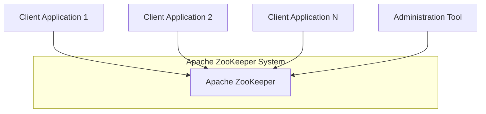
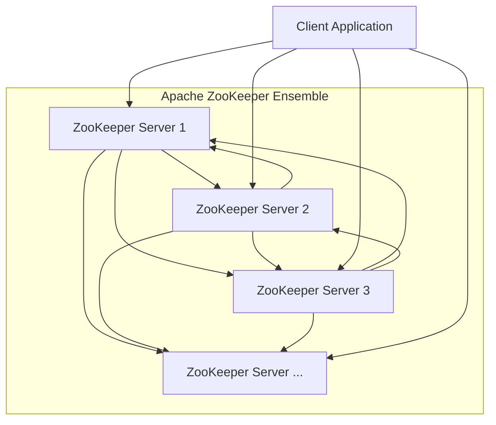
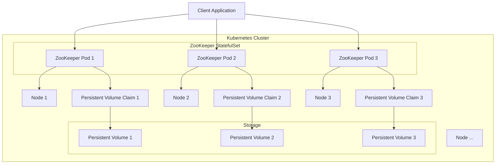
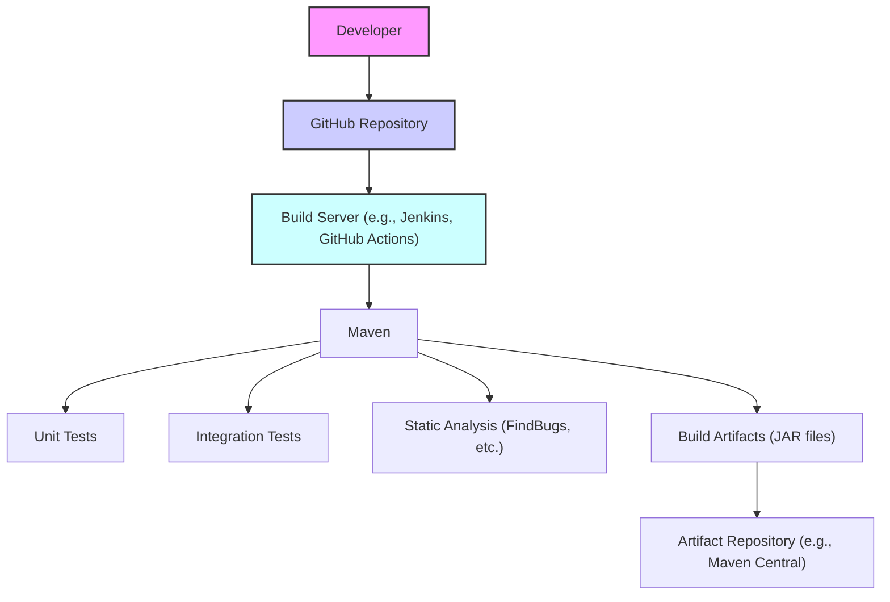

# BUSINESS POSTURE

Apache ZooKeeper is a centralized service for maintaining configuration information, naming, providing distributed synchronization, and providing group services. These kinds of services are used in some form or another by distributed applications. Each time they are implemented there is a lot of work that goes into fixing the bugs and race conditions that are inevitable. Because of the difficulty of implementing these kinds of services, applications initially usually skimp on them, which makes them brittle in the presence of change and difficult to manage. Even when done correctly, different implementations of these services lead to management complexity when the applications are deployed.

Business Priorities:

*   Provide a reliable, highly available, and performant coordination service for distributed applications.
*   Simplify the development of distributed applications by providing a common set of coordination primitives.
*   Maintain backward compatibility to ensure existing applications continue to function correctly.
*   Ensure data consistency and integrity.
*   Provide a simple and easy-to-use API.

Business Goals:

*   Become the de-facto standard for distributed coordination.
*   Support a wide range of distributed applications and use cases.
*   Maintain a vibrant and active open-source community.
*   Attract contributions from a diverse range of developers and organizations.

Most Important Business Risks:

*   Data loss or corruption due to software bugs, hardware failures, or operator errors.
*   Service unavailability due to network partitions, server crashes, or denial-of-service attacks.
*   Security breaches due to unauthorized access, data leaks, or malicious code injection.
*   Performance bottlenecks due to inefficient algorithms, excessive network traffic, or resource contention.
*   Incompatibility issues due to API changes, protocol upgrades, or configuration errors.

# SECURITY POSTURE

Existing Security Controls:

*   security control: SASL-based authentication: ZooKeeper supports Kerberos-based authentication using SASL. Described in ZooKeeper Programmer's Guide and JavaDocs.
*   security control: ACL-based authorization: ZooKeeper supports Access Control Lists (ACLs) to control access to znodes. Described in ZooKeeper Programmer's Guide.
*   security control: TLS/SSL for client-server and server-server communication: ZooKeeper supports encryption of communication channels. Described in ZooKeeper Programmer's Guide.
*   security control: Quorum configuration: ZooKeeper operates in a replicated mode, requiring a quorum of servers to be available for the service to function. This provides fault tolerance and resilience. Described in ZooKeeper Programmer's Guide.
*   security control: Snapshot and transaction log: ZooKeeper maintains a persistent snapshot of the data tree and a transaction log of all changes. This allows for recovery in case of failures. Described in ZooKeeper Programmer's Guide.

Accepted Risks:

*   accepted risk: By default, ZooKeeper client connections are unauthenticated and unencrypted. This is acceptable in trusted environments but should be addressed in security-sensitive deployments.
*   accepted risk: ZooKeeper's ACL model is relatively coarse-grained. It may not be suitable for applications requiring fine-grained access control.
*   accepted risk: ZooKeeper is vulnerable to denial-of-service attacks if not properly configured and secured.

Recommended Security Controls:

*   security control: Enforce mandatory TLS/SSL encryption for all client-server and server-server communication.
*   security control: Enable and enforce strong authentication using Kerberos or other robust authentication mechanisms.
*   security control: Implement regular security audits and penetration testing to identify and address vulnerabilities.
*   security control: Implement network segmentation to isolate ZooKeeper servers from untrusted networks.
*   security control: Monitor ZooKeeper server logs for suspicious activity.
*   security control: Use a dedicated, hardened operating system for ZooKeeper servers.
*   security control: Regularly update ZooKeeper to the latest version to benefit from security patches.

Security Requirements:

*   Authentication:
    *   All client connections must be authenticated using a strong authentication mechanism (e.g., Kerberos).
    *   Server-to-server communication must be mutually authenticated.
*   Authorization:
    *   Access to znodes must be controlled using ACLs.
    *   The principle of least privilege must be applied when granting permissions.
*   Input Validation:
    *   All client requests must be validated to prevent malicious data injection.
    *   Data size limits should be enforced to prevent resource exhaustion.
*   Cryptography:
    *   TLS/SSL must be used to encrypt all client-server and server-server communication.
    *   Strong cryptographic algorithms and key lengths must be used.
    *   Cryptographic keys must be securely managed and protected.

# DESIGN

## C4 CONTEXT

C4 Context Element List:

*   Element: Apache ZooKeeper
    *   Name: Apache ZooKeeper
    *   Type: System
    *   Description: Centralized service for maintaining configuration information, naming, providing distributed synchronization, and providing group services.
    *   Responsibilities:
        *   Maintain a hierarchical namespace of znodes.
        *   Provide a consistent view of the data to all clients.
        *   Handle client requests for data access, updates, and synchronization.
        *   Manage server membership and leader election.
        *   Ensure data durability and availability.
    *   Security controls:
        *   SASL-based authentication.
        *   ACL-based authorization.
        *   TLS/SSL encryption.
        *   Quorum configuration.
        *   Snapshot and transaction log.

*   Element: Client Application 1
    *   Name: Client Application 1
    *   Type: External System
    *   Description: A distributed application that uses ZooKeeper for coordination.
    *   Responsibilities:
        *   Connect to ZooKeeper.
        *   Read and write data to znodes.
        *   Register for watches on znodes.
        *   Implement application-specific logic using ZooKeeper primitives.
    *   Security controls:
        *   Authenticate to ZooKeeper (if configured).
        *   Use TLS/SSL for communication (if configured).

*   Element: Client Application 2
    *   Name: Client Application 2
    *   Type: External System
    *   Description: Another distributed application that uses ZooKeeper.
    *   Responsibilities: Same as Client Application 1.
    *   Security controls: Same as Client Application 1.

*   Element: Client Application N
    *   Name: Client Application N
    *   Type: External System
    *   Description: Represents any number of additional client applications.
    *   Responsibilities: Same as Client Application 1.
    *   Security controls: Same as Client Application 1.

*   Element: Administration Tool
    *   Name: Administration Tool
    *   Type: External System
    *   Description: Tools used to manage and monitor the ZooKeeper ensemble (e.g., zkCli.sh).
    *   Responsibilities:
        *   Connect to ZooKeeper.
        *   Inspect and modify znodes.
        *   Monitor server status.
        *   Perform administrative tasks.
    *   Security controls:
        *   Authenticate to ZooKeeper (if configured).
        *   Use TLS/SSL for communication (if configured).

## C4 CONTAINER

C4 Container Element List:

*   Element: ZooKeeper Server 1
    *   Name: ZooKeeper Server 1
    *   Type: Container
    *   Description: An instance of the ZooKeeper server process.
    *   Responsibilities:
        *   Participate in the ZooKeeper ensemble.
        *   Maintain a replica of the data tree.
        *   Handle client requests.
        *   Participate in leader election.
        *   Communicate with other ZooKeeper servers.
    *   Security controls:
        *   SASL-based authentication.
        *   ACL-based authorization.
        *   TLS/SSL encryption.
        *   Quorum configuration.
        *   Snapshot and transaction log.

*   Element: ZooKeeper Server 2, 3, N
    *   Name: ZooKeeper Server 2, 3, N
    *   Type: Container
    *   Description: Additional instances of the ZooKeeper server process.
    *   Responsibilities: Same as ZooKeeper Server 1.
    *   Security controls: Same as ZooKeeper Server 1.

*   Element: Client Application
    *   Name: Client Application
    *   Type: External System
    *   Description: A distributed application that uses ZooKeeper.
    *   Responsibilities:
        *   Connect to any ZooKeeper server in the ensemble.
        *   Send requests and receive responses.
    *   Security controls:
        *   Authenticate to ZooKeeper (if configured).
        *   Use TLS/SSL for communication (if configured).

## DEPLOYMENT

Possible deployment solutions:

1.  Bare-metal servers: ZooKeeper servers are deployed directly on physical hardware.
2.  Virtual machines: ZooKeeper servers are deployed on virtual machines within a private or public cloud.
3.  Containers (e.g., Docker): ZooKeeper servers are deployed as containers, managed by an orchestration platform like Kubernetes.

Chosen deployment solution (Containers with Kubernetes):

Deployment Element List:

*   Element: Kubernetes Cluster
    *   Name: Kubernetes Cluster
    *   Type: Infrastructure
    *   Description: A cluster of nodes managed by Kubernetes.
    *   Responsibilities:
        *   Provide resources for running containers.
        *   Manage container lifecycle.
        *   Provide networking and storage.
    *   Security controls:
        *   Kubernetes RBAC.
        *   Network policies.
        *   Pod security policies.

*   Element: Node 1, 2, 3, N
    *   Name: Node 1, 2, 3, N
    *   Type: Infrastructure
    *   Description: Worker nodes in the Kubernetes cluster.
    *   Responsibilities:
        *   Run containerized workloads.
    *   Security controls:
        *   Operating system hardening.
        *   Regular security updates.

*   Element: ZooKeeper StatefulSet
    *   Name: ZooKeeper StatefulSet
    *   Type: Kubernetes Resource
    *   Description: A Kubernetes StatefulSet that manages the deployment and scaling of ZooKeeper pods.
    *   Responsibilities:
        *   Ensure the ordered deployment and scaling of ZooKeeper pods.
        *   Provide stable network identities for ZooKeeper pods.
        *   Manage persistent storage for ZooKeeper pods.
    *   Security controls:
        *   Controlled by Kubernetes RBAC and Pod Security Policies.

*   Element: ZooKeeper Pod 1, 2, 3
    *   Name: ZooKeeper Pod 1, 2, 3
    *   Type: Container
    *   Description: Kubernetes Pods running the ZooKeeper server container.
    *   Responsibilities:
        *   Run the ZooKeeper server process.
    *   Security controls:
        *   Inherited from the ZooKeeper server container and Kubernetes security context.

*   Element: Persistent Volume Claim 1, 2, 3
    *   Name: Persistent Volume Claim 1, 2, 3
    *   Type: Kubernetes Resource
    *   Description: Requests for persistent storage for ZooKeeper pods.
    *   Responsibilities:
        *   Provision persistent storage for ZooKeeper data.
    *   Security controls:
        *   Storage access controls.

*   Element: Persistent Volume 1, 2, 3
    *   Name: Persistent Volume 1, 2, 3
    *   Type: Storage
    *   Description: Persistent storage volumes provisioned by the storage system.
    *   Responsibilities:
        *   Provide durable storage for ZooKeeper data.
    *   Security controls:
        *   Data encryption at rest.
        *   Storage access controls.

*   Element: Client Application
    *   Name: Client Application
    *   Type: External System
    *   Description: An application connecting to the ZooKeeper service.
    *   Responsibilities: Connect to ZooKeeper pods.
    *   Security controls: Application-level security controls.

## BUILD

The Apache ZooKeeper build process is managed by Apache Maven. The process starts when a developer commits code to the source code repository (GitHub).

Build Process Description:

1.  Developer commits code to the GitHub repository.
2.  A build server (e.g., Jenkins or GitHub Actions, as configured in the `.github/workflows` directory) detects the code change and triggers a build.
3.  Maven is used to manage the build process. The `pom.xml` file defines the build configuration, dependencies, and plugins.
4.  Maven compiles the source code.
5.  Unit tests are executed (defined in the `src/test` directory).
6.  Integration tests are executed (if configured).
7.  Static analysis tools (like FindBugs, as configured in the `pom.xml`) are run to identify potential code quality and security issues.
8.  If all tests and checks pass, Maven packages the code into build artifacts (JAR files).
9.  The build artifacts are deployed to an artifact repository (e.g., Maven Central).

Build Security Controls:

*   security control: Build automation: The build process is automated using Maven and a CI/CD system (Jenkins or GitHub Actions).
*   security control: Unit testing: Extensive unit tests are included to verify the correctness of individual components.
*   security control: Integration testing: Integration tests are used to verify the interaction between different components.
*   security control: Static analysis: Static analysis tools are used to identify potential code quality and security vulnerabilities.
*   security control: Dependency management: Maven manages project dependencies, helping to ensure that known vulnerable libraries are not used. (Requires regular updates and vulnerability scanning).
*   security control: Signed artifacts: Build artifacts can be digitally signed to ensure their integrity and authenticity.

# RISK ASSESSMENT

Critical Business Processes:

*   Distributed coordination: ZooKeeper is critical for the correct functioning of many distributed applications that rely on it for coordination, leader election, configuration management, and other services.
*   Data consistency: ZooKeeper ensures data consistency across the distributed application, preventing data corruption and race conditions.
*   High availability: ZooKeeper is designed for high availability, ensuring that the coordination service remains available even in the presence of failures.

Data Sensitivity:

*   Configuration data: ZooKeeper stores configuration data for distributed applications. The sensitivity of this data depends on the specific application. It can range from non-sensitive to highly sensitive (e.g., database credentials, API keys).
*   Metadata: ZooKeeper stores metadata about the distributed application, such as the location of services, the status of nodes, and the ownership of locks. This metadata can be sensitive as it reveals information about the application's architecture and internal state.
*   Application-specific data: Some applications may store application-specific data in ZooKeeper. The sensitivity of this data depends entirely on the application.

# QUESTIONS & ASSUMPTIONS

Questions:

*   What specific static analysis tools are used in the build process, and how are their findings addressed?
*   Are there any specific security hardening guidelines followed for deploying ZooKeeper servers?
*   What is the process for handling security vulnerabilities reported in ZooKeeper?
*   Are there any specific monitoring tools or dashboards used to monitor the security posture of ZooKeeper clusters?
*   What is the frequency of security audits and penetration testing?
*   How are cryptographic keys managed for TLS/SSL and SASL authentication?
*   What is the disaster recovery plan for ZooKeeper clusters?

Assumptions:

*   BUSINESS POSTURE: It is assumed that the primary business goal is to provide a reliable and robust coordination service, prioritizing availability and consistency over strict confidentiality.
*   SECURITY POSTURE: It is assumed that ZooKeeper deployments will often be in trusted environments, but security best practices should still be followed. It is also assumed that users will configure security features (TLS, SASL) as needed for their specific environment.
*   DESIGN: It is assumed that a standard ZooKeeper ensemble deployment with an odd number of servers (typically 3 or 5) is used. It is assumed that Kubernetes is a common deployment platform.