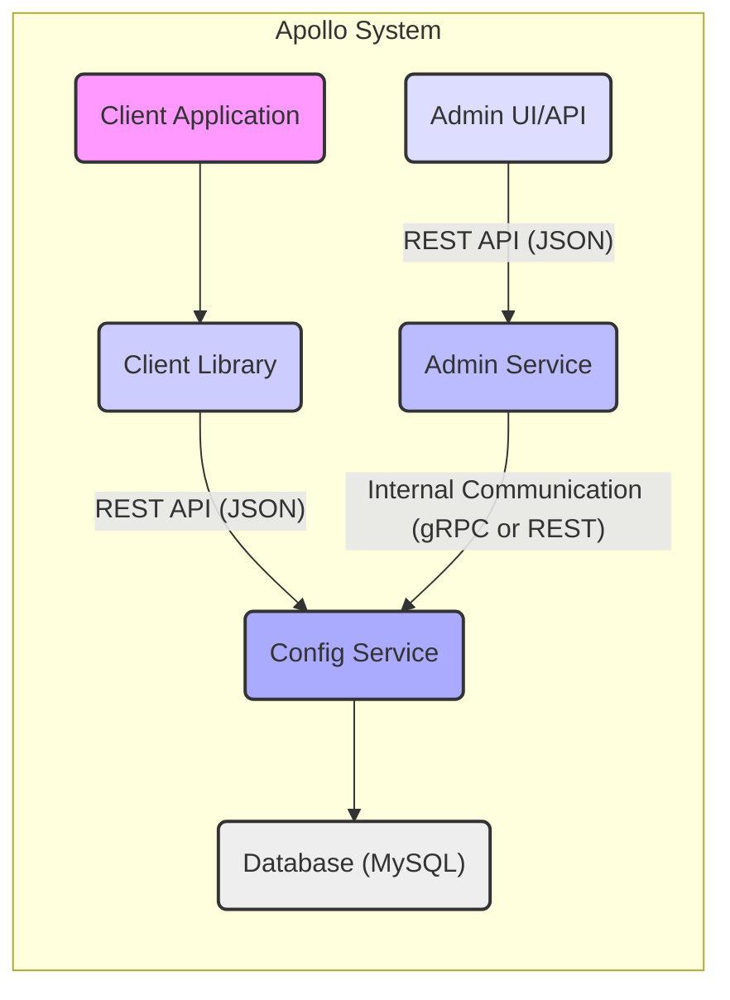
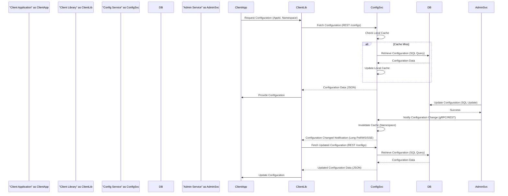
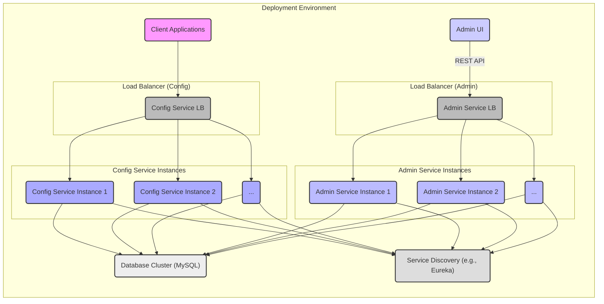

# Project Design Document: Apollo Configuration Management System

**Version:** 1.1
**Date:** October 26, 2023
**Author:** AI Software Architect

## 1. Introduction

This document provides an enhanced and more detailed design overview of the Apollo Configuration Management System, an open-source platform for managing application configuration. This improved document aims to provide a stronger foundation for subsequent threat modeling activities by offering a more granular understanding of the system's architecture, components, and data flow, including specific technologies and protocols.

### 1.1. Purpose

The primary purpose of this document is to clearly and concisely describe the architecture and design of the Apollo Configuration Management System with a focus on details relevant for security analysis. This document will serve as a crucial input for threat modeling exercises to identify potential security vulnerabilities and design effective mitigations.

### 1.2. Scope

This document covers the core components of the Apollo system, including the Config Service, Admin Service, and Client libraries. It elaborates on their functionalities, interactions (specifying protocols), and data storage mechanisms (including data formats). It also provides a more detailed view of the deployment architecture and expands on key security considerations.

### 1.3. Audience

This document is intended for:

* Security engineers and architects responsible for performing threat modeling and security assessments.
* Development teams involved in the development, maintenance, and integration of the Apollo system.
* Operations teams responsible for the deployment, configuration, and monitoring of the Apollo system.

## 2. System Overview

Apollo is designed as a distributed configuration management system enabling applications to fetch and update configuration in a consistent and reliable manner. It adheres to a client-server architecture with a central configuration repository, emphasizing high availability and scalability.

Here's a high-level overview of the key components and their interactions:

* **Config Service:** The central service responsible for serving configuration to client applications. It retrieves configuration from the database, caches it for performance, and provides real-time updates.
* **Admin Service:** Provides administrative interfaces (both UI and API) for managing applications, namespaces, configurations, and releases. It handles authentication and authorization for administrative actions.
* **Client Libraries:** Language-specific libraries integrated into applications to seamlessly interact with the Config Service and retrieve configuration data. They handle caching and updates.
* **Database:** A persistent storage layer, typically a relational database like MySQL, used to store the configuration data, including applications, namespaces, keys, values, and release history.

## 3. Component Details

This section provides a detailed description of each core component within the Apollo system, including specific technologies and data formats.

### 3.1. Config Service

* **Purpose:** To provide a highly available, performant, and reliable service for applications to retrieve their configuration data in real-time.
* **Functionality:**
    * **Configuration Retrieval:** Receives requests from client libraries (via REST API) for configuration data for specific applications and namespaces.
    * **Caching:** Retrieves configuration data from the database and caches it in memory (often using a multi-level caching strategy) for fast retrieval.
    * **Real-time Updates:** Supports mechanisms (e.g., long polling, WebSockets, Server-Sent Events) to notify clients of configuration changes.
    * **Environment and Namespace Management:**  Handles configuration retrieval based on the application's environment (e.g., dev, test, prod) and namespace.
    * **Health Checks:** Provides health check endpoints for monitoring and service discovery.
* **Interfaces:**
    * **Client API (REST):**  Exposes RESTful endpoints (typically using JSON for data exchange) for client libraries to fetch configuration. Examples include `/configs/{appId}/{clusterName}/{namespaceName}`.
    * **Admin API (Internal):** Communicates with the Admin Service, potentially via gRPC or REST, to receive notifications of configuration changes and potentially for other administrative tasks.
    * **Database Connection:** Connects to the database (typically MySQL) using standard database connection protocols (e.g., JDBC).
* **Data Storage:**
    * **In-memory Cache:** Stores frequently accessed configurations in memory for low-latency access.
    * **Database (MySQL):**  Relies on the central database for the persistent storage of configuration data, including application, namespace, and configuration key-value pairs.
* **Dependencies:**
    * **Database (e.g., MySQL):** For persistent storage.
    * **Caching Mechanism:**  In-memory data structures or potentially a distributed cache like Redis.
    * **Service Discovery (e.g., Eureka, Consul):** For registration and discovery in a microservices environment.
    * **HTTP Server:**  To handle incoming REST requests (e.g., Tomcat, Jetty).

### 3.2. Admin Service

* **Purpose:** To provide administrative interfaces for managing the configuration data, applications, and users within the Apollo system.
* **Functionality:**
    * **Configuration Management:** Provides APIs for creating, updating, and deleting applications, namespaces, and configuration key-value pairs.
    * **Release Management:** Manages the release process for configuration changes, allowing for versioning and rollback.
    * **Authentication and Authorization:** Handles user authentication (e.g., using username/password, OAuth) and authorization for administrative actions.
    * **Audit Logging:** Logs administrative actions for auditing and security purposes.
    * **Metrics and Monitoring:** Exposes metrics and monitoring information about the system's health and performance.
* **Interfaces:**
    * **Admin API (REST):** Exposes RESTful endpoints (typically using JSON) for the Admin UI and potentially other administrative tools to manage configurations. Examples include endpoints for creating/updating namespaces, configurations, and releases.
    * **Config Service API (Internal):** Communicates with the Config Service (potentially via gRPC or REST) to trigger cache updates when configurations are changed.
    * **Database Connection:** Connects to the database (typically MySQL) using standard database connection protocols (e.g., JDBC).
* **Data Storage:**
    * **Database (MySQL):** Relies on the central database for storing application metadata, namespace definitions, configuration data, release history, and user credentials (if managed internally).
* **Dependencies:**
    * **Database (e.g., MySQL):** For persistent storage.
    * **Authentication/Authorization Service:**  May be integrated or rely on an external service (e.g., an OAuth 2.0 provider).
    * **HTTP Server:** To handle incoming REST requests (e.g., Tomcat, Jetty).

### 3.3. Client Libraries

* **Purpose:** To simplify the integration of Apollo into applications and provide a consistent and efficient way to access configuration data.
* **Functionality:**
    * **Configuration Fetching:** Provides APIs for applications to fetch configuration values for specific namespaces.
    * **Local Caching:** Caches configuration data locally within the application for performance and resilience against temporary network issues.
    * **Real-time Updates:** Subscribes to configuration changes from the Config Service and automatically updates the local cache.
    * **Connection Management:** Handles connection management and retries to the Config Service.
    * **Namespace and Environment Awareness:** Allows applications to specify the application ID, cluster, and namespace for which they need configuration.
* **Interfaces:**
    * **Language-Specific APIs:** Provides easy-to-use APIs tailored to different programming languages (e.g., Java, .NET, Go).
    * **Config Service API (REST):** Communicates with the Config Service via its REST API (typically making HTTP requests with JSON).
* **Data Storage:**
    * **In-memory Cache:** Stores retrieved configuration data in memory within the application.
    * **Local File Cache (Optional):** Some client libraries may optionally persist the cache to local files for persistence across application restarts.
* **Dependencies:**
    * **HTTP Client Library:** For making requests to the Config Service (e.g., OkHttp, HttpClient).
    * **JSON Parsing Library:** For handling JSON responses from the Config Service.

### 3.4. Database

* **Purpose:** To provide persistent, reliable, and consistent storage for all configuration-related data within the Apollo system.
* **Functionality:**
    * **Data Persistence:** Stores application metadata, namespace definitions, configuration key-value pairs, and release history.
    * **Transactional Operations:** Supports transactional operations to ensure data consistency and integrity.
    * **Querying and Retrieval:** Enables efficient querying and retrieval of configuration data by the Config and Admin Services.
* **Interfaces:**
    * **Standard Database Connection Protocols:**  Accepts connections using standard protocols like JDBC (for Java).
* **Data Storage:**
    * **Relational Tables:** Stores data in well-defined relational tables with appropriate indexes for performance.
* **Dependencies:**
    * **Operating System and Storage Infrastructure:** Relies on the underlying infrastructure for storage and access.

## 4. Data Flow

The following describes the detailed data flow within the Apollo system for retrieving and updating configuration:

1. **Application Startup:** The client application starts and initializes the Apollo client library, providing its application ID, cluster name, and desired namespaces.
2. **Initial Configuration Request:** The client library makes an initial request to the Config Service's REST API (e.g., `/configs/{appId}/{clusterName}/{namespaceName}`) to fetch the current configuration for the specified namespaces.
3. **Config Service Processing:**
    * The Config Service receives the request and checks its in-memory cache for the requested configuration.
    * **Cache Hit:** If the configuration is found in the cache, it is immediately returned to the client library.
    * **Cache Miss:** If the configuration is not in the cache, the Config Service retrieves it from the database.
4. **Database Retrieval (Cache Miss):** The Config Service queries the database to retrieve the configuration data for the requested application, cluster, and namespace.
5. **Cache Update (Config Service):** The Config Service updates its in-memory cache with the retrieved configuration data.
6. **Response to Client:** The Config Service sends the configuration data (typically in JSON format) back to the client library via the REST API.
7. **Client Cache:** The client library caches the received configuration data locally in memory.
8. **Configuration Change (Admin Action):** An administrator uses the Admin UI or Admin API to update a configuration value.
9. **Admin Service Processing:**
    * The Admin Service authenticates and authorizes the administrator's request.
    * The Admin Service updates the configuration data in the database.
10. **Database Update:** The database stores the updated configuration.
11. **Notification to Config Service:** The Admin Service sends a notification to the Config Service (potentially via gRPC or a dedicated REST endpoint) indicating that a configuration change has occurred for a specific namespace.
12. **Config Service Cache Invalidation:** The Config Service receives the notification and invalidates its cache for the affected namespace(s).
13. **Client Notification (Long Polling/WebSockets/SSE):** Client libraries typically maintain a long-polling connection, WebSocket connection, or subscribe to Server-Sent Events with the Config Service. The Config Service sends a notification to the subscribed clients about the configuration change.
14. **Client Update Request:** Upon receiving the notification, the client library makes a new request to the Config Service to fetch the updated configuration.
15. **Repeat Configuration Retrieval:** Steps 3-6 are repeated to retrieve the updated configuration.
16. **Client Cache Update:** The client library updates its local cache with the new configuration values.
17. **Application Update:** The client application receives the updated configuration from the client library and applies the changes.

## 5. Deployment Architecture

Apollo is typically deployed as a set of microservices within a containerized environment (e.g., using Docker and Kubernetes). A common deployment architecture involves:

* **Multiple Config Service Instances:** Deployed behind a load balancer (e.g., Nginx, HAProxy) for high availability, scalability, and traffic distribution. These instances register with a service discovery mechanism.
* **Multiple Admin Service Instances:** Also deployed behind a load balancer for high availability and scalability. They also register with the service discovery mechanism.
* **Central Database Cluster:** A highly available database cluster (e.g., MySQL with replication) for storing configuration data.
* **Service Discovery Infrastructure:** (e.g., Eureka, Consul, etcd) for Config and Admin Services to register their availability and for other services to discover them.
* **Admin UI Deployment:** A web application (often built with frameworks like React or Vue.js) deployed separately and interacting with the Admin Service via its REST API.

## 6. Security Considerations

This section outlines key security considerations for the Apollo Configuration Management System, providing a basis for threat modeling.

* **Authentication and Authorization:**
    * **Admin Service Authentication:** How are administrators authenticated to access the Admin Service? (e.g., local user database, integration with identity providers like LDAP/AD, OAuth 2.0).
    * **Admin Service Authorization:** How is authorization enforced for administrative actions? (e.g., Role-Based Access Control (RBAC) to control who can manage specific applications or namespaces).
    * **Client Authorization (Optional):** While typically clients don't require explicit authorization to fetch configuration, are there any mechanisms to restrict access to certain configurations based on client identity in specific deployments?
* **Data Confidentiality:**
    * **Transport Layer Security (TLS):** Is TLS (HTTPS) enforced for all communication between components, especially between client applications and the Config Service, and between the Admin UI and the Admin Service?
    * **Data at Rest Encryption:** Is configuration data encrypted at rest in the database? What encryption mechanisms are used? How are encryption keys managed?
    * **Sensitive Data Handling:** How are sensitive configuration values (e.g., database passwords, API keys) handled? Are they encrypted or masked within the system? Consider integration with secret management systems.
* **Data Integrity:**
    * **Input Validation:** Is input to the Admin Service properly validated to prevent injection attacks (e.g., SQL injection, cross-site scripting)?
    * **Data Tampering Prevention:** Are there mechanisms to detect and prevent unauthorized modifications to configuration data in the database?
* **Availability:**
    * **High Availability of Config Service:** How is the high availability of the Config Service ensured? (e.g., multiple instances behind a load balancer, health checks, service discovery).
    * **High Availability of Admin Service:** How is the high availability of the Admin Service ensured?
    * **Database Availability:** How is the availability and resilience of the database ensured (e.g., replication, backups)?
* **Dependency Management:**
    * **Vulnerability Scanning:** Are dependencies regularly scanned for known vulnerabilities?
    * **Dependency Updates:** Is there a process for updating dependencies to address security patches?
* **Secrets Management:**
    * **Secure Storage of Secrets:** How are secrets required by the Apollo system itself (e.g., database credentials) stored and managed securely?
* **Auditing:**
    * **Audit Logging:** Are administrative actions and potentially configuration access attempts logged for auditing and security monitoring?

## 7. Assumptions and Constraints

* **Database Choice:** It is assumed that a relational database, likely MySQL, is used for persistent storage. Specific database configurations and security settings are outside the scope of this document.
* **Network Security:** It is assumed that basic network security measures (e.g., firewalls) are in place to restrict access to the Apollo system components.
* **Deployment Environment:** The deployment environment is assumed to be a standard cloud or on-premise infrastructure capable of running microservices.
* **Security Best Practices:** It is assumed that standard security best practices are followed for the underlying infrastructure, operating systems, and application development.

## 8. Future Considerations

* **Fine-grained Authorization for Clients:** Implementing more granular authorization controls for client applications to access specific configurations.
* **Integration with External Audit Logging Systems:**  Integrating with centralized logging systems for enhanced auditability.
* **Enhanced Secret Management Integration:**  Deepening integration with dedicated secret management solutions (e.g., HashiCorp Vault, AWS Secrets Manager) for managing sensitive configuration values.
* **Configuration Change History and Rollback Enhancements:** Providing more advanced features for tracking configuration changes and simplifying rollback procedures.
* **Security Scanning and Penetration Testing:**  Regularly conducting security scanning and penetration testing to identify potential vulnerabilities.

This improved document provides a more detailed and comprehensive overview of the Apollo Configuration Management System's design, incorporating specific technologies and focusing on aspects relevant for security analysis and threat modeling.
