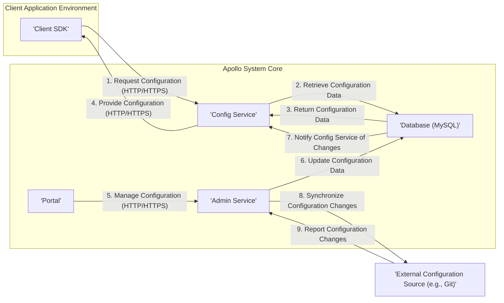

# Project Design Document: Apollo Configuration Management System

**Version:** 1.1
**Date:** October 26, 2023
**Author:** Gemini (AI Architect)

## 1. Introduction

This document provides a detailed design overview of the Apollo Configuration Management System, based on the project available at [https://github.com/apolloconfig/apollo](https://github.com/apolloconfig/apollo). This document aims to clearly articulate the system's architecture, components, and interactions to facilitate a comprehensive threat modeling exercise. This revision includes more detail on security aspects and data flows to better support threat identification.

## 2. Goals and Objectives

The primary goals of this design document are to:

*   Provide a clear and comprehensive understanding of the Apollo system's architecture.
*   Identify key components and their specific responsibilities and security implications.
*   Describe the detailed data flow and interactions between components, highlighting sensitive data.
*   Serve as a robust foundation for subsequent threat modeling activities.
*   Document key security considerations, assumptions, and potential vulnerabilities.

## 3. Target Audience

This document is intended for:

*   Security engineers and architects responsible for threat modeling, security assessments, and penetration testing.
*   Development teams working on or integrating with the Apollo system, requiring a deep understanding of its design.
*   Operations teams responsible for deploying, maintaining, and securing the Apollo system infrastructure.

## 4. High-Level Architecture

The Apollo configuration management system follows a client-server architecture with a central configuration repository.

**Description of Components:**

*   **Client SDK:** Libraries integrated into applications to fetch and manage configurations, providing an abstraction layer.
*   **Config Service:** The core, read-heavy service responsible for serving configuration data to client applications efficiently.
*   **Admin Service:** Provides APIs for managing configurations, namespaces, releases, and other administrative tasks, enforcing authorization.
*   **Portal:** A web-based user interface for managing configurations, built on top of the Admin Service API, providing user-friendly access control.
*   **Database (MySQL):** Stores configuration data, metadata, user information, and audit logs, acting as the single source of truth.
*   **External Configuration Source (e.g., Git):**  Optional integration for storing configuration history, enabling version control, and potentially serving as an initial configuration source.

## 5. Component Details

This section provides a detailed description of each key component within the Apollo system, focusing on functionality and security aspects.

### 5.1. Client SDK

*   **Purpose:**  Provides a secure and convenient way for applications to access and utilize configurations managed by Apollo.
*   **Functionality:**
    *   Fetches configuration data from the Config Service, typically on application startup and upon updates.
    *   Caches configuration locally (in memory or on disk) for performance and resilience.
    *   Subscribes to configuration updates using mechanisms like long polling or WebSockets, receiving notifications of changes.
    *   Provides APIs to access configuration values based on namespaces and keys.
    *   Supports various programming languages (e.g., Java, Go, .Net), each with potentially different security considerations.
*   **Interfaces:**
    *   Outbound: HTTP/HTTPS requests to the Config Service, potentially including application identifiers for authentication.
    *   Inbound:  Callbacks or event listeners for asynchronous configuration updates.
*   **Data Storage:**  Local memory or disk cache for retrieved configurations, potentially containing sensitive data.
*   **Security Considerations:**
    *   **Authentication:** Typically identifies itself to the Config Service using an application ID or API key.
    *   **Authorization:**  Implicitly authorized to access configurations associated with its application ID.
    *   **Cache Security:**  Sensitive configuration data in the local cache needs protection against unauthorized access on the client machine.
    *   **Update Integrity:**  Ensuring the integrity of configuration updates received from the Config Service.

### 5.2. Config Service

*   **Purpose:**  The central, read-optimized service responsible for providing configuration data to client applications with low latency.
*   **Functionality:**
    *   Retrieves configuration data from the database, caching it in memory for fast retrieval.
    *   Handles client requests for configuration, validating their identity.
    *   Notifies clients of configuration updates when changes occur in the database.
    *   Manages namespaces and configurations, serving the appropriate data based on client requests.
*   **Interfaces:**
    *   Inbound: HTTP/HTTPS API for client requests, requiring authentication (e.g., application ID).
    *   Outbound: Database connection to MySQL, requiring secure credentials.
    *   Outbound: Communication channels (e.g., WebSockets, long polling) to notify clients of updates, potentially secured with authentication.
*   **Data Storage:**  In-memory cache of configurations, potentially containing sensitive data.
*   **Security Considerations:**
    *   **Authentication:** Verifies the identity of client applications requesting configuration.
    *   **Authorization:**  Ensures clients only receive configurations they are authorized to access.
    *   **Cache Security:** Protecting the in-memory cache from unauthorized access within the service.
    *   **Denial of Service:**  Protecting against excessive requests from clients.
    *   **Secure Communication:** Enforcing HTTPS for all client communication.

### 5.3. Admin Service

*   **Purpose:**  Provides a secure API for managing configuration data, namespaces, releases, and user access control.
*   **Functionality:**
    *   Creates, updates, and deletes configurations, enforcing authorization rules.
    *   Manages namespaces, applications, and releases.
    *   Provides user authentication and authorization for administrative actions.
    *   Audits configuration changes, recording who made what changes and when.
    *   Integrates with external systems (e.g., Git) for configuration synchronization.
*   **Interfaces:**
    *   Inbound: HTTP/HTTPS API for the Portal and other administrative clients, requiring strong authentication (e.g., username/password, API keys).
    *   Outbound: Database connection to MySQL, using secure credentials.
    *   Outbound: Communication with the Config Service to trigger cache updates, potentially using internal communication mechanisms.
    *   Outbound: Interactions with external systems (e.g., Git), requiring appropriate authentication.
*   **Data Storage:**  Does not directly store configuration data, but interacts with the database.
*   **Security Considerations:**
    *   **Strong Authentication:**  Requires robust authentication for all administrative actions.
    *   **Fine-grained Authorization:** Implements granular access control to restrict who can manage which configurations and namespaces.
    *   **Input Validation:**  Strictly validates all input data to prevent injection attacks.
    *   **Audit Logging:**  Maintains a comprehensive audit log of all administrative actions.
    *   **Secure Communication:** Enforces HTTPS for all administrative API communication.

### 5.4. Portal

*   **Purpose:**  A user-friendly web-based interface for managing configurations and administering the Apollo system.
*   **Functionality:**
    *   Provides a graphical interface for viewing and editing configurations, simplifying management.
    *   Manages namespaces, applications, and releases through a visual interface.
    *   Provides user management and role-based access control, delegating administrative privileges.
    *   Displays audit logs of configuration changes, providing transparency.
*   **Interfaces:**
    *   Outbound: HTTP/HTTPS requests to the Admin Service API, authenticating users.
    *   Inbound: User interactions through a web browser.
*   **Data Storage:**  Primarily relies on browser local storage for session management and temporary data.
*   **Security Considerations:**
    *   **Secure Authentication:**  Requires secure login mechanisms for users (e.g., username/password with hashing, multi-factor authentication).
    *   **Session Management:**  Implements secure session management to prevent session hijacking.
    *   **Authorization Enforcement:**  Enforces the authorization rules defined in the Admin Service.
    *   **Cross-Site Scripting (XSS) Prevention:**  Implements measures to prevent XSS attacks.
    *   **Cross-Site Request Forgery (CSRF) Prevention:**  Protects against CSRF attacks.
    *   **Secure Communication:** Enforces HTTPS for all communication.

### 5.5. Database (MySQL)

*   **Purpose:**  The persistent storage for all critical data within the Apollo system, ensuring data durability and consistency.
*   **Functionality:**
    *   Stores configuration data (key-value pairs, namespaces, applications, releases).
    *   Stores user accounts, roles, and permissions.
    *   Stores audit logs of configuration changes and administrative actions.
*   **Interfaces:**
    *   Inbound: Secure database connections from the Config Service and Admin Service, using dedicated user accounts with restricted privileges.
*   **Data Storage:**  Persistent storage of all Apollo data, potentially containing highly sensitive configuration values.
*   **Security Considerations:**
    *   **Secure Credentials Management:**  Protecting database credentials used by the Config Service and Admin Service.
    *   **Access Control:**  Restricting database access to only authorized services.
    *   **Encryption at Rest:**  Encrypting sensitive configuration data stored in the database.
    *   **Regular Backups:**  Implementing regular backups and disaster recovery mechanisms.
    *   **SQL Injection Prevention:**  Ensuring that the Config Service and Admin Service use parameterized queries to prevent SQL injection attacks.
    *   **Auditing:**  Enabling database auditing to track access and modifications.

### 5.6. External Configuration Source (e.g., Git)

*   **Purpose:**  Provides an optional mechanism for version controlling configurations and potentially serving as an initial source of truth.
*   **Functionality:**
    *   Stores configuration changes as commits, providing a history of modifications.
    *   Allows for rollback to previous configurations, enhancing resilience.
    *   Provides an audit trail of configuration modifications outside the Apollo system's database.
*   **Interfaces:**
    *   Inbound/Outbound: Communication with the Admin Service (e.g., using Git protocols like SSH or HTTPS), requiring authentication.
*   **Data Storage:**  Configuration history and metadata within the Git repository, potentially containing sensitive data.
*   **Security Considerations:**
    *   **Secure Authentication:**  Using strong authentication mechanisms (e.g., SSH keys, access tokens) for accessing the Git repository.
    *   **Authorization:**  Restricting access to the Git repository to authorized users and services.
    *   **Repository Security:**  Ensuring the security of the Git hosting platform.
    *   **Secret Sprawl Prevention:**  Avoiding the storage of sensitive credentials directly within configuration files in Git.

## 6. Data Flow

This section describes the key data flows within the Apollo system, highlighting the data being transferred and the protocols used.

### 6.1. Fetching Configuration

1. A **Client SDK** within an application initiates a request for configuration for a specific namespace (e.g., "application.properties").
2. The **Client SDK** sends an authenticated HTTP/HTTPS GET request to the **Config Service**, including the application ID, cluster name, and requested namespaces.
3. The **Config Service** authenticates the request using the provided application ID.
4. The **Config Service** retrieves the latest, active configuration data for the requested namespace from its in-memory cache. If not present, it fetches it from the **Database**.
5. The **Database** returns the configuration data (key-value pairs) to the **Config Service** over a secure database connection.
6. The **Config Service** returns the configuration data (typically in JSON or properties format) to the **Client SDK** via the HTTP/HTTPS response.
7. The **Client SDK** caches the configuration locally in memory or on disk.

### 6.2. Updating Configuration

1. A user interacts with the **Portal** to modify a configuration (e.g., changes a property value).
2. The **Portal** sends an authenticated HTTP/HTTPS POST/PUT request to the **Admin Service** API, including the namespace, key, new value, and user credentials.
3. The **Admin Service** authenticates and authorizes the request based on the user's roles and permissions.
4. The **Admin Service** validates the input data.
5. The **Admin Service** updates the configuration data in the **Database**, including creating an audit log entry with the user and timestamp.
6. The **Database** persists the changes and the audit log entry.
7. The **Admin Service** publishes an event or directly notifies the **Config Service** about the configuration update, often using an internal communication mechanism.
8. The **Config Service** receives the notification, invalidates its cache for the affected namespace, and reloads the latest configuration from the **Database**.
9. The **Config Service** sends asynchronous notifications (e.g., via WebSockets or long polling) to subscribed **Client SDKs** about the configuration update.
10. **Client SDKs** receive the notification and fetch the latest configuration from the **Config Service**, repeating the fetching process.

### 6.3. Configuration Synchronization with External System

1. A user performs a configuration change through the **Portal**, triggering an update in the **Database**.
2. The **Admin Service**, after successfully updating the **Database**, initiates a synchronization process with the **External Configuration Source** (e.g., Git).
3. The **Admin Service** authenticates with the **External Configuration Source** using configured credentials.
4. The **Admin Service** commits the configuration changes to the **External Configuration Source**, including metadata like the user and timestamp.
5. The **External Configuration Source** acknowledges the successful synchronization.
6. Alternatively, the **Admin Service** can periodically poll the **External Configuration Source** for changes. Upon detecting changes, it retrieves them, validates them, and updates the **Database**, following the standard update flow.

## 7. Security Considerations

This section outlines key security considerations for the Apollo system, categorized for clarity.

*   **Authentication and Authorization:**
    *   **Client SDK to Config Service:** Authentication via application ID or API key. Authorization based on the application's allowed namespaces.
    *   **Portal to Admin Service:** Authentication via username/password, API keys, or potentially multi-factor authentication. Authorization based on user roles and permissions.
    *   **Admin Service to Database:** Authentication via database credentials. Authorization limited to necessary database operations.
    *   **Config Service to Database:** Authentication via database credentials. Authorization limited to read operations on configuration data.
    *   **Admin Service to External System:** Authentication via SSH keys, access tokens, or other mechanisms specific to the external system. Authorization based on the required actions.
*   **Data Confidentiality and Integrity:**
    *   **In Transit:** All communication between components should be encrypted using HTTPS/TLS.
    *   **At Rest:** Sensitive configuration data in the database should be encrypted. Consider encryption for local caches in the Client SDK.
    *   **Integrity:**  Mechanisms to ensure the integrity of configuration data during transmission and storage (e.g., checksums).
*   **Input Validation:**
    *   Strict validation of all user inputs in the Portal and API requests to the Admin Service to prevent injection attacks (SQL injection, XSS, etc.).
    *   Validation of configuration data format and values.
*   **Secure Communication:**
    *   Enforce HTTPS for all external-facing interfaces (Portal, Config Service, Admin Service).
    *   Consider secure communication mechanisms for internal communication between services.
*   **Auditing and Logging:**
    *   Comprehensive audit logs for configuration changes, administrative actions, and user logins.
    *   Secure storage and management of audit logs.
*   **Rate Limiting and Denial of Service Prevention:**
    *   Implement rate limiting on API endpoints to prevent abuse and denial-of-service attacks.
*   **Dependency Management:**
    *   Regularly review and update dependencies to address known vulnerabilities.
*   **Secure Database Configuration:**
    *   Harden the database server, use strong passwords, and restrict network access.
*   **Secrets Management:**
    *   Securely manage and store sensitive credentials (database passwords, API keys, etc.) using dedicated secrets management solutions.
*   **Error Handling:**
    *   Avoid exposing sensitive information in error messages.

## 8. Deployment Considerations

*   The Apollo system can be deployed on various infrastructure platforms, including on-premises and cloud environments.
*   Containerization technologies like Docker and orchestration platforms like Kubernetes are recommended for deployment and scaling.
*   High availability and fault tolerance should be considered for critical components like the Config Service and Database (e.g., using multiple instances, load balancing, database replication).
*   Proper network segmentation and firewall rules should be implemented to restrict access to the Apollo system components based on the principle of least privilege.
*   Secure network configuration to prevent unauthorized access between components.

## 9. Future Enhancements (Optional)

*   Support for more sophisticated configuration formats (e.g., YAML, TOML) and validation schemas.
*   Enhanced monitoring and alerting capabilities for system health and security events.
*   Integration with other security tools and platforms (e.g., SIEM systems).
*   Improved user interface and user experience in the Portal.
*   Support for configuration change approvals and workflows.

This revised design document provides a more detailed and security-focused overview of the Apollo Configuration Management System, intended to be a valuable resource for threat modeling and security analysis.