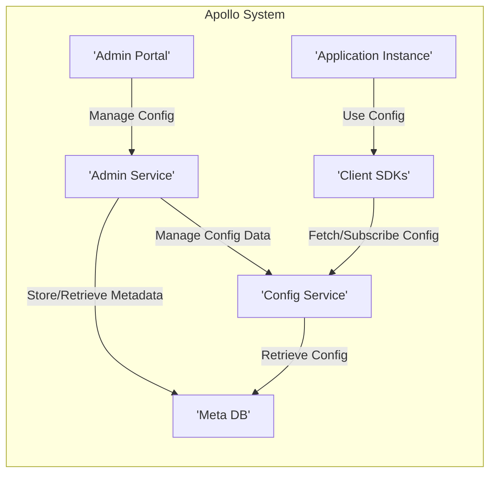
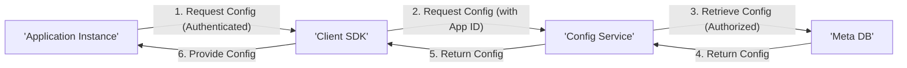
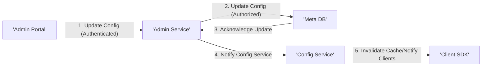
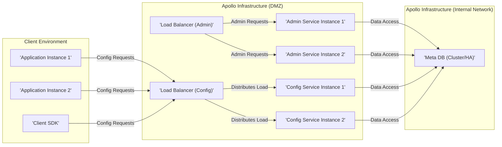

# Project Design Document: Apollo Configuration Management System

**Version:** 1.1
**Date:** October 26, 2023
**Author:** AI Software Architect

## 1. Introduction

This document provides an enhanced architectural design of the Apollo configuration management system, based on the project available at [https://github.com/apolloconfig/apollo](https://github.com/apolloconfig/apollo). This revised document aims to provide a more detailed and nuanced understanding of the system's components, interactions, and data flow, specifically tailored for effective threat modeling activities.

Apollo is a distributed configuration management system designed for modern application environments. It enables applications to fetch and update configuration in a consistent and reliable manner, supporting dynamic updates and centralized management.

## 2. Goals

The primary goals of this design document are:

*   Clearly and comprehensively articulate the architecture of the Apollo configuration management system.
*   Identify the key components and their specific responsibilities and interactions.
*   Describe the detailed interactions and data flow between components, including asynchronous operations and event handling.
*   Provide sufficient and granular detail to facilitate effective and targeted threat modeling.
*   Serve as a definitive reference for understanding the system's design and its security implications.

## 3. Scope

This document covers the core architectural components of the Apollo system with a greater level of detail, including:

*   Admin Portal (with emphasis on authentication and authorization)
*   Admin Service (including API endpoints and internal logic)
*   Config Service (including caching mechanisms and notification strategies)
*   Meta DB (including schema and access patterns)
*   Client SDKs (including different language implementations and their behavior)
*   Configuration Release Process
*   Namespace and Application concepts

This document focuses on the logical architecture and key implementation details relevant to security analysis. It does not delve into extremely low-level implementation specifics or detailed operational aspects beyond those directly impacting security.

## 4. High-Level Architecture

The Apollo system follows a client-server architecture with a central configuration repository and distinct administrative and retrieval pathways.

*   **Admin Portal:** A web-based user interface, requiring authentication and authorization, for managing configurations, namespaces, and other administrative tasks.
*   **Admin Service:**  Provides a secure set of APIs, enforcing authentication and authorization, for the Admin Portal to manage configuration data and system metadata.
*   **Config Service:** The core, highly available service responsible for securely serving configuration data to authorized client applications. It often employs caching and notification mechanisms.
*   **Meta DB:** A persistent and secure storage (typically a relational database) for storing configuration data, metadata, access control information, and potentially audit logs.
*   **Client SDKs:**  Secure libraries that applications integrate with, often requiring some form of identification, to fetch and subscribe to configuration changes.
*   **Application Instance:**  An instance of an application that securely uses the Apollo Client SDK to retrieve and utilize configurations.

## 5. Component Details

### 5.1. Admin Portal

*   **Purpose:** Provides a secure and role-based access controlled interface for administrators to manage the configuration system.
*   **Functionality:**
    *   User authentication (e.g., username/password, SSO).
    *   Role-based authorization for actions (e.g., creating applications, modifying configurations).
    *   Securely creating and managing applications, clusters, and namespaces.
    *   Securely adding, modifying, and deleting configuration properties with versioning.
    *   Managing user roles and permissions with audit trails.
    *   Viewing configuration history, audit logs, and release status.
*   **Technology Stack (Likely):** Frontend technologies (e.g., React, Angular, Vue.js), secure communication with Admin Service via HTTPS, session management.

### 5.2. Admin Service

*   **Purpose:** Exposes a secure set of APIs for the Admin Portal to interact with the configuration system's backend, enforcing authentication and authorization.
*   **Functionality:**
    *   Authentication and authorization of administrative requests.
    *   API endpoints for managing applications, clusters, and namespaces, with input validation.
    *   Handles requests to create, update, and delete configuration data in the Meta DB, with data validation and sanitization.
    *   Manages user roles and permissions, enforcing access control policies.
    *   Implements features for configuration release management, rollback, and potentially change approval workflows.
    *   Generates audit logs for all administrative actions.
*   **Technology Stack (Likely):** Java (Spring Boot) with security frameworks (e.g., Spring Security), RESTful APIs secured with authentication (e.g., OAuth 2.0, JWT), interacts with Meta DB via secure connections.

### 5.3. Config Service

*   **Purpose:**  The central, highly available, and secure component responsible for serving configuration data to authorized client applications.
*   **Functionality:**
    *   Receives requests from Client SDKs for configuration data for specific applications and namespaces, often requiring application identification.
    *   Retrieves configuration data from the Meta DB, potentially using a read-replica setup.
    *   Caches configuration data (in-memory, distributed cache) for performance and availability, with cache invalidation mechanisms triggered by Admin Service updates.
    *   Provides secure mechanisms for clients to subscribe to configuration changes (e.g., long polling over HTTPS, secure WebSockets with authentication).
    *   May implement features like configuration merging, inheritance, and environment-specific overrides.
    *   May implement rate limiting and denial-of-service protection mechanisms.
*   **Technology Stack (Likely):** Java (Spring Boot), RESTful APIs secured with authentication (e.g., API keys, potentially mutual TLS), interacts with Meta DB, utilizes caching mechanisms (e.g., Redis, Caffeine), potentially uses message queues for notifications.

### 5.4. Meta DB

*   **Purpose:**  Persistent and secure storage for all configuration data, metadata, access control information, and audit logs.
*   **Functionality:**
    *   Securely stores configuration properties organized by application, cluster, and namespace.
    *   Stores metadata about applications, clusters, and namespaces, including ownership and descriptions.
    *   Stores user roles, permissions, and potentially API keys for access control.
    *   Stores audit logs of configuration changes and administrative actions.
    *   Implements appropriate security measures like encryption at rest, access controls, and regular backups.
*   **Technology Stack (Likely):** Relational database (e.g., MySQL, PostgreSQL) with security features enabled (e.g., encryption, access controls).

### 5.5. Client SDKs

*   **Purpose:** Secure libraries that applications integrate with to fetch and subscribe to configuration changes from the Config Service, often requiring application identification.
*   **Functionality:**
    *   Provides APIs for applications to securely retrieve configuration properties for their specific application and namespaces.
    *   Handles secure communication with the Config Service, including authentication (e.g., API keys).
    *   Implements caching of configuration data within the application for performance and resilience.
    *   Provides mechanisms for applications to be notified of configuration changes, handling potential network issues and retries.
    *   May support different programming languages (e.g., Java, Python, Go, Node.js), each with its own security considerations.
    *   May include features for local configuration overrides or defaults.
*   **Technology Stack:** Language-specific libraries, implementing secure HTTP communication, potentially using TLS pinning.

## 6. Data Flow

The following diagram illustrates the typical data flow for securely retrieving configuration data:

1. An **Application Instance** needs configuration data and makes a request, potentially with its own credentials.
2. The **Client SDK** securely packages the request, including application identification, and sends it to the **Config Service**.
3. The **Config Service**, after verifying the application's identity and authorization, retrieves the configuration from the **Meta DB**.
4. The **Meta DB** returns the configuration to the **Config Service**.
5. The **Config Service** returns the configuration to the **Client SDK**.
6. The **Client SDK** provides the configuration to the **Application Instance**.

The following diagram illustrates the typical data flow for securely updating configuration data:

1. An administrator updates the configuration through the authenticated **Admin Portal**.
2. The **Admin Portal** sends the update request to the authenticated and authorized **Admin Service**.
3. The **Admin Service** updates the configuration in the **Meta DB**.
4. The **Meta DB** acknowledges the update to the **Admin Service**.
5. The **Admin Service** notifies the **Config Service** about the configuration change.
6. The **Config Service** invalidates its cache and may proactively notify connected **Client SDKs** about the update, triggering them to fetch the latest configuration.

## 7. Security Considerations

This section outlines key security considerations for each component, crucial for threat modeling:

*   **Admin Portal:**
    *   Authentication vulnerabilities (e.g., brute-force, credential stuffing).
    *   Authorization flaws leading to privilege escalation.
    *   Cross-Site Scripting (XSS) and Cross-Site Request Forgery (CSRF) vulnerabilities.
    *   Insecure session management.
*   **Admin Service:**
    *   API authentication and authorization bypass.
    *   Injection vulnerabilities (e.g., SQL injection, command injection).
    *   Insecure direct object references.
    *   Exposure of sensitive information through error messages or logs.
    *   Lack of input validation leading to data corruption.
*   **Config Service:**
    *   Unauthorized access to configuration data.
    *   Denial-of-service attacks.
    *   Cache poisoning vulnerabilities.
    *   Man-in-the-middle attacks on client connections.
    *   Vulnerabilities in the notification mechanism.
*   **Meta DB:**
    *   Unauthorized access to sensitive configuration data and credentials.
    *   SQL injection vulnerabilities.
    *   Data breaches due to insecure storage or backups.
    *   Lack of encryption at rest.
*   **Client SDKs:**
    *   Exposure of API keys or other secrets within application code.
    *   Man-in-the-middle attacks if secure communication is not enforced.
    *   Vulnerabilities in the SDK code itself.
    *   Improper handling of configuration updates leading to application errors.
*   **General Considerations:**
    *   Lack of proper logging and monitoring for security events.
    *   Insecure configuration defaults.
    *   Vulnerabilities in third-party libraries.
    *   Insufficient security testing and code reviews.

These considerations will be the starting point for a detailed threat modeling exercise.

## 8. Deployment Architecture (Conceptual)

A typical secure deployment of Apollo involves multiple instances of the Admin Service and Config Service behind load balancers, with secure network segmentation and database protection.

*   **Load Balancers (Admin & Config):** Distribute traffic securely across multiple instances, often with SSL termination.
*   **Admin Service Instances:** Multiple instances for high availability and scalability, residing in a protected network segment.
*   **Config Service Instances:** Multiple instances for high availability and scalability, potentially in a DMZ or a separate network segment with restricted access to the internal network.
*   **Meta DB (Cluster/HA):**  The database is deployed in a clustered or highly available configuration within a secure internal network, with strict access controls. Network segmentation and firewalls are crucial to restrict access to the database.

## 9. Assumptions

The following assumptions have been made in creating this design document, particularly regarding security:

*   Secure network infrastructure with firewalls and intrusion detection systems.
*   Standard security best practices are followed for operating systems and underlying infrastructure.
*   The Meta DB is a relational database with security features enabled.
*   Communication between components within the Apollo infrastructure is secured (e.g., using TLS).
*   Client applications are responsible for securely storing any retrieved configuration data locally.

## 10. Out of Scope

This design document does not cover the following:

*   Specific implementation details of security controls within each component (e.g., specific encryption algorithms, authentication protocols).
*   Detailed operational procedures for security incident response.
*   Specific client application security implementations beyond the use of the Client SDK.
*   Detailed network architecture and firewall rules.
*   Third-party integrations and their security implications.

This enhanced document provides a more detailed and security-focused understanding of the Apollo configuration management system, making it more suitable for comprehensive threat modeling activities.