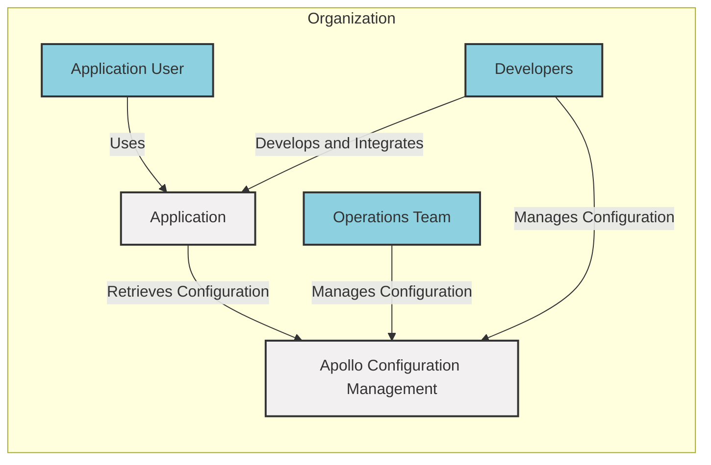
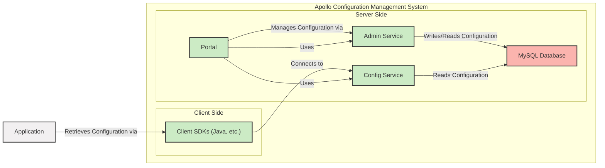
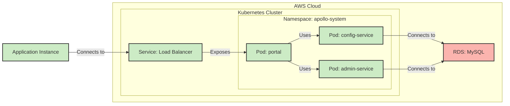
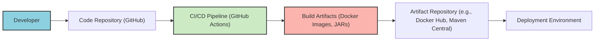

# BUSINESS POSTURE

Apollo Configuration Management system aims to provide a reliable, scalable, and centralized configuration management solution for distributed applications. It addresses the challenges of managing configurations across different environments and applications, ensuring consistency and enabling dynamic updates without service restarts.

Business Priorities and Goals:
- Centralized Configuration Management: Provide a single source of truth for application configurations, reducing configuration drift and inconsistencies.
- Dynamic Configuration Updates: Enable real-time configuration updates without requiring application restarts, improving agility and reducing downtime.
- Environment and Namespace Isolation: Support multiple environments (e.g., development, staging, production) and namespaces within environments to manage configurations effectively.
- Scalability and High Availability: Ensure the configuration management system can handle a large number of applications and requests with high availability.
- User-Friendly Interface: Offer a web-based portal for managing configurations, making it accessible and easy to use for operations and development teams.
- Auditability and Versioning: Track configuration changes and provide versioning to enable rollback and audit trails.

Business Risks:
- Configuration Data Integrity: Risk of data corruption or unauthorized modification of configuration data, leading to application malfunctions or security vulnerabilities.
- Availability of Configuration Service: Downtime of the configuration service can impact all dependent applications, leading to service disruptions.
- Unauthorized Access to Configuration Data: Exposure of sensitive configuration data to unauthorized users or systems, potentially leading to security breaches.
- Configuration Errors: Incorrect or inconsistent configurations can lead to application failures or unexpected behavior.
- Operational Complexity: Managing and maintaining the configuration management system itself can become complex, especially at scale.

# SECURITY POSTURE

Existing Security Controls:
- security control: Access control to the Apollo Portal is likely implemented using authentication and authorization mechanisms. (Implemented in Apollo Portal application)
- security control: Secure communication channels (HTTPS) are likely used for communication between clients and server components. (Assumed based on common best practices)
- security control: Role-Based Access Control (RBAC) within the Apollo Portal to manage user permissions for configuration management. (Likely implemented in Apollo Portal application)
- security control: Audit logging of configuration changes and access events. (Likely implemented in Apollo server components)

Accepted Risks:
- accepted risk: Reliance on underlying infrastructure security (network, servers, databases).
- accepted risk: Potential vulnerabilities in third-party libraries used by Apollo components.
- accepted risk: Risk of misconfiguration by authorized users.

Recommended Security Controls:
- security control: Implement strong authentication mechanisms, such as multi-factor authentication (MFA) for accessing the Apollo Portal.
- security control: Regularly perform security vulnerability scanning and penetration testing of Apollo components.
- security control: Implement input validation and sanitization on all configuration data inputs to prevent injection attacks.
- security control: Encrypt sensitive configuration data at rest and in transit.
- security control: Implement a robust secret management solution for storing and managing sensitive credentials used by Apollo components.
- security control: Implement security scanning in the CI/CD pipeline to detect vulnerabilities before deployment.
- security control: Implement code review process with security focus.

Security Requirements:
- Authentication:
    - Requirement: Securely authenticate users accessing the Apollo Portal and APIs.
    - Requirement: Support integration with existing enterprise authentication systems (e.g., LDAP, Active Directory, SSO).
- Authorization:
    - Requirement: Implement fine-grained authorization controls to manage access to configurations based on roles and responsibilities.
    - Requirement: Enforce the principle of least privilege for user access.
- Input Validation:
    - Requirement: Validate all configuration data inputs to prevent injection attacks (e.g., SQL injection, command injection, cross-site scripting).
    - Requirement: Sanitize configuration data to remove potentially harmful characters or code.
- Cryptography:
    - Requirement: Encrypt sensitive configuration data at rest in the database.
    - Requirement: Use HTTPS for all communication channels to protect data in transit.
    - Requirement: Securely store and manage cryptographic keys.

# DESIGN

## C4 CONTEXT

Context Diagram Elements:

- Element:
    - Name: Application User
    - Type: Person
    - Description: End-users who interact with the applications that consume configurations from Apollo.
    - Responsibilities: Uses applications that rely on configurations managed by Apollo.
    - Security controls: Authentication and authorization are handled by the Application itself, not directly by Apollo.

- Element:
    - Name: Application
    - Type: Software System
    - Description: Applications that require configuration management and retrieve their configurations from Apollo.
    - Responsibilities: Retrieve configurations from Apollo, apply configurations, and function based on the retrieved configurations.
    - Security controls: Implement secure configuration retrieval from Apollo, handle configuration data securely within the application, and enforce application-level security controls.

- Element:
    - Name: Apollo Configuration Management
    - Type: Software System
    - Description: Centralized configuration management system responsible for storing, managing, and distributing application configurations.
    - Responsibilities: Store configuration data, provide APIs for configuration retrieval, manage user access and permissions, and provide a user interface for configuration management.
    - Security controls: Authentication, authorization, input validation, encryption of sensitive data, audit logging, secure communication channels (HTTPS).

- Element:
    - Name: Operations Team
    - Type: Person
    - Description: Team responsible for managing and operating the Apollo Configuration Management system and application configurations.
    - Responsibilities: Manage configurations through the Apollo Portal, monitor the health of Apollo, and ensure the availability and security of the configuration management system.
    - Security controls: Access control to the Apollo Portal, adherence to security policies and procedures.

- Element:
    - Name: Developers
    - Type: Person
    - Description: Software developers who develop and integrate applications with Apollo and manage application configurations.
    - Responsibilities: Integrate applications with Apollo client SDKs, define and manage application configurations, and ensure applications correctly consume configurations.
    - Security controls: Access control to development environments and Apollo Portal, secure coding practices.

## C4 CONTAINER

Container Diagram Elements:

- Element:
    - Name: Config Service
    - Type: Container
    - Description: Provides APIs for applications to retrieve configurations in real-time. It is the core service for configuration delivery.
    - Responsibilities: Serve configuration requests from applications, cache configurations for performance, and interact with the database to fetch configurations.
    - Security controls: Authentication and authorization of client SDK requests, input validation, secure communication (HTTPS), rate limiting to prevent abuse.

- Element:
    - Name: Admin Service
    - Type: Container
    - Description: Provides APIs for managing configurations, namespaces, and other administrative tasks. It is used by the Portal for configuration management.
    - Responsibilities: Manage configuration data, handle administrative requests from the Portal, enforce authorization policies, and interact with the database.
    - Security controls: Authentication and authorization of Portal requests, input validation, audit logging, secure communication (HTTPS).

- Element:
    - Name: Portal
    - Type: Container
    - Description: Web-based user interface for managing configurations, namespaces, users, and permissions.
    - Responsibilities: Provide a user-friendly interface for configuration management, authenticate users, authorize user actions, and interact with the Admin Service.
    - Security controls: Authentication (username/password, SSO), authorization (RBAC), session management, input validation, output encoding, secure communication (HTTPS), protection against common web vulnerabilities (CSRF, XSS).

- Element:
    - Name: MySQL Database
    - Type: Container - Database
    - Description: Relational database used to store configuration data, metadata, and user information.
    - Responsibilities: Persist configuration data, provide data integrity and consistency, and support data access for Config Service and Admin Service.
    - Security controls: Access control (database user permissions), encryption at rest (if required for sensitive data), regular backups, database hardening, network security controls.

- Element:
    - Name: Client SDKs (Java, etc.)
    - Type: Container
    - Description: Libraries provided for different programming languages (e.g., Java, Python, Go) to simplify integration with Apollo.
    - Responsibilities: Provide APIs for applications to fetch configurations from the Config Service, handle caching and updates, and abstract away communication details.
    - Security controls: Secure storage of any credentials (if needed), secure communication with Config Service (HTTPS), input validation of retrieved configuration data within the application.

## DEPLOYMENT

Deployment Solution: Cloud-based Deployment (Example using Kubernetes on AWS)

Deployment Diagram Elements:

- Element:
    - Name: Pod: config-service
    - Type: Deployment Node
    - Description: Kubernetes Pod running instances of the Config Service container.
    - Responsibilities: Run Config Service instances, handle configuration requests, and connect to the database.
    - Security controls: Network policies to restrict access, resource limits, security context configurations.

- Element:
    - Name: Pod: admin-service
    - Type: Deployment Node
    - Description: Kubernetes Pod running instances of the Admin Service container.
    - Responsibilities: Run Admin Service instances, handle administrative requests, and connect to the database.
    - Security controls: Network policies to restrict access, resource limits, security context configurations.

- Element:
    - Name: Pod: portal
    - Type: Deployment Node
    - Description: Kubernetes Pod running instances of the Portal container.
    - Responsibilities: Run Portal instances, serve the web UI, and interact with Config and Admin Services.
    - Security controls: Network policies to restrict access, resource limits, security context configurations, web application firewall (WAF) in front of the Load Balancer.

- Element:
    - Name: Service: Load Balancer
    - Type: Deployment Node
    - Description: Kubernetes Service of type LoadBalancer, exposing the Portal to external users.
    - Responsibilities: Load balancing traffic to Portal pods, providing a stable external endpoint.
    - Security controls: HTTPS termination, security groups to restrict access to specific ports and IP ranges, potentially integrated with WAF.

- Element:
    - Name: RDS: MySQL
    - Type: Deployment Node - Database
    - Description: AWS RDS MySQL instance used as the database for Apollo.
    - Responsibilities: Persist Apollo data, provide database services.
    - Security controls: VPC security groups to restrict access, database access control lists, encryption at rest and in transit, regular backups, database monitoring.

- Element:
    - Name: Application Instance
    - Type: Deployment Node
    - Description: Instance of an application running in a separate environment (e.g., another Kubernetes cluster, EC2 instance).
    - Responsibilities: Run application code, retrieve configurations from Apollo.
    - Security controls: Application-level security controls, secure configuration retrieval using Client SDKs.

## BUILD

Build Process Diagram Elements:

- Element:
    - Name: Developer
    - Type: Person
    - Description: Software developer who writes and commits code changes.
    - Responsibilities: Write code, commit code to the repository, and follow secure coding practices.
    - Security controls: Code review, secure development training, access control to code repository.

- Element:
    - Name: Code Repository (GitHub)
    - Type: System
    - Description: Git repository hosted on GitHub, storing the source code of Apollo.
    - Responsibilities: Version control, code storage, collaboration platform.
    - Security controls: Access control (branch permissions, repository permissions), audit logging, vulnerability scanning of dependencies (Dependabot).

- Element:
    - Name: CI/CD Pipeline (GitHub Actions)
    - Type: System
    - Description: Automated CI/CD pipeline using GitHub Actions to build, test, and publish Apollo artifacts.
    - Responsibilities: Automated build process, compilation, testing (unit tests, integration tests), security scans (SAST, dependency scanning), artifact creation (Docker images, JARs), and publishing to artifact repository.
    - Security controls: Secure pipeline configuration, secret management for credentials, vulnerability scanning of build environment, SAST and dependency scanning tools, code signing of artifacts.

- Element:
    - Name: Build Artifacts (Docker Images, JARs)
    - Type: Data
    - Description: Output of the build process, including Docker images for server components and JAR files for client SDKs.
    - Responsibilities: Packaged software ready for deployment.
    - Security controls: Vulnerability scanning of Docker images, signing of artifacts to ensure integrity and authenticity.

- Element:
    - Name: Artifact Repository (e.g., Docker Hub, Maven Central)
    - Type: System
    - Description: Repository for storing and distributing build artifacts. Docker Hub for Docker images, Maven Central for Java JARs.
    - Responsibilities: Secure storage and distribution of build artifacts.
    - Security controls: Access control to artifact repository, vulnerability scanning of stored artifacts, audit logging, secure communication (HTTPS).

- Element:
    - Name: Deployment Environment
    - Type: Environment
    - Description: Target environment where Apollo components are deployed (e.g., Kubernetes cluster, VMs).
    - Responsibilities: Run Apollo components, provide infrastructure for Apollo.
    - Security controls: Infrastructure security controls (network security, server hardening, access control), deployment automation, configuration management.

# RISK ASSESSMENT

Critical Business Processes:
- Application Configuration Management: The core business process is managing and delivering configurations to applications. Disruption or compromise of this process can lead to widespread application failures or misbehavior.
- Configuration Updates: Dynamic configuration updates are a key feature. Failure to deliver updates or delays can impact application functionality and responsiveness.
- Access Control and Authorization: Managing access to configurations and ensuring only authorized users can modify configurations is critical to prevent unauthorized changes and maintain data integrity.

Data Sensitivity:
- Configuration Data: Configuration data itself can contain sensitive information, such as database credentials, API keys, and other secrets. The sensitivity level depends on the specific configurations being managed. High sensitivity if secrets are stored. Medium to High sensitivity if configurations impact critical business functions.
- Audit Logs: Audit logs contain information about configuration changes and user access, which can be sensitive and important for security monitoring and compliance. Medium sensitivity.
- User Credentials: User credentials for accessing the Apollo Portal are highly sensitive and must be protected. High sensitivity.

# QUESTIONS & ASSUMPTIONS

Questions:
- What type of authentication is currently used for the Apollo Portal? Is it integrated with any enterprise SSO or directory services?
- Is sensitive configuration data currently encrypted at rest in the database?
- Are there any specific compliance requirements (e.g., PCI DSS, HIPAA, GDPR) that Apollo needs to adhere to?
- What is the organization's risk appetite regarding configuration management security?
- What is the expected scale of Apollo deployment (number of applications, configurations, users)?
- Are there any existing security tools or processes that Apollo needs to integrate with?
- What is the process for managing secrets within configurations?

Assumptions:
- BUSINESS POSTURE: Assumed that the primary business goal is to provide a reliable and scalable configuration management solution for internal applications.
- SECURITY POSTURE: Assumed that basic security controls like access control and HTTPS are in place. Assumed that security is a concern, but specific security requirements and existing controls need to be further clarified.
- DESIGN: Assumed a typical cloud-based deployment scenario using Kubernetes and MySQL. Assumed a standard CI/CD pipeline using GitHub Actions. Assumed that the project is actively maintained and follows modern software development practices.