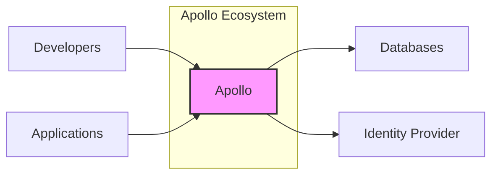
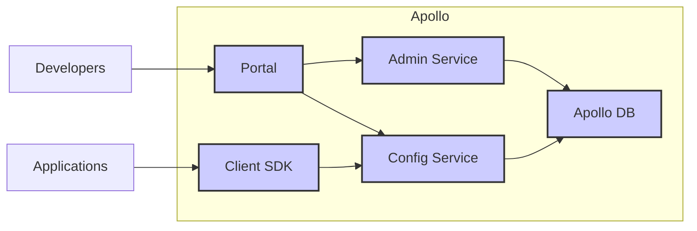
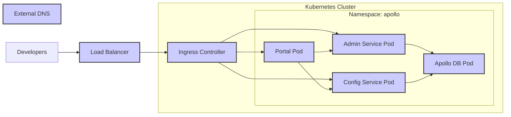

Okay, let's create a design document for the Apollo Configuration Management System based on the provided GitHub repository.

# BUSINESS POSTURE

Apollo is a configuration management system. It's designed to provide centralized management of application configurations across different environments and clusters. The business priorities likely revolve around:

*   Reliability: Ensuring configurations are consistently and reliably delivered to applications. Downtime or misconfiguration due to Apollo failure would directly impact applications relying on it.
*   Scalability: Supporting a large number of applications and configurations, potentially across many environments and clusters.  The system must scale to meet growing demands.
*   Auditability and Traceability:  Knowing who changed what configuration, when, and why is crucial for compliance and troubleshooting.
*   Ease of Use:  A user-friendly interface and API are important for developer adoption and efficient configuration management.
*   Speed of Deployment:  Enabling rapid deployment of new configurations and updates to support agile development practices.
*   Integration: Seamlessly integrating with existing infrastructure and development workflows.

Business Risks:

*   Single Point of Failure: If Apollo goes down, applications might lose access to their configurations, leading to outages.
*   Configuration Errors: Incorrect configurations pushed through Apollo can cause application malfunctions or security vulnerabilities.
*   Unauthorized Access:  Unauthorized users gaining access to Apollo could modify configurations, leading to significant damage.
*   Performance Bottlenecks:  If Apollo becomes a bottleneck, it can slow down application deployments and updates.
*   Lack of Visibility:  Insufficient auditing and monitoring can make it difficult to track down configuration-related issues.
*   Supply Chain Vulnerabilities: Vulnerabilities in Apollo's dependencies or build process could be exploited.

# SECURITY POSTURE

Based on the GitHub repository and common practices for this type of system, here's a likely security posture:

Existing Security Controls (Inferred):

*   security control: Authentication: The repository mentions user authentication, likely through a combination of username/password and potentially integration with existing identity providers (LDAP, OAuth, etc.). Implemented in Portal and Admin Service.
*   security control: Authorization: Role-Based Access Control (RBAC) is likely implemented to restrict access to configurations based on user roles (e.g., administrator, editor, viewer). Implemented in Portal and Admin Service.
*   security control: Input Validation:  The system likely validates configuration data to prevent injection attacks and ensure data integrity. Implemented in Config Service and Admin Service.
*   security control: Auditing:  Changes to configurations are likely logged, providing an audit trail of who made what changes and when. Implemented in Config Service and Admin Service.
*   security control: Encryption in Transit: Communication between Apollo components and clients is likely secured using TLS/SSL. Implemented in all network communications.
*   security control: Database Security: The database storing configurations is likely secured with access controls, encryption at rest, and regular backups. Implemented in database configuration and deployment.
*   security control: Dependency Management: The project uses build tools (Maven) that facilitate dependency management, although the specific security practices around this are not detailed in the top-level README. Implemented in build process.

Accepted Risks (Inferred):

*   accepted risk: Complexity: The distributed nature of Apollo introduces complexity, which can increase the risk of misconfiguration or security vulnerabilities.
*   accepted risk: Third-Party Dependencies:  Like all software, Apollo relies on third-party libraries, which could contain vulnerabilities.
*   accepted risk: Operational Errors:  Human error during operation or deployment could lead to security issues.

Recommended Security Controls:

*   Implement regular security audits and penetration testing.
*   Implement robust monitoring and alerting for suspicious activity.
*   Enforce strong password policies and multi-factor authentication (MFA).
*   Implement a comprehensive vulnerability management program, including regular scanning and patching.
*   Use a Software Composition Analysis (SCA) tool to identify and manage vulnerabilities in third-party dependencies.
*   Implement network segmentation to isolate Apollo components and limit the impact of potential breaches.
*   Implement configuration validation and schema enforcement to prevent invalid or malicious configurations.
*   Implement rate limiting to protect against denial-of-service attacks.

Security Requirements:

*   Authentication:
    *   Support for multiple authentication methods (e.g., username/password, LDAP, OAuth).
    *   Strong password policies and enforcement.
    *   Multi-factor authentication (MFA) for privileged users.
*   Authorization:
    *   Fine-grained Role-Based Access Control (RBAC).
    *   Principle of Least Privilege (PoLP) should be applied.
    *   Ability to define custom roles and permissions.
*   Input Validation:
    *   Validate all input from clients and users.
    *   Use a whitelist approach to input validation whenever possible.
    *   Sanitize input to prevent injection attacks.
    *   Enforce data type and format constraints.
*   Cryptography:
    *   Use TLS/SSL for all network communication.
    *   Use strong encryption algorithms and key lengths.
    *   Securely manage cryptographic keys.
    *   Consider encryption at rest for sensitive configuration data.
* Auditing:
    *   Log all configuration changes, including who made the change, when, and why.
    *   Log all authentication and authorization events.
    *   Securely store and protect audit logs.

# DESIGN

## C4 CONTEXT



Context Diagram Element Description:

*   Element:
    *   Name: Apollo
    *   Type: Software System
    *   Description: The Apollo Configuration Management System.
    *   Responsibilities: Managing application configurations, providing access control, auditing changes.
    *   Security controls: Authentication, Authorization, Input Validation, Auditing, Encryption in Transit, Database Security.
*   Element:
    *   Name: Developers
    *   Type: User
    *   Description: Users who manage and configure applications through Apollo.
    *   Responsibilities: Creating, updating, and deleting configurations.
    *   Security controls: Authentication, Authorization.
*   Element:
    *   Name: Applications
    *   Type: Software System
    *   Description: Applications that consume configurations from Apollo.
    *   Responsibilities: Retrieving and applying configurations.
    *   Security controls: Authentication (to Apollo), Input Validation (of configuration data).
*   Element:
    *   Name: Databases
    *   Type: Software System
    *   Description: Databases used by Apollo to store configuration data and metadata.
    *   Responsibilities: Persisting configuration data.
    *   Security controls: Database Security (access controls, encryption, backups).
*   Element:
    *   Name: Identity Provider
    *   Type: Software System
    *   Description: External system used for user authentication (e.g., LDAP, OAuth provider).
    *   Responsibilities: Authenticating users.
    *   Security controls: Authentication, Authorization (within the identity provider).

## C4 CONTAINER



Container Diagram Element Description:

*   Element:
    *   Name: Portal
    *   Type: Web Application
    *   Description: User interface for managing configurations.
    *   Responsibilities: Providing a user-friendly interface, interacting with Admin Service and Config Service.
    *   Security controls: Authentication, Authorization, Input Validation, Session Management.
*   Element:
    *   Name: Admin Service
    *   Type: Web Service/API
    *   Description: Service for managing Apollo's administrative functions.
    *   Responsibilities: User management, namespace management, permissions.
    *   Security controls: Authentication, Authorization, Input Validation, Auditing.
*   Element:
    *   Name: Config Service
    *   Type: Web Service/API
    *   Description: Service for storing and retrieving configurations.
    *   Responsibilities: Storing configurations, providing access to configurations, managing configuration versions.
    *   Security controls: Authentication, Authorization, Input Validation, Auditing, Encryption in Transit.
*   Element:
    *   Name: Client SDK
    *   Type: Library
    *   Description: Library used by applications to retrieve configurations from Config Service.
    *   Responsibilities: Providing an API for applications to access configurations.
    *   Security controls: Authentication (to Config Service), Input Validation (of configuration data).
*   Element:
    *   Name: Apollo DB
    *   Type: Database
    *   Description: Database for storing configuration data and metadata.
    *   Responsibilities: Persisting configuration data.
    *   Security controls: Database Security (access controls, encryption, backups).

## DEPLOYMENT

Possible Deployment Solutions:

1.  Kubernetes: Deploying Apollo services as pods within a Kubernetes cluster. This is a common and recommended approach for modern distributed systems.
2.  Virtual Machines: Deploying each Apollo service on separate virtual machines. This is a more traditional approach.
3.  Bare Metal: Deploying directly onto physical servers. This offers maximum control but is less common due to management overhead.

Chosen Solution (Kubernetes):



Deployment Diagram Element Description (Kubernetes):

*   Element:
    *   Name: Portal Pod
    *   Type: Kubernetes Pod
    *   Description: Instance of the Apollo Portal web application.
    *   Responsibilities: Serving the user interface.
    *   Security controls: Network policies, resource limits, container security context.
*   Element:
    *   Name: Admin Service Pod
    *   Type: Kubernetes Pod
    *   Description: Instance of the Apollo Admin Service.
    *   Responsibilities: Handling administrative tasks.
    *   Security controls: Network policies, resource limits, container security context.
*   Element:
    *   Name: Config Service Pod
    *   Type: Kubernetes Pod
    *   Description: Instance of the Apollo Config Service.
    *   Responsibilities: Serving configurations.
    *   Security controls: Network policies, resource limits, container security context.
*   Element:
    *   Name: Apollo DB Pod
    *   Type: Kubernetes Pod
    *   Description: Instance of the Apollo database.
    *   Responsibilities: Storing configuration data.
    *   Security controls: Network policies, resource limits, container security context, persistent volume claims with encryption.
*   Element:
    *   Name: Ingress Controller
    *   Type: Kubernetes Ingress Controller
    *   Description: Manages external access to services within the cluster.
    *   Responsibilities: Routing traffic to the appropriate services.
    *   Security controls: TLS termination, access control rules.
*   Element:
    *   Name: Load Balancer
    *   Type: Cloud Provider Load Balancer
    *   Description: Distributes traffic across multiple instances of the Ingress Controller.
    *   Responsibilities: Providing high availability and scalability.
    *   Security controls: Firewall rules, DDoS protection.
*   Element:
    *   Name: External DNS
    *   Type: DNS Service
    *   Description: Maps external domain names to the Load Balancer.
    *   Responsibilities: Providing a user-friendly way to access Apollo.
    *   Security controls: DNSSEC.

## BUILD

The Apollo project uses Maven as its build tool. The build process likely involves the following steps:

1.  Developer commits code to the GitHub repository.
2.  A build server (e.g., Jenkins, GitHub Actions) detects the changes.
3.  The build server checks out the code.
4.  Maven is used to compile the code, run tests, and package the application into JAR files.
5.  Docker images are built for each component (Portal, Admin Service, Config Service).
6.  Docker images are pushed to a container registry (e.g., Docker Hub, private registry).

```mermaid
graph LR
    A[Developer] --> B[GitHub Repository]
    B --> C[Build Server (Jenkins/GitHub Actions)]
    C --> D[Maven Build]
    D --> E[Unit Tests]
    D --> F[SAST Scanner]
    D --> G[SCA Scanner]
    D --> H[JAR Files]
    H --> I[Docker Build]
    I --> J[Docker Images]
    J --> K[Container Registry]
    style A fill:#ccf,stroke:#333,stroke-width:2px
    style B fill:#ccf,stroke:#333,stroke-width:2px
    style C fill:#ccf,stroke:#333,stroke-width:2px
    style D fill:#ccf,stroke:#333,stroke-width:2px
    style E fill:#ccf,stroke:#333,stroke-width:2px
    style F fill:#ccf,stroke:#333,stroke-width:2px
    style G fill:#ccf,stroke:#333,stroke-width:2px
    style H fill:#ccf,stroke:#333,stroke-width:2px
    style I fill:#ccf,stroke:#333,stroke-width:2px
    style J fill:#ccf,stroke:#333,stroke-width:2px
    style K fill:#ccf,stroke:#333,stroke-width:2px
```

Security Controls in Build Process:

*   Automated Build: Using a CI/CD system ensures consistency and reduces the risk of manual errors.
*   Unit Tests: Running unit tests helps to identify bugs early in the development cycle.
*   SAST Scanner: Integrating a Static Application Security Testing (SAST) tool (e.g., SonarQube, FindBugs) can help to identify security vulnerabilities in the code.
*   SCA Scanner: Integrating a Software Composition Analysis (SCA) tool (e.g., Snyk, OWASP Dependency-Check) can help to identify vulnerabilities in third-party dependencies.
*   Container Security Scanning: Scanning Docker images for vulnerabilities before pushing them to the registry.
*   Signed Commits: Enforcing signed commits in the repository ensures that code changes can be traced back to a specific developer.
*   Least Privilege: The build server should have only the necessary permissions to perform its tasks.

# RISK ASSESSMENT

Critical Business Processes:

*   Configuration Management: The core process of managing and distributing configurations.
*   Application Deployment: Deploying new applications and updates that rely on Apollo for configuration.
*   Incident Response: Responding to incidents related to configuration errors or security breaches.

Data to Protect:

*   Configuration Data:
    *   Sensitivity: Varies depending on the application. Can range from non-sensitive to highly sensitive (e.g., database credentials, API keys).
*   User Data:
    *   Sensitivity: Usernames, roles, permissions. Moderately sensitive.
*   Audit Logs:
    *   Sensitivity: Contains information about configuration changes and user activity. Moderately sensitive.

# QUESTIONS & ASSUMPTIONS

Questions:

*   What specific identity providers are supported or planned for integration?
*   What are the specific requirements for data retention and backups?
*   What are the performance and scalability targets for the system?
*   Are there any specific compliance requirements (e.g., PCI DSS, HIPAA) that need to be considered?
*   What is the expected frequency of configuration changes?
*   What level of support for blue/green or canary deployments is required?
*   What monitoring and alerting systems are in place or planned?
*   What is the process for handling security vulnerabilities discovered in Apollo or its dependencies?
*   What is database solution used to store configuration?

Assumptions:

*   BUSINESS POSTURE: The organization has a moderate risk appetite, balancing the need for agility with the need for security and reliability.
*   SECURITY POSTURE: The organization has a basic security program in place, including firewalls, intrusion detection systems, and vulnerability management.
*   DESIGN: The system is designed to be deployed in a cloud environment (e.g., AWS, Azure, GCP). The system is designed to be highly available and scalable. The system uses a relational database to store configuration data.