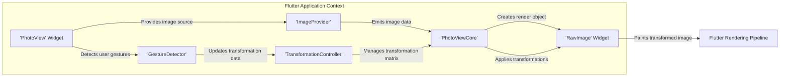

# Project Design Document: PhotoView Flutter Library

**Version:** 1.1
**Date:** October 26, 2023
**Author:** AI Architecture Expert

## 1. Introduction

This document provides an enhanced design overview of the PhotoView Flutter library, a widget designed to enable interactive, zoomable image views within Flutter applications. This detailed description aims to facilitate comprehensive threat modeling by clearly outlining the library's architecture, data flow, and dependencies.

## 2. Project Overview

The PhotoView library, available at [https://github.com/baseflow/photoview](https://github.com/baseflow/photoview), offers a robust and customizable solution for displaying images that users can manipulate through panning, zooming (including pinch-to-zoom), and rotation gestures. It efficiently manages complex gesture interactions and image transformations, ensuring a fluid and responsive user experience when viewing images within Flutter applications.

## 3. Scope

This design document focuses specifically on the internal architecture and runtime behavior of the PhotoView library as it operates within a Flutter application. It details the core components responsible for image rendering, user interaction handling, and internal state management. This scope *excludes* the implementation specifics of the Flutter framework itself or the underlying platform operating system. It also does not cover the network transport mechanisms used by specific `ImageProvider` implementations.

## 4. High-Level Architecture

## 5. Detailed Component Description

*   **'PhotoView' Widget:** This is the primary entry point and public interface of the library. It's a stateful widget that accepts an `ImageProvider` and various configuration options (e.g., initial scale, background color). It orchestrates the interaction between other internal components and handles high-level state management.
*   **'ImageProvider'**:  A fundamental Flutter concept, not unique to PhotoView. It's an abstract class responsible for fetching image data from different sources (network URLs, local assets, in-memory buffers, etc.). PhotoView relies on the standard Flutter `ImageProvider` implementations to retrieve the image.
*   **'RawImage' Widget:** A lower-level Flutter widget used by PhotoViewCore to directly display the image data. It's the target of the transformation matrix.
*   **'GestureDetector'**: A standard Flutter widget that detects and interprets various user gestures. PhotoView utilizes this to recognize panning, zooming (pinch), double-tap, and other relevant interactions for manipulating the displayed image.
*   **'TransformationController'**: This controller is responsible for managing the transformation matrix applied to the image. It holds the current scale, translation (offset), and rotation values. User gestures update this controller, which in turn triggers a re-render of the image with the new transformation.
*   **'PhotoViewCore'**: An internal widget that encapsulates the core logic for managing the image display and applying transformations. It receives the `ImageProvider` data and the transformation matrix from the `TransformationController` and renders the image using the `RawImage` widget. It handles the intricacies of applying the transformations to the image.

## 6. Data Flow

The primary data flow can be broken down into image loading and transformation application:

*   **Image Data Loading:**
    *   The `PhotoView` widget is initialized with an `ImageProvider`.
    *   The `PhotoViewCore` requests the image data from the provided `ImageProvider`.
    *   The `ImageProvider` fetches the image data asynchronously from its source.
    *   Once the image data is available, it's passed to the `RawImage` widget for initial rendering.
*   **Transformation Application:**
    *   The `GestureDetector` within the `PhotoView` widget detects user gestures.
    *   These gestures trigger updates to the `TransformationController`.
    *   The `TransformationController` recalculates the transformation matrix based on the gesture.
    *   The updated transformation matrix is applied to the `RawImage` widget within `PhotoViewCore`.
    *   The Flutter Rendering Pipeline then re-renders the `RawImage` widget with the applied transformations, resulting in the visual changes (zoom, pan, rotate).

## 7. External Dependencies

PhotoView relies on the following external components provided by the Flutter SDK:

*   **`flutter/widgets`:** Provides the foundational building blocks for the UI, including `StatefulWidget`, `StatelessWidget`, and layout components.
*   **`flutter/gestures`:** Offers the `GestureDetector` and related classes for handling user input events.
*   **`flutter/painting`:** Includes the `ImageProvider` abstract class and concrete implementations for loading images, as well as classes for managing image rendering.
*   **`flutter/rendering`:**  Provides the underlying rendering primitives and the concept of render objects, which `PhotoViewCore` utilizes.
*   **`vector_math` package (transitive dependency):** Used by Flutter for efficient matrix operations required for image transformations.

## 8. Security Considerations (Pre-Threat Modeling)

Before formal threat modeling, consider these potential security implications:

*   **Image Source Vulnerability:** If the `ImageProvider` fetches data from an untrusted source (e.g., a user-provided URL without proper validation), malicious or excessively large images could be loaded, potentially leading to:
    *   **Denial of Service (DoS):**  Loading extremely large images could exhaust device memory or processing power, causing the application to crash or become unresponsive.
    *   **Information Disclosure:**  If the image source is a private or sensitive location, improper handling could lead to unintended exposure of data.
*   **Resource Exhaustion:** Repeatedly loading and transforming very large images could lead to excessive CPU and memory usage, impacting device performance and battery life.
*   **Integer Overflow/Underflow in Transformations:** While less likely with current implementations, potential vulnerabilities could exist in the calculation or application of transformation matrices if input values are not properly sanitized or bounded, potentially leading to unexpected behavior or crashes.
*   **Input Handling Vulnerabilities:** Although primarily gesture-based, unexpected or malformed touch events could potentially trigger unforeseen states or errors within the library's logic.
*   **Content Security Policy (CSP) Bypass (in Web contexts):** If PhotoView is used within a Flutter web application, ensure that the image sources and any related resources comply with the application's Content Security Policy to prevent cross-site scripting (XSS) attacks.

## 9. Deployment Considerations

The PhotoView library is integrated into a Flutter application as a standard package dependency. Deployment involves:

*   Adding the `photoview` dependency to the `dependencies` section of the `pubspec.yaml` file.
*   Running `flutter pub get` to download and link the library.
*   Importing the necessary PhotoView classes in the Dart code where the widget is used.
*   Instantiating the `PhotoView` widget and providing an appropriate `ImageProvider`.

The security of the deployed application depends on the overall security practices of the application, including secure handling of image sources and data.

## 10. Future Considerations

Potential areas for future development and security enhancements include:

*   **Advanced Caching Strategies:** Implementing more sophisticated caching mechanisms (e.g., disk caching, memory management) to optimize performance and reduce network requests, while ensuring cache integrity and security.
*   **Fine-grained Gesture Control:** Providing more granular control over gesture recognition and customization options for developers.
*   **Enhanced Error Handling and Reporting:**  Improving error handling for image loading failures and providing more informative error messages.
*   **Accessibility Enhancements:**  Further improving accessibility features for users with disabilities, such as screen reader support for image descriptions and alternative input methods.
*   **Regular Security Audits:** Conducting periodic security reviews and penetration testing to proactively identify and address potential vulnerabilities.

This enhanced design document provides a more in-depth understanding of the PhotoView library's internal workings, which is crucial for a more thorough and effective threat modeling process.