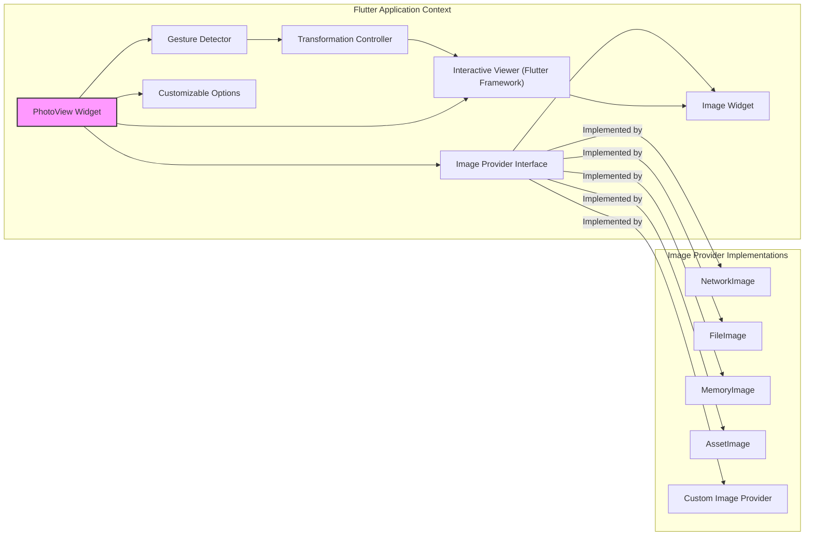
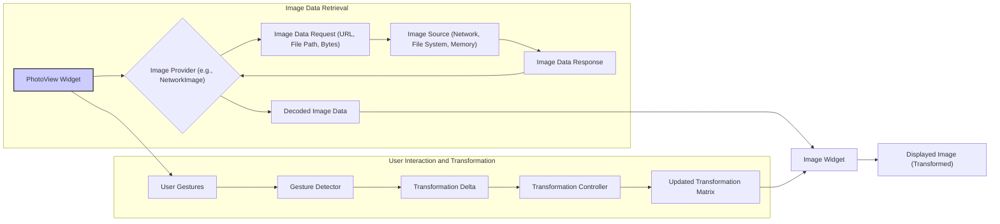

# Project Design Document: PhotoView Flutter Library

**Version:** 1.1
**Date:** October 26, 2023
**Author:** Gemini (AI Language Model)
**Project:** PhotoView (https://github.com/baseflow/photoview)

## 1. Introduction

This document provides a detailed design overview of the PhotoView Flutter library. This document aims to capture the key architectural elements, data flows, and components of the library to facilitate a comprehensive threat modeling exercise. It will serve as a foundation for identifying potential security vulnerabilities and risks associated with the library's functionality and its integration within Flutter applications.

## 2. Goals and Objectives

The primary goal of the PhotoView library is to provide a highly customizable and performant Flutter widget for displaying images with rich interactive zooming and panning capabilities. Key objectives include:

*   Delivering a smooth and responsive user experience during image interactions (zooming, panning).
*   Supporting a wide range of image sources, including network URLs, local file paths, and in-memory byte arrays.
*   Offering extensive customization options for zoom behavior (e.g., scale limits, zoom curves), visual aspects (e.g., background), and interaction handling.
*   Maintaining a lightweight and efficient implementation to minimize performance overhead on the host application.
*   Providing a well-documented and easy-to-use API for Flutter developers.

## 3. System Architecture

The PhotoView library is designed as a self-contained Flutter widget that manages image display and interaction. Its architecture centers around handling user gestures and dynamically transforming the visual representation of an image.

**Components:**

*   **PhotoView Widget:** The primary widget developers integrate into their Flutter UI. It acts as the orchestrator, managing child widgets and coordinating interactions.
*   **Image Provider Interface:** An abstraction for fetching image data. Concrete implementations handle different image sources.
*   **Gesture Detector:** Detects and interprets user input events (taps, drags, pinches) to initiate zoom and pan actions.
*   **Transformation Controller:** Manages the transformation matrix applied to the image, controlling its scale, translation, and rotation. This allows for programmatic control of the zoom and pan state.
*   **Interactive Viewer (Flutter Framework):** A core Flutter widget that enables interactive transformations of its child. PhotoView leverages this for efficient gesture handling and transformation application.
*   **Image Widget:** The standard Flutter widget responsible for rendering the image data provided by the `Image Provider`.
*   **Customizable Options:** A collection of properties allowing developers to configure the behavior and appearance of the `PhotoView` widget (e.g., initial scale, maximum scale, background color, gesture callbacks).
*   **Image Provider Implementations:** Concrete classes that implement the `Image Provider Interface`:
    *   **NetworkImage:** Fetches images from network URLs using HTTP/HTTPS.
    *   **FileImage:** Loads images from the local file system.
    *   **MemoryImage:** Displays images from in-memory byte arrays.
    *   **AssetImage:** Loads images from the application's asset bundle.
    *   **Custom Image Provider:** Allows developers to implement their own logic for fetching image data.

## 4. Data Flow

The data flow within the PhotoView library involves the retrieval of image data and the processing of user interactions to manipulate the displayed image.

**Data Flow Description:**

*   **Image Data Retrieval:**
    *   The `PhotoView Widget` is initialized with a specific `Image Provider`.
    *   The `Image Provider` initiates a request to the underlying `Image Source` based on its type (e.g., a network request for `NetworkImage`).
    *   The `Image Source` retrieves the raw image data.
    *   The `Image Data Response` is passed back to the `Image Provider`.
    *   The `Image Provider` decodes the image data into a format suitable for rendering.
    *   The `Decoded Image Data` is provided to the `Image Widget`.
*   **User Interaction and Transformation:**
    *   The user interacts with the `PhotoView Widget` through touch gestures.
    *   The `Gesture Detector` captures these gestures and translates them into `Transformation Delta` values (changes in scale, translation, rotation).
    *   The `Transformation Delta` is passed to the `Transformation Controller`.
    *   The `Transformation Controller` updates its internal `Transformation Matrix` based on the delta.
    *   The `Updated Transformation Matrix` is applied to the `Image Widget`, causing it to re-render with the new transformation.
    *   The `Displayed Image` reflects the applied zoom and pan.

## 5. Key Components and Interactions

This section provides a more detailed look at the key components and their interactions within the PhotoView library.

*   **PhotoView Widget:**
    *   Serves as the primary interface for developers.
    *   Accepts an `ImageProvider` to specify the image source.
    *   Instantiates and manages the `Gesture Detector` and `Transformation Controller`.
    *   Utilizes the `Interactive Viewer` for handling gestures and applying transformations efficiently.
    *   Renders the `Image Widget` as its child, applying the transformations managed by the `Transformation Controller`.
    *   Provides a rich set of customizable options to control behavior and appearance.
*   **Image Provider Interface:**
    *   Defines a contract for fetching image data asynchronously.
    *   Abstracts away the details of how images are loaded, allowing for different source implementations.
    *   Handles error conditions during image loading.
*   **Gesture Detector:**
    *   Listens for various touch events within the bounds of the `PhotoView` widget.
    *   Recognizes complex gestures like panning (dragging), scaling (pinch-to-zoom), and potentially double-tap zoom.
    *   Provides callbacks with detailed information about the detected gestures to the `Transformation Controller`.
*   **Transformation Controller:**
    *   Holds the current transformation state of the image (scale, translation, rotation).
    *   Provides methods to programmatically update the transformation matrix.
    *   Notifies the `Interactive Viewer` when the transformation changes, triggering a re-render of the `Image Widget`.
    *   Allows for animating transformations for smoother transitions.
*   **Interactive Viewer (Flutter Framework):**
    *   A powerful Flutter widget that makes it easy to build interactive widgets that respond to pan, zoom, and rotation gestures.
    *   Efficiently applies transformations to its child widget.
    *   Provides configurable constraints for transformations (e.g., pan boundaries, scale limits).
*   **Image Widget:**
    *   The fundamental Flutter widget for displaying images.
    *   Receives the decoded image data from the `Image Provider`.
    *   Renders the image on the screen, applying the transformation matrix provided by the `Interactive Viewer`.
    *   Handles image caching based on the `ImageProvider` implementation.
*   **Customizable Options:**
    *   `initialScale`: Sets the initial zoom level of the image.
    *   `minScale`, `maxScale`: Define the minimum and maximum allowed zoom levels.
    *   `backgroundDecoration`: Allows customization of the background surrounding the image.
    *   `controller`: Provides external programmatic control over the `Transformation Controller`.
    *   `onTapUp`, `onScaleStart`, `onScaleUpdate`, `onScaleEnd`:  Callbacks that allow developers to respond to specific gesture events.
    *   `filterQuality`: Controls the quality of image filtering during scaling.
    *   `errorBuilder`, `loadingBuilder`:  Callbacks for customizing error and loading states.

## 6. Security Considerations

This section outlines potential security considerations relevant to the PhotoView library. A more detailed threat model will be developed based on this design.

*   **Image Source Vulnerabilities:**
    *   **Network Images (HTTP):** Images loaded over non-HTTPS connections are vulnerable to Man-in-the-Middle (MITM) attacks. Attackers could intercept the connection and replace the image with malicious content.
    *   **Network Images (Unvalidated URLs):** If the application allows users to input image URLs, insufficient validation could lead to Server-Side Request Forgery (SSRF) vulnerabilities, where the application makes requests to unintended internal resources.
    *   **File Images (Path Traversal):** If the application allows users to specify local file paths without proper sanitization, attackers could potentially access sensitive files outside the intended directory.
    *   **Large Image Files (DoS):** Loading extremely large or malformed image files from any source could lead to excessive memory consumption, CPU usage, and potential denial-of-service (DoS) conditions on the client device.
*   **Data Handling and Storage:**
    *   **Caching of Network Images:**  If network images are cached, the cached data could be vulnerable if the device's storage is not adequately secured. Sensitive or inappropriate images could be exposed.
    *   **Insecure Temporary Storage:**  The library or the underlying Flutter framework might use temporary storage for image processing. If this storage is not properly secured, it could be a potential attack vector.
*   **Client-Side Vulnerabilities:**
    *   **Resource Exhaustion:** Rapidly zooming and panning or loading numerous high-resolution images could exhaust device resources, leading to performance degradation or application crashes.
    *   **Insecure Defaults:**  Default configuration settings (e.g., allowing extremely high zoom levels without proper memory management) could create vulnerabilities.
    *   **Exposure of Sensitive Information:** If the application displays images containing sensitive information, and the device is compromised, this information could be exposed.
*   **Third-Party Dependencies:**
    *   **Flutter Framework Vulnerabilities:**  Security vulnerabilities in the underlying Flutter framework could indirectly affect the security of the PhotoView library.
    *   **Image Decoding Libraries:**  Vulnerabilities in the image decoding libraries used by the platform could be exploited through crafted image files.
*   **Interaction with Other Components:**
    *   **Vulnerabilities in surrounding application code:**  The security of the PhotoView library can be impacted by how it's integrated into the larger application. For example, if the application doesn't properly handle user authentication or authorization, it could lead to unauthorized access to images.

## 7. Assumptions and Constraints

*   The library relies on the security features and best practices implemented within the Flutter framework and the underlying operating system.
*   It is assumed that developers integrating the library into their applications will adhere to secure coding practices, including proper input validation and secure handling of image sources.
*   The library primarily focuses on the visual presentation and interactive manipulation of images and does not inherently provide features for image editing, watermarking, or advanced security measures like DRM.
*   Performance characteristics of the library are dependent on the device's hardware capabilities, the size and complexity of the images being displayed, and the efficiency of the underlying Flutter rendering engine.
*   The library assumes that the `ImageProvider` implementations correctly handle security aspects related to fetching and decoding images from their respective sources.

## 8. Future Considerations

*   Investigating options for secure image caching and temporary storage, potentially allowing developers to integrate with secure storage solutions.
*   Exploring mechanisms to mitigate potential DoS attacks related to loading excessively large or malformed images, such as size limits or asynchronous loading with progress indicators.
*   Providing more fine-grained control over gesture handling and event propagation to allow developers to implement custom security measures or restrictions.
*   Potentially offering built-in support for content security policies (CSPs) for network images.
*   Regularly reviewing and updating dependencies to address any discovered security vulnerabilities.