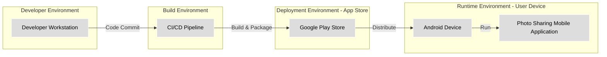
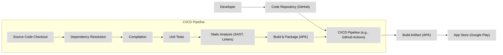

# BUSINESS POSTURE

This project is focused on leveraging the `photoview` Android library to enhance the user experience within a mobile application that displays images. The primary business priority is to provide users with a smooth and intuitive image viewing experience, specifically focusing on zoom and pan functionalities. The goal is to increase user engagement and satisfaction with the application by offering a polished and user-friendly image interaction.

The most important business risks associated with this project are:

- Risk of user dissatisfaction if the `photoview` library introduces bugs or performance issues, negatively impacting the image viewing experience.
- Risk of potential security vulnerabilities within the `photoview` library itself, or in its integration, that could be exploited within the application.
- Risk of dependency on a third-party library that may become unmaintained or incompatible with future application updates, leading to technical debt or rework.

# SECURITY POSTURE

Existing security controls:

- security control: Secure Software Development Lifecycle (SSDLC) practices are assumed to be in place for the application that will integrate the `photoview` library. This includes code reviews, static and dynamic analysis, and security testing, although specific details are not provided for the `photoview` library itself.
- security control: Dependency management practices are assumed to be in place for the application, including tracking and updating third-party libraries like `photoview`.
- security control: Application deployment through official app stores (e.g., Google Play Store) provides a level of security through app vetting processes, although this is not specific to the `photoview` library.

Accepted risks:

- accepted risk: Reliance on a third-party open-source library introduces a degree of inherent risk, as the security and maintenance of the library are not directly controlled by the application development team.
- accepted risk: Potential vulnerabilities within the `photoview` library may exist and could be discovered in the future. Mitigation relies on timely updates and security patching by the library maintainers and the application development team.

Recommended security controls:

- recommended security control: Implement automated dependency scanning to continuously monitor the `photoview` library and its dependencies for known vulnerabilities.
- recommended security control: Conduct regular security testing, including penetration testing and vulnerability scanning, of the application that integrates the `photoview` library, paying specific attention to image handling and user interactions.
- recommended security control: Establish a process for monitoring security advisories and updates related to the `photoview` library and its dependencies, and promptly apply necessary patches or updates.

Security requirements:

- Authentication: Authentication is not directly relevant to the `photoview` library itself, as it is a UI component. Authentication is expected to be handled by the application using the library to control access to images and application features.
- Authorization: Authorization is also not directly relevant to the `photoview` library. The application using the library must implement authorization mechanisms to ensure users only access images they are permitted to view.
- Input validation: Input validation is important in the context of how the application loads and displays images using the `photoview` library. The application must validate image sources (e.g., URLs, file paths) and image data to prevent issues like path traversal or malicious image files. Input validation should be implemented in the application layer before passing image data to the `photoview` library.
- Cryptography: Cryptography is not a direct requirement for the `photoview` library itself. However, the application using the library may need to employ cryptography for secure storage or transmission of images, depending on the application's requirements. This would be implemented outside of the `photoview` library.

# DESIGN

## C4 CONTEXT

```mermaid
flowchart LR
    subgraph "Photo Sharing Mobile Application"
        A["PhotoView Library"]
    end
    B["Mobile App User"]
    C["Image Storage Service"]
    D["User Authentication Service"]

    B -- Uses --> A
    A -- Retrieves Images from --> C
    B -- Authenticates with --> D
    A -- Part of --> "Photo Sharing Mobile Application"
    "Photo Sharing Mobile Application" -- Uses --> C
    "Photo Sharing Mobile Application" -- Uses --> D

    classDef plain fill:#ddd,stroke:#fff,stroke-width:1px,color:#000
    class A,B,C,D plain
```

Context Diagram Elements:

- Element:
    - Name: Mobile App User
    - Type: Person
    - Description: Users of the photo sharing mobile application who view and interact with images.
    - Responsibilities: View images, zoom and pan images, interact with the application UI.
    - Security controls: User authentication to access the application, authorization to view specific images based on application logic.

- Element:
    - Name: Photo Sharing Mobile Application
    - Type: Software System
    - Description: The mobile application (Android) that utilizes the `photoview` library to display and manage images. This is the system being designed in context.
    - Responsibilities: Provide user interface for image viewing, manage user interactions, retrieve images from storage, handle user authentication and authorization, integrate with other services.
    - Security controls: Application-level authentication and authorization, input validation, secure communication with backend services, secure storage of user data (if applicable), regular security updates and patching.

- Element:
    - Name: PhotoView Library
    - Type: Software System (External Library)
    - Description: The `photoview` Android library, an external dependency used by the Photo Sharing Mobile Application to provide image zoom and pan functionalities.
    - Responsibilities: Handle image display, provide zoom and pan gestures, manage image transformations.
    - Security controls: Security controls are primarily the responsibility of the library developers. The application using the library relies on the library being maintained and free of known vulnerabilities. Dependency scanning and regular updates are important security controls for the application.

- Element:
    - Name: Image Storage Service
    - Type: Software System (External System)
    - Description: A backend service responsible for storing and serving image files. This could be cloud storage or a dedicated image server.
    - Responsibilities: Store image files, provide access to images based on application requests, manage image metadata.
    - Security controls: Access control mechanisms, authentication and authorization for API access, data encryption at rest and in transit, regular security audits and patching.

- Element:
    - Name: User Authentication Service
    - Type: Software System (External System)
    - Description: A backend service responsible for managing user accounts and authentication.
    - Responsibilities: Authenticate users, manage user sessions, provide user identity information to the application.
    - Security controls: Secure authentication protocols (e.g., OAuth 2.0, OpenID Connect), secure storage of user credentials, multi-factor authentication, protection against brute-force attacks.

## C4 CONTAINER

```mermaid
flowchart LR
    subgraph "Mobile Device"
        subgraph "Photo Sharing Mobile Application"
            A["Android Application Container"]
                B["PhotoView Library"]
                C["Image Display UI Component"]
                D["Networking Library"]
                E["Local Storage"]
        end
    end
    F["Image Storage Service API"]
    G["User Authentication Service API"]

    C -- Uses --> B
    A -- Uses --> D
    A -- Uses --> E
    D -- Interacts with --> F
    D -- Interacts with --> G
    "Android Application Container" -- Interacts with --> F
    "Android Application Container" -- Interacts with --> G

    classDef plain fill:#ddd,stroke:#fff,stroke-width:1px,color:#000
    class A,B,C,D,E,F,G plain
```

Container Diagram Elements:

- Element:
    - Name: Android Application Container
    - Type: Container (Mobile Application)
    - Description: The main container for the Photo Sharing Mobile Application running on an Android device. It packages all application components and libraries.
    - Responsibilities: Application lifecycle management, UI rendering, coordinating application components, managing network communication and local storage.
    - Security controls: Application signing, runtime permissions, secure coding practices, integration of security libraries, regular updates from app store.

- Element:
    - Name: PhotoView Library
    - Type: Container (Library)
    - Description: The `photoview` Android library integrated within the Android Application Container. It is responsible for handling image zoom and pan gestures and rendering.
    - Responsibilities: Image display, zoom and pan functionality, gesture handling.
    - Security controls: Inherits security context of the Android Application Container. Security depends on the library's code quality and absence of vulnerabilities. Application-level dependency scanning and updates are crucial.

- Element:
    - Name: Image Display UI Component
    - Type: Container (Component)
    - Description: UI components within the Android application that utilize the `photoview` library to display images. This includes Activities and Fragments responsible for image presentation.
    - Responsibilities: Loading images, displaying images using `photoview`, handling user interactions related to image viewing.
    - Security controls: Input validation for image sources, secure handling of image data, proper error handling to prevent information leakage.

- Element:
    - Name: Networking Library
    - Type: Container (Library)
    - Description: A library (e.g., Retrofit, OkHttp) used by the Android application for network communication with backend services (Image Storage Service and User Authentication Service).
    - Responsibilities: Handling HTTP requests and responses, managing network connections, data serialization and deserialization.
    - Security controls: HTTPS for secure communication, certificate pinning, protection against man-in-the-middle attacks, secure handling of API keys and tokens.

- Element:
    - Name: Local Storage
    - Type: Container (Data Store)
    - Description: Local storage on the Android device used by the application for caching images or storing application data.
    - Responsibilities: Caching images for offline access or performance, storing user preferences or application state.
    - Security controls: Encryption of sensitive data at rest, proper file permissions, secure deletion of temporary files, protection against unauthorized access from other applications.

- Element:
    - Name: Image Storage Service API
    - Type: Container (External API)
    - Description: The API provided by the Image Storage Service for accessing and retrieving images.
    - Responsibilities: Providing endpoints for image retrieval, handling authentication and authorization for image access.
    - Security controls: API authentication and authorization (e.g., API keys, OAuth 2.0), input validation, rate limiting, protection against API attacks (e.g., injection, DDoS).

- Element:
    - Name: User Authentication Service API
    - Type: Container (External API)
    - Description: The API provided by the User Authentication Service for user authentication and session management.
    - Responsibilities: Providing endpoints for user login, registration, session management, and user profile information.
    - Security controls: Secure authentication protocols, protection against brute-force attacks, account lockout policies, secure password storage, session management, protection against session hijacking.

## DEPLOYMENT

Deployment Architecture: Mobile App Store Distribution



Deployment Diagram Elements:

- Element:
    - Name: Developer Workstation
    - Type: Infrastructure (Development Environment)
    - Description: The local machine used by developers to write code, test, and build the application.
    - Responsibilities: Code development, local testing, version control, building application packages.
    - Security controls: Secure workstation configuration, access control, antivirus software, code review processes, secure coding practices.

- Element:
    - Name: CI/CD Pipeline
    - Type: Infrastructure (Build Environment)
    - Description: Automated Continuous Integration and Continuous Deployment pipeline used to build, test, and package the application.
    - Responsibilities: Automated building, testing, static analysis, packaging, and potentially deployment to app stores.
    - Security controls: Secure build environment, access control to pipeline configurations and secrets, vulnerability scanning of dependencies, automated security testing, secure artifact storage.

- Element:
    - Name: Google Play Store
    - Type: Infrastructure (Deployment Environment - App Store)
    - Description: The Google Play Store platform used to distribute the Android application to users.
    - Responsibilities: Application hosting, distribution to users, app vetting process, handling updates.
    - Security controls: App signing verification, malware scanning, platform security features, user reviews and ratings.

- Element:
    - Name: Android Device
    - Type: Infrastructure (Runtime Environment - User Device)
    - Description: User's Android mobile device where the Photo Sharing Mobile Application is installed and run.
    - Responsibilities: Running the application, providing user interface, executing application logic, storing application data.
    - Security controls: Device security features (e.g., screen lock, encryption), operating system security updates, application sandboxing, user permissions.

- Element:
    - Name: Photo Sharing Mobile Application
    - Type: Software System (Runtime Component)
    - Description: The installed and running instance of the Photo Sharing Mobile Application on the Android device, utilizing the `photoview` library.
    - Responsibilities: Providing image viewing functionality, interacting with users, communicating with backend services.
    - Security controls: Application-level security controls as described in previous sections, runtime permissions, secure data handling, regular updates.

## BUILD



Build Process Description:

The build process for the Photo Sharing Mobile Application is automated using a CI/CD pipeline, such as GitHub Actions, to ensure consistent and secure builds.

- Developer: Developers write code and commit changes to the Code Repository.
- Code Repository (GitHub): Source code is stored and version controlled in a Git repository on GitHub.
- CI/CD Pipeline (e.g., GitHub Actions):
    - Source Code Checkout: The pipeline starts by checking out the latest source code from the repository.
    - Dependency Resolution: Dependencies, including the `photoview` library and other required libraries, are resolved and downloaded using a dependency management tool (e.g., Gradle for Android).
    - Compilation: The source code is compiled into bytecode and then into native code for Android.
    - Unit Tests: Automated unit tests are executed to verify the functionality of the code.
    - Static Analysis (SAST, Linters): Static analysis security testing (SAST) tools and linters are used to scan the codebase for potential security vulnerabilities and code quality issues. This includes checking for common coding errors, security flaws, and adherence to coding standards.
    - Build & Package (APK): The compiled code and resources are packaged into an Android Application Package (APK) file, which is the distributable format for Android applications.
- Build Artifact (APK): The resulting APK file is the build artifact, ready for deployment.
- App Store (Google Play): The APK is uploaded to the Google Play Store for distribution to users.

Security Controls in Build Process:

- security control: Secure Code Repository: Access control to the code repository, branch protection, and audit logging.
- security control: Secure CI/CD Pipeline: Access control to pipeline configurations and secrets, secure build agents, isolated build environments.
- security control: Dependency Scanning: Automated scanning of dependencies for known vulnerabilities during the dependency resolution step.
- security control: Static Analysis (SAST): Automated SAST tools integrated into the pipeline to detect potential security vulnerabilities in the code.
- security control: Code Linting: Linters to enforce coding standards and identify potential code quality issues that could lead to security problems.
- security control: Unit Tests: Unit tests to verify code functionality and prevent regressions, indirectly contributing to security by ensuring code correctness.
- security control: Secure Artifact Storage: Secure storage of build artifacts (APKs) before deployment.

# RISK ASSESSMENT

Critical business process we are trying to protect:

- Displaying images to users within the Photo Sharing Mobile Application is a critical business process. If this process is disrupted or compromised, it directly impacts user experience and the core functionality of the application.

Data we are trying to protect and their sensitivity:

- User Photos: User-generated photos are the primary data being handled. The sensitivity of this data depends on the application's purpose and user expectations. In a typical photo sharing application, user photos are considered personal and potentially sensitive.
    - Sensitivity: Potentially sensitive. Photos may contain personal information, private moments, or artistic creations that users expect to be kept confidential or shared only with intended recipients.
- User Account Information: User credentials and profile data are also sensitive and need protection.
    - Sensitivity: Highly sensitive. Compromise of user accounts can lead to unauthorized access to user photos and application features, as well as potential privacy breaches.

# QUESTIONS & ASSUMPTIONS

Questions:

- What specific type of photo sharing application is this design document for? (e.g., public sharing, private sharing, professional photography portfolio). The sensitivity of data and security requirements might vary based on the application type.
- What are the specific security requirements and compliance standards that the application needs to adhere to (e.g., GDPR, HIPAA, local privacy regulations)?
- What is the expected scale and user base of the application? This can influence the scalability and security considerations for the backend services.
- Are there any specific performance requirements for image loading and display? Performance considerations can sometimes impact security design choices.

Assumptions:

- BUSINESS POSTURE: The primary business goal is to provide a user-friendly and engaging photo viewing experience within a mobile application. User satisfaction and application adoption are key business drivers.
- SECURITY POSTURE: Standard mobile application security best practices are followed. The application aims to protect user data and prevent common mobile security vulnerabilities. The organization has a moderate risk appetite and is willing to invest in reasonable security controls.
- DESIGN: The application is an Android mobile application distributed through the Google Play Store. It utilizes backend services for image storage and user authentication. The `photoview` library is used solely for enhancing the image viewing experience within the mobile application UI.