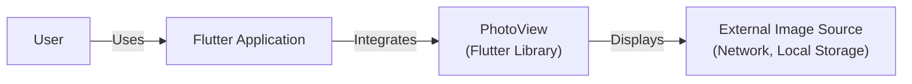
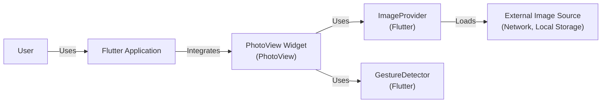
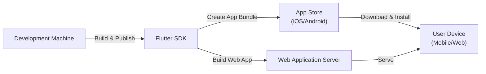
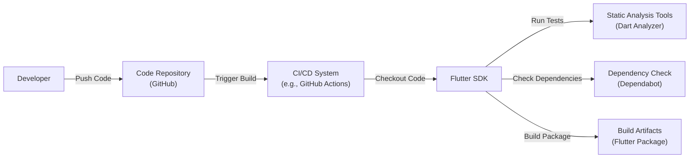

Okay, let's create a design document for the PhotoView project.

# BUSINESS POSTURE

Business Priorities and Goals:

*   Provide a simple and intuitive way to display images and videos with zoom and pan capabilities within Flutter applications.
*   Offer a highly customizable and extensible solution for developers to integrate image viewing functionality.
*   Maintain a lightweight and performant library to minimize impact on application size and responsiveness.
*   Ensure broad platform compatibility (iOS, Android, Web, potentially others).
*   Foster an active open-source community for contributions and support.

Most Important Business Risks:

*   Security vulnerabilities within the library could expose user data or lead to application compromise.
*   Poor performance or excessive resource consumption could negatively impact the user experience of applications using the library.
*   Lack of compatibility with different Flutter versions or platforms could limit adoption.
*   Inadequate documentation or support could hinder developer adoption and satisfaction.
*   Competition from other image viewing libraries could reduce market share.

# SECURITY POSTURE

Existing Security Controls:

*   security control: The project is open-source, allowing for community review and contributions to identify and address potential security issues. (Described in: GitHub repository)
*   security control: The project uses Dart, a memory-safe language, which reduces the risk of common vulnerabilities like buffer overflows. (Described in: GitHub repository, Dart language specification)
*   security control: The project appears to utilize standard Flutter widgets and APIs, minimizing the need for custom platform-specific code that could introduce vulnerabilities. (Described in: GitHub repository, code review)

Accepted Risks:

*   accepted risk: The library handles potentially untrusted image/video data from various sources (network, local storage, etc.). While Dart's memory safety helps, vulnerabilities in image/video parsing libraries (used internally by Flutter) could still exist.
*   accepted risk: The library's extensibility features (custom builders, gesture detectors) could potentially be misused by developers to introduce vulnerabilities into their applications.
*   accepted risk: The library depends on external dependencies (Flutter SDK, potentially other packages). Vulnerabilities in these dependencies could impact the security of the library.

Recommended Security Controls:

*   security control: Implement a regular security review process, including static analysis and dependency vulnerability scanning.
*   security control: Provide clear documentation and guidelines for developers on securely using the library, especially regarding handling untrusted data and using extensibility features.
*   security control: Consider adding fuzz testing to test the library's resilience against malformed image/video data.
*   security control: Establish a security reporting process for users to report potential vulnerabilities.

Security Requirements:

*   Authentication: Not directly applicable to this library, as it primarily deals with displaying content, not user authentication. Authentication should be handled by the application using the library.
*   Authorization: Not directly applicable. Authorization for accessing images/videos should be handled by the application.
*   Input Validation: The library should validate input parameters (e.g., image URLs, scale values) to prevent unexpected behavior or crashes. It should also rely on Flutter's internal handling of image/video data to minimize the risk of parsing vulnerabilities.
*   Cryptography: Not directly applicable, unless the library is used to display encrypted images/videos. In that case, the application should handle decryption, and the library should only display the decrypted data.

# DESIGN

## C4 CONTEXT

Element Descriptions:

*   Element:
    *   Name: User
    *   Type: Person
    *   Description: The end-user interacting with a Flutter application that utilizes the PhotoView library.
    *   Responsibilities: Interacts with the Flutter application to view images/videos.
    *   Security controls: None directly implemented by the PhotoView library. Relies on the security of the Flutter application and the device.

*   Element:
    *   Name: PhotoView
    *   Type: Software System (Flutter Library)
    *   Description: A Flutter library providing zoomable image and video viewing capabilities.
    *   Responsibilities: Displaying images/videos, handling user gestures (zoom, pan), providing customization options.
    *   Security controls: Input validation, reliance on Flutter's image/video handling, memory safety of Dart.

*   Element:
    *   Name: Flutter Application
    *   Type: Software System
    *   Description: A Flutter application that integrates the PhotoView library to display images/videos.
    *   Responsibilities: Managing application state, fetching image/video data, integrating and configuring PhotoView.
    *   Security controls: Responsible for overall application security, including authentication, authorization, and secure data handling.

*   Element:
    *   Name: External Image Source
    *   Type: External System
    *   Description: The source of the image/video data, such as a network URL or local file storage.
    *   Responsibilities: Providing image/video data to the Flutter application.
    *   Security controls: Depends on the specific source. Network sources should use HTTPS. Local file storage relies on device security.

## C4 CONTAINER

Since PhotoView is a library, the container diagram is essentially an extension of the context diagram.

Element Descriptions:

*   Element:
    *   Name: PhotoView Widget
    *   Type: Container (Flutter Widget)
    *   Description: The main widget provided by the PhotoView library.
    *   Responsibilities: Rendering the image/video, handling user interactions, managing zoom and pan state.
    *   Security controls: Input validation.

*   Element:
    *   Name: ImageProvider
    *   Type: Container (Flutter Class)
    *   Description: A Flutter class used to load image data from various sources.
    *   Responsibilities: Fetching image data, decoding image formats, caching images.
    *   Security controls: Relies on Flutter's internal image handling, which should include security measures against malformed image data.

*   Element:
    *   Name: GestureDetector
    *   Type: Container (Flutter Widget)
    *   Description: A Flutter widget used to detect user gestures.
    *   Responsibilities: Detecting taps, drags, scales, and other gestures.
    *   Security controls: None specific to security.

*  All other elements are described in C4 CONTEXT section.

## DEPLOYMENT

Possible Deployment Solutions:

1.  As a dependency within a Flutter application, published to app stores (iOS App Store, Google Play Store) or deployed as a web application.
2.  As a standalone example application (for demonstration or testing purposes), deployed to a device or emulator.

Chosen Solution (1): Dependency within a Flutter Application

Element Descriptions:

*   Element:
    *   Name: Development Machine
    *   Type: Infrastructure Node
    *   Description: The developer's computer used to write and build the Flutter application.
    *   Responsibilities: Running the Flutter SDK, building the application, managing dependencies.
    *   Security controls: Developer machine security best practices (e.g., secure OS, antivirus, firewall).

*   Element:
    *   Name: Flutter SDK
    *   Type: Software System
    *   Description: The Flutter SDK used to build the application.
    *   Responsibilities: Compiling Dart code, managing dependencies, creating platform-specific builds.
    *   Security controls: Relies on the security of the Flutter SDK itself and its build process.

*   Element:
    *   Name: App Store (iOS/Android)
    *   Type: Infrastructure Node
    *   Description: The app store for the target platform (iOS App Store or Google Play Store).
    *   Responsibilities: Distributing the application to users, managing updates.
    *   Security controls: App store security review processes, code signing.

*   Element:
    *   Name: Web Application Server
    *   Type: Infrastructure Node
    *   Description: A web server hosting the Flutter web application.
    *   Responsibilities: Serving the web application files to users.
    *   Security controls: Web server security best practices (e.g., HTTPS, secure configuration, firewall).

*   Element:
    *   Name: User Device (Mobile/Web)
    *   Type: Infrastructure Node
    *   Description: The user's device (mobile phone, tablet, or web browser) running the Flutter application.
    *   Responsibilities: Running the application, displaying the UI, interacting with the user.
    *   Security controls: Device security (e.g., OS security, app sandboxing), browser security (for web applications).

## BUILD

Build Process Description:

1.  Developer pushes code changes to the GitHub repository.
2.  A CI/CD system (e.g., GitHub Actions) is triggered by the push.
3.  The CI system checks out the code from the repository.
4.  The Flutter SDK is used to run tests, including static analysis using the Dart Analyzer.
5.  Dependency checks are performed (e.g., using Dependabot) to identify outdated or vulnerable dependencies.
6.  The Flutter SDK builds the package, creating the necessary build artifacts.
7.  The build artifacts (Flutter package) are ready for use in Flutter applications.

Security Controls:

*   security control: Static analysis (Dart Analyzer) is used to identify potential code quality and security issues.
*   security control: Dependency checks (Dependabot) are used to identify and manage vulnerable dependencies.
*   security control: CI/CD system (GitHub Actions) provides a controlled and automated build environment.
*   security control: Code reviews are performed as part of the development process (implied by open-source nature).

# RISK ASSESSMENT

Critical Business Processes:

*   Displaying images and videos within Flutter applications with zoom and pan capabilities.
*   Providing a customizable and extensible image viewing solution for developers.

Data to Protect and Sensitivity:

*   Image/video data displayed by the library: Sensitivity varies depending on the content. Could range from public images to private user data. The library itself doesn't store or manage this data persistently; it only displays it. The application using the library is responsible for the security of the data.
*   No user credentials or PII are directly handled by the library.

# QUESTIONS & ASSUMPTIONS

Questions:

*   Are there any specific compliance requirements (e.g., GDPR, HIPAA) that the library needs to consider? (Assumption: No specific compliance requirements beyond general best practices.)
*   What are the expected sources of image/video data (e.g., primarily network, local storage, user-generated)? (Assumption: A mix of network and local storage sources.)
*   Are there any plans to support encrypted images/videos? (Assumption: No plans for built-in encryption support.)
*   What level of test coverage is currently in place, and are there plans to increase it? (Assumption: Reasonable test coverage exists, with ongoing efforts to improve it.)

Assumptions:

*   Business Posture: The primary goal is to provide a functional and useful library, with security as a high priority but not necessarily the absolute top priority.
*   Security Posture: The library relies heavily on the security of the underlying Flutter framework and its image/video handling capabilities.
*   Design: The library is designed to be lightweight and extensible, with a focus on ease of use for developers.