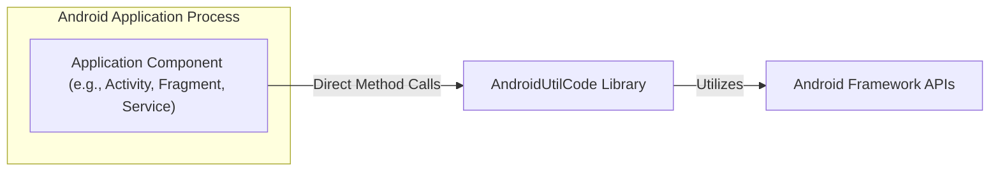
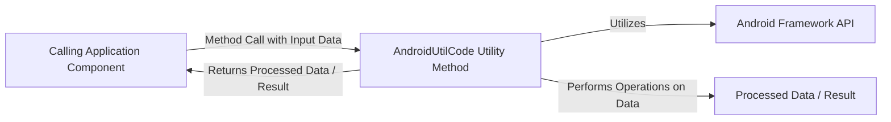

# Project Design Document: AndroidUtilCode Library

**Version:** 1.1
**Date:** October 26, 2023
**Author:** AI Software Architect

## 1. Introduction

This document provides a detailed design overview of the AndroidUtilCode library (referenced from [https://github.com/blankj/androidutilcode](https://github.com/blankj/androidutilcode)). This document aims to clearly articulate the library's architecture, components, and data flow, serving as a foundation for subsequent threat modeling activities. This document focuses on the library's structure and functionality as understood from its public interface and documentation, with a particular emphasis on aspects relevant to security.

## 2. Goals and Objectives

The primary goal of the AndroidUtilCode library is to provide a comprehensive set of utility functions and helper classes for Android development. The objectives include:

*   Simplifying common Android development tasks, reducing the need for developers to write repetitive code.
*   Reducing boilerplate code, leading to cleaner and more concise application codebases.
*   Improving code readability and maintainability by encapsulating common functionalities.
*   Providing a wide range of utility functionalities covering various aspects of Android development.

## 3. High-Level Architecture

The AndroidUtilCode library is structured as a collection of static utility classes. It doesn't implement a traditional layered architecture but rather offers a set of independent, focused utility functions organized logically within classes. The library is designed to be integrated directly into Android applications as a compile-time dependency.



*   **Android Application Process:** Represents the runtime environment of the Android application that uses the library.
*   **Application Component:**  Specific parts of the application (like Activities, Fragments, or Services) that invoke methods from the utility library.
*   **AndroidUtilCode Library:** The set of static utility classes providing various functionalities.
*   **Android Framework APIs:** The underlying Android operating system interfaces that the utility library interacts with to perform its tasks.

## 4. Component Details

The library is organized into distinct modules or packages, each containing utility classes grouped by their functionality. Understanding these components is crucial for identifying potential threat vectors.

*   **`Utils`:** The central access point for many utility modules. It often contains initialization methods and provides a global context.
*   **`AppUtils`:** Provides utilities for interacting with the Android application environment, such as:
    *   Getting application name, version, and package information.
    *   Managing application lifecycle events.
    *   Interacting with the application's context.
*   **`CacheUtils`:** Offers functionalities for managing cached data:
    *   Disk-based caching.
    *   Memory-based caching.
    *   Utilities for clearing cache directories.
*   **`CleanUtils`:** Provides methods for clearing various types of application data:
    *   Clearing application cache.
    *   Clearing files within the application's file system.
    *   Clearing shared preferences.
    *   Clearing databases.
*   **`CrashUtils`:**  Provides mechanisms for handling and logging application crashes:
    *   Capturing and saving crash logs.
    *   Restarting the application after a crash.
*   **`DeviceUtils`:** Provides information about the Android device:
    *   Device ID, IMEI, and other identifiers.
    *   Device model, manufacturer, and OS version.
    *   Network operator information.
*   **`FileUtils`:** Offers utilities for file system operations:
    *   Creating, deleting, and renaming files and directories.
    *   Reading and writing file content.
    *   Checking file existence and size.
*   **`ImageUtils`:** Provides functionalities for image manipulation:
    *   Resizing, cropping, and rotating images.
    *   Converting between different image formats.
    *   Loading images from various sources.
*   **`KeyboardUtils`:** Offers utilities for managing the software keyboard:
    *   Showing and hiding the keyboard.
    *   Checking keyboard visibility.
*   **`LogUtils`:** Provides a customizable logging mechanism:
    *   Different log levels (verbose, debug, info, warning, error, fatal).
    *   Options for writing logs to files.
*   **`NetworkUtils`:** Offers utilities for checking network connectivity and retrieving network information:
    *   Checking if the device is connected to the internet.
    *   Getting network type (Wi-Fi, mobile).
    *   Retrieving IP addresses.
*   **`ProcessUtils`:** Provides utilities for managing processes:
    *   Killing background processes.
    *   Getting running processes.
*   **`RegexUtils`:** Offers utilities for working with regular expressions:
    *   Matching and searching strings using regular expressions.
*   **`ScreenUtils`:** Provides information about the device screen and utilities for screen manipulation:
    *   Getting screen dimensions and density.
    *   Setting screen brightness.
*   **`SDCardUtils`:** Offers utilities for interacting with the SD card:
    *   Checking SD card availability and space.
    *   Getting SD card paths.
*   **`ServiceUtils`:** Provides utilities for managing Android services:
    *   Starting and stopping services.
    *   Checking if a service is running.
*   **`ShellUtils`:** Allows executing shell commands on the device (requires appropriate permissions and careful usage).
*   **`SPUtils`:** Provides a wrapper around SharedPreferences for easier data persistence:
    *   Storing and retrieving primitive data types.
*   **`StringUtils`:** Offers various string manipulation utilities:
    *   Checking for empty strings.
    *   Formatting strings.
    *   Converting between different string encodings.
*   **`ThreadUtils`:** Provides utilities for managing threads and thread pools:
    *   Executing tasks on background threads.
    *   Creating and managing thread pools.
*   **`TimeUtils`:** Offers utilities for working with dates and times:
    *   Formatting dates and times.
    *   Calculating time differences.
*   **`ToastUtils`:** Provides a simplified way to display Toast messages to the user.
*   **`UriUtils`:** Offers utilities for working with URIs:
    *   Parsing and building URIs.
    *   Getting file paths from URIs.
*   **`ZipUtils`:** Provides utilities for compressing and decompressing ZIP files.

## 5. Data Flow

The data flow within the AndroidUtilCode library is primarily driven by the calling application components. Data is passed as arguments to the static methods, processed by the utility functions, and the results are returned to the caller. The library itself doesn't typically initiate data flow or persistently store sensitive user data.



**Typical Data Flow:**

1. An application component needs to perform a utility function (e.g., get device ID).
2. The component calls the relevant static method in the AndroidUtilCode library (e.g., `DeviceUtils.getDeviceId()`).
3. The utility method might interact with Android Framework APIs to retrieve the necessary information.
4. The utility method processes the data (if needed) and returns the result to the calling component.

**Examples of Data Flow with Security Relevance:**

*   **`FileUtils.writeFileFromString(filePath, content)`:** The application provides a `filePath` and `content`. The library writes the `content` to the file at the given `filePath`. *Potential Security Issue:* If the application doesn't properly sanitize `filePath`, a malicious application could potentially overwrite arbitrary files.
*   **`SPUtils.put(key, value)`:** The application provides a `key` and a `value`. The library stores this key-value pair in SharedPreferences. *Potential Security Issue:* If sensitive data is stored without encryption, it could be vulnerable to access by other applications.
*   **`ShellUtils.execCmd(command, isRoot)`:** The application provides a `command` string. The library executes this command in a shell. *Critical Security Issue:* This is a highly sensitive operation. If the `command` is constructed using unsanitized user input, it can lead to command injection vulnerabilities, allowing attackers to execute arbitrary commands with the application's privileges (or root privileges if `isRoot` is true).

## 6. Security Considerations (For Threat Modeling)

While AndroidUtilCode aims to simplify development, its functionalities introduce potential security considerations that must be addressed during threat modeling of applications using this library.

*   **Data Storage Vulnerabilities:**
    *   **Insecure Storage in Caches (`CacheUtils`):** Data cached using `CacheUtils` might not be adequately protected. Sensitive information should not be stored in the cache without proper encryption.
    *   **Insecure Storage in Shared Preferences (`SPUtils`):** Data stored using `SPUtils` is generally accessible to other applications on rooted devices. Sensitive data should be encrypted before storing it using `SPUtils`.
*   **File System Vulnerabilities (`FileUtils`):**
    *   **Path Traversal:** If file paths are constructed using user-provided input without proper validation, attackers could potentially access or modify files outside the intended directories.
    *   **World-Readable/Writable Files:**  Careless use of `FileUtils` could lead to the creation of files with overly permissive access rights, potentially exposing sensitive information.
*   **Network Security (`NetworkUtils`):**
    *   While `NetworkUtils` primarily provides information, the application's use of this information can have security implications. For example, relying solely on `NetworkUtils.isWifiConnected()` without proper authentication can be insecure.
*   **Shell Command Injection (`ShellUtils`):**
    *   **High Risk:**  The `ShellUtils.execCmd()` method is a significant security risk if not used with extreme caution. Any input used to construct the shell command must be rigorously sanitized to prevent command injection attacks. Avoid using this utility if possible, or implement robust input validation.
*   **Permissions and Privilege Escalation:**
    *   The library's functionality depends on the permissions granted to the *hosting application*. Threat modeling should ensure the application follows the principle of least privilege.
    *   Misuse of utilities like `ShellUtils` (especially with root privileges) can lead to privilege escalation vulnerabilities.
*   **Logging Sensitive Information (`LogUtils`):**
    *   Care must be taken to avoid logging sensitive user data or internal application secrets using `LogUtils`, especially in production builds.
*   **Crash Reporting Data (`CrashUtils`):**
    *   Ensure that crash reports generated by `CrashUtils` do not inadvertently contain sensitive information.
*   **Third-Party Dependencies:**
    *   While not explicitly detailed in the library's documentation, if AndroidUtilCode relies on other external libraries, the security vulnerabilities of those dependencies also need to be considered.
*   **Improper Input Validation:**
    *   Even though the library primarily processes data provided by the application, vulnerabilities can arise if the library itself doesn't handle unexpected or malicious input gracefully, potentially leading to crashes or unexpected behavior.
*   **Misuse of Utilities Leading to Logic Flaws:**
    *   Developers might misuse utility functions, leading to logical vulnerabilities in the application. For example, incorrect usage of time utilities could lead to authentication bypasses or other time-based vulnerabilities.

## 7. Deployment

The AndroidUtilCode library is typically deployed as an Android Archive (AAR) file. Integration into an Android project is usually done through dependency management tools like Gradle by adding the library as a dependency in the application's `build.gradle` file.

```
dependencies {
    implementation 'com.blankj:utilcode:x.x.x' // Replace x.x.x with the actual version
}
```

## 8. Future Considerations

Potential future changes or additions to the library that could impact its design and security include:

*   **Introduction of new utility modules:** New functionalities might introduce new attack surfaces and security considerations.
*   **Modifications to existing APIs:** Changes to the behavior or parameters of existing methods could have unforeseen security implications.
*   **Adoption of new Android APIs:** Integrating with newer Android features might introduce new security requirements or best practices that need to be followed.
*   **Architectural refactoring:** Significant changes to the library's internal structure could necessitate a re-evaluation of the threat model.
*   **Introduction of permission-sensitive utilities:**  New utilities requiring specific Android permissions will need careful security analysis regarding their usage and potential for abuse.

This document provides a detailed design overview of the AndroidUtilCode library, specifically tailored for threat modeling purposes. Understanding the library's components, data flow, and potential security implications is crucial for building secure Android applications that utilize this popular utility library.
