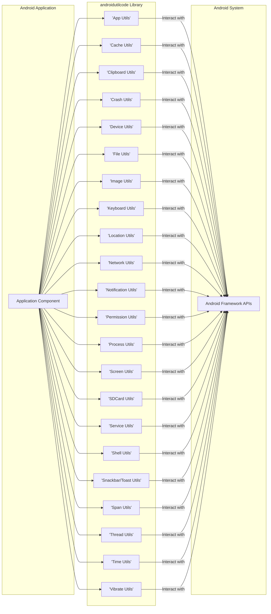
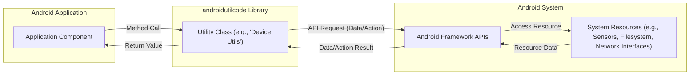

# Project Design Document: AndroidUtilCode Library

**Version:** 1.1
**Date:** October 26, 2023
**Author:** AI Software Architect

## 1. Introduction

This document provides an enhanced and more detailed design overview of the open-source Android utility library, `androidutilcode` (available at [https://github.com/blankj/androidutilcode](https://github.com/blankj/androidutilcode)). This revised document aims to provide a clearer and more granular articulation of the library's architecture, components, data flow, and key functionalities, specifically for effective threat modeling. The enhancements focus on providing more context and detail relevant to identifying potential security vulnerabilities and risks.

## 2. Goals

*   Provide a comprehensive and granular architectural overview of the `androidutilcode` library, suitable for threat modeling.
*   Clearly identify key components and their specific interactions with the Android system and application.
*   Describe the data flow within the library with a focus on the types of data being handled and their sources/destinations.
*   Establish a clear understanding of the library's functionalities, highlighting potential areas of security concern for detailed analysis.

## 3. Scope

This document covers the design of the `androidutilcode` library as it exists in the linked GitHub repository. It focuses on the logical architecture, key functionalities, and data interactions, providing more specific details about the operations performed by each utility category. It does not delve into the internal implementation details of individual utility methods unless they are crucial for understanding the overall architecture or potential security implications at a component level.

## 4. Target Audience

This document is intended for:

*   Security engineers and architects performing threat modeling on projects utilizing `androidutilcode`. The increased granularity aims to facilitate more precise threat identification.
*   Developers who require a detailed understanding of the library's structure and potential security implications.
*   Anyone involved in the security assessment, penetration testing, or maintenance of applications using this library.

## 5. High-Level Overview

`androidutilcode` is a comprehensive Android utility library offering a wide range of helper functions and classes to simplify common Android development tasks. It provides utilities categorized by functionality, interacting directly with the Android operating system and application components. Key areas of functionality include:

*   **App Utilities:** Managing application lifecycle, information, and components (e.g., getting app version, installing/uninstalling apps, checking foreground status).
*   **Cache Utilities:** Handling application cache operations (e.g., clearing cache, getting cache size).
*   **Clipboard Utilities:** Interacting with the system clipboard (e.g., copying and pasting text/URIs).
*   **Crash Utilities:** Providing mechanisms for custom crash handling and reporting.
*   **Device Utilities:** Retrieving device-specific information (e.g., IMEI, Android ID, screen details, sensor data).
*   **File Utilities:** Performing file system operations (e.g., creating, deleting, reading/writing files, managing directories).
*   **Image Utilities:**  Providing functionalities for image manipulation and processing (e.g., compressing images, getting image dimensions).
*   **Keyboard Utilities:** Managing the soft keyboard (e.g., showing/hiding the keyboard).
*   **Location Utilities:** Accessing device location information (e.g., getting last known location, requesting location updates).
*   **Network Utilities:** Handling network-related tasks (e.g., checking network connectivity, getting IP addresses, downloading files).
*   **Notification Utilities:** Simplifying the creation and management of system notifications.
*   **Permission Utilities:** Assisting with checking and requesting Android runtime permissions.
*   **Process Utilities:** Managing application processes (e.g., killing background processes).
*   **Screen Utilities:** Providing information about the device screen and display (e.g., getting screen resolution, setting screen brightness).
*   **SDCard Utilities:** Performing operations related to the SD card (e.g., checking SD card availability, getting SD card paths).
*   **Service Utilities:** Interacting with Android services (e.g., starting and stopping services).
*   **Shell Utilities:** Enabling the execution of shell commands with system privileges.
*   **Snackbar/Toast Utilities:** Simplifying the display of transient messages to the user.
*   **Span Utilities:** Providing tools for styling text within TextViews.
*   **Thread Utilities:**  Offering utilities for managing threads and asynchronous tasks.
*   **Time Utilities:** Providing functionalities for working with dates and times.
*   **Vibrate Utilities:** Controlling the device's vibration functionality.

The library is designed for seamless integration into Android applications as a dependency.

## 6. Architectural Design

The `androidutilcode` library maintains a modular design, with utilities logically grouped into static utility classes based on their function. This design promotes ease of use, as developers directly call static methods without needing to instantiate objects.

### 6.1. Key Components (Detailed)

*   **'App Utils':** Provides utilities for retrieving application metadata (name, version, package info), managing application components (activities, services), and controlling the application lifecycle (install, uninstall, foreground checks).
*   **'Cache Utils':** Offers functionalities for managing the application's cache directory, allowing clearing of cached data and retrieval of cache size. This interacts with the Android file system.
*   **'Clipboard Utils':** Enables interaction with the system clipboard for copying text, URIs, and other data, and pasting data from the clipboard. This involves accessing system-level clipboard services.
*   **'Crash Utils':** Facilitates custom handling of uncaught exceptions, potentially allowing developers to log crash details, display custom error messages, or attempt to recover from crashes.
*   **'Device Utils':** Provides access to a wide range of device-specific information, including unique identifiers (IMEI, Android ID), build information (OS version, manufacturer), and hardware details (screen size, density, sensor data). This often involves querying system properties and hardware interfaces.
*   **'File Utils':** Offers comprehensive utilities for file system operations, including creating, deleting, renaming, reading, and writing files and directories. This interacts directly with the Android file system and storage permissions.
*   **'Image Utils':** Provides functionalities for image manipulation, such as compressing images, resizing, getting image dimensions, and potentially loading images from various sources.
*   **'Keyboard Utils':** Allows programmatic control of the soft keyboard, enabling developers to show or hide the keyboard as needed. This interacts with the Android input method framework.
*   **'Location Utils':** Provides access to device location services, allowing retrieval of the last known location and requesting location updates using various location providers (GPS, network). This requires location permissions.
*   **'Network Utils':** Offers utilities for checking network connectivity status, retrieving network information (IP addresses, Wi-Fi details), and performing network operations like downloading files. This interacts with the Android network stack.
*   **'Notification Utils':** Simplifies the process of creating and displaying system notifications, allowing customization of notification content, appearance, and actions. This interacts with the Android notification manager.
*   **'Permission Utils':** Provides helper methods for checking if specific Android runtime permissions are granted and for requesting permissions from the user.
*   **'Process Utils':** Offers functionalities for managing application processes, such as killing background processes. This requires system-level privileges and careful usage.
*   **'Screen Utils':** Provides information about the device's screen and display metrics, allowing developers to retrieve screen resolution, density, and control screen brightness.
*   **'SDCard Utils':** Offers utilities for checking the availability and state of the external storage (SD card) and retrieving paths to SD card directories. This interacts with the Android storage framework.
*   **'Service Utils':** Simplifies the management of Android services, allowing developers to start, stop, and bind to services.
*   **'Shell Utils':** Enables the execution of arbitrary shell commands with the privileges of the application. This is a powerful but potentially dangerous component.
*   **'Snackbar/Toast Utils':** Provides convenient methods for displaying short-lived messages (Snackbars and Toasts) to the user.
*   **'Span Utils':** Offers utilities for applying custom styling (colors, fonts, etc.) to specific parts of a text displayed in a TextView.
*   **'Thread Utils':** Provides helper methods for managing threads and executing tasks asynchronously, potentially using thread pools or other concurrency mechanisms.
*   **'Time Utils':** Offers functionalities for working with dates and times, including formatting, parsing, and performing time calculations.
*   **'Vibrate Utils':** Allows programmatic control of the device's vibration hardware.

### 6.2. Interactions

Android application components (Activities, Services, Broadcast Receivers, etc.) directly invoke the static methods provided by the utility classes within the `androidutilcode` library. These utility methods, in turn, interact with various Android Framework APIs to perform their intended operations. The interactions can involve:

*   **System Service Calls:**  Interacting with Android system services like `ConnectivityManager`, `LocationManager`, `NotificationManager`, etc.
*   **Content Providers:** Accessing data through content providers (though less common in this type of utility library).
*   **File System Operations:** Reading and writing data to the device's file system.
*   **Permission Checks:** Verifying if the application has the necessary permissions to perform certain actions.
*   **Intent Broadcasting:** Sending or receiving system-wide or application-specific intents.
*   **Process Management:** Interacting with the Android process management system.

## 7. Data Flow

The data flow within `androidutilcode` typically follows these patterns:

1. **Application Initiates Request:** An application component calls a static method in a utility class.
2. **Data Retrieval from Android System:** The utility method often needs to retrieve data from the Android system via Framework APIs. Examples include:
    *   **'Device Utils'**: Retrieving device identifiers (IMEI, Android ID) via `TelephonyManager` and `Settings.Secure`.
    *   **'Network Utils'**: Checking network status using `ConnectivityManager`.
    *   **'File Utils'**: Accessing file system metadata or content using `java.io.File` and related classes.
    *   **'Location Utils'**: Obtaining location data through `LocationManager`.
    *   **'Permission Utils'**: Checking permission status via `ContextCompat.checkSelfPermission()`.
3. **Data Processing (Optional):** The utility method might process the retrieved data (e.g., formatting, filtering, aggregating).
4. **Action Execution on Android System (Optional):** Some utilities trigger actions:
    *   **'App Utils'**: Starting activities or services using `startActivity()` and `startService()`.
    *   **'Notification Utils'**: Displaying notifications via `NotificationManager.notify()`.
    *   **'Shell Utils'**: Executing commands using `Runtime.getRuntime().exec()`.
    *   **'Clipboard Utils'**: Setting clipboard content via `ClipboardManager.setPrimaryClip()`.
5. **Result Returned to Application:** The utility method returns the processed data or the result of the action to the calling application component.

## 8. Security Considerations (Detailed)

This section outlines potential security considerations for each major utility category, providing a more granular view for threat modeling:

*   **'App Utils':**
    *   **Risk:**  Improper handling of intent flags when starting activities or services could lead to unintended privilege escalation or information disclosure.
*   **'Cache Utils':**
    *   **Risk:**  If not implemented correctly, sensitive data might be inadvertently stored in the cache, making it accessible to other applications or through device compromise.
*   **'Clipboard Utils':**
    *   **Risk:**  Copying sensitive data to the clipboard could expose it to clipboard history vulnerabilities or malicious applications monitoring the clipboard.
*   **'Crash Utils':**
    *   **Risk:**  Crash reports might contain sensitive information if not sanitized before logging or transmission. Insecure transmission of crash logs could lead to data breaches.
*   **'Device Utils':**
    *   **Risk:**  Exposure of device identifiers (IMEI, Android ID) can be used for tracking users or devices. Improper handling of sensor data could lead to privacy violations.
*   **'File Utils':**
    *   **Risk:**  Path traversal vulnerabilities could allow access to files outside the intended directories. Insecure file permissions could lead to unauthorized access or modification of data.
*   **'Image Utils':**
    *   **Risk:**  Processing untrusted images could lead to vulnerabilities like denial-of-service or even code execution if image processing libraries have flaws.
*   **'Keyboard Utils':**
    *   **Risk:**  While seemingly benign, improper keyboard management could potentially interfere with secure input fields.
*   **'Location Utils':**
    *   **Risk:**  Unauthorized access to location data is a significant privacy concern. Insecure handling or storage of location data could lead to breaches.
*   **'Network Utils':**
    *   **Risk:**  Performing network requests without proper security measures (HTTPS) can lead to man-in-the-middle attacks. Improper handling of network data could expose sensitive information.
*   **'Notification Utils':**
    *   **Risk:**  Displaying sensitive information in notifications on the lock screen could lead to unauthorized disclosure.
*   **'Permission Utils':**
    *   **Risk:**  Incorrectly checking or requesting permissions might lead to security vulnerabilities by granting unintended access.
*   **'Process Utils':**
    *   **Risk:**  Killing arbitrary processes could destabilize the system or interfere with other applications. This requires careful consideration of permissions and potential impact.
*   **'Screen Utils':**
    *   **Risk:**  While generally low risk, manipulating screen settings without user consent could be considered a privacy violation or nuisance.
*   **'SDCard Utils':**
    *   **Risk:**  Operations on the SD card need to respect file permissions. Improper handling could lead to unauthorized access or modification of data on external storage.
*   **'Service Utils':**
    *   **Risk:**  Improperly starting or binding to services could lead to security vulnerabilities if the target service is not properly secured.
*   **'Shell Utils':**
    *   **Risk:**  Executing shell commands introduces a significant risk of command injection vulnerabilities if input is not carefully sanitized. This component should be used with extreme caution.
*   **'Snackbar/Toast Utils':**
    *   **Risk:**  Displaying sensitive information in transient messages could be a minor information disclosure risk.
*   **'Span Utils':**
    *   **Risk:**  Generally low risk, but potential for rendering issues if malformed spans are used.
*   **'Thread Utils':**
    *   **Risk:**  Improper thread management can lead to race conditions or deadlocks, potentially causing application instability or security vulnerabilities.
*   **'Time Utils':**
    *   **Risk:**  Generally low risk, but incorrect time handling could have implications in security-sensitive contexts (e.g., certificate validation).
*   **'Vibrate Utils':**
    *   **Risk:**  Generally very low risk, primarily a user experience consideration.

## 9. Deployment

The `androidutilcode` library is deployed by adding it as a dependency in the `dependencies` block of an Android application's `build.gradle` file. Developers then access the static methods of the utility classes directly within their application code.

## 10. Future Considerations

*   **Regular Security Audits:**  Given the library's extensive functionality and potential impact, regular security audits and penetration testing are crucial.
*   **Input Validation and Sanitization:**  Implementing robust input validation and sanitization within utility methods, especially those interacting with external data or system commands, is essential.
*   **Secure Defaults:**  Ensuring that default configurations and behaviors are secure and minimize potential risks.
*   **Principle of Least Privilege:**  When interacting with Android APIs, ensure the library operates with the minimum necessary permissions.
*   **Clear Security Documentation:**  Providing detailed documentation outlining security considerations and best practices for using each utility is vital for developers.
*   **Dependency Management:**  Regularly review and update dependencies to address potential vulnerabilities in underlying libraries.

This enhanced design document provides a more detailed and granular understanding of the `androidutilcode` library, specifically tailored for effective threat modeling. The detailed component descriptions, data flow analysis, and security considerations offer a solid foundation for identifying and mitigating potential security risks associated with its use.