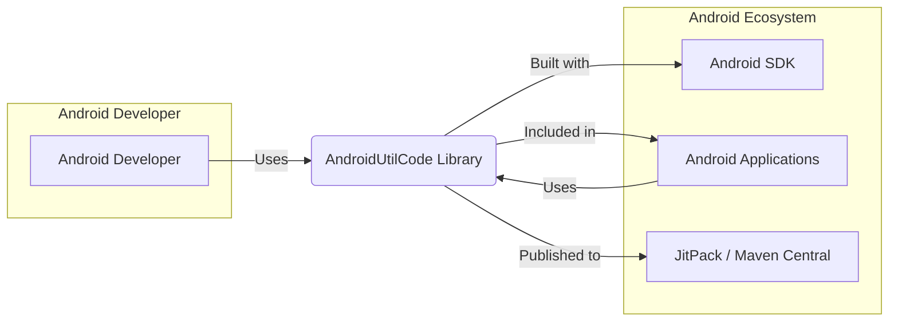
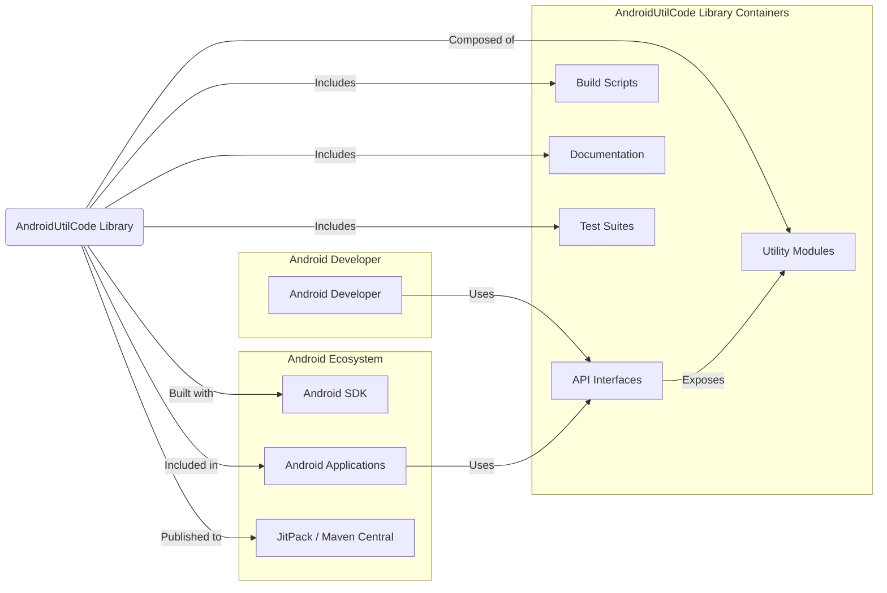
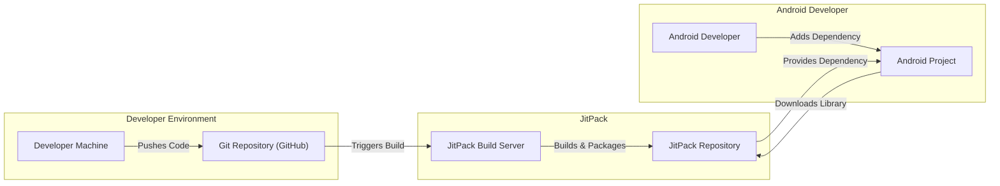
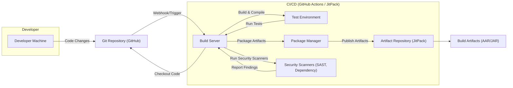

# BUSINESS POSTURE

- Business Priorities and Goals:
 - To provide a comprehensive, easy-to-use, and reliable Android utility library for developers.
 - To increase developer productivity by offering pre-built, tested, and commonly used utility functions.
 - To foster a community around the library, encouraging contributions and improvements.
 - To establish the library as a widely adopted and trusted resource in the Android development ecosystem.

- Most Important Business Risks:
 - Risk of introducing bugs or vulnerabilities into applications that use the library, potentially leading to application instability or security issues.
 - Risk of the library becoming outdated or unmaintained, leading to compatibility issues with newer Android versions or developer tools.
 - Risk of negative community perception if the library is perceived as unreliable, poorly documented, or insecure, hindering adoption.
 - Risk of legal or compliance issues if the library infringes on patents or licenses, or if it mishandles user data (though less likely for a utility library).

# SECURITY POSTURE

- Existing Security Controls:
 - security control: Open Source Code - The source code is publicly available on GitHub, allowing for community review and scrutiny. Implemented: GitHub Repository.
 - security control: Code Review - Contributions are likely reviewed by maintainers before being merged. Implemented: GitHub Pull Request process (assumed).
 - security control: Unit Tests - The library likely includes unit tests to ensure functionality and catch regressions. Implemented: Project codebase (assumed).
 - security control: Static Analysis - Developers might use static analysis tools during development. Implemented: Developer environment (assumed).
 - accepted risk: Reliance on Community Security Review - Security depends on the vigilance of the open-source community to identify and report vulnerabilities.
 - accepted risk: Third-Party Dependencies - The library might depend on other third-party libraries, inheriting their potential vulnerabilities.

- Recommended Security Controls:
 - security control: Dependency Scanning - Implement automated dependency scanning to identify known vulnerabilities in third-party libraries used by the project.
 - security control: Continuous Integration Security Checks - Integrate automated security checks into the CI/CD pipeline, such as SAST (Static Application Security Testing) and linters, to identify potential code-level vulnerabilities.
 - security control: Regular Security Audits - Conduct periodic security audits, potentially by external security experts, to identify and address potential security weaknesses.
 - security control: Vulnerability Disclosure Policy - Establish a clear vulnerability disclosure policy to allow security researchers to report vulnerabilities responsibly.

- Security Requirements:
 - Authentication: Not applicable - This is a utility library and does not handle user authentication directly. Applications using the library are responsible for their own authentication mechanisms.
 - Authorization: Not applicable -  This is a utility library and does not handle user authorization directly. Applications using the library are responsible for their own authorization mechanisms.
 - Input Validation:
  - Requirement: All utility functions that accept external input (e.g., user-provided strings, file paths, network addresses) must perform thorough input validation to prevent injection attacks (e.g., SQL injection, command injection, path traversal), denial-of-service attacks, and other input-related vulnerabilities.
  - Requirement: Input validation should include checks for data type, format, length, and allowed character sets.
  - Requirement: Error handling for invalid input should be robust and should not expose sensitive information.
 - Cryptography:
  - Requirement: If the library includes cryptographic functionality, it must use well-established and secure cryptographic algorithms and libraries.
  - Requirement: Cryptographic keys and secrets must be handled securely and should not be hardcoded in the library.
  - Requirement:  Ensure proper use of cryptographic APIs to avoid common pitfalls like incorrect encryption modes or weak key generation.

# DESIGN

## C4 CONTEXT

- Context Diagram Elements:
 - - Name: Android Developer
   - Type: Person
   - Description: Android software developers who use the AndroidUtilCode library in their projects.
   - Responsibilities: To integrate the library into their Android applications to leverage utility functions. To report issues and contribute to the library.
   - Security controls: Responsible for securely integrating the library into their applications and using its functionalities correctly.
 - - Name: AndroidUtilCode Library
   - Type: Software System
   - Description: A collection of utility classes and functions for Android development, providing reusable components for common tasks.
   - Responsibilities: To provide reliable, efficient, and secure utility functions for Android developers. To be well-documented and easy to use.
   - Security controls: Input validation within utility functions, secure cryptographic implementations (if applicable), adherence to secure coding practices.
 - - Name: Android SDK
   - Type: Software System
   - Description: The Android Software Development Kit, used to build and compile the AndroidUtilCode library.
   - Responsibilities: To provide the necessary tools and libraries for Android development.
   - Security controls: Security of the Android SDK itself is managed by Google. Developers should use updated and trusted versions of the SDK.
 - - Name: Android Applications
   - Type: Software System
   - Description: Android mobile applications developed by Android developers, which may include the AndroidUtilCode library.
   - Responsibilities: To provide functionality to end-users. To securely use and integrate third-party libraries like AndroidUtilCode.
   - Security controls: Application-level security controls, including authentication, authorization, data protection, and secure communication.
 - - Name: JitPack / Maven Central
   - Type: Software System
   - Description: Package repositories used to distribute the AndroidUtilCode library to Android developers.
   - Responsibilities: To host and distribute the library artifacts. To ensure the integrity and availability of the packages.
   - Security controls: Repository security controls, including access control and integrity checks to prevent tampering with packages.

## C4 CONTAINER

- Container Diagram Elements:
 - - Name: AndroidUtilCode Library
   - Type: Container
   - Description: The overall Android utility library, encompassing all its modules, APIs, build scripts, documentation, and tests.
   - Responsibilities: To provide a cohesive and well-structured collection of utility functions. To manage the build, testing, and documentation processes.
   - Security controls: Overall library security posture, including secure development practices, dependency management, and vulnerability management.
 - - Name: Utility Modules
   - Type: Container
   - Description:  Individual modules within the library, each focusing on a specific category of utility functions (e.g., network utilities, file utilities, image utilities).
   - Responsibilities: To implement specific utility functions. To ensure the correctness and security of the implemented functions.
   - Security controls: Input validation within each module's functions, secure coding practices specific to the module's functionality.
 - - Name: API Interfaces
   - Type: Container
   - Description: Publicly exposed API interfaces of the library, allowing Android developers to access and use the utility functions.
   - Responsibilities: To provide a clear and consistent interface for developers to interact with the library. To handle API requests and delegate them to the appropriate utility modules.
   - Security controls: API design to prevent misuse, input validation at the API level, rate limiting if applicable (though less likely for a library).
 - - Name: Build Scripts
   - Type: Container
   - Description: Scripts and configuration files used to build, test, and package the library (e.g., Gradle build files).
   - Responsibilities: To automate the build process. To ensure consistent and reproducible builds.
   - Security controls: Secure configuration of build scripts, dependency management within build scripts, integrity checks of build tools and dependencies.
 - - Name: Documentation
   - Type: Container
   - Description: Documentation for the library, including API documentation, usage guides, and examples.
   - Responsibilities: To provide clear and comprehensive documentation for developers. To ensure documentation is accurate and up-to-date.
   - Security controls: Secure hosting of documentation, prevention of malicious content injection into documentation.
 - - Name: Test Suites
   - Type: Container
   - Description: Unit tests, integration tests, and other test suites used to verify the functionality and correctness of the library.
   - Responsibilities: To ensure the quality and reliability of the library. To detect regressions and bugs.
   - Security controls: Secure test environment, prevention of test pollution, use of security-focused testing techniques (e.g., fuzzing, penetration testing - potentially for applications using the library, not the library itself directly).

## DEPLOYMENT

- Deployment Options:
 - Option 1: JitPack - Deploy the library to JitPack, a popular package repository for JVM and Android projects built with Gradle.
 - Option 2: Maven Central - Deploy the library to Maven Central, the central repository for Maven artifacts.
 - Option 3: GitHub Releases - Distribute the library as JAR/AAR files via GitHub Releases.
 - Option 4: Manual Installation - Developers manually download and include the library files in their projects.

- Selected Deployment Architecture: JitPack

- Deployment Diagram Elements (JitPack):
 - - Name: Developer Machine
   - Type: Infrastructure
   - Description: The local development environment of the library developers, used for coding, testing, and pushing code.
   - Responsibilities: Development and testing of the library. Secure storage of developer credentials and code.
   - Security controls: Developer machine security practices, including OS hardening, antivirus, and secure code storage.
 - - Name: Git Repository (GitHub)
   - Type: Infrastructure
   - Description: The GitHub repository hosting the source code of the AndroidUtilCode library.
   - Responsibilities: Version control, code collaboration, and triggering build processes.
   - Security controls: GitHub access controls, branch protection, and security features provided by GitHub.
 - - Name: JitPack Build Server
   - Type: Infrastructure
   - Description: JitPack's build infrastructure, responsible for automatically building and packaging the library from the GitHub repository.
   - Responsibilities: Automated building and packaging of the library. Secure handling of build processes.
   - Security controls: JitPack's infrastructure security controls, including build isolation, secure artifact storage, and access control.
 - - Name: JitPack Repository
   - Type: Infrastructure
   - Description: JitPack's repository for storing and distributing built library packages.
   - Responsibilities: Hosting and distributing the library packages to Android developers. Ensuring package integrity and availability.
   - Security controls: JitPack's repository security controls, including access control, integrity checks, and DDoS protection.
 - - Name: Android Developer
   - Type: Person
   - Description: Android developers who use JitPack to download and include the AndroidUtilCode library in their projects.
   - Responsibilities: To securely manage dependencies in their Android projects. To verify the integrity of downloaded libraries.
   - Security controls: Developer practices for dependency management, including using trusted repositories and verifying package integrity (e.g., using checksums).
 - - Name: Android Project
   - Type: Infrastructure
   - Description: Android application projects that depend on the AndroidUtilCode library, managed by Android developers.
   - Responsibilities: To build and run Android applications. To securely integrate and use dependencies.
   - Security controls: Application-level security controls, including dependency management, secure build processes, and runtime security measures.

## BUILD

- Build Process Elements:
 - - Name: Developer Machine
   - Type: Environment
   - Description: Developer's local machine where code is written and initially tested.
   - Responsibilities: Writing code, local testing, committing and pushing code changes.
   - Security controls: Developer machine security practices, code review before commit, local static analysis tools.
 - - Name: Git Repository (GitHub)
   - Type: System
   - Description: GitHub repository hosting the source code, acting as the central code repository and trigger for CI/CD.
   - Responsibilities: Version control, code storage, change tracking, triggering automated builds.
   - Security controls: GitHub access controls, branch protection, commit signing, audit logs.
 - - Name: Build Server (GitHub Actions / JitPack)
   - Type: System
   - Description: Automated build server environment (could be GitHub Actions or JitPack's build infrastructure) responsible for compiling, testing, and packaging the library.
   - Responsibilities: Automated build process, compilation, testing, security scanning, packaging, and publishing.
   - Security controls: Secure build environment, isolated build agents, access control to build configurations and secrets, build process monitoring.
 - - Name: Test Environment
   - Type: Environment
   - Description: Environment where automated tests (unit tests, integration tests) are executed to verify code functionality.
   - Responsibilities: Running automated tests, reporting test results, ensuring code quality.
   - Security controls: Isolated test environment, secure test data management, test result analysis and reporting.
 - - Name: Package Manager (Gradle / Maven)
   - Type: Tool
   - Description: Build tools like Gradle or Maven used to manage dependencies, compile code, and package the library.
   - Responsibilities: Dependency resolution, compilation, packaging, build process management.
   - Security controls: Secure configuration of package manager, dependency vulnerability scanning, use of trusted repositories.
 - - Name: Artifact Repository (JitPack)
   - Type: System
   - Description: Repository (like JitPack) where build artifacts (AAR/JAR files) are stored and distributed.
   - Responsibilities: Storing and distributing build artifacts, providing access to developers, ensuring artifact integrity.
   - Security controls: Access control to artifact repository, artifact integrity checks (checksums, signatures), secure artifact storage.
 - - Name: Security Scanners (SAST, Dependency)
   - Type: Tool
   - Description: Automated security scanning tools integrated into the build process to identify potential vulnerabilities (SAST for code, dependency scanners for third-party libraries).
   - Responsibilities: Static code analysis, dependency vulnerability scanning, reporting security findings.
   - Security controls: Configuration of security scanners, vulnerability reporting and tracking, integration with build pipeline.
 - - Name: Build Artifacts (AAR/JAR)
   - Type: Artifact
   - Description: The final packaged library files (AAR or JAR) ready for distribution and use by Android developers.
   - Responsibilities: Providing the distributable library package.
   - Security controls: Artifact signing, integrity verification mechanisms (checksums).

# RISK ASSESSMENT

- Critical Business Processes:
 - Android Application Functionality - The library supports various functionalities in Android applications. If the library is compromised or contains vulnerabilities, it can directly impact the functionality and security of applications using it.
 - Developer Productivity - The library aims to improve developer productivity. Issues with the library (bugs, security vulnerabilities) can hinder productivity and increase development costs.
 - Community Trust and Adoption - The success of the open-source library depends on community trust and adoption. Security vulnerabilities or lack of security measures can erode trust and limit adoption.

- Data to Protect and Sensitivity:
 - Source Code - The source code of the library is publicly available, but modifications or unauthorized changes to the repository need to be prevented to maintain integrity. Sensitivity: Medium (integrity is important).
 - Build Artifacts (AAR/JAR) - The compiled library packages need to be protected from tampering and unauthorized modification during the build and distribution process. Sensitivity: High (integrity and availability are critical).
 - Developer Credentials and Secrets - If any secrets or credentials are used in the build process (e.g., for publishing to repositories), they need to be protected. Sensitivity: High (confidentiality is critical).
 - Dependency Information - Information about third-party dependencies used by the library needs to be managed to track and mitigate potential vulnerabilities. Sensitivity: Medium (availability and integrity are important for security).

# QUESTIONS & ASSUMPTIONS

- Questions:
 - What is the process for handling vulnerability reports? Is there a security contact or a dedicated channel for reporting security issues?
 - Are there any specific security testing practices currently in place beyond unit tests (e.g., fuzzing, penetration testing)?
 - What is the policy for updating dependencies, especially security-related updates?
 - Are there any specific compliance requirements or industry standards that the library aims to adhere to?

- Assumptions:
 - BUSINESS POSTURE: The primary goal is to provide a useful and reliable utility library for the Android developer community. Community adoption and positive reputation are important success metrics.
 - SECURITY POSTURE:  Standard open-source development practices are followed, including code review and unit testing. Security is considered important but might not be the top priority compared to functionality and ease of use.
 - DESIGN: The library is built using standard Android development tools and practices. It is intended to be distributed via common package repositories like JitPack or Maven Central. The build process is automated using CI/CD pipelines.