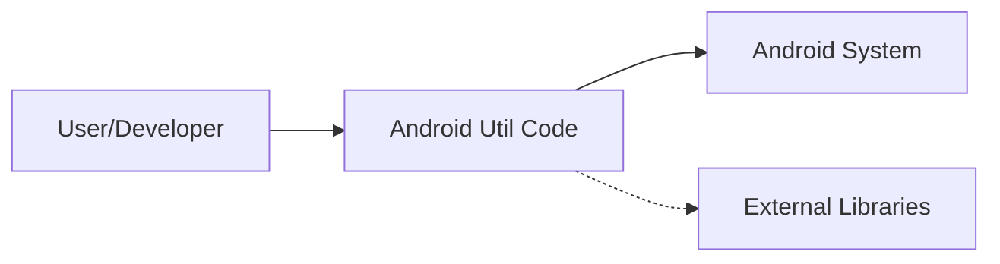
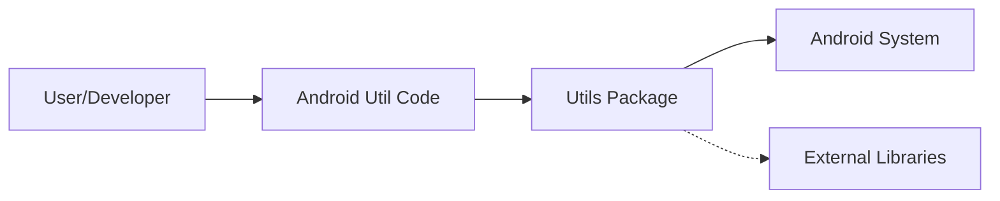
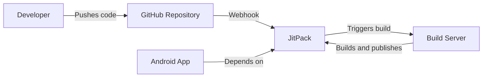
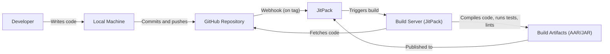

# BUSINESS POSTURE

Business Priorities and Goals:

*   Provide a comprehensive, well-tested, and easy-to-use utility library for Android development.
*   Reduce development time and effort for Android developers by offering pre-built solutions for common tasks.
*   Improve code quality and maintainability by promoting code reuse and reducing boilerplate.
*   Maintain high compatibility across various Android versions and devices.
*   Foster a strong community around the library, encouraging contributions and feedback.

Business Risks:

*   Security vulnerabilities in the library could be exploited in applications that use it, potentially affecting a large number of users.
*   Bugs or compatibility issues could lead to application instability or crashes, damaging the reputation of both the library and the applications using it.
*   Lack of maintenance or updates could render the library obsolete or incompatible with future Android versions.
*   Failure to attract and retain users and contributors could hinder the library's growth and long-term viability.
*   Legal issues related to licensing or intellectual property could arise.

# SECURITY POSTURE

Existing Security Controls:

*   security control: The library's code is publicly available on GitHub, allowing for community review and scrutiny. (Described in: GitHub repository)
*   security control: The library is widely used, increasing the likelihood of vulnerabilities being discovered and reported. (Described in: GitHub repository, community feedback)
*   security control: The library appears to be actively maintained, with regular updates and bug fixes. (Described in: GitHub repository commit history)

Accepted Risks:

*   accepted risk: The library relies on the underlying Android framework and system APIs, inheriting any security vulnerabilities present in those components.
*   accepted risk: The library may not have undergone formal security audits or penetration testing.
*   accepted risk: The library's extensive functionality increases the attack surface, potentially introducing vulnerabilities that are not immediately apparent.

Recommended Security Controls:

*   security control: Implement static analysis security testing (SAST) in the build process to identify potential vulnerabilities early.
*   security control: Conduct regular security reviews and audits of the library's code, focusing on high-risk areas such as file handling, network communication, and data storage.
*   security control: Establish a clear vulnerability disclosure and response process to handle security reports from the community.
*   security control: Provide security guidance and best practices to developers using the library.
*   security control: Consider fuzz testing to identify unexpected behavior and potential vulnerabilities.

Security Requirements:

*   Authentication: Not directly applicable, as the library itself does not handle authentication. However, any utility functions related to authentication (e.g., handling tokens) must be implemented securely.
*   Authorization: Not directly applicable, as the library itself does not handle authorization. However, any utility functions related to authorization (e.g., checking permissions) must be implemented securely.
*   Input Validation: All utility functions that accept input from external sources (e.g., user input, files, network data) must perform thorough input validation to prevent injection attacks, buffer overflows, and other vulnerabilities.
*   Cryptography: Any cryptographic operations performed by the library must use strong, well-established algorithms and secure key management practices. Avoid using deprecated or weak cryptographic primitives.

# DESIGN

## C4 CONTEXT

Element Descriptions:

*   Element:
    *   Name: User/Developer
    *   Type: Person
    *   Description: An Android developer who integrates the Android Util Code library into their application.
    *   Responsibilities: Uses the library's functions to simplify development tasks.
    *   Security controls: Follows secure coding practices when using the library.

*   Element:
    *   Name: Android Util Code
    *   Type: Software System
    *   Description: A collection of utility functions for Android development.
    *   Responsibilities: Provides pre-built solutions for common tasks, reducing development time and effort.
    *   Security controls: Input validation, secure use of Android APIs, regular security reviews.

*   Element:
    *   Name: Android System
    *   Type: Software System
    *   Description: The underlying Android operating system and its APIs.
    *   Responsibilities: Provides core functionality and services to applications.
    *   Security controls: Android's built-in security features (sandboxing, permissions, etc.).

*   Element:
    *   Name: External Libraries
    *   Type: Software System
    *   Description: Any third-party libraries that Android Util Code might depend on.
    *   Responsibilities: Provide specific functionality required by Android Util Code.
    *   Security controls: Relies on the security of the external libraries themselves. AndroidUtilCode should use well-maintained and reputable libraries.

## C4 CONTAINER

Element Descriptions:

*   Element:
    *   Name: User/Developer
    *   Type: Person
    *   Description: An Android developer who integrates the Android Util Code library into their application.
    *   Responsibilities: Uses the library's functions to simplify development tasks.
    *   Security controls: Follows secure coding practices when using the library.

*   Element:
    *   Name: Android Util Code
    *   Type: Software System
    *   Description: A collection of utility functions for Android development.
    *   Responsibilities: Provides pre-built solutions for common tasks, reducing development time and effort.
    *   Security controls: Input validation, secure use of Android APIs, regular security reviews.

*   Element:
    *   Name: Utils Package
    *   Type: Container: Java Package
    *   Description: The main package containing all the utility classes and functions.
    *   Responsibilities: Organizes and provides access to the library's functionality.
    *   Security controls: Input validation within each utility function, secure handling of sensitive data.

*   Element:
    *   Name: Android System
    *   Type: Software System
    *   Description: The underlying Android operating system and its APIs.
    *   Responsibilities: Provides core functionality and services to applications.
    *   Security controls: Android's built-in security features (sandboxing, permissions, etc.).

*   Element:
    *   Name: External Libraries
    *   Type: Software System
    *   Description: Any third-party libraries that Android Util Code might depend on.
    *   Responsibilities: Provide specific functionality required by Android Util Code.
    *   Security controls: Relies on the security of the external libraries themselves. AndroidUtilCode should use well-maintained and reputable libraries.

## DEPLOYMENT

Possible Deployment Solutions:

1.  **JitPack:** Developers can include the library via JitPack by adding the JitPack repository and the library's dependency to their project's build.gradle file.
2.  **Maven Central:** The library could be published to Maven Central, a widely used repository for Java libraries.
3.  **Manual Download:** Developers could download the library's source code or a pre-built JAR file and manually include it in their project.

Chosen Solution (JitPack):

Element Descriptions:

*   Element:
    *   Name: Developer
    *   Type: Person
    *   Description: The developer of the Android Util Code library.
    *   Responsibilities: Writes and maintains the library's code.
    *   Security controls: Follows secure coding practices.

*   Element:
    *   Name: GitHub Repository
    *   Type: Code Repository
    *   Description: The public repository hosting the library's source code.
    *   Responsibilities: Stores the code, tracks changes, and enables collaboration.
    *   Security controls: Access controls, branch protection rules.

*   Element:
    *   Name: JitPack
    *   Type: Build Service / Dependency Repository
    *   Description: A service that builds and publishes Java and Android libraries directly from GitHub repositories.
    *   Responsibilities: Builds the library from source, provides a repository for dependency management.
    *   Security controls: Relies on the security of GitHub and its own infrastructure.

*   Element:
    *   Name: Build Server
    *   Type: Infrastructure
    *   Description: Server infrastructure provided by JitPack.
    *   Responsibilities: Executes build process.
    *   Security controls: Relies on the security of JitPack infrastructure.

*   Element:
    *   Name: Android App
    *   Type: Software System
    *   Description: An Android application that uses the Android Util Code library.
    *   Responsibilities: Performs its intended functionality, utilizing the library for common tasks.
    *   Security controls: Depends on the security of the library and the Android system.

## BUILD

Build Process Description:

1.  **Development:** The developer writes and modifies the library's code on their local machine.
2.  **Commit and Push:** The developer commits their changes and pushes them to the GitHub repository.
3.  **Webhook Trigger:** A webhook configured on the GitHub repository notifies JitPack of a new tag (typically used for releases).
4.  **Build Trigger:** JitPack receives the webhook and triggers a build on its build server.
5.  **Code Fetch:** The build server fetches the library's source code from the GitHub repository.
6.  **Compilation and Testing:** The build server compiles the code, runs unit tests, and potentially performs static analysis (linting, SAST - *recommended*).
7.  **Artifact Creation:** If the build and tests are successful, the build server creates the build artifacts (AAR or JAR file).
8.  **Publish:** The build artifacts are published to the JitPack repository, making them available for developers to include in their projects.

Security Controls in Build Process:

*   security control: **Code Review:** Code changes should be reviewed by other developers before being merged into the main branch. (GitHub Pull Requests)
*   security control: **Automated Testing:** Unit tests are executed as part of the build process to ensure code quality and prevent regressions. (JitPack build process, configured in build.gradle)
*   security control: **Static Analysis (SAST - *recommended*):** Integrate a SAST tool into the build process to automatically scan the code for potential security vulnerabilities.
*   security control: **Dependency Management:** Use a dependency management system (Gradle) to manage external libraries and ensure they are up-to-date and free of known vulnerabilities. (build.gradle file)
*   security control: **Linting:** Use a linter (like Android Lint) to enforce coding style and identify potential issues. (JitPack build process, configured in build.gradle)

# RISK ASSESSMENT

Critical Business Processes:

*   Providing reliable and efficient utility functions for Android development.
*   Maintaining the library's reputation and user trust.
*   Ensuring the long-term viability and sustainability of the project.

Data Protection:

*   The library itself does not directly handle sensitive user data in most cases. However, some utility functions might interact with data that could be considered sensitive, depending on how they are used by developers.
*   Data Sensitivity:
    *   **Low:** Most utility functions deal with general-purpose tasks and do not handle sensitive data.
    *   **Medium:** Functions related to file I/O, network communication, or data storage could potentially handle sensitive data, depending on the application's context.
    *   **High:** Functions related to cryptography or security (if any) would handle highly sensitive data (e.g., keys, passwords). *It's crucial to ensure these functions are implemented with extreme care and follow security best practices.*

# QUESTIONS & ASSUMPTIONS

Questions:

*   Are there any specific security certifications or compliance requirements that the library needs to meet?
*   What is the expected level of security expertise of the developers who will be using this library?
*   Are there any plans to add features that would handle sensitive user data directly?
*   What is the process for handling security vulnerabilities reported by the community?
*   Are there any existing security audits or penetration tests performed on the library or similar projects?

Assumptions:

*   BUSINESS POSTURE: The primary goal is to provide a useful and convenient library for Android developers, prioritizing ease of use and functionality. Security is important but not the absolute top priority.
*   SECURITY POSTURE: The library relies on the security of the underlying Android framework and any external dependencies. Developers using the library are expected to have a basic understanding of Android security principles.
*   DESIGN: The library is designed to be modular and extensible, allowing developers to easily integrate it into their projects. The build process is automated using JitPack.