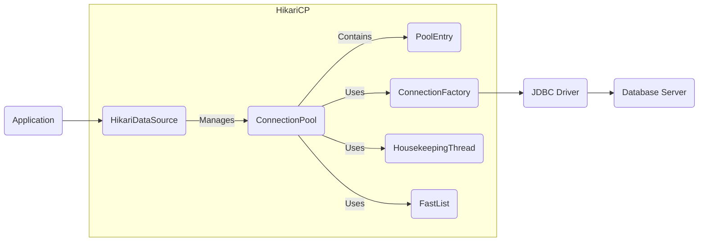
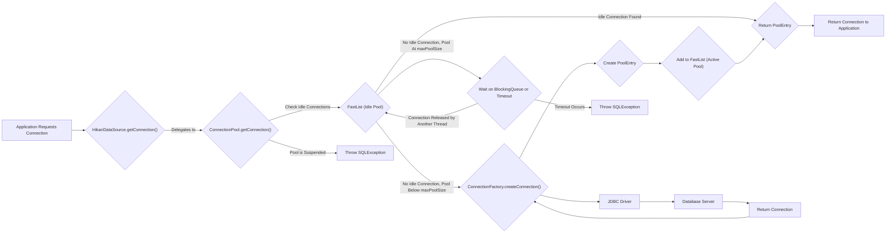
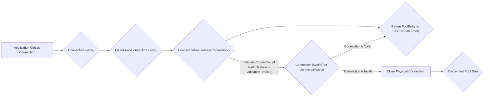
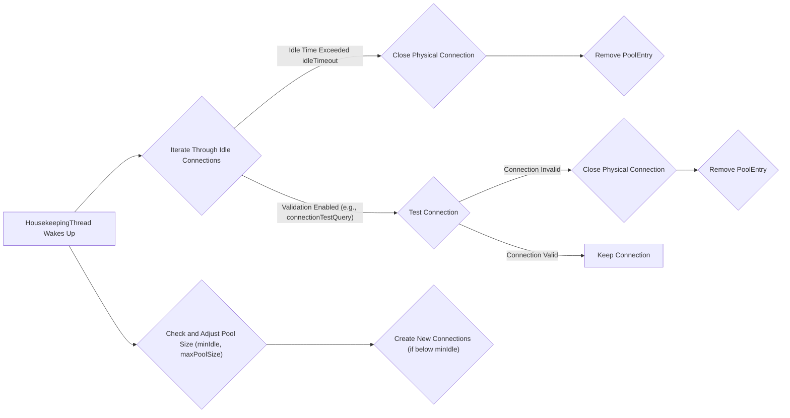

# Project Design Document: HikariCP Connection Pool

**Version:** 1.1
**Date:** October 26, 2023
**Author:** Gemini (AI Language Model)

## 1. Introduction

This document provides a detailed design overview of the HikariCP connection pooling library. It aims to describe the key components, their interactions, and the overall architecture of the system. This document will serve as a foundation for subsequent threat modeling activities.

### 1.1. Purpose

The primary purpose of this document is to provide a comprehensive architectural description of HikariCP. This description will be used to identify potential security vulnerabilities and attack vectors during the threat modeling process. It aims to be detailed enough for security experts to understand the system's inner workings and potential weaknesses.

### 1.2. Scope

This document covers the core components and functionalities of the HikariCP library, focusing on aspects relevant to security and data flow. It includes:

*   Detailed descriptions of key architectural components and their responsibilities.
*   Data flow diagrams illustrating the lifecycle of a database connection within the pool.
*   Explanations of the interactions between different components.
*   A comprehensive overview of security-relevant considerations and potential threats.

### 1.3. Target Audience

This document is intended for:

*   Security engineers and architects responsible for performing threat modeling and security assessments.
*   Software developers who need a deep understanding of HikariCP's internal mechanisms for debugging or extending its functionality.
*   Operations and DevOps teams involved in deploying, configuring, and monitoring applications that utilize HikariCP.

## 2. System Overview

HikariCP is a mature, high-performance JDBC connection pooling library. Its primary function is to efficiently manage a pool of database connections, significantly reducing the performance overhead associated with establishing new connections for each database operation. It acts as a transparent intermediary between the application and the underlying JDBC driver, providing connection pooling and management capabilities.

### 2.1. Key Features

*   **Blazing Fast Performance:**  HikariCP is renowned for its speed in acquiring and releasing database connections, minimizing latency in database interactions.
*   **Lightweight Footprint:** Designed for minimal overhead in terms of memory and CPU usage.
*   **Sophisticated Connection Management:** Implements robust mechanisms for handling connection failures, timeouts, and maintaining a healthy pool of connections.
*   **Extensive Configuration Options:** Offers a rich set of configuration parameters to fine-tune pool behavior according to specific application requirements and database characteristics.
*   **Seamless JDBC Integration:** Adheres to the standard `javax.sql.DataSource` interface, ensuring compatibility with any compliant JDBC driver.

## 3. Architectural Design

HikariCP's architecture is centered around the efficient management of a connection pool. The core components work together to provide a reliable and performant connection pooling solution.

*   **`HikariDataSource`:** This class serves as the primary entry point and configuration hub for HikariCP. It implements the `javax.sql.DataSource` interface, allowing applications to obtain database connections through standard JDBC practices. It encapsulates the `ConnectionPool` and manages its lifecycle.
*   **`ConnectionPool`:** This is the heart of HikariCP, responsible for the actual management of the connection pool. It maintains collections of active (in-use) and idle (available) `PoolEntry` objects. It handles requests for connections, manages the creation of new connections when needed, and oversees the retirement of connections.
*   **`PoolEntry`:** Represents a wrapper around a single `java.sql.Connection` object. It stores the actual database connection along with metadata such as its creation timestamp, last access time, and current state (e.g., in use, idle, reserved). This metadata is crucial for the pool's management logic.
*   **`ConnectionFactory`:** This component is responsible for the creation of new physical database connections. It utilizes the configured JDBC driver and connection parameters (URL, username, password, etc.) to establish connections to the database server. It also handles connection initialization and any driver-specific setup.
*   **`HousekeepingThread`:** A dedicated background thread that periodically performs maintenance tasks on the connection pool. These tasks include:
    *   **Idle Connection Timeout:**  Closing connections that have been idle for longer than the configured `idleTimeout`.
    *   **Connection Testing:**  Validating idle connections to ensure they are still alive and usable (if configured).
    *   **Pool Sizing:**  Adjusting the pool size (number of connections) based on the configured minimum and maximum pool sizes and the current demand.
*   **`FastList`:** An internal, highly optimized, lock-free list implementation used by the `ConnectionPool` to efficiently manage the collections of `PoolEntry` objects. Its lock-free nature contributes to HikariCP's performance.
*   **JDBC Driver:** The external JDBC driver specific to the database being used (e.g., PostgreSQL, MySQL, Oracle). HikariCP interacts with the database through this driver using the standard JDBC API.

### 3.1. Component Diagram

## 4. Data Flow

The core data flow within HikariCP revolves around the lifecycle of a database connection, from its acquisition by the application to its release back to the pool and eventual retirement.

### 4.1. Connection Acquisition

**Detailed Steps:**

1. The application requests a database connection by calling the `getConnection()` method on the `HikariDataSource`.
2. `HikariDataSource` delegates this request to the `getConnection()` method of the internal `ConnectionPool`.
3. The `ConnectionPool` first checks its `FastList` of idle `PoolEntry` objects.
4. If an idle `PoolEntry` is found, it is removed from the idle list and returned to the application. The `PoolEntry` is moved to the active connections list.
5. If no idle connection is available and the current number of connections is below the configured `maxPoolSize`, the `ConnectionPool` requests a new physical connection from the `ConnectionFactory`.
6. The `ConnectionFactory` utilizes the configured JDBC driver to establish a new connection to the database server.
7. The database server responds with a new connection.
8. The `ConnectionFactory` wraps the newly created `java.sql.Connection` in a `PoolEntry`.
9. The new `PoolEntry` is added to the `FastList` of active connections.
10. The `PoolEntry` (containing the database connection) is then returned to the application.
11. If no idle connection is available and the pool has reached its `maxPoolSize`, the request will wait on a blocking queue until a connection is released back to the pool or a timeout occurs.
12. If the waiting period exceeds the configured timeout, an `SQLException` is thrown to the application.
13. If the `ConnectionPool` is in a suspended state (typically due to repeated connection failures), an `SQLException` is thrown immediately.

### 4.2. Connection Release

**Detailed Steps:**

1. The application closes the database connection, typically within a `finally` block.
2. The `close()` method is invoked on the `HikariProxyConnection`, which is a proxy object returned to the application instead of the raw connection.
3. The `HikariProxyConnection`'s `close()` method delegates the release operation to the `releaseConnection()` method of the `ConnectionPool`.
4. Depending on the configuration (specifically `testOnReturn` or a positive `validationTimeout`), the `ConnectionPool` may attempt to validate the connection before returning it to the idle pool. This validation typically involves calling `connection.isValid()` or executing a custom validation query.
5. If the connection is deemed valid, the corresponding `PoolEntry` is added back to the `FastList` of idle connections, making it available for future requests.
6. If the connection is invalid, the physical database connection is closed, and the `PoolEntry` is discarded.
7. The pool size is decremented to reflect the removal of the invalid connection.

### 4.3. Housekeeping

**Detailed Steps:**

1. The `HousekeepingThread` periodically wakes up based on the configured `housekeeping.periodMs`.
2. It iterates through the `FastList` of idle connections.
3. For each idle connection, it checks if the time elapsed since it was last used exceeds the configured `idleTimeout`. If it does, the physical database connection is closed, and the corresponding `PoolEntry` is removed from the pool.
4. If connection validation is enabled (e.g., through the `connectionTestQuery` or `validationTimeout` settings), the `HousekeepingThread` may test idle connections to ensure they are still valid.
5. If a connection fails the validation test, the physical connection is closed, and the `PoolEntry` is removed.
6. The `HousekeepingThread` also checks if the current pool size is below the configured `minIdle`. If it is, and the pool has not reached `maxPoolSize`, it attempts to create new connections to reach the `minIdle` threshold.

## 5. Security Considerations

This section details potential security considerations related to HikariCP's architecture and operation. These points are crucial for identifying potential vulnerabilities during threat modeling.

*   **Configuration Security (Credentials Management):**
    *   Database credentials (username, password) are often stored in HikariCP's configuration. Insecure storage of these credentials (e.g., plain text in configuration files) poses a significant risk.
    *   Consider using environment variables, secure vault solutions, or encrypted configuration files to protect these credentials.
    *   Permissions on configuration files should be restricted to authorized personnel.
*   **Connection Security (Encryption and Integrity):**
    *   HikariCP relies on the underlying JDBC driver to establish secure connections to the database. Ensure that the JDBC connection URL is configured to use encryption protocols like TLS/SSL (`jdbc:postgresql://...ssl=true`, `jdbc:mysql://...useSSL=true`).
    *   Without proper encryption, database traffic (including sensitive data) can be intercepted and read by attackers (Man-in-the-Middle attacks).
    *   Verify the database server's SSL/TLS configuration to prevent downgrade attacks.
*   **Connection Leakage and Resource Exhaustion:**
    *   Application code that fails to close connections obtained from HikariCP can lead to connection leaks. Over time, this can exhaust the connection pool and potentially the database server's connection limits, leading to denial of service.
    *   Implement proper resource management practices (e.g., using try-with-resources or finally blocks) to ensure connections are always closed.
    *   Monitor connection pool metrics to detect and address potential leaks.
*   **Denial of Service (DoS) Attacks:**
    *   An attacker could potentially attempt to exhaust the connection pool by rapidly acquiring connections and holding them without releasing them. Configure appropriate `maxPoolSize` and `connectionTimeout` values to mitigate this risk.
    *   Database server DoS can occur if the application, through HikariCP, opens an excessive number of connections due to misconfiguration or attack.
*   **JDBC Driver Vulnerabilities:**
    *   HikariCP depends on the security of the underlying JDBC driver. Vulnerabilities in the JDBC driver could be exploited by attackers.
    *   Keep the JDBC driver updated to the latest stable version to patch known security flaws.
    *   Follow security advisories related to the specific JDBC driver being used.
*   **Information Disclosure through Logging and Error Messages:**
    *   HikariCP's logging can potentially expose sensitive information, such as database connection details or error messages that reveal internal system information.
    *   Configure logging levels appropriately for production environments to minimize the risk of information disclosure. Avoid logging sensitive data.
*   **SQL Injection (Indirect Risk):**
    *   While HikariCP itself doesn't directly handle SQL queries, it provides the connections used by the application. If the application code doesn't properly sanitize user inputs before constructing SQL queries, it can be vulnerable to SQL injection attacks.
    *   Use parameterized queries or prepared statements to prevent SQL injection vulnerabilities.
*   **Connection Hijacking (Environmental Risk):**
    *   If the environment where the application and HikariCP are running is compromised (e.g., through malware or unauthorized access), an attacker might be able to intercept or hijack active database connections.
    *   Implement robust security measures at the infrastructure level, including network segmentation, access controls, and intrusion detection systems.

## 6. Deployment Considerations

HikariCP is typically deployed as a library embedded within an application. Its configuration and management depend on the deployment environment.

*   **Application Server Environments:** In application servers (e.g., Tomcat, Jetty, WildFly), HikariCP can be configured as a JNDI data source. The application server manages the lifecycle of the data source and provides a centralized configuration mechanism.
*   **Standalone Applications:** In standalone Java applications (e.g., Spring Boot applications), HikariCP is typically included as a dependency (e.g., via Maven or Gradle) and configured programmatically or through configuration files (e.g., application.properties or application.yml in Spring Boot).
*   **Cloud Environments:** When deploying in cloud environments (e.g., AWS, Azure, GCP), consider using managed database services (e.g., Amazon RDS, Azure SQL Database, Google Cloud SQL). Configure HikariCP to connect to these services securely, taking advantage of cloud-specific security features like VPCs and IAM roles.
*   **Containerized Environments (Docker, Kubernetes):** When deploying in containers, ensure that database credentials and other sensitive configuration are managed securely, potentially using secrets management features provided by the container orchestration platform.

## 7. Future Considerations

*   **Enhanced Metrics and Monitoring:**  Further improvements in providing detailed, real-time metrics about connection pool performance, health, and usage patterns would be valuable for monitoring and proactive issue detection. Integration with popular monitoring tools could be explored.
*   **Improved Integration with Security Frameworks:**  Exploring tighter integration with security frameworks or libraries could simplify the secure management of sensitive configuration data and potentially offer more advanced security features.
*   **Observability Enhancements:**  Adding more detailed tracing and logging capabilities could aid in debugging and understanding the behavior of the connection pool in complex environments.

This improved design document provides a more detailed and comprehensive overview of HikariCP, enhancing its value for threat modeling and security analysis. The expanded descriptions of components, data flows, and security considerations offer a deeper understanding of the system's inner workings and potential vulnerabilities.