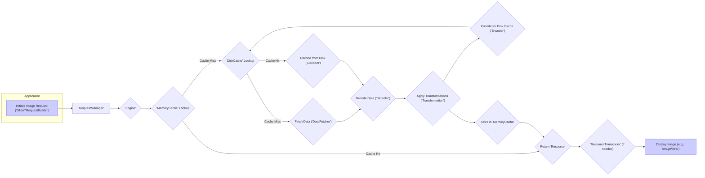

# Project Design Document: Glide Image Loading Library

**Version:** 1.1
**Date:** October 26, 2023
**Author:** AI Software Architect

## 1. Introduction

This document provides an enhanced architectural design of the Glide image loading library for Android, specifically tailored for threat modeling. It details the key components, data flow, and security considerations to facilitate the identification of potential vulnerabilities and the design of appropriate security mitigations.

Glide is a widely adopted open-source library for Android that streamlines the process of fetching, decoding, and displaying images from diverse sources, including network URLs, local file paths, and application resources. Its design emphasizes smooth scrolling performance and efficient management of image resources.

## 2. Goals

The primary goals of this design document are:

* To offer a more detailed and refined overview of Glide's architecture and functionalities.
* To clearly identify and describe the interactions between key components.
* To provide a visual representation of the data flow within the library using a Mermaid diagram.
* To expand upon the security considerations, providing more specific examples relevant to threat modeling.

## 3. Scope

This document encompasses the core architectural elements and the lifecycle of an image loading request within the Glide library, based on the latest available information. The focus remains on the image loading pipeline and its associated functionalities.

The following aspects are within the scope of this document:

* Detailed descriptions of Glide's core components and their responsibilities.
* A comprehensive breakdown of the lifecycle of an image loading request, from initiation to display.
* In-depth explanation of data sources and the various caching mechanisms employed.
* Detailed description of the image decoding and transformation processes.
* Key integration points with the Android framework and their implications.

The following aspects are explicitly excluded from the scope of this document:

* Granular implementation details of individual classes, methods, or internal algorithms.
* In-depth analysis of performance optimization techniques employed within Glide.
* Exhaustive examination of all possible third-party integrations beyond core dependencies.
* The underlying Android operating system, its security model, or hardware specifics.

## 4. Architectural Overview

Glide's architecture is built upon a modular and highly extensible pipeline, enabling efficient and flexible image loading. This pipeline orchestrates the fetching, decoding, processing, and display of images.

### 4.1. Key Components (Detailed)

* **`Glide` Singleton:** The central access point for the library. It provides static methods to initiate image loading requests and configure global settings. It acts as a factory for `RequestManager` instances.
* **`RequestManager`:** Manages the lifecycle of image loading requests within a specific Android component (e.g., Activity, Fragment, View). It ties the requests to the component's lifecycle, preventing memory leaks and ensuring proper resource management.
* **`RequestBuilder<T>`:** A fluent API for configuring all aspects of an image loading request. This includes specifying the image source (URL, file, resource), setting placeholder and error images, defining transformations, and configuring caching strategies and priorities. The generic type `T` represents the expected resource type (e.g., `Drawable`, `Bitmap`).
* **`Engine`:** The core orchestrator of the image loading process. It receives requests from `RequestManager`, manages resource acquisition from various sources (memory cache, disk cache, network), and coordinates background tasks for fetching and decoding. It also handles resource sharing and recycling.
* **`DataFetcher<T>`:** An interface responsible for fetching raw data from a specific source. Implementations like `HttpUrlFetcher`, `FileFetcher`, and `ResourceFetcher` handle fetching data from network URLs, local files, and Android resources, respectively. The generic type `T` represents the type of data fetched (e.g., `InputStream`).
* **`DataSource`:** An enumeration or interface defining the origin of the image data, providing context to the loading process (e.g., `LOCAL`, `REMOTE`, `DATA_DISK_CACHE`, `RESOURCE_DISK_CACHE`, `MEMORY_CACHE`).
* **`DataLoadProvider<Model, Data>`:** Provides the necessary components (e.g., `DataFetcher`, `Encoder`, `Decoder`) for loading data of a specific type. It maps a model (e.g., a URL string) to the appropriate data fetcher and data type.
* **`Encoder<T>`:** Responsible for encoding a `Resource` of type `T` into a byte stream for storage in the disk cache. Implementations exist for encoding `Bitmap`s and other resource types.
* **`Decoder<Source, T>`:** Responsible for decoding raw data (`Source`) into a usable `Resource` of type `T` (e.g., decoding an `InputStream` into a `Bitmap`). Different `Decoder` implementations handle various image formats (JPEG, PNG, GIF, etc.).
* **`Resource<T>`:** A wrapper around the loaded and decoded image data of type `T` (e.g., a `Bitmap`). It manages the lifecycle of the underlying resource and ensures proper recycling.
* **`ResourceTranscoder<Z, R>`:** Converts a `Resource` of one type (`Z`) to another (`R`) (e.g., converting a `Bitmap` `Resource` to a `Drawable` `Resource`).
* **`Transformation<T>`:** An interface for applying modifications to a `Resource` of type `T`. Implementations include transformations for resizing, cropping, applying filters, and more. Transformations can be chained together.
* **`MemoryCache`:** A fast, in-memory cache (typically an `LruCache`) for storing recently loaded and decoded `Resource` objects. This provides quick access to frequently used images.
* **`DiskCache`:** A persistent cache on the device's storage for storing encoded image data. Different implementations exist, such as `DiskLruCacheWrapper`, offering different storage strategies and limitations.
* **`Key`:** A unique identifier used for caching resources. It's generated based on the request parameters (image source, transformations, size, etc.) to ensure cache hits for identical requests.
* **`ConnectivityMonitor`:** Monitors the device's network connectivity status to potentially adjust loading strategies (e.g., delaying large downloads on metered connections).

### 4.2. Data Flow (Visualized)

The following list describes the detailed flow of an image loading request in Glide:

1. **Initiate Image Request:** The application initiates an image loading request using the `Glide` singleton or a specific `RequestManager` and configures the request using a `RequestBuilder`.
2. **Request Management:** The `RequestBuilder` builds the request, and the `RequestManager` takes ownership, associating it with the lifecycle of the relevant Android component.
3. **Engine Orchestration:** The `RequestManager` delegates the request to the `Engine`, the central coordinator of the loading process.
4. **Memory Cache Check:** The `Engine` first checks the `MemoryCache` for a `Resource` associated with the request's unique `Key`.
    * **Memory Cache Hit:** If a matching `Resource` is found, it's immediately returned, bypassing further fetching and decoding.
    * **Memory Cache Miss:** If no matching `Resource` is found, the process proceeds to the disk cache.
5. **Disk Cache Check:** The `Engine` then checks the `DiskCache` for encoded image data associated with the request's `Key`.
    * **Disk Cache Hit:** If found, the encoded data is retrieved and passed to the appropriate `Decoder` for decoding.
    * **Disk Cache Miss:** If not found, the `Engine` proceeds to fetch the data from the original source.
6. **Data Fetching:** Based on the image source specified in the request, the `Engine` selects the appropriate `DataFetcher` implementation (e.g., `HttpUrlFetcher` for network URLs, `FileFetcher` for local files).
7. **Data Retrieval:** The selected `DataFetcher` retrieves the raw image data from its source (e.g., downloading bytes from a network URL, reading bytes from a file).
8. **Decoding:** The retrieved raw data is passed to the appropriate `Decoder` (determined by the data type) to be decoded into a usable `Resource` object (e.g., decoding JPEG bytes into a `Bitmap`).
9. **Transformation Application:** Any `Transformation`s configured in the `RequestBuilder` are applied to the decoded `Resource`. This might involve resizing, cropping, applying filters, or other image manipulations.
10. **Disk Cache Encoding:** The transformed `Resource` is then encoded by the appropriate `Encoder` and stored in the `DiskCache` for future use.
11. **Memory Cache Storage:** The transformed `Resource` is also stored in the `MemoryCache` for immediate access in subsequent requests.
12. **Resource Transcoding (Optional):** If the requested resource type differs from the decoded type (e.g., requesting a `Drawable` when a `Bitmap` was decoded), a `ResourceTranscoder` converts the `Resource` to the desired type.
13. **Image Display:** Finally, the resulting `Resource` (typically a `Drawable`) is delivered back to the target specified in the request (e.g., an `ImageView`), where it is displayed.

## 5. Security Considerations (Enhanced)

This section expands upon the potential security considerations relevant for threat modeling Glide, providing more specific examples:

* **Data Source Vulnerabilities:**
    * **HTTP Downgrade Attacks:** If not strictly enforcing HTTPS, attackers could intercept requests and force a downgrade to HTTP, exposing image data.
    * **Server-Side Injection Vulnerabilities:** If the image URL is dynamically constructed based on user input without proper sanitization, attackers could inject malicious URLs leading to unexpected content or server-side exploits.
    * **Local File Access Exploits:** When loading from local files or content providers, vulnerabilities in the application or other apps could allow attackers to manipulate file paths, leading to unauthorized access to sensitive files.
* **Data Integrity and Manipulation:**
    * **Malicious Image Payloads:** Attackers could craft image files with embedded malicious code or exploit vulnerabilities in image decoding libraries to trigger buffer overflows or other memory corruption issues.
    * **Cache Poisoning Attacks:**
        * **HTTP Cache Poisoning:** If server-side caching headers are not properly configured, attackers could inject malicious responses into shared HTTP caches, affecting other users.
        * **Local Cache Poisoning:** If the device is compromised, attackers could directly manipulate the contents of Glide's disk or memory cache, serving malicious images to the application.
* **Resource Exhaustion:**
    * **"Billion Laughs" Attack (XML Bomb):** While primarily relevant to XML processing, similar concepts could apply to complex image formats, potentially causing excessive memory consumption during decoding.
    * **Large Image DoS:**  Repeatedly requesting extremely large images could overwhelm the device's memory and processing capabilities, leading to application crashes or instability.
    * **Cache Fill Attacks:**  Flooding the cache with requests for unique, rarely accessed images can evict legitimate cached data and degrade performance.
* **Third-Party Dependency Vulnerabilities:**
    * Security vulnerabilities in libraries like OkHttp (if used) or underlying image decoding libraries (e.g., those provided by the Android platform) could indirectly impact Glide's security. Keeping dependencies updated is crucial.
* **Improper Configuration Risks:**
    * **Disabling SSL Certificate Verification:** Disabling SSL certificate verification for HTTPS requests makes the application vulnerable to Man-in-the-Middle attacks.
    * **Insecure Disk Cache Location:** Storing the disk cache in a world-readable location could expose cached image data.
    * **Permissive Transformation Policies:** Allowing arbitrary user-defined transformations could potentially be exploited to cause excessive processing or unexpected behavior.
* **Information Disclosure Risks:**
    * **Cache Data Exposure:** If the device is rooted or compromised, the contents of the disk cache could reveal previously viewed images, potentially containing sensitive information.
    * **Leaking Temporary Files:** Improper handling of temporary files created during the image loading process could lead to information disclosure.
* **Android Permission Mismanagement:**
    * **Overly Broad Permissions:** Granting unnecessary permissions (e.g., `WRITE_EXTERNAL_STORAGE` when only reading is required) increases the attack surface.
    * **Missing Permissions:**  Lack of necessary permissions can lead to unexpected failures and potentially expose vulnerabilities if error handling is insufficient.

## 6. Dependencies

Glide relies on several Android framework components and may optionally use third-party libraries. Key dependencies include:

* **AndroidX Core Libraries:** Provides fundamental Android APIs and utilities.
* **AndroidX AppCompat Library:** Enables compatibility with older Android versions.
* **`androidx.annotation`:** For annotations related to nullability and thread safety.
* **OkHttp (Optional):** A widely used HTTP client that Glide can leverage for network requests, offering features like connection pooling and interceptors.
* **`com.github.bumptech.glide:gifdecoder`:**  A dedicated library for decoding GIF images.

## 7. Deployment

Glide is integrated into an Android application by adding its dependency to the application's `build.gradle` file. Developers then utilize the `Glide` API within their Java or Kotlin code to initiate and manage image loading tasks within their application's UI components.

## 8. Future Considerations

* **Regular Security Audits and Penetration Testing:** Conducting periodic security assessments can proactively identify potential vulnerabilities and weaknesses in the library.
* **Integration with Content Security Policy (CSP):** Exploring mechanisms to integrate with CSP for network image loading could provide an additional layer of security against cross-site scripting (XSS) attacks if image URLs are dynamically generated.
* **Subresource Integrity (SRI) for Downloaded Images:** Investigating the feasibility of verifying the integrity of downloaded images using techniques like SRI could help prevent the use of tampered images.
* **Secure Defaults and Configuration Options:**  Ensuring secure default configurations for network connections (e.g., enforcing HTTPS) and providing clear guidance on secure configuration options for developers.
* **Sandboxing or Isolation of Decoding Processes:** Exploring techniques to isolate the image decoding process to limit the impact of potential vulnerabilities in decoding libraries.

This enhanced design document provides a more detailed and security-focused understanding of Glide's architecture, serving as a valuable resource for threat modeling and security analysis. Continuous review and updates are recommended to reflect any changes in the library or emerging security threats.
