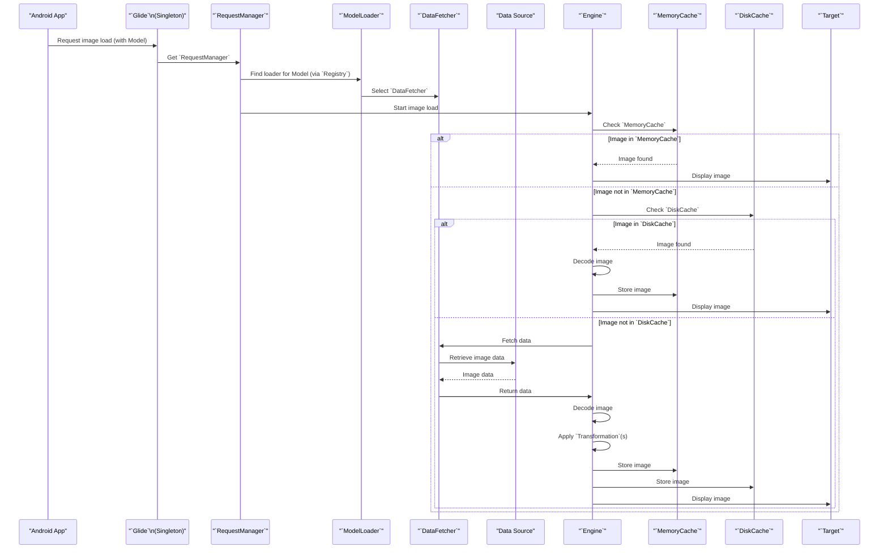

# Project Design Document: Glide Image Loading Library

**Version:** 1.1
**Date:** October 26, 2023
**Author:** AI Software Architect

## 1. Introduction

This document provides a detailed design overview of the Glide image loading library for Android. It outlines the key components, their interactions, and the overall architecture of the library. This document is specifically intended to serve as a foundation for subsequent threat modeling activities, enabling a comprehensive assessment of potential security vulnerabilities. Understanding the system's design is crucial for identifying potential attack surfaces and weaknesses.

## 2. Goals and Scope

The primary goal of this document is to provide a clear, detailed, and accurate architectural description of the Glide library. This description will be used by security professionals and developers to identify potential security threats, vulnerabilities, and design flaws within the system.

The scope of this document encompasses the core functionalities of the Glide library, focusing on:

*   Image loading from various sources (network URLs, local storage paths, Android resources, content URIs, and byte arrays).
*   Image caching mechanisms, including in-memory and disk caching.
*   Image transformations and processing applied before display or caching.
*   The request management lifecycle, from initiation to completion or cancellation.
*   Integration points with Android UI components like `ImageView` and custom targets.
*   The role of key interfaces and abstractions within the library.

This document explicitly does not cover:

*   Detailed implementation specifics within individual classes' methods.
*   Performance benchmarking or optimization strategies.
*   Specific use cases or implementation details within client applications using Glide.
*   Third-party extensions or modules built on top of Glide, unless they are integral to the core functionality.

## 3. Architectural Overview

Glide employs a modular and extensible architecture designed for efficient and flexible image loading. The core components work together in a coordinated manner to fetch, decode, process, cache, and display images. The architecture emphasizes separation of concerns and allows for customization and extension.

```mermaid
graph LR
    subgraph "Android Application"
        A("`ImageView`")
    end
    B("`Glide`\n(Singleton)") --> C("`RequestManager`");
    C --> D("`ModelLoaders`");
    D --> E("`DataFetchers`");
    E --> F{"Data Sources\n(Network, File,\nContent Provider,\nResources, Bytes)"};
    C --> G("`Target`");
    G --> A;
    C --> H("`Engine`");
    H --> I("`MemoryCache`");
    H --> J("`DiskCache`");
    J --> E;
    I --> G;
    H --> K("`Transformation`");
    K --> G;
    B --> L("`Registry`");
    L --> D;
    L --> E;
    L --> K;
    style A fill:#f9f,stroke:#333,stroke-width:2px
    style B fill:#ccf,stroke:#333,stroke-width:2px
    style C fill:#ccf,stroke:#333,stroke-width:2px
    style D fill:#ccf,stroke:#333,stroke-width:2px
    style E fill:#ccf,stroke:#333,stroke-width:2px
    style F fill:#bbb,stroke:#333,stroke-width:2px
    style G fill:#ccf,stroke:#333,stroke-width:2px
    style H fill:#ccf,stroke:#333,stroke-width:2px
    style I fill:#ccf,stroke:#333,stroke-width:2px
    style J fill:#ccf,stroke:#333,stroke-width:2px
    style K fill:#ccf,stroke:#333,stroke-width:2px
    style L fill:#ccf,stroke:#333,stroke-width:2px
```

Key components and their roles:

*   **`Glide` (Singleton):** The central access point for the library. It provides a static method to obtain a `RequestManager` and manages global configurations.
*   **`RequestManager`:**  Responsible for managing the lifecycle of individual image loading requests. It ties requests to the lifecycle of an Android component (Activity, Fragment) to prevent resource leaks.
*   **`ModelLoaders`:** An interface and its implementations that translate a given data model (e.g., a URL string, a file object) into a concrete data fetcher. The `Registry` helps in selecting the appropriate `ModelLoader`.
*   **`DataFetchers`:**  Responsible for fetching the raw image data from various sources. Concrete implementations handle network requests (`HttpUrlFetcher`), local file access (`FileFetcher`), content provider queries (`ContentResolverFetcher`), resource loading (`ResourceFetcher`), and byte array handling (`BytesFetcher`).
*   **Data Sources:** The external systems or locations where image data resides, including remote web servers, the local file system, content providers, and application resources.
*   **`Target`:** An interface representing the destination for the loaded image. Common implementations include `ImageViewTarget` for displaying images in `ImageView`s and custom targets for other display mechanisms.
*   **`Engine`:** The core orchestrator of the image loading process. It manages cache lookups, data fetching, decoding, transformations, and cache updates.
*   **`MemoryCache`:** A fast, in-memory cache (typically LruCache) for storing recently loaded and decoded `Bitmap` objects. This significantly speeds up subsequent requests for the same image.
*   **`DiskCache`:** A persistent cache on the device's storage for storing either source data or transformed image data. It can be configured with different strategies (e.g., LRU, unlimited).
*   **`Transformation`:** An interface for applying modifications to images, such as resizing, cropping, applying filters, or custom effects. Transformations can be applied before caching and/or before displaying the image.
*   **`Registry`:** A central component that maintains the mappings between different types of models, data, resources, and transformations. It allows Glide to dynamically select the appropriate components for a given request.

## 4. Component Details

This section provides a more detailed description of the key components, emphasizing their functionalities and potential security implications.

### 4.1. `Glide` (Singleton)

*   Provides the primary entry point for interacting with the library through static methods.
*   Manages global configuration options, such as default memory and disk cache sizes, and connection timeouts.
*   Responsible for initializing the `Registry` and other core components.
*   Potential security concern: Improper configuration could lead to excessive resource usage or insecure defaults.

### 4.2. `RequestManager`

*   Manages the lifecycle of image loading requests, ensuring resources are properly released when the associated Android component is destroyed.
*   Provides a fluent API for building and starting image loading requests.
*   Allows for request cancellation.
*   Potential security concern: Improper lifecycle management could lead to resource leaks or unexpected behavior.

### 4.3. `ModelLoaders`

*   Abstract the process of interpreting different types of input models.
*   Implementations are responsible for validating the input model and determining the appropriate `DataFetcher`.
*   Potential security concern: Vulnerabilities in model validation could lead to path traversal or other injection attacks if the model represents a file path or URL.

### 4.4. `DataFetchers`

*   Perform the actual retrieval of image data from various sources.
*   `HttpUrlFetcher`: Handles network requests, potentially over insecure HTTP.
*   `FileFetcher`: Accesses the local file system, requiring careful handling of file paths.
*   `ContentResolverFetcher`: Queries content providers, requiring proper permission checks.
*   `ResourceFetcher`: Loads resources from the application's `res` directory.
*   `BytesFetcher`: Handles image data provided as byte arrays.
*   Potential security concerns:
    *   `HttpUrlFetcher`: Susceptible to MITM attacks if HTTPS is not enforced.
    *   `FileFetcher`: Vulnerable to path traversal attacks if file paths are not sanitized.
    *   `ContentResolverFetcher`: Risk of accessing unauthorized data if permissions are mishandled.

### 4.5. Data Sources

*   Represent the external sources of image data.
*   Security depends heavily on the security of these external systems (e.g., secure web servers, protected file storage).
*   Glide's security relies on the integrity and confidentiality of the data provided by these sources.

### 4.6. `Target`

*   Receives the loaded image and displays it or processes it further.
*   `ImageViewTarget` handles setting the `Bitmap` on an `ImageView`.
*   Custom targets might perform other actions with the loaded image.
*   Potential security concern: Vulnerabilities in custom target implementations could lead to unexpected behavior or security issues.

### 4.7. `Engine`

*   The core logic of Glide resides here, managing the entire image loading pipeline.
*   Coordinates cache lookups, data fetching, decoding, and transformations.
*   Applies synchronization to manage concurrent requests.
*   Potential security concern: Vulnerabilities in the engine's logic could have widespread impact on the library's security.

### 4.8. `MemoryCache`

*   Provides fast access to recently used images.
*   Typically uses a size-limited LruCache.
*   Potential security concern: While less persistent than disk cache, vulnerabilities could lead to denial-of-service by filling the cache with malicious data.

### 4.9. `DiskCache`

*   Provides persistent storage for cached images.
*   Can be configured with different storage locations and caching strategies.
*   Potential security concerns:
    *   Cache poisoning: Malicious images could be injected into the cache.
    *   Data leakage: Sensitive images might be stored without proper encryption or access controls.
    *   Insufficient access controls on the cache directory could allow unauthorized access.

### 4.10. `Transformation`

*   Allows for image manipulation.
*   Implementations can perform various operations, from simple resizing to complex filtering.
*   Potential security concern: Malicious transformations could potentially lead to denial-of-service by consuming excessive resources or exploiting vulnerabilities in image processing libraries.

### 4.11. `Registry`

*   Maintains the mappings between models, data, and various components like `ModelLoaders`, `DataFetchers`, and `Transformations`.
*   Allows for customization and extension of Glide's functionality.
*   Potential security concern: Improperly registered or malicious components could be injected into the loading pipeline.

## 5. Data Flow

The typical data flow for loading an image using Glide involves a series of steps, as illustrated below:



The process generally follows these steps:

1. The Android application initiates an image loading request by calling a method on the `Glide` singleton, providing a data model (e.g., a URL).
2. The `Glide` singleton retrieves the appropriate `RequestManager`.
3. The `RequestManager` uses the provided model to find a suitable `ModelLoader` via the `Registry`.
4. The `ModelLoader` selects the appropriate `DataFetcher` for the given model type.
5. The `RequestManager` instructs the `Engine` to start the image load.
6. The `Engine` first checks the `MemoryCache`. If the image is found, it's immediately provided to the `Target`.
7. If the image is not in the `MemoryCache`, the `Engine` checks the `DiskCache`. If found, the image is retrieved, decoded, stored in the `MemoryCache`, and then provided to the `Target`.
8. If the image is not in either cache, the `Engine` instructs the selected `DataFetcher` to retrieve the raw image data from the `Data Source`.
9. The `DataFetcher` fetches the data from the source (e.g., downloads from a network URL).
10. The raw data is returned to the `Engine`.
11. The `Engine` decodes the raw data into a `Bitmap`.
12. Any specified `Transformation`s are applied to the `Bitmap`.
13. The transformed `Bitmap` is stored in the `MemoryCache` and potentially in the `DiskCache`.
14. Finally, the transformed `Bitmap` is provided to the `Target` for display.

## 6. Security Considerations (For Threat Modeling)

This section expands on potential security concerns within the Glide architecture, categorized for clarity. These points will be the focus of subsequent threat modeling exercises.

**A. Data Integrity and Authenticity:**

*   **Network Transport Security:** Lack of HTTPS enforcement for network requests makes the application vulnerable to MITM attacks, allowing attackers to intercept and potentially modify image data.
*   **Disk Cache Poisoning:** An attacker gaining access to the device's file system could inject malicious or corrupted images into the disk cache, which would then be served to the application.
*   **Data Source Compromise:** If the remote image server or content provider is compromised, Glide could load and display malicious content.

**B. Confidentiality:**

*   **Disk Cache Data Leakage:** Sensitive images stored in the disk cache might be accessible to other applications or users if proper file permissions or encryption are not in place.
*   **Memory Leaks of Sensitive Data:** Although less persistent, improper handling of `Bitmap` objects in memory could potentially lead to memory leaks containing sensitive image data.

**C. Availability and Denial of Service:**

*   **Image Decoding Vulnerabilities:** Specially crafted image files could exploit vulnerabilities in the underlying image decoding libraries, leading to application crashes or denial of service.
*   **Resource Exhaustion through Transformations:** Maliciously crafted transformation requests could consume excessive CPU or memory, leading to application slowdown or crashes.
*   **Cache Bombing:** An attacker could force the caching of a large number of unique, large images, filling the disk cache and potentially impacting device performance.

**D. Access Control and Authorization:**

*   **Content Provider Permissions:** Improper handling of permissions when loading images from content providers could lead to unauthorized access to sensitive data.
*   **Local File Access Control:** If Glide is used to load local files, insufficient validation of file paths could lead to path traversal vulnerabilities, allowing access to unauthorized files.

**E. Input Validation and Sanitization:**

*   **URL Injection:** Improper validation of image URLs could lead to Server-Side Request Forgery (SSRF) attacks, where the application is tricked into making requests to unintended servers.
*   **File Path Injection:** If loading local files, insufficient sanitization of file paths could allow attackers to access or load arbitrary files.

**F. Dependency Management:**

*   **Vulnerabilities in Dependencies:** Glide relies on other libraries (e.g., OkHttp). Vulnerabilities in these dependencies could indirectly impact Glide's security.

## 7. Assumptions and Limitations

*   This document assumes a basic understanding of Android application development principles and common security concepts.
*   The focus is on the core functionality of the Glide library as of the current version. Changes in future versions may affect the accuracy of this document.
*   The security considerations outlined are not exhaustive but represent key areas of potential risk based on the system's design. A thorough threat modeling exercise will be required to identify all potential threats and vulnerabilities.
*   This document does not delve into the specifics of how Glide is used within a particular application. Security implications can vary depending on the context of use.
*   The document assumes that the underlying Android operating system and hardware provide a certain level of security. Vulnerabilities in the platform itself are outside the scope of this document.
