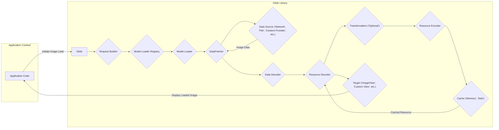

# Project Design Document: Glide Image Loading Library

**Version:** 1.1
**Date:** October 26, 2023
**Author:** AI Software Architect

## 1. Introduction

This document provides an enhanced architectural design of the Glide image loading library for Android. This design will serve as the foundation for subsequent threat modeling activities, enabling a more granular analysis of potential security vulnerabilities. Glide is a widely adopted open-source library designed to facilitate efficient and smooth image loading, caching, and display within Android applications.

## 2. Project Overview

Glide streamlines the process of fetching, decoding, and displaying images in Android applications. It abstracts away the complexities associated with:

*   Retrieving images from diverse sources (network URLs, local file paths, content URIs, application resources, etc.).
*   Managing image decoding and encoding for various formats.
*   Implementing multi-layered caching mechanisms (memory and disk).
*   Applying image transformations (resizing, cropping, applying filters, etc.) in an optimized manner.
*   Integrating with Android component lifecycles to prevent resource leaks.

The library's primary goals are to enhance application performance, improve user experience through seamless image loading, and minimize memory footprint.

## 3. High-Level Architecture

The following diagram illustrates the high-level architecture of Glide, highlighting the key components and their interactions during the image loading process.

## 4. Component Breakdown

This section provides a detailed breakdown of the key components within the Glide library, outlining their responsibilities and interactions.

### 4.1. Glide

*   **Description:** The central entry point for interacting with the Glide library. It offers static methods to initiate and manage image loading requests.
*   **Responsibilities:**
    *   Provides a fluent and intuitive API for constructing image loading requests.
    *   Manages the overall lifecycle of individual image loading requests.
    *   Serves as a central access point to Glide's configuration and context.

### 4.2. Request Builder

*   **Description:** A builder pattern used to configure the specific parameters and options for an image loading request.
*   **Responsibilities:**
    *   Specifies the source of the image to be loaded (e.g., URL string, file URI, resource identifier).
    *   Defines any image transformations to be applied (e.g., resizing, cropping).
    *   Sets caching strategies and options (e.g., skipping cache, using disk cache strategies).
    *   Designates the `Target` where the loaded image will be displayed.
    *   Handles placeholder images (displayed while loading) and error/fallback images.

### 4.3. Model Loader Registry

*   **Description:** A registry responsible for mapping different data model types (representing image sources) to the appropriate `ModelLoader` implementation.
*   **Responsibilities:**
    *   Dynamically determines the correct `ModelLoader` to use based on the type of the provided image source.
    *   Allows developers to register custom `ModelLoader` implementations for handling unique data sources.

### 4.4. Model Loader

*   **Description:** An interface responsible for translating a specific data model (e.g., a URL string) into a concrete `DataFetcher` instance.
*   **Responsibilities:**
    *   Takes a data model as input.
    *   Returns a `DataFetcher` that is capable of retrieving the image data from the source represented by the model.

### 4.5. DataFetcher

*   **Description:** An interface responsible for the actual retrieval of raw image data from the designated `Data Source`.
*   **Responsibilities:**
    *   Performs network requests (if the data source is a network URL).
    *   Reads data from the local file system or interacts with content providers.
    *   Handles potential exceptions and errors during data retrieval.

### 4.6. Data Source

*   **Description:** Represents the origin from which the image data is fetched.
*   **Examples:**
    *   Network endpoints (accessed via HTTP/HTTPS).
    *   Local file system paths.
    *   Android Content Providers.
    *   Application assets.
    *   Byte arrays.

### 4.7. Data Decoder

*   **Description:** Responsible for decoding the raw data (obtained by the `DataFetcher`) into an intermediate, more manageable format.
*   **Responsibilities:**
    *   Handles various image formats (JPEG, PNG, GIF, WebP, etc.).
    *   Performs initial decoding steps, potentially involving decompression or parsing.

### 4.8. Resource Decoder

*   **Description:** Decodes the intermediate data (produced by the `Data Decoder`) into a usable resource, typically a `Bitmap` object for display.
*   **Responsibilities:**
    *   Performs the final decoding into the desired image representation.
    *   May apply optimizations based on the target's requirements (e.g., downsampling for smaller `ImageView`s).

### 4.9. Transformation

*   **Description:** An optional component that modifies the decoded image resource before it is displayed or cached.
*   **Responsibilities:**
    *   Applies transformations such as resizing, cropping, applying image filters, and rotating.
    *   Ensures transformations are performed efficiently to minimize performance impact.

### 4.10. Resource Encoder

*   **Description:** Encodes a resource (e.g., a `Bitmap`) into a byte stream for storage in the disk cache.
*   **Responsibilities:**
    *   Encodes the resource into a format suitable for persistent storage.
    *   May apply compression techniques to reduce storage space.

### 4.11. Cache (Memory & Disk)

*   **Description:** A multi-level caching system used to store decoded images (memory cache) and encoded image data (disk cache) to improve performance by avoiding redundant fetching and decoding.
*   **Responsibilities:**
    *   Provides mechanisms for storing and retrieving cached resources.
    *   Implements eviction strategies (e.g., Least Recently Used - LRU) to manage cache size.
    *   Supports different disk cache implementations for flexibility.

### 4.12. Target

*   **Description:** Represents the destination where the loaded image will be displayed or used (e.g., an `ImageView`, a custom view, or a notification).
*   **Responsibilities:**
    *   Receives the loaded image resource from Glide.
    *   Handles the display of the image within the target view or component.
    *   Manages the lifecycle of the image within the target.

## 5. Data Flow

The typical data flow for loading an image using Glide involves the following steps:

1. The application initiates an image loading request through the `Glide` API, providing the image source and the desired `Target`.
2. The `Request Builder` configures the request with specific parameters and options.
3. The `Model Loader Registry` identifies the appropriate `Model Loader` based on the image source type.
4. The selected `Model Loader` creates a `DataFetcher` responsible for retrieving the image data from the `Data Source`.
5. The `DataFetcher` fetches the raw image data (e.g., downloading from a network URL or reading from a file).
6. The `Data Decoder` decodes the raw data into an intermediate format.
7. The `Resource Decoder` decodes the intermediate data into a usable resource, such as a `Bitmap`.
8. Optional `Transformation` components modify the decoded resource as specified in the request.
9. The decoded and transformed resource is delivered to the designated `Target` for display.
10. The `Resource Encoder` encodes the resource for potential storage in the disk `Cache`. The resource is also stored in the memory `Cache`.
11. For subsequent requests for the same image, Glide first checks the memory cache. If not found, it checks the disk cache before resorting to fetching from the original `Data Source`.

## 6. Key Technologies and Dependencies

*   **Java/Kotlin:** The primary programming languages used for developing the Glide library.
*   **Android SDK:**  Relies heavily on various components of the Android framework.
*   **OkHttp (Commonly Used):** A popular and efficient HTTP client library often integrated with Glide for handling network requests.
*   **DiskLruCache:** A disk-based LRU cache implementation frequently used by Glide for its disk caching mechanism.

## 7. Security Considerations (For Threat Modeling)

This section outlines potential security considerations and vulnerabilities within the Glide architecture, serving as a starting point for a comprehensive threat modeling exercise.

*   **Data Source Vulnerabilities:**
    *   **Insecure Network Communication (HTTP):** Loading images over unencrypted HTTP connections exposes image data to potential eavesdropping (man-in-the-middle attacks) and manipulation.
    *   **Compromised Image Servers:** If the image source is a remote server, a compromised server could serve malicious or inappropriate content, potentially leading to application vulnerabilities or displaying harmful images.
    *   **Path Traversal Vulnerabilities (File System):** Improper handling of file paths provided as image sources could allow attackers to access unauthorized files on the device.
    *   **Content Provider Exploitation:**  Vulnerabilities in content providers used as image sources could be exploited to access or manipulate data.
*   **Data Handling Vulnerabilities:**
    *   **Denial of Service (DoS) via Large Images:** Loading excessively large or malformed images could consume excessive memory and processing resources, potentially leading to application crashes or slowdowns.
    *   **Integer Overflow/Underflow in Decoding/Transformation:**  Vulnerabilities in image decoding or transformation logic could lead to integer overflow or underflow conditions, potentially causing crashes or unexpected behavior.
    *   **Out-of-Memory Errors:**  Loading and processing large images without proper memory management can lead to `OutOfMemoryError` exceptions, crashing the application.
    *   **Exposure of Sensitive Data in Image Metadata:** Image metadata might contain sensitive information that could be unintentionally exposed.
*   **Caching Vulnerabilities:**
    *   **Cache Poisoning:** Attackers might be able to inject malicious content into the Glide cache, which would then be served to the application as legitimate images.
    *   **Cache Snooping/Information Disclosure:**  Sensitive information might be inadvertently stored in the cache and could be accessible to other applications or processes with sufficient permissions.
    *   **Insecure Cache Storage:** If the disk cache is not properly protected, malicious actors with access to the device's file system could potentially access or modify cached image data.
*   **Transformation Vulnerabilities:**
    *   **Exploiting Transformation Logic:**  Vulnerabilities in image transformation algorithms could be exploited to cause unexpected behavior or crashes.
*   **Dependency Vulnerabilities:**
    *   **Third-Party Library Vulnerabilities:**  Vulnerabilities in underlying libraries like OkHttp or the specific disk cache implementation could indirectly impact Glide's security. It's crucial to keep dependencies updated.
*   **Target Vulnerabilities:**
    *   **Security Issues in Custom Targets:** If developers implement custom `Target` implementations, vulnerabilities in their code could be exploited.

## 8. Conclusion

This enhanced design document provides a detailed architectural overview of the Glide image loading library, emphasizing components and data flow relevant for security analysis. It outlines key components, their responsibilities, and the typical image loading process. This document serves as a critical foundation for conducting thorough threat modeling, enabling the identification of potential security risks and the development of appropriate mitigation strategies to ensure the secure and reliable operation of applications utilizing the Glide library.