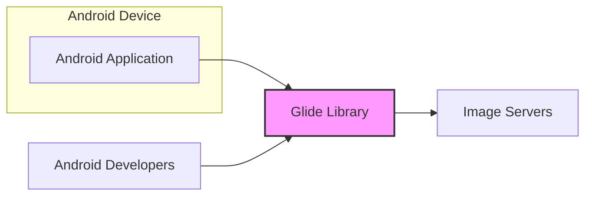
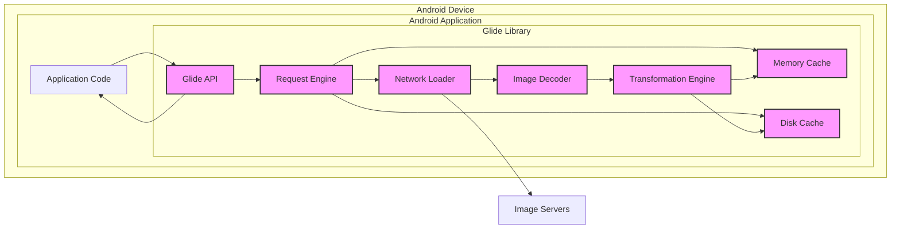
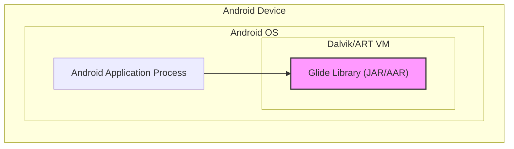
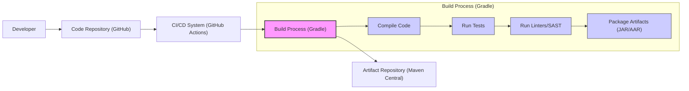

# BUSINESS POSTURE

This project is the Glide library, an open-source media management and image loading framework for Android.

- Business Priorities and Goals:
  - Provide a robust, efficient, and easy-to-use library for Android developers to load, cache, and display images and other media.
  - Improve the performance and user experience of Android applications by optimizing image loading and reducing bandwidth consumption.
  - Offer a flexible and extensible framework that can be adapted to various image loading needs and scenarios.
  - Maintain a widely adopted and trusted library within the Android development community.

- Business Risks:
  - Performance regressions or bugs in the library could negatively impact application performance and user experience.
  - Security vulnerabilities in the library could be exploited by malicious actors to compromise applications using Glide.
  - Lack of maintenance or updates could lead to the library becoming outdated and less secure over time.
  - Compatibility issues with new Android versions or devices could reduce the library's usability.
  - Reputational damage if the library is perceived as unreliable, insecure, or difficult to use.

# SECURITY POSTURE

- Existing Security Controls:
  - security control: Input validation on image URLs and data formats handled by the library. Implemented within the library's code, specifically in the network loading and decoding components.
  - security control: Caching mechanisms to reduce network requests. Implemented within the library's disk and memory cache components.
  - security control: Reliance on Android platform security features, such as permissions and sandboxing. Inherited from the Android operating system environment.
  - accepted risk: Potential vulnerabilities in third-party image formats or codecs that Glide depends on. Accepted due to the need to support a wide range of image formats.
  - accepted risk: Risk of denial-of-service attacks if the library is used to load extremely large or malformed images. Accepted as mitigation would significantly impact performance for legitimate use cases.

- Recommended Security Controls:
  - security control: Implement automated dependency scanning to identify and address vulnerabilities in third-party libraries used by Glide.
  - security control: Integrate static analysis security testing (SAST) tools into the build process to detect potential security flaws in the Glide codebase.
  - security control: Conduct regular security code reviews by experienced security engineers to identify and remediate vulnerabilities.
  - security control: Implement fuzz testing to discover vulnerabilities related to handling various image formats and malformed inputs.
  - security control: Enforce secure coding practices throughout the development lifecycle, including input validation, output encoding, and secure error handling.

- Security Requirements:
  - Authentication:
    - Not directly applicable to the Glide library itself. Authentication of image sources is the responsibility of the application using Glide. Glide should support passing through authentication headers if provided by the application.
  - Authorization:
    - Not directly applicable to the Glide library itself. Authorization to access image resources is the responsibility of the application using Glide. Glide should respect any access control mechanisms implemented by the application or the image server.
  - Input Validation:
    - Requirement: The library must perform robust input validation on all external inputs, including image URLs, image data, and transformation parameters, to prevent injection attacks and other input-related vulnerabilities.
    - Implementation: Input validation should be implemented in the network loading, decoding, and transformation components of Glide.
  - Cryptography:
    - Requirement: If handling sensitive image data, the library should support encryption of cached data at rest and during transit if necessary.
    - Implementation: Consider using Android Keystore for secure storage of encryption keys if local caching of sensitive data is required. For network transit, rely on HTTPS which is the responsibility of the application or underlying network layers.

# DESIGN

## C4 CONTEXT

- Context Diagram Elements:
  - Element:
    - Name: Android Application
    - Type: Software System
    - Description: Android applications that utilize the Glide library to load and display images. These applications are the primary users of Glide.
    - Responsibilities:
      - Initiate image loading requests to Glide.
      - Display images loaded by Glide to the user.
      - Handle user interactions related to images.
      - Implement application-level security controls, including authentication and authorization for image resources.
    - Security controls:
      - security control: Application-level authentication and authorization to control access to image resources.
      - security control: Input validation on user-provided data related to image loading.
      - security control: Secure storage of any sensitive data related to image handling.

  - Element:
    - Name: Glide Library
    - Type: Software System
    - Description: The Glide image loading and caching library. It is responsible for efficiently loading images from various sources, caching them, and providing them to Android applications.
    - Responsibilities:
      - Receive image loading requests from Android applications.
      - Fetch images from remote servers or local storage.
      - Cache images in memory and on disk to improve performance.
      - Decode and transform images into a format suitable for display.
      - Provide loaded images to Android applications.
    - Security controls:
      - security control: Input validation on image URLs and data formats.
      - security control: Secure caching mechanisms to protect cached image data.
      - security control: Protection against common image processing vulnerabilities.

  - Element:
    - Name: Image Servers
    - Type: External System
    - Description: Remote servers that host image resources. These can be CDNs, cloud storage services, or application-specific servers.
    - Responsibilities:
      - Store and serve image resources.
      - Handle requests for image resources from clients, including Glide.
      - Implement server-side security controls, such as authentication and authorization.
    - Security controls:
      - security control: Server-side authentication and authorization to control access to image resources.
      - security control: Protection against denial-of-service attacks.
      - security control: Secure storage and transmission of image data.

  - Element:
    - Name: Android Developers
    - Type: Person
    - Description: Developers who use the Glide library to build Android applications. They integrate Glide into their applications and configure it to meet their specific image loading needs.
    - Responsibilities:
      - Integrate Glide library into Android applications.
      - Configure Glide to optimize image loading and caching.
      - Handle Glide's API and manage image loading requests.
      - Ensure proper error handling and resource management when using Glide.
    - Security controls:
      - security control: Following secure coding practices when integrating and using Glide.
      - security control: Keeping Glide library updated to the latest version to benefit from security patches.

## C4 CONTAINER

- Container Diagram Elements:
  - Element:
    - Name: Glide API
    - Type: Library Component
    - Description: The public API of the Glide library that Android applications interact with to initiate image loading requests and configure Glide's behavior.
    - Responsibilities:
      - Provide a user-friendly interface for Android developers to use Glide.
      - Accept image loading requests and configuration parameters from applications.
      - Delegate requests to the Request Engine.
    - Security controls:
      - security control: Input validation on API parameters to prevent misuse and injection attacks.

  - Element:
    - Name: Request Engine
    - Type: Library Component
    - Description: The core component of Glide that manages the image loading process. It coordinates caching, network loading, decoding, and transformations.
    - Responsibilities:
      - Orchestrate the image loading workflow.
      - Check the memory and disk caches for requested images.
      - Initiate network requests if images are not cached.
      - Delegate image decoding and transformations.
      - Manage cache updates.
    - Security controls:
      - security control: Cache invalidation mechanisms to prevent serving stale or compromised cached data.
      - security control: Rate limiting of network requests to mitigate denial-of-service risks.

  - Element:
    - Name: Memory Cache
    - Type: Data Store
    - Description: An in-memory cache that stores recently loaded images for fast retrieval.
    - Responsibilities:
      - Provide fast access to frequently used images.
      - Reduce the need to load images from disk or network repeatedly.
      - Implement a cache eviction policy to manage memory usage.
    - Security controls:
      - security control: Limit the size of the memory cache to prevent excessive memory consumption.
      - security control: Consider clearing sensitive data from memory cache when application goes to background.

  - Element:
    - Name: Disk Cache
    - Type: Data Store
    - Description: A persistent cache that stores images on disk for longer-term caching.
    - Responsibilities:
      - Provide persistent caching of images across application sessions.
      - Reduce network traffic and improve offline availability.
      - Implement a cache eviction policy to manage disk space.
    - Security controls:
      - security control: Secure file permissions for the disk cache directory to prevent unauthorized access.
      - security control: Consider encrypting sensitive data in the disk cache.

  - Element:
    - Name: Network Loader
    - Type: Library Component
    - Description: Responsible for fetching images from remote servers over the network.
    - Responsibilities:
      - Handle network communication with image servers.
      - Download image data based on URLs.
      - Support various network protocols (e.g., HTTP, HTTPS).
      - Handle network errors and retries.
    - Security controls:
      - security control: Enforce HTTPS for secure communication with image servers whenever possible.
      - security control: Input validation on URLs to prevent injection attacks.
      - security control: Implement timeouts and limits on network requests to prevent denial-of-service.

  - Element:
    - Name: Image Decoder
    - Type: Library Component
    - Description: Decodes downloaded image data into a bitmap format that can be displayed by Android applications.
    - Responsibilities:
      - Parse and decode image data from various formats (e.g., JPEG, PNG, GIF).
      - Handle different image codecs and formats.
      - Optimize decoding for performance and memory usage.
    - Security controls:
      - security control: Protection against image parsing vulnerabilities that could lead to crashes or code execution.
      - security control: Input validation on image data to prevent malformed image attacks.

  - Element:
    - Name: Transformation Engine
    - Type: Library Component
    - Description: Applies image transformations, such as resizing, cropping, and applying filters, to images before they are displayed.
    - Responsibilities:
      - Apply requested image transformations.
      - Optimize transformations for performance.
      - Provide a flexible API for defining custom transformations.
    - Security controls:
      - security control: Input validation on transformation parameters to prevent misuse and unexpected behavior.
      - security control: Ensure transformations do not introduce new vulnerabilities or expose sensitive data.

## DEPLOYMENT

Glide library is deployed as part of Android applications. There isn't a separate deployment infrastructure for Glide itself. The deployment context is the Android application runtime environment on Android devices.

- Deployment Diagram Elements:
  - Element:
    - Name: Android Application Process
    - Type: Process
    - Description: The process in which an Android application runs on an Android device. This process provides the runtime environment for the application and the Glide library.
    - Responsibilities:
      - Execute the Android application code and the Glide library code.
      - Manage resources for the application, including memory, CPU, and network access.
      - Enforce security policies and permissions for the application.
    - Security controls:
      - security control: Android OS security features, including sandboxing and permission management.
      - security control: Process isolation to prevent interference between applications.

  - Element:
    - Name: Glide Library (JAR/AAR)
    - Type: Software Component
    - Description: The compiled Glide library, packaged as a JAR or AAR file, which is included within the Android application package (APK).
    - Responsibilities:
      - Provide image loading and caching functionality within the Android application process.
      - Utilize Android OS resources and APIs to perform its functions.
      - Operate within the security context of the Android application process.
    - Security controls:
      - security control: Library-level security controls as described in previous sections (input validation, secure caching, etc.).
      - security control: Reliance on the security of the Android application process and the underlying Android OS.

## BUILD

- Build Process Description:
  - Developer: Developers write code for Glide and commit changes to the code repository.
  - Code Repository (GitHub): The source code for Glide is hosted on GitHub. This serves as the central version control system.
  - CI/CD System (GitHub Actions): GitHub Actions is used for continuous integration and continuous delivery. It automates the build, test, and release process.
  - Build Process (Gradle): Gradle is the build automation tool used to compile, test, and package the Glide library.
    - Compile Code: Gradle compiles the Java and Kotlin source code into bytecode.
    - Run Tests: Gradle executes unit tests and integration tests to ensure code quality and functionality.
    - Run Linters/SAST: Static analysis security testing (SAST) tools and linters are run to identify potential code quality issues and security vulnerabilities.
    - Package Artifacts (JAR/AAR): Gradle packages the compiled code and resources into JAR and AAR files, which are the distributable artifacts of the Glide library.
  - Artifact Repository (Maven Central): The built JAR and AAR artifacts are published to Maven Central, a public repository for Java and Android libraries, making Glide available to Android developers.

- Build Security Controls:
  - security control: Secure access control to the code repository (GitHub) to prevent unauthorized code changes.
  - security control: Use of a CI/CD system (GitHub Actions) to automate the build process and ensure consistency and repeatability.
  - security control: Integration of static analysis security testing (SAST) tools and linters into the build pipeline to detect potential vulnerabilities early in the development lifecycle.
  - security control: Automated unit and integration tests to verify the functionality and security of the code.
  - security control: Dependency scanning in the CI/CD pipeline to identify and manage vulnerabilities in third-party dependencies.
  - security control: Signing of artifacts (JAR/AAR) to ensure integrity and authenticity of the released library.
  - security control: Secure publishing process to Maven Central, including secure credentials management.

# RISK ASSESSMENT

- Critical Business Processes:
  - Providing a reliable and performant image loading library for Android developers.
  - Maintaining the reputation and trust of the Glide library within the Android development community.
  - Ensuring the security and stability of applications that use Glide.

- Data to Protect and Sensitivity:
  - Image Data: The primary data handled by Glide is image data. The sensitivity of this data depends on the applications using Glide. Some applications may handle sensitive images (e.g., personal photos, medical images).
    - Sensitivity Level: Variable, can range from public to highly sensitive depending on the application context.
  - Cached Image Data: Glide caches images in memory and on disk. Cached data can persist sensitive information if the original images are sensitive.
    - Sensitivity Level: Same as image data, variable.
  - Library Code: The source code of Glide itself. Protecting the integrity and confidentiality of the code is important to prevent malicious modifications and maintain trust.
    - Sensitivity Level: Moderate to High (open source but integrity is crucial).

# QUESTIONS & ASSUMPTIONS

- Questions:
  - What types of Android applications are the primary users of Glide? Are they primarily focused on image-heavy content, or is image loading a secondary feature?
  - Are there specific performance benchmarks or SLAs that Glide aims to meet?
  - What is the expected threat model for applications using Glide? Are they likely to be targeted by sophisticated attackers, or are more common threats the primary concern?
  - Are there any specific regulatory compliance requirements that applications using Glide might need to adhere to (e.g., HIPAA, GDPR)?
  - What is the process for reporting and addressing security vulnerabilities in Glide?

- Assumptions:
  - Glide is used in a wide variety of Android applications, ranging from simple apps to complex, image-intensive applications.
  - Performance is a critical factor for Glide's usability and adoption.
  - The primary security concerns are related to common web and application vulnerabilities, such as input validation issues, image parsing vulnerabilities, and cache security.
  - Applications using Glide are expected to handle their own application-level security concerns, such as authentication and authorization for image resources.
  - The Glide project has a process for addressing reported security vulnerabilities, although the details are not explicitly provided in the input.