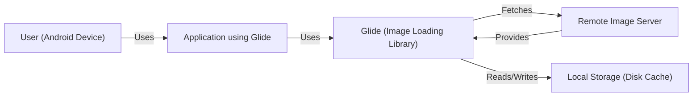
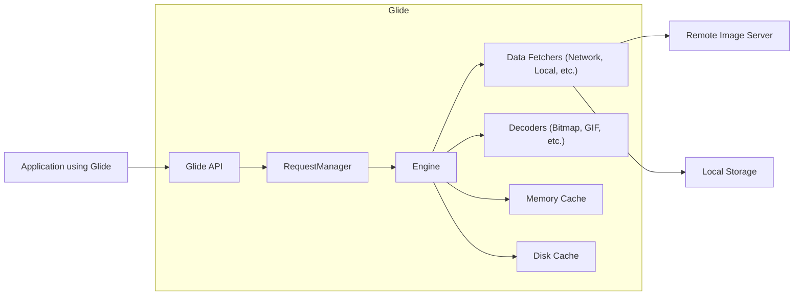
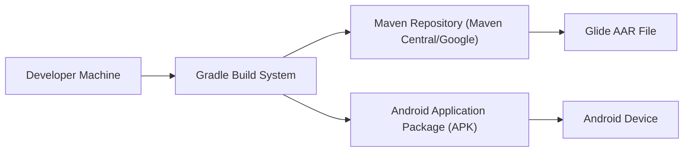
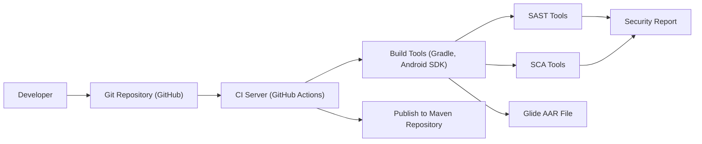

Okay, let's create a design document for the Glide project, focusing on aspects relevant for threat modeling.

# BUSINESS POSTURE

Glide is a popular open-source image loading and caching library for Android.  It simplifies the process of fetching, decoding, and displaying images, while also handling caching and memory management.  Given its widespread use, the business priorities and goals can be inferred as follows:

Priorities and Goals:

*   Performance:  Fast image loading is crucial for a good user experience in Android applications. Glide must minimize delays and provide smooth scrolling in image-heavy interfaces.
*   Reliability:  Glide must reliably load and display images, handling various network conditions and image formats gracefully.  Crashes or incorrect image rendering would severely impact the host application.
*   Ease of Use:  A simple and intuitive API is essential for developer adoption.  Glide should be easy to integrate and configure.
*   Maintainability:  As an open-source project, Glide needs a clean and maintainable codebase to facilitate contributions and long-term support.
*   Compatibility:  Support for a wide range of Android versions and devices is critical for broad adoption.
*   Resource Efficiency:  Minimize memory and battery consumption, especially important for mobile devices.

Business Risks:

*   Reputational Damage:  Vulnerabilities or performance issues in Glide could negatively impact the reputation of applications that use it, and transitively, the reputation of Glide itself.
*   Application Instability:  Bugs in Glide could lead to crashes or malfunctions in host applications, leading to user frustration and negative reviews.
*   Security Exploits:  Vulnerabilities in image processing or network handling could be exploited by attackers to compromise the host application or device.  This is a major concern.
*   Licensing Issues:  Improper handling of image copyrights or licensing could lead to legal problems for applications using Glide. (Less of a direct threat model concern, but still a business risk).
*   Community Abandonment: If the project is not actively maintained, it will become less attractive to developers, and existing users may migrate to alternatives.

# SECURITY POSTURE

Existing Security Controls:

*   security control: Input Validation: Glide performs checks on input URLs and resource IDs to prevent loading from unexpected sources. (Implicit in the library's design and usage of RequestOptions and resource loading mechanisms).
*   security control: Memory Management: Glide implements robust memory caching and lifecycle-aware resource management to prevent memory leaks and OutOfMemoryErrors. (Core to the library's functionality, described in the documentation and visible in the codebase).
*   security control: Disk Caching: Glide uses a disk cache to store downloaded images, reducing network requests and improving performance. The caching mechanism includes size limits and eviction policies. (Documented and part of the core functionality).
*   security control: Resource Transformation: Glide allows for image transformations (resizing, cropping, etc.). These transformations are applied carefully to avoid potential vulnerabilities related to image processing. (Part of the API and core functionality).
*   security control: Error Handling: Glide provides error handling mechanisms to gracefully handle network failures, invalid images, and other potential issues. (Documented and part of the API).
*   security control: Open Source Code: The code is publicly available and can be reviewed by anyone.

Accepted Risks:

*   accepted risk: Third-Party Library Dependencies: Glide depends on other libraries (e.g., for networking, image decoding). Vulnerabilities in these dependencies could impact Glide's security.
*   accepted risk: Denial of Service (DoS): A malicious application could potentially attempt to overload Glide with excessive image loading requests, leading to performance degradation or crashes. While Glide has resource management, extreme cases might still be an issue.
*   accepted risk: Image Decoding Vulnerabilities: While Glide uses standard Android image decoding libraries, vulnerabilities in those libraries (or custom decoders if used) could be exploited.
*   accepted risk: Data Leakage via Cache: If the device's storage is compromised, the cached images could be accessed by an attacker.

Recommended Security Controls:

*   security control: Implement a robust Content Security Policy (CSP) for network requests, limiting the domains from which Glide can load images. This would mitigate the risk of loading malicious images from attacker-controlled servers.
*   security control: Integrate with a Software Composition Analysis (SCA) tool to automatically identify and track vulnerabilities in Glide's dependencies.
*   security control: Perform regular security audits and penetration testing of Glide, focusing on image processing, network handling, and caching mechanisms.
*   security control: Consider adding support for signed URLs or other authentication mechanisms to ensure that only authorized images are loaded.
*   security control: Provide clear documentation and guidance on secure usage of Glide, including best practices for handling user-provided image URLs.
*   security control: Implement fuzz testing to identify potential vulnerabilities in image decoding and processing.

Security Requirements:

*   Authentication: Not directly applicable to Glide itself, as it primarily deals with loading publicly accessible images or resources identified by URIs. However, applications using Glide might need to authenticate with image sources, and Glide should support standard authentication mechanisms (e.g., passing headers).
*   Authorization: Glide should provide mechanisms to restrict access to certain images or resources based on application-defined policies. This could involve integrating with the application's authorization system or using signed URLs.
*   Input Validation:
    *   Strictly validate all input URLs and resource IDs to prevent loading from unauthorized or malicious sources.
    *   Sanitize user-provided input used in image transformations to prevent injection attacks.
    *   Enforce size limits on downloaded images to prevent excessive memory consumption.
*   Cryptography:
    *   Use HTTPS for all network requests to protect image data in transit.
    *   If caching sensitive images, consider encrypting the disk cache.
    *   If supporting signed URLs, ensure proper signature verification.

# DESIGN

## C4 CONTEXT

Element Descriptions:

*   Element:
    *   Name: User (Android Device)
    *   Type: Person
    *   Description: The end-user interacting with an Android application that utilizes Glide for image loading.
    *   Responsibilities: Interacts with the application's UI, triggering image loading requests.
    *   Security Controls: Relies on the security controls implemented by the Android OS and the application.

*   Element:
    *   Name: Application using Glide
    *   Type: Software System
    *   Description: An Android application that integrates the Glide library to handle image loading and caching.
    *   Responsibilities: Initiates image loading requests, configures Glide, displays images in the UI.
    *   Security Controls: Implements application-level security controls, such as input validation and authentication.

*   Element:
    *   Name: Glide (Image Loading Library)
    *   Type: Software System
    *   Description: The Glide library itself, responsible for fetching, decoding, caching, and displaying images.
    *   Responsibilities: Manages image loading lifecycle, handles caching, performs image transformations.
    *   Security Controls: Input validation, memory management, disk caching, resource transformation, error handling.

*   Element:
    *   Name: Remote Image Server
    *   Type: Software System
    *   Description: A remote server that hosts the images to be loaded by Glide.
    *   Responsibilities: Serves image data over the network (typically via HTTP/HTTPS).
    *   Security Controls: Server-side security controls, such as access control, input validation, and protection against common web vulnerabilities.

*   Element:
    *   Name: Local Storage (Disk Cache)
    *   Type: Data Store
    *   Description: The device's local storage used by Glide to cache downloaded images.
    *   Responsibilities: Stores and retrieves cached image data.
    *   Security Controls: Relies on the Android OS's file system security and permissions. Encryption may be used.

## C4 CONTAINER

Element Descriptions:

*   Element:
    *   Name: Application using Glide
    *   Type: Software System
    *   Description: An Android application that integrates the Glide library.
    *   Responsibilities: Initiates image loading requests, configures Glide, displays images.
    *   Security Controls: Application-level security controls.

*   Element:
    *   Name: Glide API
    *   Type: API
    *   Description: The public API of the Glide library, used by the application to interact with Glide.
    *   Responsibilities: Provides methods for loading images, configuring options, and managing requests.
    *   Security Controls: Input validation, parameter sanitization.

*   Element:
    *   Name: RequestManager
    *   Type: Component
    *   Description: Manages image loading requests and their lifecycles.
    *   Responsibilities: Tracks active requests, handles request cancellation, and manages request priorities.
    *   Security Controls: Resource management, request prioritization.

*   Element:
    *   Name: Engine
    *   Type: Component
    *   Description: The core image loading engine, responsible for coordinating the fetching, decoding, and caching of images.
    *   Responsibilities: Orchestrates the image loading process, interacts with data fetchers, decoders, and caches.
    *   Security Controls: Central point for enforcing security policies.

*   Element:
    *   Name: Data Fetchers (Network, Local, etc.)
    *   Type: Component
    *   Description: Components responsible for fetching image data from various sources (network, local storage, content providers, etc.).
    *   Responsibilities: Retrieves image data from the specified source.
    *   Security Controls: Input validation, network security (HTTPS), secure access to local resources.

*   Element:
    *   Name: Decoders (Bitmap, GIF, etc.)
    *   Type: Component
    *   Description: Components responsible for decoding image data into a usable format (e.g., Bitmap).
    *   Responsibilities: Decodes image data based on its format.
    *   Security Controls: Input validation, protection against image decoding vulnerabilities.

*   Element:
    *   Name: Memory Cache
    *   Type: Cache
    *   Description: An in-memory cache that stores recently loaded images for fast access.
    *   Responsibilities: Stores and retrieves images in memory.
    *   Security Controls: Size limits, eviction policies, memory management.

*   Element:
    *   Name: Disk Cache
    *   Type: Cache
    *   Description: A disk-based cache that stores downloaded images for persistence.
    *   Responsibilities: Stores and retrieves images on disk.
    *   Security Controls: Size limits, eviction policies, file system permissions, potential encryption.

*   Element:
    * Name: Remote Image Server
    * Type: Software System
    * Description: External system, server providing images.
    * Responsibilities: Serving images.
    * Security Controls: Standard server security.

*   Element:
    * Name: Local Storage
    * Type: Data Store
    * Description: Device storage.
    * Responsibilities: Storing files.
    * Security Controls: OS level security.

## DEPLOYMENT

Possible Deployment Solutions:

1.  **Direct Dependency (Gradle):** The most common approach. Glide is added as a dependency in the application's `build.gradle` file. The library is downloaded from a repository (e.g., Maven Central, Google's Maven repository) and packaged with the application.
2.  **Local Library Project:** The Glide source code could be included as a local library project within the application's project structure. This is less common but allows for direct modification of the Glide source code.
3.  **AAR File:** Glide could be pre-built as an AAR (Android Archive) file and included directly in the application's `libs` folder.

Chosen Solution (Direct Dependency - Gradle):

Element Descriptions:

*   Element:
    *   Name: Developer Machine
    *   Type: Infrastructure Node
    *   Description: The developer's workstation where the application code is written and built.
    *   Responsibilities: Hosts the development environment, source code, and build tools.
    *   Security Controls: Standard development environment security practices.

*   Element:
    *   Name: Gradle Build System
    *   Type: Software System
    *   Description: The build system used to compile the application and its dependencies.
    *   Responsibilities: Manages dependencies, compiles code, packages the application.
    *   Security Controls: Dependency verification (checksums, signatures), secure configuration.

*   Element:
    *   Name: Maven Repository (Maven Central/Google)
    *   Type: Software System
    *   Description: A repository that hosts the Glide library and its dependencies.
    *   Responsibilities: Provides access to pre-built library artifacts.
    *   Security Controls: Repository security measures, artifact signing.

*   Element:
    *   Name: Glide AAR File
    *   Type: Artifact
    *   Description: The compiled Glide library packaged as an AAR file.
    *   Responsibilities: Contains the Glide code and resources.
    *   Security Controls: Integrity checks (checksums, signatures).

*   Element:
    *   Name: Android Application Package (APK)
    *   Type: Artifact
    *   Description: The final application package that is installed on the Android device.
    *   Responsibilities: Contains the application code, resources, and dependencies (including Glide).
    *   Security Controls: Code signing, Android OS security mechanisms.

*   Element:
    *   Name: Android Device
    *   Type: Infrastructure Node
    *   Description: The end-user's Android device where the application is installed and run.
    *   Responsibilities: Executes the application code.
    *   Security Controls: Android OS security features, application sandboxing.

## BUILD

Build Process Description:

1.  **Developer:** Developers write code and push changes to the Git repository (GitHub).
2.  **Git Repository (GitHub):** The source code is hosted on GitHub.
3.  **CI Server (GitHub Actions):** GitHub Actions is used as the CI server.  Workflows are triggered on pull requests and pushes to the main branch.
4.  **Build Tools (Gradle, Android SDK):** The CI server uses Gradle and the Android SDK to build the Glide library.
5.  **SAST Tools:** Static Application Security Testing (SAST) tools (e.g., FindBugs, PMD, Android Lint) are integrated into the build process to analyze the source code for potential security vulnerabilities.
6.  **SCA Tools:** Software Composition Analysis (SCA) tools (e.g., OWASP Dependency-Check, Snyk) are used to scan the project's dependencies for known vulnerabilities.
7.  **Security Report:** The SAST and SCA tools generate security reports that are reviewed by the development team.
8.  **Glide AAR File:** The build process produces the Glide AAR file.
9.  **Publish to Maven Repository:**  The AAR file, along with its metadata (POM file), is published to a Maven repository (e.g., Maven Central) for distribution.

Security Controls in Build Process:

*   security control: Code Review: All code changes are reviewed by other developers before being merged into the main branch.
*   security control: SAST: Static analysis tools are used to identify potential vulnerabilities in the source code.
*   security control: SCA: Dependency analysis tools are used to track and manage vulnerabilities in third-party libraries.
*   security control: Build Automation: The build process is fully automated, ensuring consistency and repeatability.
*   security control: Artifact Signing: The published AAR file can be digitally signed to ensure its integrity and authenticity.
*   security control: Secure CI Environment: The CI server (GitHub Actions) is configured securely, with limited access and appropriate permissions.

# RISK ASSESSMENT

Critical Business Processes:

*   Image loading and display within Android applications.
*   Maintaining the reputation of Glide and applications that depend on it.
*   Ensuring the stability and security of applications using Glide.

Data Sensitivity:

*   **Image Data (Generally Low Sensitivity):** Most images loaded by Glide are likely to be publicly accessible content. However, some applications might use Glide to load sensitive images (e.g., user profile pictures, private photos). In these cases, the sensitivity of the image data would be higher.
*   **Cache Data (Potentially Sensitive):** The disk cache could contain sensitive images, depending on the application's usage. If the device is compromised, this data could be at risk.
*   **URLs and Resource IDs (Low to Medium Sensitivity):** The URLs and resource IDs used to load images could potentially reveal information about the application's backend or the user's activity.
*   **No PII is directly handled by the library itself.**

# QUESTIONS & ASSUMPTIONS

Questions:

*   What specific image formats are supported by Glide, and are there any known vulnerabilities associated with those formats?
*   What are the specific mechanisms used by Glide for input validation of URLs and resource IDs?
*   Are there any plans to add support for signed URLs or other authentication mechanisms?
*   What is the current process for handling security vulnerabilities reported in Glide or its dependencies?
*   Are there any specific security certifications or compliance requirements that Glide needs to meet?
*   What is the exact list of third-party dependencies?

Assumptions:

*   BUSINESS POSTURE: Glide is primarily used for loading publicly accessible images, and most applications using Glide do not handle highly sensitive image data.
*   SECURITY POSTURE: The Android OS provides a reasonable level of security for the device's storage and network communication. Applications using Glide are responsible for implementing their own authentication and authorization mechanisms.
*   DESIGN: Glide relies on standard Android libraries for image decoding and networking. The development team follows secure coding practices and regularly reviews the codebase for potential vulnerabilities. The build process includes security checks (SAST, SCA).