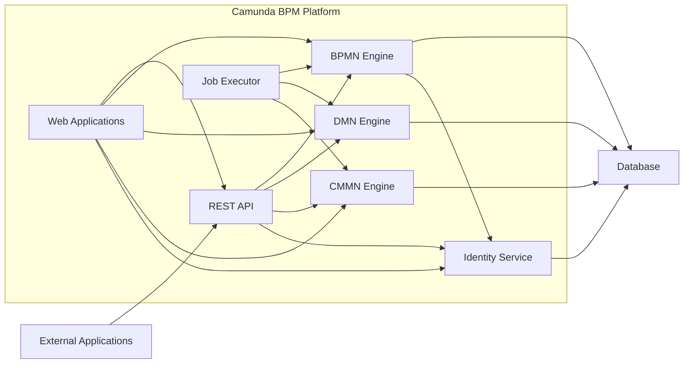

## Project Design Document: Camunda BPM Platform

**1. Introduction**

This document provides a detailed architectural design of the Camunda BPM Platform, based on the open-source project available at [https://github.com/camunda/camunda-bpm-platform](https://github.com/camunda/camunda-bpm-platform). This document serves as a foundation for subsequent threat modeling activities. It outlines the key components, their interactions, and the overall system architecture.

**2. System Overview**

The Camunda BPM Platform is a Java-based framework for workflow and decision automation. It allows developers and business users to model, automate, and execute business processes and decisions. The platform consists of several core components that work together to provide this functionality.

**3. Core Components**

*   **BPMN Engine:** The central component responsible for executing BPMN 2.0 process definitions. It manages process instances, tasks, and events.
*   **DMN Engine:**  Responsible for evaluating DMN 1.3 decision tables and decision requirements graphs.
*   **CMMN Engine:**  Handles the execution of CMMN 1.1 case definitions.
*   **REST API:** Provides a programmatic interface for interacting with the platform, allowing external applications and services to manage and monitor processes, tasks, and decisions.
*   **Web Applications:** A set of user interfaces for different user roles:
    *   **Cockpit:** For monitoring and operating process instances, tasks, and deployments.
    *   **Tasklist:** For end-users to claim and complete assigned tasks.
    *   **Admin:** For managing users, groups, and system configurations.
    *   **Modeler (embedded):**  Allows users to create and edit BPMN, DMN, and CMMN models directly within the platform.
*   **Database:**  Stores process definitions, process instance data, task information, user and group details, and other platform metadata.
*   **Job Executor:**  Asynchronously executes background tasks, such as timers, message events, and asynchronous service tasks.
*   **Identity Service:** Manages users, groups, and their authentication and authorization.

**4. Architectural Diagram**

**5. Component Interactions and Data Flow**

*   **Process Definition Deployment:**
    *   A user uploads a BPMN, DMN, or CMMN model (via Web Applications or REST API).
    *   The respective engine (BPMN, DMN, or CMMN) parses and validates the model.
    *   The model definition is stored in the Database.
*   **Process Instance Creation:**
    *   An external application or user (via Web Applications or REST API) initiates a new process instance.
    *   The BPMN Engine retrieves the process definition from the Database.
    *   The engine creates a new process instance and stores its state in the Database.
*   **Task Assignment and Completion:**
    *   The BPMN Engine reaches a user task.
    *   Task information is stored in the Database.
    *   Users can view and claim tasks via the Tasklist Web Application.
    *   Upon completion, the Tasklist updates the task status in the Database.
    *   The BPMN Engine proceeds with the process execution.
*   **Decision Evaluation:**
    *   The BPMN Engine encounters a Business Rule Task.
    *   The DMN Engine retrieves the relevant decision definition from the Database.
    *   Input data is passed to the DMN Engine.
    *   The DMN Engine evaluates the decision and returns the result to the BPMN Engine.
*   **External Service Invocation:**
    *   The BPMN Engine reaches a Service Task.
    *   The Job Executor picks up the asynchronous job.
    *   The Job Executor invokes an external service (configured in the process definition).
    *   The external service performs its operation and may return data.
    *   The Job Executor updates the process instance state in the Database.
*   **User Authentication and Authorization:**
    *   Users attempting to access Web Applications or the REST API are authenticated by the Identity Service.
    *   Authorization checks are performed based on user roles and permissions managed by the Identity Service.

**6. External Integrations**

The Camunda BPM Platform can integrate with various external systems, including:

*   **Databases:**  For storing application data accessed by process instances.
*   **Message Queues (e.g., Kafka, RabbitMQ):** For asynchronous communication with other services.
*   **RESTful Services:** For invoking external business logic.
*   **SOAP Web Services:** For interacting with legacy systems.
*   **LDAP/Active Directory:** For user and group management.
*   **Custom Applications:** Through the REST API or embedded engine.

**7. Deployment Considerations**

The Camunda BPM Platform can be deployed in various environments:

*   **Standalone Server:**  A single instance of the platform running on a dedicated server.
*   **Clustered Environment:** Multiple instances of the platform working together for high availability and scalability.
*   **Embedded in Applications:** The BPMN engine can be embedded directly within a Java application.
*   **Cloud Environments (e.g., AWS, Azure, GCP):** Utilizing cloud services for infrastructure and scalability.

**8. Security Considerations**

*   **Authentication:**  The platform relies on the Identity Service for user authentication. Secure password policies and multi-factor authentication should be considered.
*   **Authorization:** Role-based access control (RBAC) is used to manage user permissions. Proper configuration of roles and permissions is crucial.
*   **Input Validation:**  The platform should validate all input data to prevent injection attacks.
*   **Secure Communication:**  HTTPS should be enforced for all communication with the platform, especially for the REST API and Web Applications.
*   **Data Encryption:** Sensitive data stored in the database should be encrypted at rest and in transit.
*   **Audit Logging:**  The platform should maintain audit logs of significant events for security monitoring and incident response.
*   **Dependency Management:**  Regularly update dependencies to patch known vulnerabilities.
*   **Access Control to Resources:**  Restrict access to the database and configuration files.
*   **Secure Configuration:**  Follow security best practices when configuring the platform and its components.
*   **Protection against Cross-Site Scripting (XSS) and Cross-Site Request Forgery (CSRF):** Implement appropriate security measures in the Web Applications.
*   **API Security:** Secure the REST API using authentication and authorization mechanisms (e.g., OAuth 2.0).

**9. Technology Stack**

*   **Programming Language:** Java
*   **Database:** Relational databases (e.g., PostgreSQL, MySQL, Oracle, H2)
*   **Application Server/Servlet Container:**  (e.g., Tomcat, WildFly, Jetty)
*   **Web Technologies:** HTML, CSS, JavaScript

**10. Future Considerations**

*   Integration with more advanced analytics and monitoring tools.
*   Enhanced support for cloud-native deployments.
*   Further development of the CMMN engine capabilities.

This document provides a comprehensive overview of the Camunda BPM Platform architecture. It serves as a valuable resource for understanding the system's components, interactions, and security considerations, making it suitable for subsequent threat modeling activities.
