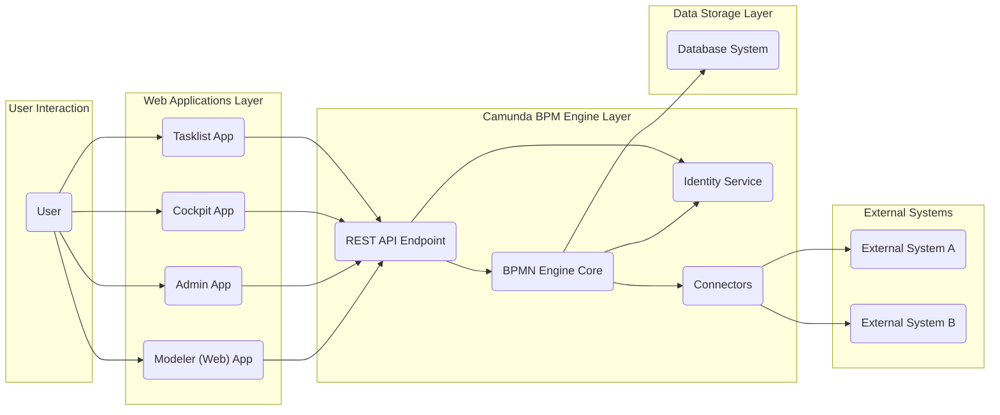
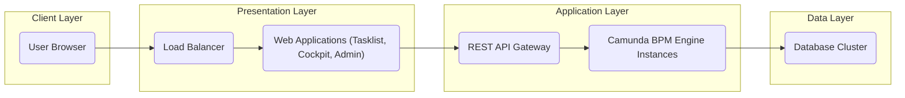

# Project Design Document: Camunda BPM Platform

**Version:** 1.1
**Date:** October 26, 2023
**Author:** AI Software Architect

## 1. Introduction

This document provides a detailed architectural design of the Camunda BPM Platform, an open-source platform for workflow and decision automation. It elaborates on the system's components, their interactions, data flow, deployment considerations, and crucial security aspects. This design serves as a foundational document for subsequent threat modeling activities. The architecture described is based on the open-source Camunda BPM Platform project available at [https://github.com/camunda/camunda-bpm-platform](https://github.com/camunda/camunda-bpm-platform).

## 2. Goals and Objectives

* To present a clear and comprehensive architectural overview of the Camunda BPM Platform.
* To meticulously identify key components, detailing their functionalities and interdependencies.
* To illustrate the data flow within the system, highlighting critical data pathways.
* To emphasize important security considerations relevant to the platform's architecture.
* To serve as a definitive input for future threat modeling exercises.

## 3. Target Audience

* Security architects and engineers responsible for assessing and securing the platform.
* Developers working with, extending, or integrating with the Camunda BPM Platform.
* Operations and infrastructure teams involved in deploying and maintaining the platform.
* Stakeholders requiring a technical understanding of the Camunda BPM Platform's architecture for security analysis.

## 4. High-Level Overview

The Camunda BPM Platform is an open-source solution designed for automating business processes and decisions. It enables users to model, automate, and execute workflows and decision logic. The platform comprises several interconnected core components that collectively deliver this functionality. Key aspects of the platform include:

* **BPMN Engine:** The central runtime environment responsible for interpreting and executing business process definitions.
* **Web Applications Suite:** A set of user interfaces facilitating process modeling, task management, administration, and monitoring.
* **REST API:** A programmatic interface enabling external systems and applications to interact with the engine and other platform components.
* **Persistent Data Store:** A database used to persistently store process definitions, instances, historical data, and platform configurations.
* **Identity and Access Management:** A service responsible for managing users, groups, and their associated permissions within the platform.

## 5. Detailed Design

### 5.1 Core Components

* **BPMN Engine:**
    * **Description:** The heart of the platform, responsible for the lifecycle management of process instances based on BPMN 2.0 diagrams.
    * **Functionality:**
        * **Process Instance Management:** Creation, execution, suspension, resumption, and termination of process instances.
        * **Task Management:** Management of user and service tasks, including assignment, claiming, completion, and delegation.
        * **Event Handling:** Processing of various events such as start, intermediate, and end events, including timer and message events.
        * **Timer Management:** Scheduling and triggering of time-based events within processes.
        * **Message Correlation:** Matching incoming messages to waiting process instances.
        * **Decision Evaluation (DMN):** Execution of decision logic defined using DMN 1.3 models.
        * **External System Integration:** Facilitating communication with external systems through service tasks, message events, and connectors.
    * **Key Interactions:** Interacts directly with the database for persistence, communicates with the Identity Service for authorization checks, and interacts with external systems via configured connectors or custom service tasks.

* **Web Applications:**
    * **Description:** A collection of web-based user interfaces providing different functionalities for various user roles.
    * **Components:**
        * **Cockpit:** Offers operational insights into running processes and decisions, enabling monitoring, troubleshooting, and performance analysis.
        * **Tasklist:** Provides end-users with a personalized view of their assigned tasks, allowing them to complete their work.
        * **Admin:** Enables administrators to manage users, groups, deployments, process definitions, and engine configurations.
        * **Modeler (Web-based):** Facilitates the creation and editing of BPMN and DMN models directly within the web browser (complementary to the desktop Modeler).
    * **Functionality:** Provides user-friendly interfaces for interacting with and managing the BPMN engine and its associated data.
    * **Key Interactions:** Communicates with the BPMN engine primarily through the **REST API**.

* **REST API:**
    * **Description:** A comprehensive RESTful API exposing the core functionalities of the BPMN engine and other platform services.
    * **Functionality:**
        * **Process Instance Operations:** Starting new instances, retrieving instance details, modifying variables, and signaling events.
        * **Task Operations:** Querying tasks, claiming and unclaiming tasks, completing tasks, and managing task variables.
        * **Deployment Management:** Deploying new process and decision definitions.
        * **Querying:**  Retrieving historical process instance and task data.
        * **Identity Management:** Managing users and groups (depending on configuration).
        * **Metrics and Reporting:** Accessing engine metrics and performance data.
    * **Key Interactions:** Serves as the primary interface for communication between the web applications, external applications, scripts, and the BPMN engine.

* **Database:**
    * **Description:** A relational database system used for the persistent storage of all platform-related data.
    * **Data Stored:**
        * Process definitions (BPMN and DMN XML).
        * State of running process instances (variables, execution history).
        * Details of active and completed tasks.
        * User and group information, including roles and permissions.
        * Deployment metadata.
        * Historical process instance and task data for auditing and reporting.
    * **Supported Databases:**  Supports a range of relational databases, including PostgreSQL, MySQL, MariaDB, Oracle, and H2 (primarily for development and testing).
    * **Key Interactions:** The **BPMN Engine** is the primary component interacting directly with the database for all persistence operations. Other components might access the database indirectly through the engine or specific APIs.

* **Identity Service:**
    * **Description:** Responsible for managing user authentication and authorization within the Camunda BPM Platform.
    * **Functionality:**
        * **User Management:** Creation, modification, and deletion of user accounts.
        * **Group Management:** Creation and management of user groups for role-based access control.
        * **Authentication:** Verifying user credentials (username/password, integration with external identity providers like LDAP or OAuth 2.0).
        * **Authorization:** Determining user permissions for accessing resources and performing actions within the platform.
    * **Key Interactions:** The **BPMN Engine** and **Web Applications** rely on the Identity Service to authenticate users and authorize their access to specific functionalities and data.

* **Event Bus (Optional, for Clustering):**
    * **Description:** In a clustered deployment, an event bus facilitates communication and synchronization between multiple instances of the BPMN Engine.
    * **Examples:** JGroups, Apache Kafka.
    * **Functionality:** Enables consistent state management and coordination across the cluster by distributing events related to process execution and engine state.
    * **Key Interactions:** Used internally by the **BPMN Engine** nodes in a clustered environment to ensure data consistency and coordination.

* **Connectors:**
    * **Description:** Provide a mechanism for seamless integration with external systems and services without requiring custom coding for common integration patterns.
    * **Functionality:**
        * Offer pre-built integrations for popular services and protocols (e.g., REST, SOAP, Email, Apache Kafka).
        * Allow for the development of custom connectors to integrate with specific systems.
    * **Key Interactions:** Invoked by the **BPMN Engine** during process execution to interact with external systems based on their configuration within service tasks or message events.

### 5.2 Data Flow

**Detailed Data Flow Description:**

1. **User Initiates Action:** A user interacts with the platform through one of the **Web Applications**.
2. **Web Application Request:** The **Web Application** sends a request to the **REST API Endpoint** to perform an action (e.g., claim a task, start a process).
3. **REST API Processing:** The **REST API Endpoint** receives the request and routes it to the appropriate component within the **Camunda BPM Engine Layer**. This might involve the **BPMN Engine Core** for process-related actions or the **Identity Service** for authentication/authorization.
4. **Engine Core Logic:** The **BPMN Engine Core** executes the requested action, potentially involving:
    * **Database Interaction:** Reading or writing data to the **Database System** to update process instance state, task details, or historical information.
    * **Identity Service Check:** Verifying user permissions with the **Identity Service** before proceeding with sensitive operations.
    * **Connector Invocation:** If the process definition includes a service task or message event configured with a **Connector**, the engine will invoke the corresponding connector to interact with an **External System**.
5. **Connector Communication:** **Connectors** send requests to and receive responses from **External Systems**.
6. **Response Handling:** The **BPMN Engine Core** processes responses from external systems or database operations.
7. **API Response:** The **REST API Endpoint** sends a response back to the originating **Web Application**.
8. **User Interface Update:** The **Web Application** updates the user interface based on the received response.

## 6. Security Considerations

This section outlines key security considerations for the Camunda BPM Platform. These points will serve as a basis for a more detailed threat model.

* **Authentication Mechanisms:**
    * Secure authentication is crucial to verify the identity of users accessing the platform.
    * Camunda supports username/password authentication and integration with external identity providers (LDAP, Active Directory) via plugins.
    * Consider implementing multi-factor authentication for enhanced security.
    * Secure storage and handling of user credentials are paramount.

* **Authorization and Access Control:**
    * Fine-grained authorization controls are necessary to restrict access to sensitive resources and functionalities.
    * Camunda's authorization framework allows defining permissions based on users, groups, and resource types (e.g., process definitions, deployments, tasks).
    * Properly configuring authorization rules is essential to prevent unauthorized access and actions.

* **Data Protection at Rest and in Transit:**
    * Sensitive data stored in the **Database System** should be encrypted at rest using database-level encryption features.
    * All communication between components, especially between the client and server, should be encrypted using HTTPS to protect data in transit.
    * Consider encryption for sensitive data stored in process variables.

* **Input Validation and Output Encoding:**
    * Implement robust input validation on all data received from users and external systems to prevent injection attacks (e.g., SQL injection, Cross-Site Scripting - XSS).
    * Encode output data appropriately to mitigate XSS vulnerabilities.

* **Secure Configuration Practices:**
    * Review and harden default configurations for all components, including the application server and database.
    * Disable unnecessary services and features to reduce the attack surface.
    * Enforce strong password policies for administrative accounts.

* **Dependency Management and Vulnerability Scanning:**
    * Regularly update dependencies (libraries and frameworks) to patch known vulnerabilities.
    * Implement a process for scanning dependencies for security vulnerabilities and addressing identified risks.

* **Logging and Auditing:**
    * Enable comprehensive logging of security-relevant events, including authentication attempts, authorization failures, and administrative actions.
    * Securely store and protect audit logs from unauthorized access and modification.

* **API Security Best Practices:**
    * Secure the **REST API Endpoint** using appropriate authentication and authorization mechanisms (e.g., OAuth 2.0 for external integrations).
    * Implement rate limiting and other protective measures to prevent API abuse.
    * Follow secure API design principles.

* **Connector Security:**
    * Ensure secure communication between **Connectors** and external systems, using appropriate protocols and authentication methods.
    * Validate the security posture of external systems integrated with Camunda.

* **Security Headers:**
    * Configure appropriate security headers (e.g., Content Security Policy, HTTP Strict Transport Security) in the web server to protect against common web attacks.

## 7. Deployment Architecture

The Camunda BPM Platform offers flexible deployment options to suit various needs and environments:

* **Standalone Deployment:** All components (engine, web applications, database) are deployed on a single server instance. Suitable for development, testing, and small-scale deployments.
* **Clustered Deployment:** Multiple instances of the BPMN Engine are deployed across several servers, providing high availability and scalability. Requires an **Event Bus** for inter-node communication and coordination. The web applications and database can also be clustered for increased resilience.
* **Containerized Deployment (Docker, Kubernetes):**  Deployment using containerization technologies like Docker and orchestration platforms like Kubernetes for efficient resource management, scalability, and portability.
* **Cloud-Based Deployment:** Leveraging cloud platforms (AWS, Azure, GCP) and their managed services for infrastructure, databases, and potentially container orchestration.

A typical multi-tier deployment architecture involves the following layers:

* **Presentation Layer:**  Consists of the **Web Applications** accessed by end-users through web browsers. Often behind a load balancer.
* **Application Layer:** Houses the **REST API Endpoint** and the **BPMN Engine Core**, responsible for processing business logic and API requests.
* **Data Layer:**  Comprises the **Database System** responsible for persistent data storage.

## 8. Technology Stack

* **Core Language:** Java
* **Core Framework:** Spring Framework
* **Web UI Technologies:** HTML, CSS, JavaScript (various frameworks used within the web applications)
* **REST API Implementation:** JAX-RS (Jersey implementation)
* **Database Support:**  Relational databases (PostgreSQL, MySQL, MariaDB, Oracle, H2)
* **Application Server/Runtime:** Can be deployed on traditional application servers (Tomcat, WildFly) or as a standalone Spring Boot application with an embedded server.
* **Modeling Standards:** BPMN 2.0, DMN 1.3

## 9. Assumptions and Constraints

* This design document primarily focuses on the open-source Camunda BPM Platform. Features specific to the Enterprise Edition are not explicitly detailed.
* The scope is limited to the core platform components and their interactions. Specific business process definitions and custom integrations are outside the scope.
* Security considerations are presented at an architectural level and will be further elaborated upon during the threat modeling process.
* The deployment architecture examples are general representations; specific deployment configurations may vary based on organizational requirements.

## 10. Future Considerations

* **Evolution towards Microservices:** Potential decomposition of the platform into a more granular microservices architecture for increased scalability and resilience.
* **Enhanced Cloud-Native Capabilities:** Further optimization for deployment and operation in cloud environments, leveraging serverless technologies and managed services.
* **Advanced Security Integrations:**  Deeper integration with security information and event management (SIEM) systems, vulnerability scanning tools, and identity providers.
* **Improved Observability and Monitoring:**  Enhancements to monitoring and logging capabilities for better insights into platform performance and health.
* **Integration with Emerging Technologies:**  Potential integration with technologies like AI/ML for intelligent process automation.
