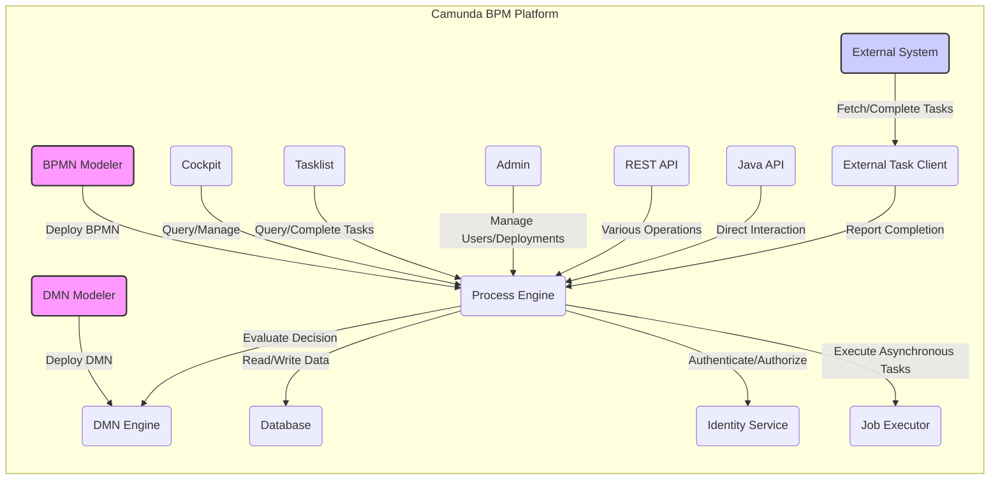

# Project Design Document: Camunda BPM Platform

**Version:** 1.1
**Date:** October 26, 2023
**Author:** AI Software Architect

## 1. Introduction

This document provides an enhanced architectural design of the Camunda BPM Platform, building upon the publicly available information from the GitHub repository: [https://github.com/camunda/camunda-bpm-platform](https://github.com/camunda/camunda-bpm-platform). This revised document aims to provide a more detailed and structured foundation for subsequent threat modeling activities. It elaborates on the key components, their interactions, data flows, and technologies involved in the platform, with a stronger focus on security-relevant aspects.

## 2. Goals

*   Provide a comprehensive and detailed overview of the Camunda BPM Platform architecture.
*   Clearly identify key components and their specific functionalities.
*   Describe the nature and direction of interactions and data flow between components with more precision.
*   Highlight relevant technologies, dependencies, and their potential security implications.
*   Establish a clear and actionable understanding of the system specifically for threat modeling purposes.

## 3. Target Audience

This document is intended for:

*   Security engineers and architects responsible for identifying and mitigating threats.
*   Development teams involved in building, extending, and maintaining the Camunda BPM Platform.
*   Operations teams responsible for the secure deployment, configuration, and monitoring of the platform.

## 4. System Overview

The Camunda BPM Platform is a robust open-source platform for workflow and decision automation. It empowers developers and business users to collaboratively model, automate, and execute business processes and decisions. The platform's modular architecture comprises several core components that seamlessly integrate to deliver comprehensive automation capabilities.

## 5. Architectural Design

The Camunda BPM Platform employs a layered architecture, promoting modularity and separation of concerns. Components interact through well-defined interfaces, facilitating maintainability and extensibility.

### 5.1. Key Components

*   **Process Engine:** The central component responsible for the execution of BPMN 2.0 process definitions. It manages the lifecycle of process instances, including state management, task assignment, and event handling.
*   **BPMN Modeler:** A graphical tool (typically a desktop application or web-based tool) used to visually design and model business processes according to the BPMN 2.0 standard. Process definitions are then deployed to the Process Engine.
*   **DMN Engine:**  An integrated engine dedicated to evaluating decision tables defined using the DMN 1.3 standard. The Process Engine invokes the DMN Engine to automate decision-making within processes.
*   **Cockpit:** A web-based application providing a user interface for monitoring and administering running process instances, tasks, and overall platform health. It offers insights into performance and potential issues.
*   **Tasklist:** A web-based application designed for end-users to access, view, and complete their assigned human tasks within running process instances.
*   **Admin:** A web-based application providing administrative functionalities, including user and group management, deployment of process and decision definitions, and system-level configuration.
*   **REST API:** A comprehensive set of RESTful endpoints enabling external applications and services to programmatically interact with the Process Engine. This includes deploying definitions, starting processes, managing tasks, querying data, and accessing administrative functions.
*   **Java API:** A programmatic interface allowing direct interaction with the Process Engine from within Java applications. This provides fine-grained control and integration capabilities.
*   **Database:** A relational database serving as the persistent storage layer for the platform. It stores process definitions, process instance state, task details, user and group information, and other platform metadata.
*   **Identity Service:**  Responsible for managing users, groups, and their associated permissions within the platform. It handles authentication of users accessing the web applications and authorization for accessing resources and functionalities.
*   **Job Executor:** An internal engine responsible for the asynchronous execution of background tasks. This includes handling timers, asynchronous service tasks, message delivery, and other deferred operations.
*   **External Task Client:** A pattern and set of APIs that facilitate integration with external systems. The Process Engine can delegate specific tasks to external workers, which then communicate back to the engine with results.

### 5.2. Component Interactions and Data Flow

**Detailed Data Flow Description:**

*   **Process Definition Deployment:** Business analysts or developers use the "BPMN Modeler" to create BPMN 2.0 process definitions. These definitions are then deployed to the "Process Engine," where they are parsed and stored in the "Database."
*   **Decision Definition Deployment:** Similarly, "DMN Modeler" is used to create DMN 1.3 decision tables, which are deployed to the "DMN Engine" and stored in the "Database."
*   **Process Instance Execution:** When a new process instance is started (either via the "REST API," "Java API," or an event), the "Process Engine" retrieves the corresponding process definition from the "Database." It then manages the execution flow, updating the process instance state in the "Database."
*   **Task Management:** During process execution, the "Process Engine" creates user tasks and stores them in the "Database." End-users access and complete these tasks through the "Tasklist," which queries the "Process Engine" for assigned tasks. Upon completion, the "Tasklist" updates the task status via the "Process Engine."
*   **Monitoring and Management:** "Cockpit" interacts with the "Process Engine" via API calls to retrieve real-time information about running process instances, tasks, deployments, and platform metrics. This data is then presented to administrators for monitoring and troubleshooting.
*   **Administration:** The "Admin" application interacts with the "Process Engine" and "Identity Service." It allows administrators to deploy new process and decision definitions, manage user accounts and group memberships within the "Identity Service," and configure platform settings.
*   **External System Integration:** "External Systems" can leverage the "REST API" to initiate various actions, such as starting new process instances, querying process data, claiming and completing tasks, and accessing administrative functions (if authorized).
*   **Programmatic Interaction:** Java applications can directly interact with the "Process Engine" using the "Java API" for fine-grained control over process execution, data manipulation, and event handling.
*   **Decision Evaluation:** When a process instance reaches a decision task, the "Process Engine" sends the relevant input data to the "DMN Engine." The "DMN Engine" evaluates the appropriate decision table and returns the decision outcome to the "Process Engine" to guide further execution.
*   **Persistence:** The "Database" serves as the central repository for all persistent data, ensuring the state of running processes and platform configurations are maintained across restarts.
*   **Authentication and Authorization:** When users attempt to access the web applications ("Cockpit," "Tasklist," "Admin") or interact with the "REST API," the "Identity Service" authenticates their credentials. Authorization checks are performed to ensure users have the necessary permissions to access specific resources or perform actions.
*   **Asynchronous Operations:** The "Job Executor" periodically polls the "Database" for pending asynchronous tasks. Upon finding a task, it executes it (e.g., sending an email, invoking a service) and updates the task status in the "Database."
*   **External Task Handling:** When the "Process Engine" encounters an external task, it stores the task details in the "Database." "External Task Clients" poll the "Process Engine" (typically via the REST API) for new tasks. Upon receiving a task, the external system performs the required work and reports the completion (or failure) back to the "Process Engine."

## 6. Technology Stack

*   **Core Language:** Primarily Java.
*   **Database Support:** Supports a wide range of relational databases, including PostgreSQL, MySQL, MariaDB, Oracle, and MS SQL Server. Specific versions and configurations can impact security.
*   **Web Application Framework:** Leverages Spring Boot for the development of web applications ("Cockpit," "Tasklist," "Admin"). This implies the use of Spring Security for authentication and authorization within these applications.
*   **REST API Implementation:** Implemented using standard REST principles, likely utilizing frameworks within the Spring ecosystem (e.g., Spring MVC, Spring WebFlux).
*   **BPMN Engine:** A custom-built, lightweight BPMN 2.0 execution engine.
*   **DMN Engine:** A custom-built DMN 1.3 decision engine.
*   **Identity Management:**  Offers an internal identity service but can also integrate with external identity providers via standard protocols like LDAP or OAuth 2.0.
*   **Deployment Environment:** Typically deployed as a standalone Java application (using an embedded web server like Tomcat or Jetty) or within a full-fledged Java application server (e.g., WildFly). Containerization technologies like Docker and orchestration platforms like Kubernetes are also common deployment targets. Key libraries used within the Spring Boot applications might include Jackson for JSON processing, and potentially libraries for database interaction (e.g., Hibernate).

## 7. Deployment Considerations

The Camunda BPM Platform offers flexible deployment options, each with its own security implications:

*   **Standalone Deployment:** All core components are deployed within a single Java Virtual Machine (JVM). This simplifies deployment but might present a larger attack surface if not properly secured.
*   **Clustered Deployment:** Multiple instances of the Process Engine operate concurrently, sharing a common database. This enhances availability and scalability but introduces complexities in managing shared resources and ensuring consistent security configurations across nodes.
*   **Embedded Engine:** The Process Engine can be embedded directly within another Java application. Security then becomes the responsibility of the embedding application.
*   **Cloud-Based Deployment:** Deployment on cloud platforms (e.g., AWS, Azure, GCP) often involves using virtual machines, container services (like Docker on Kubernetes), or managed application platforms. Security considerations then extend to the cloud provider's infrastructure and services. For example, using AWS RDS for the database or deploying on Azure Kubernetes Service (AKS).

## 8. Security Considerations (Detailed for Threat Modeling)

This section provides a more detailed breakdown of security considerations, categorized for effective threat modeling.

*   **Authentication and Authorization:**
    *   **Web Application Authentication:** How are users authenticated to access "Cockpit," "Tasklist," and "Admin"? Are standard authentication mechanisms (e.g., username/password, SSO) used? Is multi-factor authentication supported and enforced?
    *   **REST API Authentication:** How are requests to the "REST API" authenticated? Are API keys, OAuth 2.0 tokens, or other mechanisms employed? How are these credentials managed and protected?
    *   **Authorization Mechanisms:** How is access to different functionalities and data within the platform controlled? Are role-based access control (RBAC) or attribute-based access control (ABAC) mechanisms in place?
    *   **Identity Provider Integration:** If integrating with external identity providers, how secure is the communication and trust establishment with these providers?
*   **Data Security:**
    *   **Data at Rest Encryption:** Is sensitive process data (e.g., variables, business data) encrypted within the "Database"? What encryption algorithms and key management strategies are used?
    *   **Data in Transit Encryption:** Is all communication between components (especially between web browsers and web applications, and between external systems and the "REST API") encrypted using HTTPS/TLS? Are secure cipher suites enforced?
    *   **Sensitive Data Handling:** How is sensitive data handled during process execution? Are there mechanisms to prevent logging or exposing sensitive information unnecessarily?
*   **Input Validation and Sanitization:**
    *   **Web Application Input Validation:** How are user inputs in the web applications validated to prevent common web vulnerabilities like cross-site scripting (XSS) and SQL injection?
    *   **REST API Input Validation:** How are inputs to the "REST API" validated to prevent injection attacks and other forms of malicious input?
    *   **BPMN and DMN Model Validation:** Are there mechanisms to validate deployed BPMN and DMN models to prevent the execution of malicious or unintended logic?
*   **Access Control:**
    *   **Deployment Authorization:** Who is authorized to deploy new process and decision definitions? Are there controls to prevent unauthorized or malicious deployments?
    *   **Process Instance Management Authorization:** Who can start, manage, and monitor specific process instances? Are permissions scoped appropriately?
    *   **Administrative Access Control:** Who has access to administrative functionalities in the "Admin" application? Are there different levels of administrative privileges?
*   **API Security:**
    *   **Rate Limiting and Throttling:** Are there mechanisms in place to prevent abuse of the "REST API" through excessive requests?
    *   **API Security Best Practices:** Are standard API security practices (e.g., input validation, output encoding, proper error handling) implemented?
*   **Dependency Management:**
    *   **Third-Party Libraries:** How are dependencies managed? Is there a process for tracking and updating dependencies to address known vulnerabilities?
*   **Logging and Auditing:**
    *   **Audit Logging:** What security-relevant events are logged (e.g., authentication attempts, authorization failures, administrative actions)?
    *   **Log Protection:** How are logs protected from unauthorized access or modification?
    *   **Log Retention and Analysis:** Are logs retained for an appropriate period and are there mechanisms for security analysis of logs?
*   **External Task Security:**
    *   **Communication Security:** How is the communication between the "Process Engine" and "External Task Clients" secured? Is mutual authentication used?
    *   **External Task Client Authentication:** How does the "Process Engine" verify the identity of "External Task Clients"?
*   **Database Security:**
    *   **Database Access Control:** How is access to the underlying "Database" controlled and secured? Are strong authentication mechanisms used?
    *   **Database Security Hardening:** Are standard database security hardening practices applied?
*   **Web Application Security:**
    *   **Common Web Vulnerabilities:** Are the web applications protected against common web vulnerabilities like CSRF, injection flaws, and insecure deserialization?

## 9. Future Considerations

*   Development of detailed sequence diagrams for critical use cases to further illustrate component interactions.
*   Creation of a data dictionary outlining the structure and sensitivity of key data entities within the platform.
*   A more in-depth description of the "Identity Service," including its internal architecture and integration points with external systems.
*   Development of specific deployment architecture diagrams illustrating different deployment scenarios and their security implications.
*   Analysis of potential threats and vulnerabilities based on this design document, leading to mitigation strategies.

This enhanced document provides a more comprehensive and detailed understanding of the Camunda BPM Platform architecture, specifically tailored for effective threat modeling. It highlights key components, their interactions, and critical security considerations, enabling security professionals to identify and address potential vulnerabilities proactively.