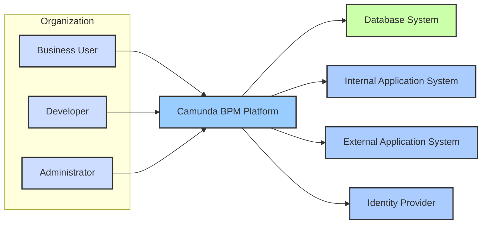
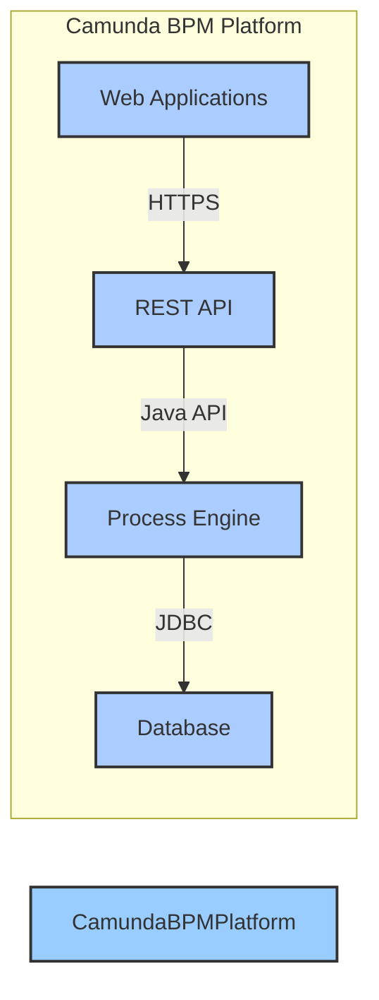
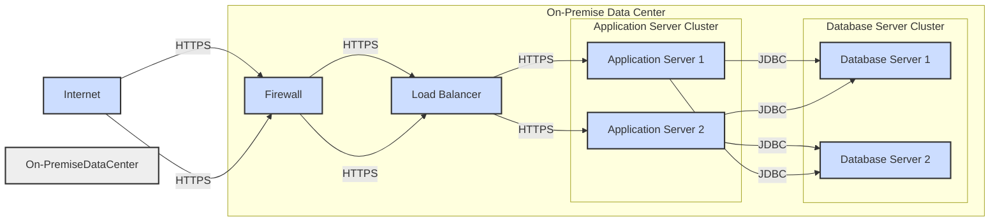
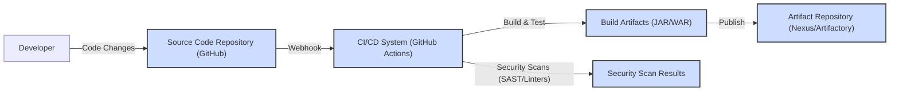

# BUSINESS POSTURE

This project, Camunda BPM Platform, aims to provide a comprehensive platform for Business Process Management (BPM) and workflow automation. It enables organizations to model, automate, and optimize business processes, improving efficiency, transparency, and agility.

Business priorities and goals:
- Automate and streamline business processes to reduce manual effort and operational costs.
- Improve process efficiency and speed up process execution.
- Enhance process visibility and control for better decision-making.
- Increase business agility and responsiveness to changing market conditions.
- Ensure compliance and auditability of business processes.
- Integrate business processes with existing IT systems and applications.

Most important business risks:
- Process automation errors leading to incorrect business outcomes and financial losses.
- Data breaches and unauthorized access to sensitive business process data.
- System downtime and unavailability disrupting critical business operations.
- Compliance violations due to poorly designed or implemented processes.
- Lack of user adoption and resistance to change hindering project success.
- Integration failures with existing systems causing data inconsistencies and operational disruptions.

# SECURITY POSTURE

Existing security controls:
- security control: Secure software development lifecycle (SSDLC) is assumed to be in place, although details are not explicitly provided in the repository. Location: Assumed best practices.
- security control: Access control mechanisms within the Camunda BPM platform to manage user permissions and roles. Location: Camunda BPM Platform documentation.
- security control: Authentication mechanisms to verify user identities. Location: Camunda BPM Platform documentation.
- security control: Authorization mechanisms to control user access to specific functionalities and data. Location: Camunda BPM Platform documentation.
- security control: Encryption of sensitive data at rest and in transit. Location: Camunda BPM Platform documentation.
- security control: Regular security patching and updates for the platform and underlying dependencies. Location: Camunda BPM Platform release notes and update policy.
- security control: Deployment within secure infrastructure (e.g., corporate network, cloud environment with security groups). Location: Deployment environment configuration.

Accepted risks:
- accepted risk: Potential vulnerabilities in third-party libraries and dependencies. Mitigation: Dependency scanning and regular updates.
- accepted risk: Configuration errors leading to security misconfigurations. Mitigation: Security hardening guidelines and automated configuration checks.
- accepted risk: Insider threats with privileged access to the platform. Mitigation: Role-based access control, audit logging, and security awareness training.
- accepted risk: Denial-of-service attacks targeting the platform's availability. Mitigation: Infrastructure security measures, rate limiting, and monitoring.

Recommended security controls:
- security control: Implement automated security scanning (SAST/DAST) in the CI/CD pipeline.
- security control: Conduct regular penetration testing and vulnerability assessments.
- security control: Implement a security incident and event management (SIEM) system for monitoring and alerting.
- security control: Enforce multi-factor authentication (MFA) for administrative and privileged accounts.
- security control: Implement input validation and output encoding to prevent injection attacks.
- security control: Establish a security awareness training program for developers and administrators.

Security requirements:
- Authentication:
  - Requirement: The platform must support secure authentication mechanisms to verify user identities.
  - Requirement: Support for industry-standard authentication protocols like OAuth 2.0, SAML, and OpenID Connect.
  - Requirement: Option for multi-factor authentication (MFA) for enhanced security.
- Authorization:
  - Requirement: Role-based access control (RBAC) to manage user permissions and access to functionalities and data.
  - Requirement: Fine-grained authorization policies to control access to specific process instances, tasks, and data.
  - Requirement: Audit logging of authorization decisions and access attempts.
- Input Validation:
  - Requirement: Robust input validation to prevent injection attacks (e.g., SQL injection, cross-site scripting).
  - Requirement: Validation of all user inputs, including form data, API requests, and file uploads.
  - Requirement: Use of parameterized queries or prepared statements to prevent SQL injection.
- Cryptography:
  - Requirement: Encryption of sensitive data at rest (e.g., database encryption, file system encryption).
  - Requirement: Encryption of sensitive data in transit using TLS/HTTPS for all communication channels.
  - Requirement: Secure storage and management of cryptographic keys.
  - Requirement: Use of strong and up-to-date cryptographic algorithms and protocols.

# DESIGN

## C4 CONTEXT

Context Diagram Elements:

- Element:
  - Name: Business User
  - Type: Person
  - Description: End users who interact with business processes managed by Camunda BPM Platform, typically through web applications or custom interfaces.
  - Responsibilities: Initiate and participate in business processes, complete tasks, and monitor process execution.
  - Security controls: Authentication to access the platform, authorization based on roles to access specific processes and tasks, input validation for data submitted through user interfaces.

- Element:
  - Name: Developer
  - Type: Person
  - Description: Software developers who design, develop, and deploy business processes and integrate Camunda BPM Platform with other systems.
  - Responsibilities: Model business processes, develop process applications, integrate with external systems, and deploy and maintain Camunda BPM Platform components.
  - Security controls: Access control to development environments, code repositories, and deployment pipelines, secure coding practices, and vulnerability scanning of developed applications.

- Element:
  - Name: Administrator
  - Type: Person
  - Description: System administrators who manage and maintain the Camunda BPM Platform infrastructure, including servers, databases, and security configurations.
  - Responsibilities: Install, configure, and monitor Camunda BPM Platform, manage user accounts and permissions, perform backups and recovery, and ensure system security and availability.
  - Security controls: Strong authentication and multi-factor authentication for administrative access, role-based access control to platform administration functionalities, audit logging of administrative actions, and regular security reviews.

- Element:
  - Name: Camunda BPM Platform
  - Type: Software System
  - Description: The central Business Process Management platform responsible for orchestrating and executing business processes. It provides functionalities for process modeling, execution, monitoring, and integration.
  - Responsibilities: Process execution, task management, workflow orchestration, process monitoring, API exposure for integration, and security management for process data and access.
  - Security controls: Authentication and authorization mechanisms, input validation, data encryption at rest and in transit, audit logging, and security configuration options.

- Element:
  - Name: Database System
  - Type: Database System
  - Description: Relational database system used by Camunda BPM Platform to store process definitions, process instance data, task data, and historical data.
  - Responsibilities: Persistent storage of process data, data integrity, data availability, and secure access to data for Camunda BPM Platform.
  - Security controls: Database access control, database encryption at rest, regular database backups, and vulnerability patching of the database system.

- Element:
  - Name: Internal Application System
  - Type: Software System
  - Description: Other internal applications within the organization that interact with Camunda BPM Platform to initiate processes, receive process updates, or exchange data.
  - Responsibilities: Integration with business processes, data exchange with Camunda BPM Platform, and participation in automated workflows.
  - Security controls: Secure API communication (e.g., HTTPS), authentication and authorization for API access, and input validation for data exchanged with Camunda BPM Platform.

- Element:
  - Name: External Application System
  - Type: Software System
  - Description: External applications or services outside the organization's control that interact with Camunda BPM Platform, such as partner systems or cloud services.
  - Responsibilities: Integration with business processes that extend beyond organizational boundaries, data exchange with Camunda BPM Platform, and participation in cross-organizational workflows.
  - Security controls: Secure API communication (e.g., HTTPS with mutual TLS), strong authentication and authorization mechanisms, data encryption in transit, and careful consideration of data sharing and access policies.

- Element:
  - Name: Identity Provider
  - Type: Software System
  - Description: System responsible for managing user identities and authentication, potentially integrated with Camunda BPM Platform for single sign-on (SSO) and centralized user management.
  - Responsibilities: User authentication, identity management, and providing user identity information to Camunda BPM Platform for authorization.
  - Security controls: Strong authentication mechanisms, secure storage of user credentials, and secure communication protocols for identity federation (e.g., SAML, OAuth 2.0, OpenID Connect).

## C4 CONTAINER

Container Diagram Elements:

- Element:
  - Name: Web Applications
  - Type: Container - Web Application
  - Description: User interfaces for different user roles, such as Camunda Cockpit for monitoring and administration, Camunda Tasklist for user task management, and Camunda Admin for user and group management. Implemented as web applications running in an application server.
  - Responsibilities: Provide user interfaces for interacting with Camunda BPM Platform, user authentication and authorization, and presentation of process data.
  - Security controls: HTTPS for secure communication, session management, input validation, output encoding, and integration with authentication and authorization services provided by the platform.

- Element:
  - Name: REST API
  - Type: Container - Web Application
  - Description: RESTful API exposed by Camunda BPM Platform for programmatic access to platform functionalities, such as process deployment, process instance management, task management, and data retrieval. Implemented as a web application running in an application server.
  - Responsibilities: Provide a programmatic interface for external systems and applications to interact with Camunda BPM Platform, API authentication and authorization, and API request handling.
  - Security controls: HTTPS for secure communication, API authentication (e.g., OAuth 2.0, Basic Auth), API authorization based on roles and permissions, input validation for API requests, and rate limiting to prevent abuse.

- Element:
  - Name: Process Engine
  - Type: Container - Application
  - Description: The core component of Camunda BPM Platform, responsible for executing business processes, managing process state, handling events, and interacting with the database. Implemented as a Java application.
  - Responsibilities: Process execution, workflow orchestration, task management, event handling, transaction management, and interaction with the database.
  - Security controls: Internal access control mechanisms, secure handling of process data, and integration with security services for authentication and authorization.

- Element:
  - Name: Database
  - Type: Container - Database
  - Description: Relational database used to persist process definitions, process instance data, task data, and historical data for Camunda BPM Platform.
  - Responsibilities: Persistent storage of process data, data integrity, data availability, and secure access to data for the Process Engine.
  - Security controls: Database access control, database encryption at rest, regular database backups, and database security hardening.

## DEPLOYMENT

Deployment Architecture Option: On-Premise Deployment

Deployment Diagram Elements (On-Premise Deployment):

- Element:
  - Name: Internet
  - Type: Environment
  - Description: Public internet network from which users access the Camunda BPM Platform.
  - Responsibilities: Public network connectivity.
  - Security controls: None directly, relies on perimeter security controls.

- Element:
  - Name: Firewall
  - Type: Infrastructure - Firewall
  - Description: Network firewall protecting the on-premise data center from external threats.
  - Responsibilities: Network traffic filtering, intrusion prevention, and perimeter security.
  - Security controls: Firewall rules to allow only necessary traffic (e.g., HTTPS on specific ports), intrusion detection and prevention systems (IDS/IPS).

- Element:
  - Name: Load Balancer
  - Type: Infrastructure - Load Balancer
  - Description: Load balancer distributing incoming traffic across multiple application server instances for high availability and scalability.
  - Responsibilities: Traffic distribution, health checks of application servers, and session persistence.
  - Security controls: HTTPS termination, SSL certificate management, and protection against DDoS attacks.

- Element:
  - Name: Application Server 1 & 2
  - Type: Infrastructure - Application Server
  - Description: Instances of application servers (e.g., Tomcat, WildFly) hosting the Camunda BPM Platform web applications and REST API. Deployed in a cluster for high availability.
  - Responsibilities: Running Camunda BPM Platform applications, processing user requests, and interacting with the database.
  - Security controls: Application server hardening, secure configuration, regular patching, and access control to the server instances.

- Element:
  - Name: Database Server 1 & 2
  - Type: Infrastructure - Database Server
  - Description: Instances of database servers (e.g., PostgreSQL, MySQL) hosting the Camunda BPM Platform database. Deployed in a cluster for high availability and data redundancy.
  - Responsibilities: Database management, data storage, data replication, and ensuring data availability and integrity.
  - Security controls: Database server hardening, database access control, database encryption at rest, regular database backups, and database security monitoring.

- Element:
  - Name: On-Premise Data Center
  - Type: Environment
  - Description: Organization's physical data center hosting the Camunda BPM Platform infrastructure.
  - Responsibilities: Physical security, power and cooling, network infrastructure, and overall environment for the platform.
  - Security controls: Physical access control, environmental controls, and physical security measures.

## BUILD

Build Process Description:

The build process for Camunda BPM Platform typically involves the following steps, focusing on security controls:

1. Developer commits code changes to the Source Code Repository (e.g., GitHub).
2. A webhook triggers the CI/CD System (e.g., GitHub Actions, Jenkins) upon code changes.
3. The CI/CD system automatically builds the project, compiles code, and runs unit and integration tests.
4. Security Scans are performed during the build process:
   - Static Application Security Testing (SAST) tools are used to analyze the source code for potential vulnerabilities.
   - Linters are used to enforce code quality and security best practices.
5. Build Artifacts (e.g., JAR or WAR files) are generated if the build and security checks are successful.
6. Security Scan Results are collected and reviewed. Failures can block the build pipeline.
7. Build Artifacts are published to an Artifact Repository (e.g., Nexus, Artifactory) for version control and secure storage.

Build Process Security Controls:

- security control: Secure coding practices are enforced by developers. Location: Developer training and code review process.
- security control: Code reviews are conducted to identify potential security vulnerabilities and code quality issues. Location: Development process.
- security control: Static Application Security Testing (SAST) tools are integrated into the CI/CD pipeline to automatically scan code for vulnerabilities. Location: CI/CD pipeline configuration.
- security control: Linters are used to enforce code quality and security best practices. Location: CI/CD pipeline configuration.
- security control: Automated build process using CI/CD system to ensure consistency and repeatability. Location: CI/CD system configuration.
- security control: Artifact Repository is used to securely store and manage build artifacts with access control. Location: Artifact Repository configuration.
- security control: Vulnerability scanning of dependencies is performed to identify and mitigate risks from third-party libraries. Location: Dependency management tools and CI/CD pipeline.

# RISK ASSESSMENT

Critical business processes:
- Workflow automation for core business operations (e.g., order processing, customer onboarding, claims management).
- Decision automation for critical business decisions (e.g., loan approvals, risk assessments).
- Process monitoring and reporting for business performance management.
- Integration with other critical business systems (e.g., CRM, ERP, core banking systems).

Data sensitivity:
- Business process data: Contains sensitive business information related to processes, tasks, and decisions. Sensitivity level: Confidential.
- User data: User credentials, roles, and permissions. Sensitivity level: Confidential.
- Audit logs: Records of user actions and system events. Sensitivity level: Confidential, Integrity.
- Process definitions: Business process models and rules. Sensitivity level: Confidential, Integrity.

Data types include:
- Personally Identifiable Information (PII) depending on the business processes automated.
- Financial data related to transactions and business operations.
- Proprietary business information and trade secrets embedded in process definitions and data.
- System and application logs containing operational and security-related information.

# QUESTIONS & ASSUMPTIONS

Questions:
- What is the specific deployment environment (on-premise, cloud, hybrid)?
- What are the specific authentication and authorization mechanisms required?
- What are the specific data sensitivity levels for different types of process data?
- Are there any specific compliance requirements (e.g., GDPR, HIPAA, PCI DSS)?
- What are the integration points with other systems in detail?
- What is the expected user base and transaction volume?

Assumptions:
- Assumption: Standard enterprise security practices are desired.
- Assumption: The platform will be deployed in a secure network environment.
- Assumption: HTTPS will be used for all web communication.
- Assumption: A relational database will be used for persistence.
- Assumption: A CI/CD pipeline will be used for build and deployment automation.
- Assumption: Security is a high priority for the project.
- Assumption: The organization has resources to implement recommended security controls.