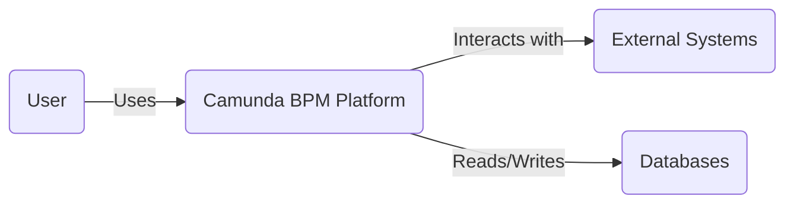
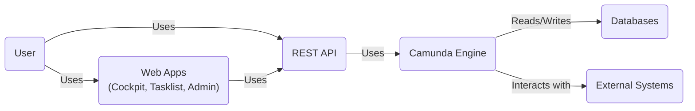
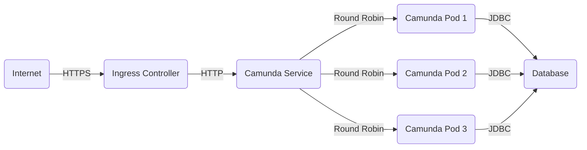
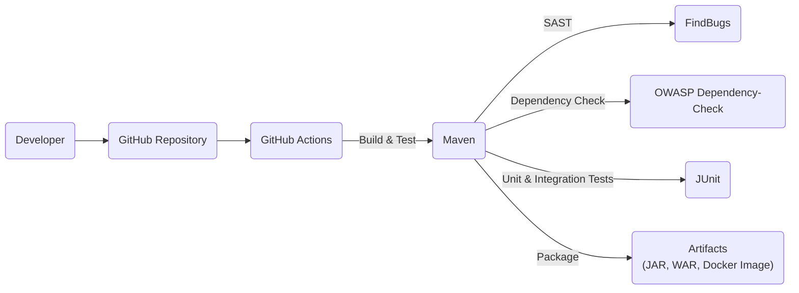

# BUSINESS POSTURE

Camunda BPM is a platform for workflow and decision automation. It's used by businesses to automate core processes, improving efficiency and visibility. Based on the GitHub repository, here's a breakdown of the business posture:

Priorities and Goals:

*   Provide a robust and reliable platform for workflow and decision automation.
*   Offer a flexible and extensible platform that can be adapted to various business needs.
*   Enable developers to easily design, implement, and manage workflows and decisions.
*   Ensure scalability and performance to handle large volumes of transactions.
*   Provide tools for monitoring and analyzing workflow execution.
*   Maintain an active open-source community and ecosystem.

Business Risks:

*   Data breaches or unauthorized access to sensitive business process data.
*   System downtime or performance degradation impacting critical business operations.
*   Incorrect or flawed workflow definitions leading to business errors or compliance violations.
*   Lack of auditability and traceability of workflow executions.
*   Vulnerabilities in the platform or its dependencies that could be exploited by attackers.
*   Difficulty in integrating with existing enterprise systems.
*   Inability to scale to meet growing business demands.

# SECURITY POSTURE

Existing Security Controls:

*   security control: Authentication mechanisms for users and API clients (e.g., HTTP Basic, OAuth 2.0). Described in Camunda documentation and implementation.
*   security control: Authorization framework to control access to resources and operations based on roles and permissions. Described in Camunda documentation and implementation.
*   security control: Encryption of data in transit using TLS/SSL. Described in Camunda documentation and implementation.
*   security control: Input validation to prevent injection attacks (e.g., Cross-Site Scripting, SQL Injection). Described in Camunda documentation and implementation.
*   security control: Audit logging to track user actions and system events. Described in Camunda documentation and implementation.
*   security control: Regular security updates and patches to address vulnerabilities. Described in Camunda documentation and implementation.
*   security control: Secure configuration guidelines and best practices. Described in Camunda documentation.
*   security control: Support for external identity providers (e.g., LDAP, Active Directory). Described in Camunda documentation and implementation.

Accepted Risks:

*   accepted risk: The platform relies on the security of the underlying infrastructure (e.g., operating system, database, network).
*   accepted risk: The security of custom scripts and extensions developed by users is the responsibility of the users.
*   accepted risk: The platform may be vulnerable to denial-of-service attacks if not properly configured and protected.

Recommended Security Controls:

*   Implement a robust secrets management solution to securely store and manage sensitive configuration data (e.g., API keys, passwords).
*   Integrate with a centralized security information and event management (SIEM) system for real-time threat detection and response.
*   Implement network segmentation to isolate the platform from other systems and limit the impact of potential breaches.
*   Conduct regular penetration testing and vulnerability assessments to identify and address security weaknesses.
*   Implement a web application firewall (WAF) to protect against common web-based attacks.

Security Requirements:

*   Authentication:
    *   Support for multi-factor authentication (MFA).
    *   Strong password policies and enforcement.
    *   Secure session management with appropriate timeouts.
    *   Protection against brute-force attacks.
*   Authorization:
    *   Fine-grained access control based on roles and permissions.
    *   Principle of least privilege.
    *   Regular review and auditing of user permissions.
*   Input Validation:
    *   Strict validation of all user inputs to prevent injection attacks.
    *   Encoding of output data to prevent cross-site scripting (XSS).
    *   Protection against other common web vulnerabilities (e.g., CSRF, SQL Injection).
*   Cryptography:
    *   Use of strong, industry-standard cryptographic algorithms.
    *   Secure key management practices.
    *   Encryption of sensitive data at rest.
*   Auditing:
    *   Comprehensive audit logging of all security-relevant events.
    *   Secure storage and protection of audit logs.
    *   Regular review and analysis of audit logs.

# DESIGN

## C4 CONTEXT

Element Descriptions:

*   Element:
    *   Name: User
    *   Type: Person
    *   Description: A human user who interacts with the Camunda BPM Platform.
    *   Responsibilities: Designing, deploying, managing, and executing workflows and decisions.
    *   Security controls: Authentication, Authorization, MFA.

*   Element:
    *   Name: Camunda BPM Platform
    *   Type: Software System
    *   Description: The core system for workflow and decision automation.
    *   Responsibilities: Executing workflows and decisions, managing process instances, providing APIs for interaction.
    *   Security controls: Authentication, Authorization, Input Validation, Encryption, Audit Logging.

*   Element:
    *   Name: External Systems
    *   Type: Software System
    *   Description: Other systems that the Camunda BPM Platform interacts with (e.g., CRM, ERP, microservices).
    *   Responsibilities: Providing data or services to the Camunda BPM Platform, receiving data or requests from the Camunda BPM Platform.
    *   Security controls: Secure communication channels (e.g., TLS/SSL), API authentication and authorization.

*   Element:
    *   Name: Databases
    *   Type: Software System
    *   Description: Databases used by the Camunda BPM Platform to store process definitions, instance data, and other information.
    *   Responsibilities: Persisting data for the Camunda BPM Platform.
    *   Security controls: Database security best practices, encryption at rest, access control.

## C4 CONTAINER

Element Descriptions:

*   Element:
    *   Name: User
    *   Type: Person
    *   Description: A human user who interacts with the Camunda BPM Platform.
    *   Responsibilities: Designing, deploying, managing, and executing workflows and decisions.
    *   Security controls: Authentication, Authorization, MFA.

*   Element:
    *   Name: Camunda Engine
    *   Type: Container
    *   Description: The core component responsible for executing BPMN 2.0 workflows and DMN 1.3 decisions.
    *   Responsibilities: Parsing process definitions, managing process instances, executing tasks, handling events.
    *   Security controls: Input validation, secure execution of scripts and expressions.

*   Element:
    *   Name: REST API
    *   Type: Container
    *   Description: Provides a RESTful interface for interacting with the Camunda Engine.
    *   Responsibilities: Exposing engine functionality to external clients, handling API requests, managing authentication and authorization.
    *   Security controls: Authentication, Authorization, Input Validation, Rate Limiting.

*   Element:
    *   Name: Web Apps (Cockpit, Tasklist, Admin)
    *   Type: Container
    *   Description: Web-based applications for monitoring, managing, and interacting with workflows and tasks.
    *   Responsibilities: Providing user interfaces for process monitoring, task management, and system administration.
    *   Security controls: Authentication, Authorization, Input Validation, XSS Protection, CSRF Protection.

*   Element:
    *   Name: External Systems
    *   Type: Software System
    *   Description: Other systems that the Camunda BPM Platform interacts with.
    *   Responsibilities: Providing data or services, receiving data or requests.
    *   Security controls: Secure communication channels, API authentication and authorization.

*   Element:
    *   Name: Databases
    *   Type: Container
    *   Description: Databases used to store process definitions, instance data, and other information.
    *   Responsibilities: Persisting data.
    *   Security controls: Database security best practices, encryption at rest, access control.

## DEPLOYMENT

Camunda BPM Platform can be deployed in various ways, including:

1.  Embedded Engine: The Camunda Engine can be embedded within a custom Java application.
2.  Standalone Server: The Camunda Engine can be deployed as a standalone server (e.g., using Tomcat, WildFly, or Spring Boot).
3.  Docker Container: The Camunda Engine can be deployed as a Docker container.
4.  Kubernetes: The Camunda Engine can be deployed to a Kubernetes cluster.

Chosen Deployment Solution (Kubernetes):

Element Descriptions:

*   Element:
    *   Name: Internet
    *   Type: Infrastructure Node
    *   Description: The public internet.
    *   Responsibilities: Providing access to the Camunda BPM Platform.
    *   Security controls: Firewall, Intrusion Detection/Prevention System.

*   Element:
    *   Name: Ingress Controller
    *   Type: Infrastructure Node
    *   Description: Manages external access to the services in the Kubernetes cluster.
    *   Responsibilities: Routing incoming traffic to the appropriate services.
    *   Security controls: TLS termination, SSL certificates, access control rules.

*   Element:
    *   Name: Camunda Service
    *   Type: Kubernetes Service
    *   Description: A Kubernetes Service that exposes the Camunda BPM Platform pods.
    *   Responsibilities: Providing a stable IP address and DNS name for accessing the Camunda BPM Platform.
    *   Security controls: Network policies.

*   Element:
    *   Name: Camunda Pod 1, Camunda Pod 2, Camunda Pod 3
    *   Type: Kubernetes Pod
    *   Description: Pods running instances of the Camunda BPM Platform.
    *   Responsibilities: Executing workflows and decisions.
    *   Security controls: Container security best practices, resource limits, security context.

*   Element:
    *   Name: Database
    *   Type: Infrastructure Node
    *   Description: The database used by the Camunda BPM Platform.
    *   Responsibilities: Persisting data.
    *   Security controls: Database security best practices, encryption at rest, access control, firewall.

## BUILD

The Camunda BPM Platform build process involves multiple steps, from source code to deployable artifacts. The process is automated using Maven and involves several security checks.

Build Process Description:

1.  Developer commits code to the GitHub repository.
2.  GitHub Actions triggers a build workflow.
3.  Maven is used to manage dependencies, compile code, run tests, and package the application.
4.  Security checks are performed during the build process:
    *   Static Application Security Testing (SAST) using FindBugs to identify potential vulnerabilities in the code.
    *   Dependency checking using OWASP Dependency-Check to identify known vulnerabilities in third-party libraries.
    *   Unit and integration tests using JUnit to ensure code quality and functionality.
5.  Build artifacts (JAR, WAR, Docker Image) are created.

Security Controls in Build Process:

*   security control: SAST (FindBugs).
*   security control: Dependency checking (OWASP Dependency-Check).
*   security control: Automated build and test process (GitHub Actions, Maven).
*   security control: Code reviews and pull requests.

# RISK ASSESSMENT

Critical Business Processes:

*   Workflow and decision automation: The core business process is the automation of workflows and decisions, which directly impacts operational efficiency and business outcomes.
*   Process instance management: Managing the lifecycle of process instances is critical for ensuring that workflows are executed correctly and completely.
*   Task management: Assigning and managing tasks to users is essential for ensuring that work is completed in a timely manner.
*   Reporting and analytics: Monitoring and analyzing workflow execution data is important for identifying bottlenecks, optimizing processes, and making informed business decisions.

Data Sensitivity:

*   Process definitions: Contain the logic of business processes, which may be confidential or proprietary. Sensitivity: Medium to High.
*   Process instance data: Includes data related to specific workflow executions, which may contain sensitive business information or personal data. Sensitivity: Medium to High.
*   User data: Includes information about users of the platform, such as usernames, roles, and permissions. Sensitivity: Medium.
*   Audit logs: Contain a record of user actions and system events, which may be sensitive from a security and compliance perspective. Sensitivity: Medium.

# QUESTIONS & ASSUMPTIONS

Questions:

*   What are the specific compliance requirements (e.g., GDPR, HIPAA, PCI DSS) that the platform must adhere to?
*   What are the expected performance and scalability requirements for the platform?
*   What are the existing security policies and procedures of the organization?
*   What is the level of security expertise within the development and operations teams?
*   What is the budget allocated for security controls and tools?

Assumptions:

*   BUSINESS POSTURE: The organization prioritizes the security and reliability of the Camunda BPM Platform.
*   SECURITY POSTURE: The organization has a basic understanding of security best practices and is willing to invest in security measures.
*   DESIGN: The platform will be deployed in a secure environment with appropriate network segmentation and access controls. The underlying infrastructure (operating system, database, network) is secured according to industry best practices.