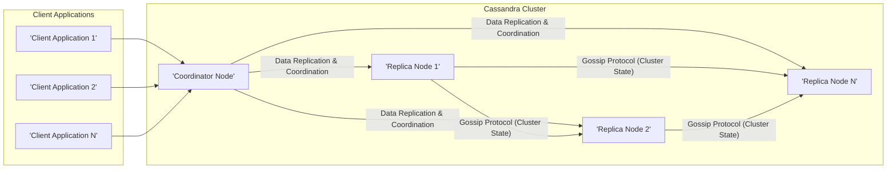
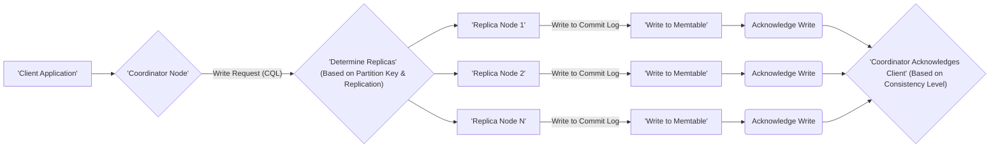
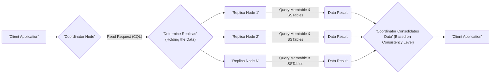

# Project Design Document: Apache Cassandra (Improved)

**Version:** 1.1
**Date:** October 26, 2023
**Author:** AI Software Architect

## 1. Introduction

This document provides an enhanced architectural overview of Apache Cassandra, a highly scalable and available NoSQL distributed database management system. This design document is specifically tailored to serve as a comprehensive foundation for subsequent threat modeling activities. It meticulously outlines the key components, data flow, and interactions within a Cassandra cluster, with a particular emphasis on identifying potential areas of interest for security analysis. This document is based on the information available in the official Apache Cassandra repository: [https://github.com/apache/cassandra](https://github.com/apache/cassandra). The intended audience includes security engineers, architects, and developers involved in securing Cassandra deployments.

## 2. System Overview

Apache Cassandra is a distributed, wide-column store NoSQL database engineered to manage vast datasets across numerous commodity servers. Its core design principles prioritize high availability and fault tolerance, eliminating single points of failure. The decentralized, peer-to-peer architecture enables linear scalability and inherent resilience, making it suitable for mission-critical applications.

## 3. High-Level Architecture

*   **Client Applications:** External applications that initiate interactions with the Cassandra cluster to perform data read and write operations. These applications communicate using the Cassandra Query Language (CQL).
*   **Cassandra Cluster:** A self-organizing collection of interconnected nodes that collectively provide data storage and management. The cluster operates without a central master node.
*   **Coordinator Node:** A Cassandra node that acts as the initial point of contact for client requests. Any node within the cluster can serve as a coordinator. The coordinator is responsible for routing requests and coordinating operations across the relevant replica nodes.
*   **Replica Nodes:** Cassandra nodes responsible for storing copies (replicas) of data partitions. The number of replicas is configurable and determines the fault tolerance of the system.
*   **Gossip Protocol:** A peer-to-peer communication protocol employed by Cassandra nodes to disseminate information about the cluster's state, including node availability, location, and schema details. This protocol is crucial for maintaining a consistent view of the cluster.

## 4. Detailed System Architecture

A single Cassandra node is composed of several critical components, each playing a vital role in its functionality and security:

*   **Client Interface (CQL Endpoint):**
    *   Provides the Cassandra Query Language (CQL) interface for client interactions.
    *   Handles client connection requests and manages sessions.
    *   Enforces configured authentication mechanisms (e.g., internal authentication, Kerberos, LDAP).
    *   Applies authorization rules based on roles and permissions to control access to keyspaces and tables. **Security Implication:** This is a primary entry point for potential unauthorized access and injection attacks.

*   **Request Coordinator:**
    *   Serves as the initial handler for incoming client requests.
    *   Parses CQL queries and determines the nodes responsible for the requested data based on the partition key and the configured replication strategy.
    *   For write operations, it forwards data to the appropriate replica nodes.
    *   For read operations, it queries the necessary replica nodes and consolidates the results based on the requested consistency level. **Security Implication:**  Vulnerabilities here could lead to data manipulation or information disclosure.

*   **Gossip:**
    *   Implements the gossip protocol for inter-node communication.
    *   Nodes periodically exchange state information, including their current status, load, and schema versions.
    *   Facilitates cluster membership management and failure detection. **Security Implication:**  Compromise of the gossip protocol could allow an attacker to manipulate cluster membership or disrupt operations.

*   **Storage Engine:**
    *   Manages the persistence of data to disk.
    *   Utilizes a log-structured merge-tree (LSM-tree) architecture optimized for write performance.
    *   Supports features like data encryption at rest. **Security Implication:**  Crucial for protecting data confidentiality and integrity.

*   **Commit Log:**
    *   A durable, append-only log that records all write operations before they are applied to memtables.
    *   Ensures data durability and recoverability in the event of node failures. **Security Implication:**  Access control to the commit log is important to prevent tampering with the write history.

*   **Memtable:**
    *   An in-memory data structure where write operations are initially stored.
    *   Data within the memtable is sorted by partition key and clustering columns.
    *   Multiple memtables can exist for a given table.

*   **SSTable (Sorted String Table):**
    *   Immutable files stored on disk that contain sorted data.
    *   Organized by partition key and clustering columns, enabling efficient data retrieval.
    *   Multiple SSTables may exist for a single table, representing different points in time. **Security Implication:**  Proper file system permissions are essential to protect SSTable data.

*   **Compaction:**
    *   A background process that merges and optimizes SSTables.
    *   Reduces the number of SSTables, reclaims disk space, and improves read performance.
    *   Can involve merging, sorting, and filtering data, including tombstone removal.

*   **Bloom Filters:**
    *   Probabilistic data structures used to quickly determine if an SSTable *might* contain a specific row before performing disk I/O.
    *   Reduces unnecessary disk access and improves read latency.

*   **Caching:**
    *   Cassandra employs various caching mechanisms to enhance read performance.
    *   **Key Cache:** Stores the location of partition keys within SSTables.
    *   **Row Cache:** Stores frequently accessed rows in memory. **Security Implication:**  Consider the sensitivity of data stored in caches and potential for cache poisoning attacks.

*   **Hinted Handoff:**
    *   A mechanism to ensure write availability when a replica node is temporarily unavailable.
    *   The coordinator node stores "hints" (write operations) destined for the unavailable node.
    *   When the unavailable node recovers, the coordinator replays the hints, delivering the missed writes. **Security Implication:**  The hint delivery process should be secured to prevent unauthorized data injection.

*   **Anti-Entropy (Repair):**
    *   A process for ensuring data consistency across all replicas of a partition.
    *   Nodes compare their data and synchronize any discrepancies.
    *   Utilizes Merkle trees to efficiently identify differences between replicas. **Security Implication:**  The repair process should be protected against malicious nodes injecting incorrect data.

*   **JMX Interface:**
    *   Provides a Java Management Extensions (JMX) interface for monitoring and managing the Cassandra node.
    *   Exposes various metrics and allows for runtime configuration changes. **Security Implication:**  Access to the JMX interface should be strictly controlled due to its powerful management capabilities.

## 5. Data Flow

### 5.1. Write Operation

1. The client application initiates a write request using CQL, sending it to a designated coordinator node.
2. The coordinator node analyzes the write request and determines the set of replica nodes responsible for storing the data based on the partition key and the configured replication strategy.
3. The coordinator forwards the write request to the identified replica nodes.
4. Each replica node first writes the data to its local commit log to ensure durability.
5. Subsequently, the data is written to the in-memory memtable.
6. Once the write is successfully recorded in the commit log and memtable, the replica node sends an acknowledgment back to the coordinator.
7. The coordinator waits for a sufficient number of acknowledgments from the replicas, as defined by the requested consistency level, before acknowledging the successful write operation back to the client application.

### 5.2. Read Operation

1. The client application sends a read request using CQL to a coordinator node.
2. The coordinator identifies the replica nodes that are expected to hold the requested data.
3. The coordinator sends the read request to the relevant replica nodes.
4. Each replica node queries its memtable and SSTables to retrieve the requested data.
5. The replica nodes return their respective data results to the coordinator.
6. The coordinator consolidates the data received from the replicas, taking into account the requested consistency level (e.g., returning the most recent data).
7. Finally, the coordinator sends the consolidated data result back to the client application.

## 6. Key Components for Threat Modeling

The following components are critical areas to focus on during threat modeling due to their potential security implications:

*   **Client Interface (CQL Endpoint):**  A prime target for SQL injection-like attacks, authentication bypass attempts, and denial-of-service attacks. Improperly secured endpoints can expose sensitive data or allow unauthorized data manipulation.
*   **Authentication and Authorization Mechanisms:** Weak or misconfigured authentication can lead to unauthorized access. Insufficient authorization controls can allow users to perform actions beyond their intended privileges.
*   **Network Communication (Inter-node and Client-node):** Unencrypted communication channels can expose sensitive data in transit. Man-in-the-middle attacks could intercept or modify data.
*   **Gossip Protocol:**  Vulnerabilities in the gossip protocol could allow attackers to inject false state information, leading to cluster instability or data corruption. Spoofing node identities could disrupt cluster operations.
*   **Storage Engine (SSTables):**  If SSTables are not properly secured (e.g., through encryption at rest and appropriate file system permissions), sensitive data could be exposed to unauthorized access.
*   **Commit Log:**  Unauthorized access or modification of the commit log could compromise data durability and consistency.
*   **Compaction Process:**  While not a direct attack vector, vulnerabilities in the compaction process could lead to data corruption or denial of service through resource exhaustion.
*   **Hinted Handoff:**  If the hinted handoff mechanism is not secured, attackers could potentially inject malicious data intended for temporarily unavailable nodes.
*   **Anti-Entropy (Repair):**  Malicious nodes participating in the repair process could inject incorrect data, leading to data corruption across the cluster.
*   **Configuration Files (cassandra.yaml, etc.):**  These files often contain sensitive information, such as credentials and security settings. Improper access control can lead to configuration tampering.
*   **JMX Interface:**  Without proper authentication and authorization, the JMX interface can be exploited to gain administrative control over the Cassandra node, potentially leading to data breaches or service disruption.

## 7. Deployment Considerations

The security posture of a Cassandra cluster can be significantly influenced by its deployment environment:

*   **On-Premise:** Requires careful configuration of network firewalls, physical security of servers, and operating system hardening. Security responsibilities are primarily managed by the organization.
*   **Cloud Environments (AWS, Azure, GCP):** Leverages cloud provider security services like network security groups, IAM roles, and encryption services. Shared responsibility model requires understanding the division of security responsibilities.
*   **Containerized Environments (Docker, Kubernetes):** Introduces container security considerations, including image security, container runtime security, and orchestration platform security. Proper network segmentation and access control within the container environment are crucial.

## 8. Dependencies

Cassandra's security is also dependent on the security of its underlying technologies:

*   **Java Virtual Machine (JVM):**  Vulnerabilities in the JVM can directly impact Cassandra's security. Keeping the JVM updated with the latest security patches is essential.
*   **Operating System:**  The underlying operating system needs to be hardened and regularly patched to mitigate OS-level vulnerabilities.
*   **Network Infrastructure:**  The security of the network infrastructure, including firewalls and intrusion detection systems, plays a vital role in protecting the Cassandra cluster.
*   **Disk Storage:**  The security of the underlying storage system, including encryption and access controls, is important for protecting data at rest.

## 9. Conclusion

This improved design document provides a more detailed and security-focused architectural overview of Apache Cassandra. By elaborating on the functionalities of key components and highlighting potential security implications, this document aims to provide a robust foundation for effective threat modeling. Understanding these architectural details and potential vulnerabilities is crucial for developing and implementing appropriate security controls to protect Cassandra deployments. This document will serve as a valuable resource for security engineers and architects in their efforts to secure Cassandra clusters against potential threats.