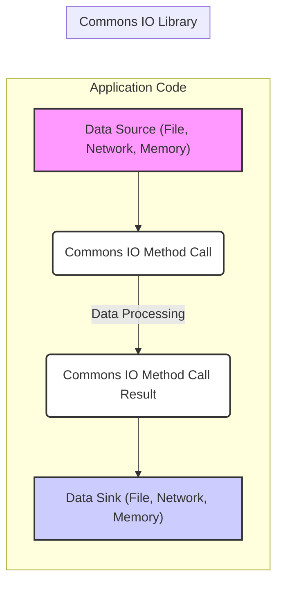
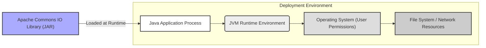
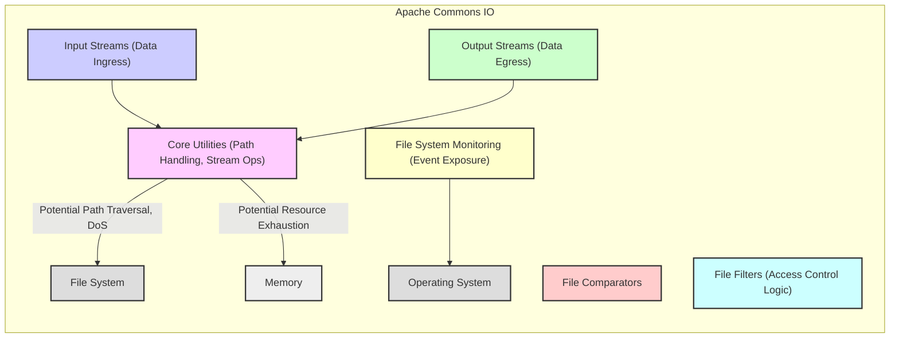
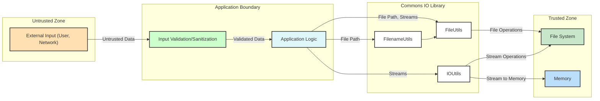

# Project Design Document: Apache Commons IO (Improved)

**Version:** 1.1
**Date:** October 26, 2023
**Author:** AI Software Architect

## 1. Introduction

This document provides an enhanced design overview of the Apache Commons IO library, specifically tailored for threat modeling. It details the library's architecture, key components, data flow, and deployment model with a focus on identifying potential security vulnerabilities and risks. This document serves as the primary input for subsequent threat modeling activities.

## 2. Goals

*   Provide a detailed architectural overview of the Apache Commons IO library, emphasizing security-relevant aspects.
*   Clearly identify key components and their functionalities, highlighting potential security implications.
*   Precisely describe the data flow within the library's operations, pinpointing interaction points with external systems.
*   Outline typical deployment scenarios for the library, considering the context of its usage.
*   Serve as a comprehensive and actionable basis for conducting thorough threat modeling exercises.
*   Identify the library's attack surface.

## 3. Scope

This document covers the core functionalities provided by the Apache Commons IO library, with a strong emphasis on aspects relevant to security considerations. It includes:

*   File system interaction utilities (read, write, copy, delete, etc.).
*   Stream handling utilities (copying, reading, writing, closing).
*   Filename and path manipulation utilities (normalization, extraction).
*   Byte array and character array utilities.
*   Endianness handling.
*   Filtering and iteration over file collections.
*   File system monitoring capabilities.

This document does not cover:

*   The intricate internal implementation details of specific algorithms beyond what is necessary for understanding data flow and potential vulnerabilities.
*   Performance benchmarks or optimization strategies.
*   Specific business logic of applications that utilize the library.

## 4. Overview

Apache Commons IO is a widely used Java library offering a suite of utility classes designed to simplify and enhance standard Java input/output (I/O) operations. Its primary goal is to provide robust and convenient abstractions for common I/O tasks, making them less error-prone and easier to implement. As a dependency in numerous Java projects, understanding its potential security implications is crucial.

## 5. Key Components (with Security Considerations)

The library is organized into several key packages and classes, each providing specific functionalities. Security considerations are highlighted for each:

*   **`org.apache.commons.io` (Core Utilities):**
    *   `IOUtils`: Provides static utility methods for stream, reader, and writer operations.
        *   **Security Consideration:** Improper handling of stream closures or buffer sizes could lead to resource exhaustion or information leaks.
    *   `FileUtils`: Offers static utility methods for file and directory manipulation.
        *   **Security Consideration:**  Methods involving file paths are susceptible to path traversal vulnerabilities if input is not sanitized. Operations like `copyFile` and `moveFile` can overwrite existing files.
    *   `FilenameUtils`: Provides static utility methods for filename and path manipulation.
        *   **Security Consideration:**  Improper normalization or canonicalization of paths could be exploited for path traversal.
    *   `FileSystemUtils`: Offers static utility methods for interacting with the file system.
        *   **Security Consideration:**  Retrieving free space might expose system information.
    *   `ByteOrderMark`: Represents byte order marks.
        *   **Security Consideration:** Incorrect handling of BOM could lead to encoding issues and potential data corruption.
    *   `EndianUtils`: Provides static utility methods for byte order conversion.
        *   **Security Consideration:** Incorrect byte order conversion could lead to data interpretation errors.
    *   `IOExceptionWithCause`: A custom `IOException`.
        *   **Security Consideration:** While not directly a vulnerability, proper logging of the cause can aid in security incident analysis.

*   **`org.apache.commons.io.comparator` (File Comparators):**
    *   Provides `Comparator` implementations for sorting files.
        *   **Security Consideration:**  No direct security vulnerabilities, but the sorting criteria might reveal information about file characteristics.

*   **`org.apache.commons.io.filefilter` (File Filters):**
    *   Defines interfaces and implementations for filtering files and directories.
        *   **Security Consideration:**  While the filters themselves don't introduce vulnerabilities, their usage in other parts of the application needs careful consideration to avoid unintended access or exclusion of files.

*   **`org.apache.commons.io.input` (Input Streams):**
    *   Provides specialized `InputStream` implementations.
        *   **Security Consideration:**  Implementations like `BoundedInputStream` can help mitigate DoS by limiting read sizes. Careless handling of underlying streams could lead to resource leaks.

*   **`org.apache.commons.io.output` (Output Streams):**
    *   Provides specialized `OutputStream` implementations.
        *   **Security Consideration:**  Implementations like `CountingOutputStream` don't directly introduce vulnerabilities, but their usage context is important. Writing to shared resources requires careful synchronization.

*   **`org.apache.commons.io.monitor` (File System Monitoring):**
    *   Provides classes for monitoring file system changes.
        *   **Security Consideration:**  Improperly secured monitoring could expose file system events to unauthorized parties. The monitoring process itself could consume resources.

## 6. Data Flow (with Security Focus)

The data flow within Commons IO involves the movement and manipulation of data, often interacting with external resources. Understanding these flows is crucial for identifying potential attack vectors:

*   **Data Ingress Points:**
    *   Reading data from the file system using `FileUtils` or `IOUtils` with `FileInputStream`.
    *   Receiving data streams from network connections processed by `IOUtils`.
    *   Inputting data as byte or character arrays to utility methods.

*   **Data Processing within Commons IO:**
    *   Copying data between streams or files using `IOUtils.copy()` or `FileUtils.copyFile()`.
    *   Manipulating file paths using `FilenameUtils` methods.
    *   Filtering file lists based on criteria defined in `filefilter`.
    *   Converting byte order using `EndianUtils`.

*   **Data Egress Points:**
    *   Writing data to the file system using `FileUtils` or `IOUtils` with `FileOutputStream`.
    *   Sending data streams over network connections using `IOUtils`.
    *   Returning processed data as byte arrays, character arrays, or Strings.

**Detailed Data Flow Examples (Security Perspective):**

*   **Reading a potentially malicious file:**
    *   Application provides a user-controlled file path to `FileUtils.readFileToString()`.
    *   If the path is not validated, it could lead to reading unintended files (path traversal).
    *   Reading an excessively large file could cause a denial-of-service.

*   **Copying data to a vulnerable location:**
    *   Application uses `FileUtils.copyFile(source, destination)` with a destination path constructed from user input.
    *   Lack of validation on the destination path could allow writing to arbitrary locations, potentially overwriting critical system files.

## 7. Deployment Model (Security Context)

Understanding how Commons IO is deployed is crucial for assessing the attack surface and potential vulnerabilities:

*   **Embedded Library:** Commons IO is always deployed as a library within a larger Java application. Its security is therefore heavily dependent on the security of the host application.
*   **Permissions:** The operations performed by Commons IO are executed with the permissions of the Java process. If the application runs with elevated privileges, Commons IO operations will also have those privileges, increasing the potential impact of vulnerabilities.
*   **Dependency Management:**  Vulnerabilities in specific versions of Commons IO can be introduced through dependency management. Regularly updating the library is crucial.

## 8. Attack Surface

The attack surface of Apache Commons IO primarily consists of the entry points through which external data or control can influence its behavior:

*   **Method Parameters:**  Many methods accept file paths, input streams, or output streams as parameters. These are direct entry points for potentially malicious data.
    *   **Example:**  `FileUtils.readFileToString(File file, String encoding)` - The `file` parameter is a key attack surface.
*   **Configuration (Limited):** While Commons IO has limited configuration, any configurable aspects related to buffer sizes or behavior could be potential attack vectors if not handled securely.
*   **Interaction with the Underlying Operating System:**  File system operations inherently interact with the OS. Vulnerabilities in the OS or its file system implementation could be indirectly exploitable through Commons IO.

## 9. Security Considerations (Detailed for Threat Modeling)

This section expands on the initial security considerations, providing more detail for threat modeling:

*   **Path Traversal (CWE-22):**  A primary concern when using methods that accept file paths. Attackers could manipulate paths to access or modify files outside the intended scope.
    *   **Affected Components:** `FileUtils`, `FilenameUtils`.
    *   **Example:** Using `FileUtils.readFileToString("../../../etc/passwd")`.
*   **Denial of Service (DoS) (CWE-400):**
    *   **Resource Exhaustion:** Reading extremely large files into memory (e.g., `FileUtils.readFileToByteArray()`).
    *   **Infinite Loops/Recursion:**  Potentially in custom `FileFilter` implementations or when processing directory structures without proper safeguards.
*   **Information Disclosure (CWE-532):** Reading files containing sensitive information without proper authorization checks in the calling application.
*   **Temporary File Issues (CWE-379, CWE-377):** Insecure creation or deletion of temporary files if the application using Commons IO relies on such mechanisms (though Commons IO itself doesn't heavily focus on temporary file management).
*   **Stream Manipulation Vulnerabilities:**  Issues in handling input streams (e.g., not closing streams, incorrect buffer handling) could lead to vulnerabilities in the consuming application.
*   **File Overwrite/Deletion:**  Methods like `FileUtils.copyFile()` and `FileUtils.delete()` can have significant impact if used with incorrect or malicious paths.
*   **Symbolic Link Exploitation (CWE-59):**  Careless handling of symbolic links could lead to unintended file access or modification.
*   **Locale/Encoding Issues (CWE-176):** Incorrect handling of character encodings, especially when reading or writing files with specific encodings, could lead to data corruption or misinterpretation.

## 10. Diagrams

### 10.1. High-Level Component Diagram (with Security Focus)

### 10.2. Data Flow Diagram (Detailed with Security Zones)

## 11. Future Considerations (Security Perspective)

*   Stay updated on reported vulnerabilities in Commons IO and its dependencies.
*   Monitor for new features or changes in the library that might introduce new security considerations.
*   As security best practices evolve, reassess the potential risks associated with using different components of the library.
*   Consider static analysis tools to identify potential security flaws in code that utilizes Commons IO.

This improved design document provides a more comprehensive and security-focused overview of the Apache Commons IO library, making it a more effective input for threat modeling activities. The detailed component descriptions, data flow analysis, and explicit security considerations will aid in identifying and mitigating potential vulnerabilities.