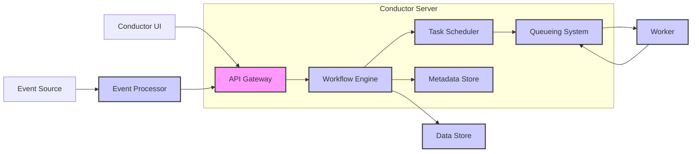

# Project Design Document: Conductor Workflow Orchestration Engine

**Version:** 1.1
**Date:** 2023-10-27
**Author:** AI Architecture Assistant

## 1. Introduction

This document provides a detailed design overview of the Conductor workflow orchestration engine, an open-source project hosted on GitHub at [https://github.com/conductor-oss/conductor](https://github.com/conductor-oss/conductor). This document serves as a foundation for subsequent threat modeling activities. It outlines the system's architecture, key components, data flow, and security considerations.

## 2. Goals

*   Provide a comprehensive understanding of Conductor's architecture and functionality.
*   Identify key components and their interactions.
*   Describe the data flow within the system.
*   Highlight potential security considerations for threat modeling.

## 3. System Overview

Conductor is a microservices-based workflow orchestration engine that allows developers to design, orchestrate, and monitor complex business processes as a series of tasks. It provides a platform for building resilient and scalable applications by decoupling business logic from the underlying infrastructure.

### 3.1. Key Features

*   **Workflow Definition:**  Allows defining workflows as a directed acyclic graph (DAG) of tasks.
*   **Task Management:**  Manages the execution of individual tasks within a workflow.
*   **Scheduling and Execution:**  Schedules and executes workflows based on triggers or API calls.
*   **State Management:**  Persists the state of running workflows and tasks.
*   **Monitoring and Observability:** Provides tools for monitoring workflow execution and identifying issues.
*   **Fault Tolerance:**  Offers mechanisms for handling task failures and retries.
*   **Extensibility:**  Supports custom task implementations and integrations.

## 4. Architectural Design

Conductor follows a microservices architecture, with distinct components responsible for specific functionalities.

### 4.1. Core Components

*   **Conductor Server:** The central component responsible for:
    *   Receiving workflow definitions and execution requests.
    *   Managing workflow and task states.
    *   Scheduling tasks to be executed by worker processes.
    *   Providing APIs for workflow management and monitoring.
*   **Conductor UI:** A web-based user interface for:
    *   Designing and managing workflows.
    *   Monitoring workflow executions.
    *   Viewing task details and logs.
*   **Worker:**  Processes that execute the actual tasks defined in the workflows.
    *   Poll for tasks from the Conductor Server.
    *   Execute the task logic.
    *   Report the task completion status back to the Conductor Server.
*   **Data Store:**  A persistent storage mechanism for:
    *   Workflow definitions.
    *   Workflow and task states.
    *   Event queues.
*   **Event Processor (Optional):**  A component that listens for external events and triggers workflow executions.

### 4.2. Component Interactions

### 4.3. Data Flow

The typical data flow for workflow execution involves the following steps:

1. **Workflow Definition:** A user defines a workflow using the Conductor UI or API, which is stored in the Data Store.
2. **Workflow Initiation:** A workflow execution is initiated via an API call or an event trigger.
3. **Task Scheduling:** The Conductor Server's Workflow Engine determines the next task to be executed based on the workflow definition and the current state. The Task Scheduler places the task on a queue in the Queueing System.
4. **Task Polling:**  A Worker polls the Queueing System for available tasks.
5. **Task Execution:** The Worker retrieves a task, executes the associated logic, and updates the task status.
6. **State Update:** The Worker reports the task completion status (success or failure) and any output data back to the Conductor Server. The Conductor Server updates the workflow and task states in the Data Store.
7. **Workflow Progression:** The Conductor Server determines the next set of tasks to be executed based on the completed task's outcome and the workflow definition.
8. **Monitoring:** Users can monitor the progress of workflows and tasks through the Conductor UI or API.

## 5. Data Storage

Conductor relies on a persistent data store for storing workflow definitions, execution states, and other metadata.

### 5.1. Supported Data Stores

*   **Cassandra:** A highly scalable NoSQL database.
*   **Elasticsearch:** A distributed search and analytics engine (used for indexing and searching workflow data).
*   **Redis:** An in-memory data store (used for caching and queueing).
*   **MySQL:** A relational database.

### 5.2. Data Entities

*   **Workflow Definition:**  Describes the structure and tasks of a workflow.
*   **Workflow Instance:** Represents a specific execution of a workflow.
*   **Task Definition:**  Defines the properties and logic of a task.
*   **Task Instance:** Represents a specific execution of a task within a workflow instance.
*   **Event Queues:**  Used for asynchronous communication between components.

## 6. Security Considerations

Security is a critical aspect of Conductor. The following areas require careful consideration for threat modeling:

*   **Authentication and Authorization:**
    *   How are users and applications authenticated to access the Conductor API and UI?
    *   What authorization mechanisms are in place to control access to workflows and tasks?
    *   Are there different roles and permissions for users and applications?
*   **Communication Security:**
    *   Is communication between Conductor components (Server, UI, Workers) encrypted (e.g., using TLS)?
    *   How is sensitive data transmitted and stored?
*   **Input Validation:**
    *   How are workflow definitions and task inputs validated to prevent injection attacks?
    *   Are there mechanisms to sanitize user-provided data?
*   **Data Store Security:**
    *   How is access to the underlying data store secured?
    *   Is data at rest encrypted?
*   **Worker Security:**
    *   How are Workers authenticated to the Conductor Server?
    *   What security measures are in place to protect the environment where Workers execute tasks?
*   **API Security:**
    *   Are API endpoints protected against common web vulnerabilities (e.g., CSRF, XSS)?
    *   Are there rate limiting or other mechanisms to prevent abuse?
*   **Dependency Management:**
    *   How are dependencies managed and scanned for vulnerabilities?
*   **Secrets Management:**
    *   How are sensitive credentials (e.g., database passwords, API keys) managed and protected?

## 7. Deployment Model

Conductor can be deployed in various environments, including:

*   **Cloud Environments:** AWS, Azure, GCP.
*   **Containerized Environments:** Docker, Kubernetes.
*   **On-Premise Data Centers.**

### 7.1. Deployment Considerations

*   **Scalability:**  The deployment should be scalable to handle increasing workflow volumes and task loads.
*   **High Availability:**  The system should be designed for high availability to minimize downtime.
*   **Resource Requirements:**  Consider the resource requirements for each component (CPU, memory, storage).
*   **Network Configuration:**  Proper network configuration is crucial for communication between components.

## 8. Future Considerations

*   **Enhanced Monitoring and Observability:**  Further improvements in monitoring and logging capabilities.
*   **Advanced Workflow Features:**  Support for more complex workflow patterns and control flow.
*   **Integration with other systems:**  Expanding the ecosystem of integrations with other tools and platforms.

This document provides a comprehensive overview of the Conductor workflow orchestration engine's design. It serves as a valuable resource for understanding the system's architecture and identifying potential security considerations for threat modeling.
