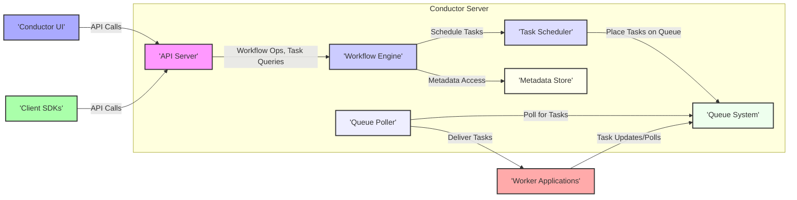

Okay, I will improve the previous Conductor design document based on your feedback. Here's the improved version:

## Project Design Document: Conductor Workflow Orchestration Engine

**1. Introduction**

This document provides a detailed design overview of the Conductor workflow orchestration engine, an open-source project available at [https://github.com/conductor-oss/conductor](https://github.com/conductor-oss/conductor). This document aims to capture the key architectural components, data flows, and deployment considerations of Conductor to facilitate future threat modeling activities.

**2. Project Overview**

Conductor is a resilient, scalable, and observable microservices-based workflow orchestration engine. It empowers developers to design, orchestrate, and monitor complex business processes represented as workflows. By decoupling application logic from task orchestration, Conductor enhances scalability, fault tolerance, and observability.

**Key Features:**

*   Visual Workflow Designer: A user-friendly interface for graphically creating and managing workflow definitions.
*   Workflow Execution Engine: The core component responsible for interpreting workflow definitions and managing their execution lifecycle.
*   Task Management:  Handles the scheduling, execution, tracking, and lifecycle management of individual tasks within a workflow.
*   Fault Tolerance and Reliability:  Designed with built-in mechanisms to handle failures, retries, and ensure workflow completion even in distributed environments.
*   Extensibility: Supports custom task implementations and integrations with external systems through a pluggable architecture.
*   API-Driven: Offers comprehensive REST APIs for programmatic interaction with the engine for workflow definition, execution, and monitoring.
*   Observability: Provides tools and APIs for real-time monitoring of workflow execution, performance metrics, and logging.

**3. Architecture Overview**

Conductor employs a distributed architecture with several interacting components.

**4. Component Design**

This section provides detailed descriptions of the individual components within the Conductor architecture.

*   **Conductor Server:** The central processing unit of the workflow engine.
    *   **API Server:**
        *   Purpose: Exposes RESTful APIs for external interaction with Conductor.
        *   Responsibilities:
            *   Receiving and validating incoming API requests (e.g., starting workflows, querying status).
            *   Authenticating and authorizing API requests to ensure secure access.
            *   Translating API requests into internal commands for other server components.
            *   Returning responses to API clients.
        *   Data Interactions: Receives workflow start requests, task update requests, and provides workflow/task status.
        *   Technology: Typically implemented using a framework like Spring Boot (Java).
    *   **Workflow Engine:**
        *   Purpose: Interprets workflow definitions and manages the execution lifecycle of workflows.
        *   Responsibilities:
            *   Maintaining the current state of running workflows (e.g., which tasks are completed, which are pending).
            *   Determining the next task to be executed based on workflow logic and task dependencies.
            *   Handling workflow branching, looping, and conditional execution.
            *   Managing workflow completion, failure scenarios, and retries.
        *   Data Interactions: Reads workflow definitions from the Metadata Store, updates workflow states, and interacts with the Task Scheduler.
        *   Technology: Core logic implemented in Java.
    *   **Task Scheduler:**
        *   Purpose: Responsible for scheduling tasks for execution by worker applications.
        *   Responsibilities:
            *   Monitoring the state of workflows and identifying tasks that are ready to be executed.
            *   Placing eligible tasks onto the appropriate task queues in the Queue System.
            *   Managing task timeouts and retries.
        *   Data Interactions: Receives task scheduling requests from the Workflow Engine and interacts with the Queue System.
        *   Technology: Java-based scheduling mechanisms.
    *   **Queue Poller:**
        *   Purpose: Continuously monitors task queues for new tasks that need to be processed by worker applications.
        *   Responsibilities:
            *   Connecting to the configured Queue System.
            *   Retrieving tasks from the designated queues.
            *   Delivering tasks to registered worker applications that are subscribed to those task types.
        *   Data Interactions: Reads tasks from the Queue System and delivers them to Worker Applications.
        *   Technology: Integrates with various queue systems (e.g., Redis, Kafka, SQS).
    *   **Metadata Store:**
        *   Purpose: Persists critical Conductor metadata, including workflow definitions, task definitions, and workflow execution history.
        *   Responsibilities:
            *   Storing and retrieving workflow and task definitions.
            *   Persisting the real-time state of running and completed workflows and tasks.
            *   Providing historical data for monitoring, auditing, and debugging.
        *   Data Interactions: Stores and retrieves workflow definitions, task definitions, and workflow execution data.
        *   Technology: Supports various database systems (e.g., Cassandra, MySQL, PostgreSQL).
    *   **Queue System:**
        *   Purpose: Acts as a reliable message broker for asynchronous communication between the Conductor Server and worker applications.
        *   Responsibilities:
            *   Providing durable and ordered message queuing for tasks.
            *   Ensuring at-least-once delivery of tasks to worker applications.
            *   Supporting different queuing semantics and configurations.
        *   Data Interactions: Stores tasks to be processed and facilitates task updates from Worker Applications.
        *   Technology: Supports various queue systems (e.g., Redis, Kafka, SQS).

*   **Conductor UI:**
    *   Purpose: Provides a web-based graphical interface for interacting with Conductor.
    *   Responsibilities:
        *   Allowing users to design and manage workflows visually.
        *   Enabling the initiation and monitoring of workflow executions.
        *   Displaying real-time and historical workflow and task execution data.
        *   Providing administrative functionalities for managing the Conductor environment.
    *   Data Interactions: Interacts with the API Server to retrieve and manipulate workflow definitions and execution data.
    *   Technology: Typically built using JavaScript frameworks (e.g., React).

*   **Client SDKs:**
    *   Purpose: Provide libraries in various programming languages to simplify interaction with the Conductor API.
    *   Responsibilities:
        *   Offering convenient methods for calling Conductor APIs without needing to manually construct HTTP requests.
        *   Handling API request serialization and response deserialization.
        *   Potentially providing abstractions for common Conductor operations.
    *   Data Interactions:  Encapsulate interactions with the API Server.
    *   Technology: Available for multiple languages (e.g., Java, Python, Go).

*   **Worker Applications:**
    *   Purpose: Independent applications responsible for executing the individual tasks defined within workflows.
    *   Responsibilities:
        *   Registering with the Conductor Server to declare their ability to handle specific task types.
        *   Polling task queues for tasks assigned to them.
        *   Executing the business logic associated with the assigned tasks.
        *   Reporting the task completion status (success or failure) and any output data back to the Conductor Server.
    *   Data Interactions: Receive task information from the Queue System and send task completion updates back to the Queue System (or directly to the API Server).
    *   Technology: Can be implemented in any programming language and deployed independently.

**5. Data Flow**

A typical workflow execution involves the following data flow:

1. **Workflow Definition:** A user creates or updates a workflow definition using the Conductor UI or programmatically via the API Server. This definition is stored in the Metadata Store.
2. **Workflow Initiation Request:** A client application or user initiates a workflow execution by sending a request to the API Server, including the workflow name and input parameters.
3. **Workflow Instance Creation:** The API Server forwards the request to the Workflow Engine, which creates a new workflow instance and persists its initial state in the Metadata Store.
4. **Task Scheduling:** The Workflow Engine determines the first task to be executed based on the workflow definition and instructs the Task Scheduler to schedule it. The Task Scheduler places the task details (including input data) onto the appropriate task queue in the Queue System.
5. **Task Polling and Retrieval:** A registered Worker Application polls the relevant task queue in the Queue System and retrieves the task details.
6. **Task Execution:** The Worker Application executes the business logic associated with the task, potentially processing input data received from the queue.
7. **Task Completion Reporting:** Upon completion (success or failure), the Worker Application sends a task completion update, including the task output data and status, to the Queue System (or directly to the API Server).
8. **Workflow State Update:** The Queue Poller (or API Server) receives the task completion update and notifies the Workflow Engine. The Workflow Engine updates the workflow execution state in the Metadata Store, reflecting the completed task and its output.
9. **Next Task Determination:** The Workflow Engine evaluates the workflow definition and the outcome of the completed task to determine the next task to be executed.
10. Steps 4-9 repeat until all tasks in the workflow are completed or the workflow reaches a terminal state (completed, failed, or terminated).
11. **Workflow Completion Notification:** Once the workflow reaches a terminal state, the Conductor Server may trigger notifications or callbacks to interested parties, as configured in the workflow definition or through external integrations.

**6. Deployment Model**

Conductor is typically deployed in a distributed and scalable manner. Common deployment models include:

*   **Cloud Environments (AWS, Azure, GCP):**
    *   Containerized deployment using Docker and orchestration platforms like Kubernetes (EKS, AKS, GKE).
    *   Utilizing managed services for the Metadata Store (e.g., Amazon RDS, Azure Database for PostgreSQL, Google Cloud SQL) and Queue System (e.g., Amazon SQS, Azure Service Bus, Google Cloud Pub/Sub).
    *   Leveraging cloud-native monitoring and logging solutions.
*   **On-Premise Data Centers:**
    *   Deployment on virtual machines or bare-metal servers.
    *   Requires managing the infrastructure for the Metadata Store (e.g., Cassandra cluster, relational database) and Queue System (e.g., Kafka cluster, Redis).
    *   Often involves using configuration management tools for deployment and maintenance.

**Key Deployment Considerations:**

*   **Scalability:** The Conductor Server (especially API Server, Workflow Engine, Task Scheduler) and worker applications should be horizontally scalable to handle increasing workflow volume and task load.
*   **High Availability:** Deploying multiple instances of the Conductor Server components behind a load balancer and utilizing highly available database and message queue systems are crucial for ensuring resilience and minimizing downtime.
*   **Security:** Implementing robust security measures across all components and network boundaries is paramount. This includes secure communication protocols (TLS), authentication and authorization mechanisms, and secure storage of sensitive data.
*   **Monitoring and Logging:** Comprehensive monitoring of key metrics (e.g., workflow execution times, task queue lengths, error rates) and centralized logging are essential for operational visibility and troubleshooting.

**7. Security Considerations (For Threat Modeling)**

This section outlines key security considerations relevant for threat modeling Conductor deployments.

*   **Authentication and Authorization:**
    *   API Authentication: How are API requests to the Conductor Server authenticated (e.g., API keys, OAuth 2.0)?
    *   API Authorization: How is access to specific API endpoints and resources authorized (e.g., role-based access control)?
    *   UI Authentication: How are users authenticated to access the Conductor UI (e.g., username/password, SSO)?
    *   UI Authorization: How is access to UI functionalities and data controlled based on user roles?
    *   Worker Authentication: How are worker applications authenticated when connecting to the Queue System or reporting task status?
*   **Data Security:**
    *   Data in Transit: Is communication between Conductor components (API Server to Workflow Engine, etc.) and between Conductor and worker applications encrypted (e.g., TLS)?
    *   Data at Rest: Is sensitive data stored in the Metadata Store and Queue System encrypted?
    *   Input Validation: Are inputs to the Conductor API and worker applications properly validated to prevent injection attacks (e.g., SQL injection, command injection)?
    *   Workflow Definition Security: How are malicious or vulnerable workflow definitions prevented from being registered?
    *   Task Data Security: How is sensitive data passed between tasks and handled by worker applications secured?
*   **Network Security:**
    *   Network Segmentation: Are Conductor components deployed in segmented networks to limit the impact of potential breaches?
    *   Firewall Rules: Are appropriate firewall rules in place to restrict network access to only necessary ports and services?
    *   Access Control Lists (ACLs): Are ACLs used to control access to the Metadata Store and Queue System?
*   **Dependency Management:**
    *   Vulnerability Scanning: Are dependencies of the Conductor Server and worker applications regularly scanned for known vulnerabilities?
    *   Dependency Updates: Are dependencies kept up-to-date with security patches?
*   **Secrets Management:**
    *   Secure Storage: How are sensitive credentials (e.g., database passwords, API keys, queue credentials) stored and managed securely (e.g., using a secrets management service)?
    *   Rotation: Are secrets rotated regularly?
*   **Auditing and Logging:**
    *   Audit Logs: Are audit logs generated for API calls, workflow executions, administrative actions, and security-related events?
    *   Log Security: Are logs stored securely and access to logs controlled?
*   **Worker Security:**
    *   Sandboxing/Isolation: Are there mechanisms to isolate worker application environments to prevent malicious code from impacting the Conductor infrastructure?
    *   Resource Limits: Are resource limits enforced for worker applications to prevent denial-of-service attacks?
*   **Queue Security:**
    *   Access Control: How is access to the message queues controlled to prevent unauthorized access, modification, or deletion of messages?
    *   Message Encryption: Are messages in the queue encrypted?

**8. Future Considerations**

*   Enhanced Role-Based Access Control (RBAC) for finer-grained authorization.
*   Improved security features for handling sensitive data within workflows, such as data masking and encryption at the workflow level.
*   More comprehensive monitoring and alerting capabilities with customizable thresholds and notifications.
*   Support for additional workflow patterns and integration capabilities with other enterprise systems.
*   Further development of client SDKs for a wider range of programming languages and platforms.

This improved design document provides a more detailed and structured overview of the Conductor workflow orchestration engine, specifically focusing on aspects relevant for thorough threat modeling. The enhanced descriptions and the dedicated security considerations section should facilitate the identification of potential vulnerabilities and the design of appropriate security mitigations.