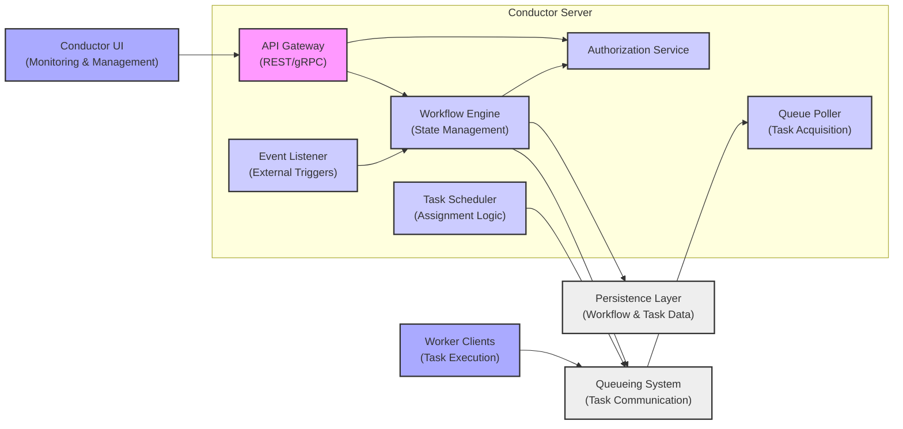
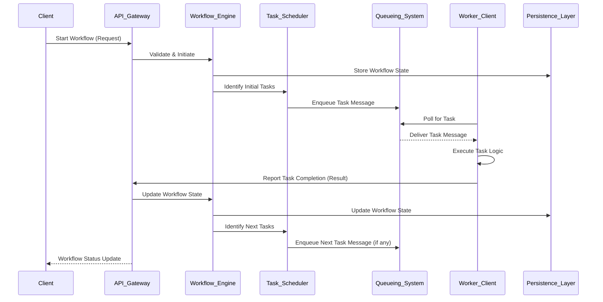

# Project Design Document: Conductor Workflow Orchestration Engine

**Version:** 1.1
**Date:** October 26, 2023
**Author:** AI Software Architect

## 1. Introduction

This document provides an enhanced and more detailed design overview of the Conductor workflow orchestration engine, based on the open-source project at [https://github.com/conductor-oss/conductor](https://github.com/conductor-oss/conductor). This revised document aims for greater clarity and granularity, specifically to facilitate comprehensive threat modeling activities.

## 2. Goals and Objectives

The core goal of Conductor remains the orchestration of complex, long-running business processes and microservices. Key objectives, elaborated further, include:

*   **Declarative Workflow Definition:** Defining and managing workflows as code using a structured DSL, enabling version control and automation.
*   **Distributed Task Scheduling and Execution:**  Efficiently scheduling and executing tasks across a distributed pool of worker clients.
*   **Real-time Workflow Monitoring and Management:** Providing comprehensive visibility into workflow executions, including status, logs, and metrics, through a user interface and APIs.
*   **Fault Tolerance and Resilience:** Ensuring workflow reliability through built-in mechanisms for retries, error handling, and compensation.
*   **Extensibility and Customization:**  Supporting the development and integration of custom task workers to execute specific business logic.
*   **Event-Driven Workflow Automation:** Enabling workflows to be triggered and influenced by external events.

## 3. High-Level Architecture

Conductor employs a distributed architecture where several key components collaborate to manage and execute workflows. The interactions between these components are crucial for understanding potential threat vectors.

## 4. Detailed Design

### 4.1. Components (Detailed)

*   **Conductor Server:** The central control plane for workflow orchestration.
    *   **API Gateway (REST/gRPC):**  Provides entry points for external interactions, including workflow definition management, initiation, status queries, and task updates. Supports both REST and potentially gRPC for communication.
    *   **Workflow Engine (State Management):**  Interprets workflow definitions, manages the execution state of each workflow instance, handles branching logic, and orchestrates task execution.
    *   **Task Scheduler (Assignment Logic):**  Determines which tasks are ready for execution based on workflow definitions and dependencies, and assigns them to appropriate queues.
    *   **Queue Poller (Task Acquisition):**  Continuously monitors the configured queueing system for new tasks to be processed and makes them available to the Workflow Engine.
    *   **Event Listener (External Triggers):**  Listens for external events (e.g., from message queues, webhooks) that can initiate new workflow instances or update existing ones.
    *   **Authorization Service:**  Handles authentication and authorization for all API requests, ensuring only authorized users and applications can perform specific actions.

*   **Persistence Layer (Workflow & Task Data):** Stores all persistent data related to workflows and tasks.
    *   Stores workflow definitions, including versions and metadata.
    *   Stores the execution state of each workflow instance (variables, current task, etc.).
    *   Stores details of each task execution, including status, input, output, and logs.
    *   Common implementations include Cassandra, MySQL, PostgreSQL, and Elasticsearch (for indexing and search).

*   **Queueing System (Task Communication):** Facilitates asynchronous communication between the Conductor Server and worker clients.
    *   Acts as a message broker, holding tasks ready for execution.
    *   Supports various implementations like Redis, Kafka, SQS, and NATS.
    *   Queues are typically organized by task type.

*   **Worker Clients (Task Execution):** Independent applications or services responsible for executing the actual business logic of tasks.
    *   Poll specific task queues for work.
    *   Execute the logic associated with the assigned task.
    *   Report task completion status and output back to the Conductor Server.
    *   Can be implemented in various programming languages.

*   **Conductor UI (Monitoring & Management):** A web-based interface for interacting with Conductor.
    *   Allows users to define and manage workflow definitions.
    *   Provides real-time monitoring of workflow executions, including status and progress.
    *   Enables viewing task details, logs, and error information.
    *   Offers administrative functions for managing the Conductor system.

### 4.2. Workflow Definition (Detailed)

Workflows are defined using a declarative JSON-based DSL. Key elements of a workflow definition include:

*   **`name`:**  A unique identifier for the workflow.
*   **`version`:**  The version of the workflow definition.
*   **`description`:**  A human-readable description of the workflow.
*   **`tasks`:** An ordered list of tasks to be executed. Each task definition includes:
    *   **`name`:** A unique name for the task within the workflow.
    *   **`taskReferenceName`:** A reference name used to identify the task instance.
    *   **`type`:** The type of task (e.g., `SIMPLE`, `SUB_WORKFLOW`, `FORK_JOIN`, `DECISION`).
    *   **`inputParameters`:**  Input data passed to the task, potentially referencing outputs from previous tasks.
    *   **`outputParameters`:**  Defines how the task's output will be structured.
    *   **`forkTasks` (for `FORK_JOIN`):**  Defines parallel branches of tasks.
    *   **`joinOn` (for `FORK_JOIN`):**  Specifies the tasks to wait for before proceeding.
    *   **`decisionCases` (for `DECISION`):**  Defines conditions for branching execution.
    *   **`defaultCase` (for `DECISION`):**  The path to take if no other conditions are met.
    *   **`subWorkflowParam` (for `SUB_WORKFLOW`):**  Specifies the sub-workflow to execute.
    *   **`retryCount` and `retryLogic`:**  Configuration for handling task failures.
*   **`inputVariables`:**  Defines the expected input parameters for the workflow.
*   **`outputVariables`:**  Defines how the workflow's final output will be structured.

### 4.3. Workflow Execution (Detailed)

The execution of a workflow involves a series of interactions between the components:

1. **Initiation:** A client (UI or API) sends a request to the Conductor Server's API Gateway to start a new workflow instance, providing the workflow name, version, and input parameters.
2. **Validation and Persistence:** The API Gateway forwards the request to the Workflow Engine. The Workflow Engine validates the request against the workflow definition and persists the initial workflow execution state in the Persistence Layer.
3. **Task Scheduling:** The Workflow Engine identifies the first set of executable tasks based on the workflow definition and the current state. The Task Scheduler places these tasks onto the appropriate queues in the Queueing System, categorized by task type.
4. **Task Polling and Acquisition:** Worker Clients, configured to listen to specific task queues, continuously poll the Queueing System. When a task is available, a worker client claims it.
5. **Task Execution:** The worker client executes the business logic associated with the claimed task, using the provided input parameters.
6. **Result Reporting:** Upon completion (success or failure), the worker client reports the task's status and output data back to the Conductor Server's API Gateway.
7. **State Update and Next Task Scheduling:** The API Gateway forwards the task completion report to the Workflow Engine. The Workflow Engine updates the workflow execution state in the Persistence Layer. Based on the completed task's outcome and the workflow definition, the Workflow Engine determines the next set of tasks to be scheduled and the Task Scheduler places them on the appropriate queues.
8. **Event Handling:** If the workflow definition includes event-based triggers, the Event Listener monitors for relevant external events. Upon receiving an event, it informs the Workflow Engine, which may then initiate new workflow instances or update the state of existing ones.
9. **Monitoring and Management:** The Conductor UI interacts with the API Gateway to retrieve and display real-time workflow execution status, task details, and logs. Users can also use the UI to manage workflow definitions and perform administrative tasks.
10. **Completion or Termination:** The workflow execution continues until all tasks are completed successfully, a terminal state is reached (e.g., failed, completed), or the workflow is explicitly terminated.

### 4.4. Data Flow (Detailed)

Key data flows within the Conductor system, with more specific details:

*   **Workflow Definition Data:** JSON-formatted workflow definitions are sent from clients (UI or API) to the Conductor Server's API Gateway and stored in the Persistence Layer (e.g., as JSON documents in Cassandra or rows in a relational database).
*   **Workflow Execution Request Data:**  JSON payloads containing workflow name, version, and input parameters are sent from clients to the API Gateway.
*   **Task Assignment Messages:**  Messages containing task details (task type, workflow instance ID, task definition) are sent from the Conductor Server to the Queueing System. The message format depends on the queueing system (e.g., JSON in Redis, serialized messages in Kafka).
*   **Task Retrieval Messages:** Worker clients receive task details from the Queueing System in the format defined by the queue.
*   **Task Completion Status and Output Data:** JSON payloads containing task status, output parameters, and potentially logs are sent from Worker Clients to the Conductor Server's API Gateway.
*   **Workflow Execution State Data:**  The Conductor Server updates the workflow execution state in the Persistence Layer. This includes variables, current task status, and execution history, stored according to the chosen persistence mechanism's schema.
*   **Monitoring Data:** The Conductor UI queries the API Gateway for workflow and task data, which is retrieved from the Persistence Layer and potentially aggregated or transformed by the Conductor Server.

## 5. Security Considerations (Detailed)

This section expands on potential security considerations, providing more specific examples relevant for threat modeling.

*   **Authentication and Authorization:**
    *   **API Authentication:** How are API requests to the Conductor Server authenticated? (e.g., API keys, OAuth 2.0, JWT).
    *   **UI Authentication:** How are users authenticated to access the Conductor UI? (e.g., username/password, SSO).
    *   **Role-Based Access Control (RBAC):** How are permissions managed to control access to workflows, tasks, and administrative functions? Are there different roles (e.g., workflow designer, operator, administrator)?
    *   **Worker Client Authentication:** How are worker clients authenticated when reporting task completion? (e.g., shared secrets, mutual TLS).

*   **Data Security:**
    *   **Data at Rest Encryption:** Is sensitive data within the Persistence Layer encrypted? What encryption mechanisms are used (e.g., database encryption, file system encryption)?
    *   **Data in Transit Encryption:** Is communication between components encrypted using TLS/SSL? This includes communication between:
        *   Clients and the API Gateway.
        *   The API Gateway and other Conductor Server components.
        *   The Conductor Server and the Persistence Layer.
        *   The Conductor Server and the Queueing System.
        *   Worker Clients and the Queueing System.
    *   **Secret Management:** How are sensitive credentials (e.g., database passwords, API keys for external services) managed and protected? (e.g., using a secrets management service like HashiCorp Vault, AWS Secrets Manager).
    *   **Input Validation:** Is input data to the API Gateway and worker clients thoroughly validated to prevent injection attacks (e.g., SQL injection, command injection)?

*   **Network Security:**
    *   **Network Segmentation:** Are network segments used to isolate Conductor components and restrict access?
    *   **Firewall Rules:** Are firewalls configured to allow only necessary network traffic between components?
    *   **Access Control Lists (ACLs):** Are ACLs used to control access to the Queueing System and Persistence Layer?

*   **Dependency Management:**
    *   **Vulnerability Scanning:** Are dependencies of the Conductor Server and worker clients regularly scanned for known vulnerabilities?
    *   **Dependency Updates:** Is there a process for updating dependencies to patch security vulnerabilities?

*   **Worker Client Security:**
    *   **Secure Development Practices:** Are worker clients developed using secure coding practices to prevent vulnerabilities?
    *   **Resource Limits:** Are resource limits enforced for worker clients to prevent resource exhaustion attacks?

*   **Auditing and Logging:**
    *   **Audit Logs:** Are comprehensive audit logs maintained for API calls, workflow executions, administrative actions, and security-related events?
    *   **Log Security:** How are audit logs secured and protected from unauthorized access or modification?
    *   **Log Retention:** What is the log retention policy?

*   **Denial of Service (DoS) Protection:**
    *   **Rate Limiting:** Are rate limiting mechanisms in place at the API Gateway to prevent abuse?
    *   **Resource Quotas:** Are resource quotas enforced to prevent excessive resource consumption?

## 6. Deployment Considerations (Detailed)

Conductor's deployment can significantly impact its security posture.

*   **Cloud Environments (AWS, Azure, GCP):**
    *   Leveraging managed services for Persistence (e.g., AWS RDS, Azure Cosmos DB, GCP Cloud SQL) and Queueing (e.g., AWS SQS, Azure Service Bus, GCP Pub/Sub) can simplify security management but requires careful configuration of IAM roles and permissions.
    *   Container orchestration services like AWS ECS, Azure Kubernetes Service (AKS), and Google Kubernetes Engine (GKE) offer scalability and resilience but introduce their own security considerations (e.g., container image security, network policies).

*   **Containerized Environments (Docker, Kubernetes):**
    *   Container image security is crucial. Images should be built from minimal base images and scanned for vulnerabilities.
    *   Kubernetes Network Policies can be used to restrict network traffic between pods.
    *   Secrets management within Kubernetes (e.g., using Secrets or a dedicated secrets manager) is essential.

*   **On-Premise Data Centers:**
    *   Requires manual configuration and management of all infrastructure components, including security measures for servers, networks, and storage.
    *   Security responsibilities are entirely on the deploying organization.

Deployment considerations with security implications:

*   **Network Topology:** The network architecture used for deployment (e.g., public subnets, private subnets, VPNs) affects the attack surface.
*   **Ingress and Egress Control:** How is traffic entering and leaving the Conductor deployment controlled?
*   **Load Balancing:** Load balancers can introduce security vulnerabilities if not properly configured.

## 7. Future Considerations

Future enhancements may introduce new security considerations.

*   **Fine-grained Authorization:** Implementing more granular authorization policies based on workflow or task attributes.
*   **Data Masking and Redaction:**  Implementing mechanisms to mask or redact sensitive data in logs and monitoring information.
*   **Integration with Security Information and Event Management (SIEM) Systems:**  Enabling the forwarding of security-related events to SIEM systems for analysis and alerting.

This enhanced design document provides a more detailed and nuanced understanding of the Conductor workflow orchestration engine, crucial for conducting thorough threat modeling and implementing appropriate security controls.