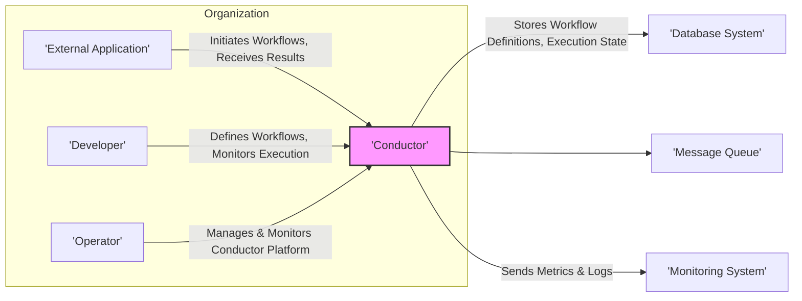
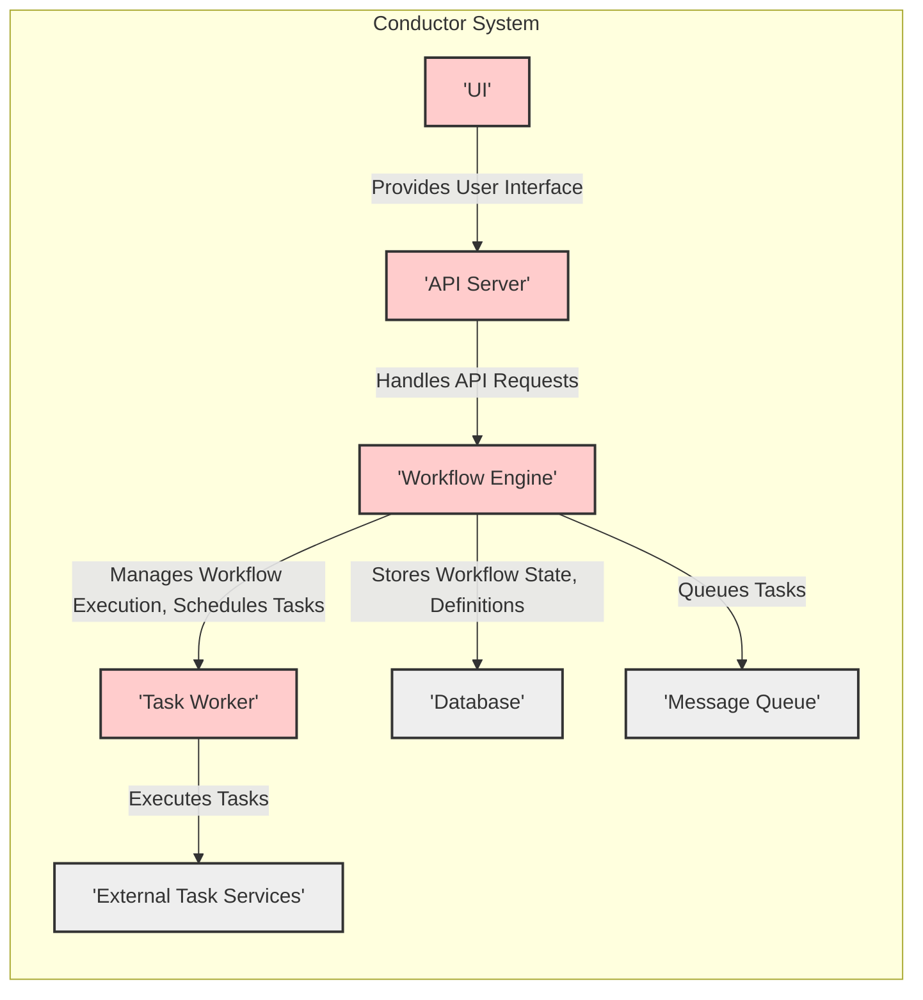
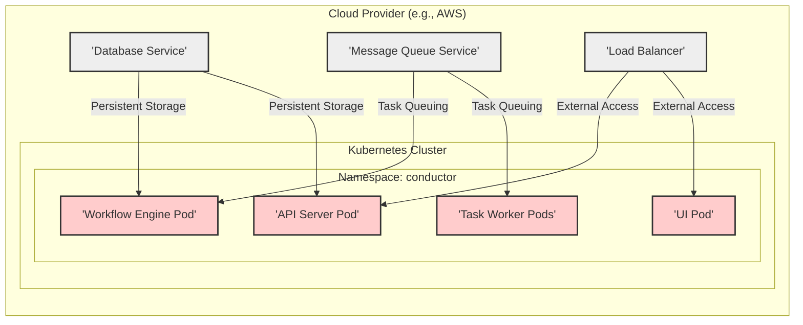

# BUSINESS POSTURE

This project, Conductor, aims to provide a robust and scalable workflow orchestration engine. The primary business priority is to enable developers to build and manage complex, distributed applications by simplifying the orchestration of tasks and microservices. The goal is to increase development velocity, improve application resilience, and enhance observability of complex processes.

Most important business risks that need to be addressed:
- Risk of workflow execution failures leading to business process disruptions.
- Risk of data integrity issues within workflows, potentially causing incorrect business outcomes.
- Risk of unauthorized access to workflow definitions and execution data, leading to data breaches or manipulation.
- Risk of performance bottlenecks in the workflow engine impacting application responsiveness and scalability.
- Risk of vendor lock-in if the project becomes heavily reliant on specific cloud provider services.

# SECURITY POSTURE

Existing security controls:
- security control: Access control to the Conductor API and UI, likely based on authentication and authorization mechanisms. (Implementation details need to be verified in the repository documentation).
- security control: Secure communication channels (HTTPS) for API access and inter-component communication. (Assumed, needs verification).
- security control: Data encryption at rest for sensitive data stored by Conductor (e.g., workflow definitions, execution logs). (Assumed, needs verification).
- security control: Input validation to prevent injection attacks in workflow definitions and API requests. (Assumed, needs verification).
- security control: Logging and auditing of security-related events. (Assumed, needs verification).

Accepted risks:
- accepted risk: Potential vulnerabilities in third-party dependencies used by Conductor. (Mitigated by dependency scanning and updates).
- accepted risk: Risk of misconfiguration of security settings by operators. (Mitigated by clear documentation and configuration validation).
- accepted risk: Denial-of-service attacks targeting the Conductor API or infrastructure. (Mitigated by rate limiting, resource management, and infrastructure security).

Recommended security controls:
- security control: Implement robust Role-Based Access Control (RBAC) for managing access to workflow definitions, execution, and administrative functions.
- security control: Integrate with centralized identity providers (e.g., OAuth 2.0, SAML) for authentication.
- security control: Implement secrets management for storing and accessing sensitive credentials used in workflows.
- security control: Regularly perform security vulnerability scanning and penetration testing of the Conductor platform.
- security control: Implement a secure software development lifecycle (SSDLC) incorporating security reviews, static and dynamic analysis, and security testing.

Security requirements:
- Authentication:
  - Requirement: The system must authenticate users accessing the API and UI.
  - Requirement: Support for multiple authentication methods, including API keys and integration with identity providers.
  - Requirement: Strong password policies should be enforced if local user accounts are used.
- Authorization:
  - Requirement: The system must implement role-based access control (RBAC) to manage permissions for different users and roles.
  - Requirement: Authorization should be enforced for all API endpoints and UI functionalities.
  - Requirement: Granular permissions should be configurable for workflow definitions, execution, and administrative tasks.
- Input validation:
  - Requirement: All user inputs, including workflow definitions, API requests, and UI inputs, must be validated to prevent injection attacks (e.g., SQL injection, command injection, cross-site scripting).
  - Requirement: Input validation should be performed on both the client-side and server-side.
  - Requirement: Use of parameterized queries or prepared statements for database interactions.
- Cryptography:
  - Requirement: Sensitive data at rest (e.g., workflow definitions, execution logs, secrets) must be encrypted.
  - Requirement: Secure communication channels (HTTPS) must be used for all API and UI traffic.
  - Requirement: Consider encryption of data in transit between Conductor components if communication happens over untrusted networks.
  - Requirement: Use strong cryptographic algorithms and key management practices.

# DESIGN

## C4 CONTEXT

Context Diagram Elements:

- Element:
  - Name: External Application
  - Type: System
  - Description: External applications or microservices that initiate workflows in Conductor and consume the results. These are the clients of the workflow orchestration engine.
  - Responsibilities:
    - Define and initiate workflows using the Conductor API.
    - Receive workflow execution status and results from Conductor.
    - Handle errors and retries based on workflow execution outcomes.
  - Security controls:
    - security control: API Key or OAuth 2.0 based authentication when interacting with Conductor API.
    - security control: Input validation of data sent to Conductor API.

- Element:
  - Name: Developer
  - Type: Person
  - Description: Software developers who design, develop, and maintain workflows using Conductor. They interact with Conductor to define workflows and monitor their execution.
  - Responsibilities:
    - Define workflow definitions using Conductor's DSL or UI.
    - Test and debug workflow definitions.
    - Monitor workflow execution and troubleshoot issues.
  - Security controls:
    - security control: Role-Based Access Control (RBAC) to manage access to workflow definition and monitoring functionalities.
    - security control: Authentication to access Conductor UI and API.

- Element:
  - Name: Operator
  - Type: Person
  - Description: System administrators or operations engineers responsible for deploying, configuring, and maintaining the Conductor platform.
  - Responsibilities:
    - Deploy and configure Conductor infrastructure.
    - Monitor Conductor platform health and performance.
    - Manage user accounts and access control.
    - Perform backups and disaster recovery.
  - Security controls:
    - security control: Strong authentication and authorization for administrative access to Conductor platform.
    - security control: Audit logging of administrative actions.
    - security control: Secure configuration management practices.

- Element:
  - Name: Conductor
  - Type: System
  - Description: The workflow orchestration engine itself. It manages workflow definitions, schedules tasks, tracks execution state, and provides APIs and UI for interaction.
  - Responsibilities:
    - Store and manage workflow definitions.
    - Schedule and execute workflow tasks.
    - Manage workflow state and execution history.
    - Provide APIs for workflow initiation, monitoring, and management.
    - Provide UI for workflow definition and monitoring.
  - Security controls:
    - security control: Authentication and authorization for API and UI access.
    - security control: Input validation for all API requests and UI inputs.
    - security control: Encryption at rest for sensitive data.
    - security control: Secure communication channels (HTTPS).
    - security control: Audit logging of security-related events.

- Element:
  - Name: Database System
  - Type: System
  - Description: A persistent database system used by Conductor to store workflow definitions, execution state, task queues, and other metadata.
  - Responsibilities:
    - Persistently store workflow definitions and execution state.
    - Provide reliable data storage and retrieval for Conductor.
    - Ensure data integrity and availability.
  - Security controls:
    - security control: Access control to the database system, limiting access to Conductor components.
    - security control: Encryption at rest for database storage.
    - security control: Regular database backups.
    - security control: Database security hardening and patching.

- Element:
  - Name: Message Queue
  - Type: System
  - Description: A message queue system used by Conductor for asynchronous communication between components, particularly for task scheduling and execution.
  - Responsibilities:
    - Facilitate asynchronous task scheduling and execution.
    - Provide reliable message delivery between Conductor components.
    - Handle message persistence and queuing.
  - Security controls:
    - security control: Access control to the message queue, limiting access to Conductor components.
    - security control: Encryption in transit for messages if necessary.
    - security control: Message queue security hardening and configuration.

- Element:
  - Name: Monitoring System
  - Type: System
  - Description: An external monitoring system used to collect metrics and logs from Conductor for performance monitoring, alerting, and troubleshooting.
  - Responsibilities:
    - Collect metrics and logs from Conductor components.
    - Provide dashboards and visualizations for monitoring Conductor health and performance.
    - Generate alerts based on predefined thresholds.
  - Security controls:
    - security control: Secure communication channel for sending metrics and logs to the monitoring system.
    - security control: Access control to the monitoring system itself.

## C4 CONTAINER

Container Diagram Elements:

- Element:
  - Name: API Server
  - Type: Container
  - Description: Exposes the REST API for external applications and the UI to interact with Conductor. Handles authentication, authorization, and request routing.
  - Responsibilities:
    - Expose and manage the Conductor REST API.
    - Handle user authentication and authorization.
    - Route API requests to the Workflow Engine.
    - Provide API documentation and OpenAPI specification.
  - Security controls:
    - security control: HTTPS for API communication.
    - security control: API authentication and authorization (API keys, OAuth 2.0).
    - security control: Input validation for all API requests.
    - security control: Rate limiting and request throttling to prevent abuse.

- Element:
  - Name: Workflow Engine
  - Type: Container
  - Description: The core component of Conductor. Responsible for managing workflow definitions, scheduling tasks, tracking workflow execution state, and coordinating task workers.
  - Responsibilities:
    - Manage workflow definitions and versions.
    - Schedule tasks based on workflow definitions and execution state.
    - Track workflow execution progress and state.
    - Interact with the Database and Message Queue.
    - Coordinate Task Workers.
  - Security controls:
    - security control: Access control to internal APIs and functionalities.
    - security control: Secure communication with other containers (Database, Message Queue, Task Workers).
    - security control: Input validation for internal data processing.

- Element:
  - Name: Task Worker
  - Type: Container
  - Description: Executes tasks defined in workflows. Task workers poll the message queue for tasks, execute them, and report back the results to the Workflow Engine.
  - Responsibilities:
    - Poll the Message Queue for tasks to execute.
    - Execute tasks based on task definitions.
    - Report task execution status and results to the Workflow Engine.
    - Interact with external task services or applications.
  - Security controls:
    - security control: Authentication when communicating with the Workflow Engine and Message Queue.
    - security control: Secure handling of task execution logic and credentials.
    - security control: Resource limits to prevent resource exhaustion.

- Element:
  - Name: Database
  - Type: Container
  - Description: Persistent storage for workflow definitions, execution state, task queues, and other metadata. Could be a relational database (e.g., MySQL, PostgreSQL) or a NoSQL database (e.g., Cassandra, DynamoDB).
  - Responsibilities:
    - Persistently store Conductor data.
    - Provide efficient data access for the Workflow Engine.
    - Ensure data consistency and availability.
  - Security controls:
    - security control: Database access control and authentication.
    - security control: Encryption at rest for database storage.
    - security control: Regular database backups and recovery procedures.
    - security control: Database security hardening and patching.

- Element:
  - Name: Message Queue
  - Type: Container
  - Description:  Facilitates asynchronous communication between the Workflow Engine and Task Workers. Could be Kafka, RabbitMQ, or other message queue systems.
  - Responsibilities:
    - Queue tasks for Task Workers.
    - Ensure reliable message delivery.
    - Handle message persistence and queuing.
  - Security controls:
    - security control: Message queue access control and authentication.
    - security control: Encryption in transit for messages if necessary.
    - security control: Message queue security hardening and configuration.

- Element:
  - Name: UI
  - Type: Container
  - Description: Web-based user interface for developers and operators to define workflows, monitor execution, and manage the Conductor platform.
  - Responsibilities:
    - Provide a user-friendly interface for workflow definition and management.
    - Visualize workflow execution status and history.
    - Provide monitoring and administrative functionalities.
    - Interact with the API Server.
  - Security controls:
    - security control: HTTPS for UI access.
    - security control: User authentication and authorization.
    - security control: Input validation for UI inputs.
    - security control: Protection against common web application vulnerabilities (e.g., XSS, CSRF).

- Element:
  - Name: External Task Services
  - Type: Container
  - Description: External services or applications that are invoked by Task Workers to perform specific tasks within workflows.
  - Responsibilities:
    - Execute specific tasks as part of workflows.
    - Provide APIs or interfaces for Task Workers to interact with.
    - Return task execution results to Task Workers.
  - Security controls:
    - security control: Authentication and authorization for Task Workers to access external services.
    - security control: Secure communication channels (HTTPS) for communication with Task Workers.
    - security control: Input validation and output sanitization.

## DEPLOYMENT

Deployment Solution: Cloud-based Containerized Deployment (e.g., Kubernetes on AWS, Azure, GCP)

Deployment Diagram Elements:

- Element:
  - Name: Kubernetes Cluster
  - Type: Infrastructure
  - Description: A managed Kubernetes cluster provided by the cloud provider. Provides container orchestration and management for Conductor components.
  - Responsibilities:
    - Container orchestration and scheduling.
    - Service discovery and load balancing within the cluster.
    - Scalability and high availability of Conductor components.
  - Security controls:
    - security control: Kubernetes RBAC for cluster access control.
    - security control: Network policies to isolate namespaces and pods.
    - security control: Security hardening of Kubernetes nodes and control plane.
    - security control: Regular security updates and patching of Kubernetes components.

- Element:
  - Name: API Server Pod
  - Type: Deployment Unit (Pod)
  - Description: Containerized instance of the API Server running within a Kubernetes pod. Scaled horizontally for high availability and performance.
  - Responsibilities:
    - Handle API requests within the Kubernetes environment.
    - Load balancing of API requests across multiple API Server pods.
  - Security controls:
    - security control: Container image security scanning.
    - security control: Resource limits and quotas for pod.
    - security control: Network policies to restrict network access.

- Element:
  - Name: Workflow Engine Pod
  - Type: Deployment Unit (Pod)
  - Description: Containerized instance of the Workflow Engine running within a Kubernetes pod. Scaled horizontally for high availability and performance.
  - Responsibilities:
    - Manage workflow execution within the Kubernetes environment.
    - Coordinate with Task Worker pods.
  - Security controls:
    - security control: Container image security scanning.
    - security control: Resource limits and quotas for pod.
    - security control: Network policies to restrict network access.

- Element:
  - Name: Task Worker Pods
  - Type: Deployment Unit (Pods)
  - Description: Multiple containerized instances of Task Workers running within Kubernetes pods. Scaled horizontally based on workload.
  - Responsibilities:
    - Execute tasks within the Kubernetes environment.
    - Scale based on task queue length and workload.
  - Security controls:
    - security control: Container image security scanning.
    - security control: Resource limits and quotas for pods.
    - security control: Network policies to restrict network access.

- Element:
  - Name: UI Pod
  - Type: Deployment Unit (Pod)
  - Description: Containerized instance of the UI running within a Kubernetes pod. Scaled horizontally for high availability and performance.
  - Responsibilities:
    - Serve the UI application within the Kubernetes environment.
    - Load balancing of UI requests across multiple UI pods.
  - Security controls:
    - security control: Container image security scanning.
    - security control: Resource limits and quotas for pod.
    - security control: Network policies to restrict network access.

- Element:
  - Name: Database Service
  - Type: Managed Service
  - Description: Managed database service provided by the cloud provider (e.g., AWS RDS, Azure Database, GCP Cloud SQL). Provides persistent storage for Conductor.
  - Responsibilities:
    - Reliable and scalable database service.
    - Automated backups and maintenance.
    - Security patching and updates.
  - Security controls:
    - security control: Database access control lists (ACLs).
    - security control: Encryption at rest and in transit.
    - security control: Regular security audits and compliance certifications.

- Element:
  - Name: Message Queue Service
  - Type: Managed Service
  - Description: Managed message queue service provided by the cloud provider (e.g., AWS SQS, Azure Service Bus, GCP Pub/Sub). Provides message queuing for Conductor.
  - Responsibilities:
    - Reliable and scalable message queue service.
    - Message persistence and delivery guarantees.
    - Security and access control.
  - Security controls:
    - security control: Message queue access control policies.
    - security control: Encryption in transit if necessary.
    - security control: Regular security audits and compliance certifications.

- Element:
  - Name: Load Balancer
  - Type: Managed Service
  - Description: Cloud provider's load balancer service. Distributes external traffic to the API Server and UI pods.
  - Responsibilities:
    - Load balancing of external traffic.
    - SSL termination.
    - High availability and scalability.
  - Security controls:
    - security control: SSL/TLS encryption for external traffic.
    - security control: Web Application Firewall (WAF) integration for protection against web attacks.
    - security control: DDoS protection.

## BUILD

```mermaid
flowchart LR
    A["'Developer'"] -- "Code Changes, Commit" --> B["'Version Control System (GitHub)'"];
    B -- "Code Push, Pull Request" --> C["'CI/CD System (GitHub Actions)'"];
    C -- "Build, Test, Scan" --> D["'Build Artifacts (Container Images, Binaries)'"];
    D -- "Push Artifacts" --> E["'Artifact Registry (Container Registry)'"];
    E -- "Deploy" --> F["'Deployment Environment (Kubernetes)'"];
    style C fill:#fcc,stroke:#333,stroke-width:2px
    style E fill:#eee,stroke:#333,stroke-width:2px
```

Build Process Description:

1. Developer: Developers write code, make changes, and commit them to a version control system.
2. Version Control System (GitHub):  GitHub hosts the source code repository. Code changes are pushed to GitHub, and pull requests are created for code review and merging.
3. CI/CD System (GitHub Actions): GitHub Actions is used as the CI/CD system. Upon code push or pull request events, automated workflows are triggered.
4. Build, Test, Scan: The CI/CD pipeline performs the following steps:
    - Build: Compiles the code and builds the necessary artifacts (e.g., container images, binaries).
    - Test: Executes automated unit tests, integration tests, and other tests to ensure code quality and functionality.
    - Scan: Performs security scans, including:
        - Static Application Security Testing (SAST): Analyzes source code for potential vulnerabilities.
        - Dependency Scanning: Checks for known vulnerabilities in third-party dependencies.
        - Container Image Scanning: Scans container images for vulnerabilities.
        - Code linters and formatters: Enforce code quality and style guidelines.
5. Build Artifacts (Container Images, Binaries):  The build process produces build artifacts, typically container images for microservices and binaries for other components.
6. Artifact Registry (Container Registry): Build artifacts are pushed to a secure artifact registry (e.g., Docker Hub, AWS ECR, Google GCR). This registry stores and manages container images and other build artifacts.
7. Deployment Environment (Kubernetes): The deployment process pulls container images from the artifact registry and deploys them to the Kubernetes cluster.

Build Process Security Controls:

- security control: Secure coding practices training for developers.
- security control: Code review process for all code changes.
- security control: Static Application Security Testing (SAST) integrated into the CI/CD pipeline.
- security control: Software Composition Analysis (SCA) / Dependency scanning to identify vulnerable dependencies.
- security control: Container image scanning for vulnerabilities before pushing to the registry.
- security control: Automated unit and integration tests to ensure code quality and prevent regressions.
- security control: Secure CI/CD pipeline configuration and access control.
- security control: Artifact signing and verification to ensure artifact integrity.
- security control: Regular security audits of the build process and infrastructure.

# RISK ASSESSMENT

Critical business processes we are trying to protect:
- Workflow execution: Ensuring workflows are executed reliably and correctly is critical for business operations that depend on these workflows.
- Workflow definition management: Protecting the integrity and confidentiality of workflow definitions is important as they represent business logic.
- Task execution: Ensuring tasks within workflows are executed securely and reliably, especially when interacting with external systems.
- Monitoring and observability: Maintaining the ability to monitor workflow execution and system health is crucial for operational stability.

Data we are trying to protect and their sensitivity:
- Workflow definitions: Contain business logic and potentially sensitive information about processes. Sensitivity: Medium to High (depending on workflow content).
- Workflow execution state: Contains data related to workflow progress, task inputs, and outputs. May contain sensitive business data processed by workflows. Sensitivity: Medium to High (depending on data processed).
- Task execution logs: Logs generated during task execution, potentially containing sensitive data. Sensitivity: Low to Medium (depending on logged data).
- System logs and metrics: Operational logs and metrics for Conductor components. Sensitivity: Low.
- Secrets and credentials: Credentials used to access external systems or services within workflows. Sensitivity: High.

# QUESTIONS & ASSUMPTIONS

Questions:
- What type of database system is recommended or typically used with Conductor?
- What message queue system is recommended or typically used with Conductor?
- What authentication and authorization mechanisms are currently implemented in Conductor?
- Are there any built-in secrets management capabilities in Conductor, or is external secrets management recommended?
- What are the typical performance and scalability considerations for Conductor deployments?
- Are there any specific compliance requirements (e.g., GDPR, HIPAA, PCI DSS) that Conductor deployments need to adhere to?

Assumptions:
- BUSINESS POSTURE: The primary business goal is to enable efficient and reliable workflow orchestration for microservices-based applications. Security and data integrity are important considerations.
- SECURITY POSTURE:  Basic security controls like HTTPS, authentication, and input validation are assumed to be in place. However, more robust security measures like RBAC, secrets management, and comprehensive security scanning are recommended.
- DESIGN: Conductor is designed as a distributed system with components like API Server, Workflow Engine, Task Workers, Database, and Message Queue. A cloud-based containerized deployment on Kubernetes is a typical deployment scenario. The build process includes automated CI/CD with security scanning and artifact management.