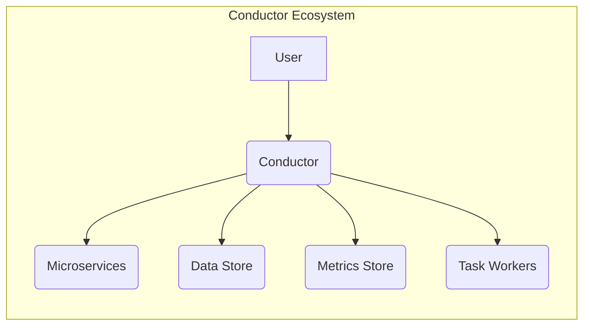
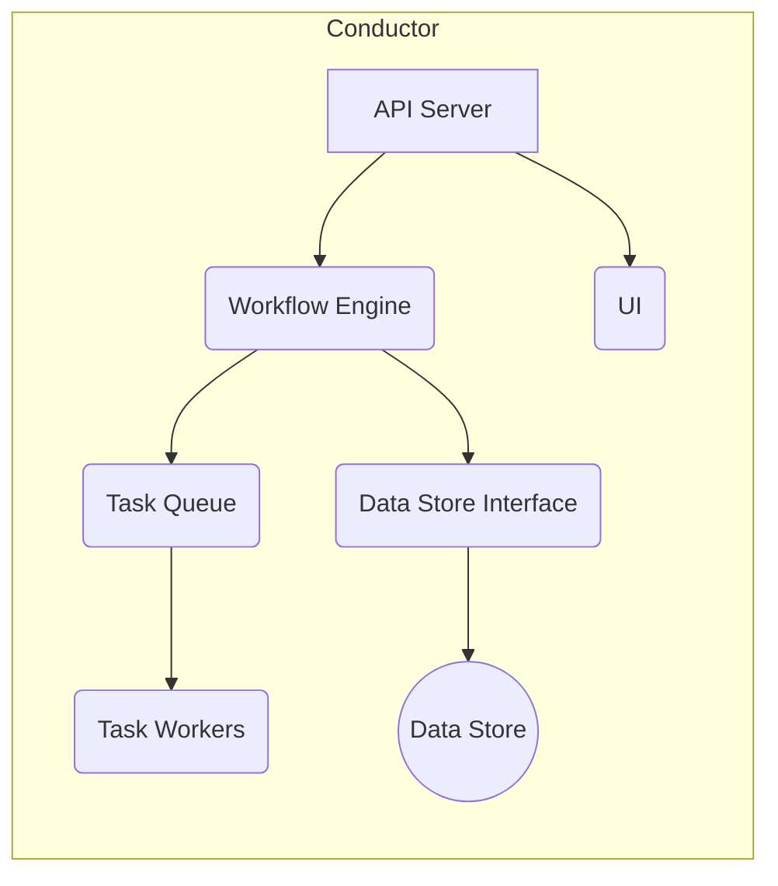
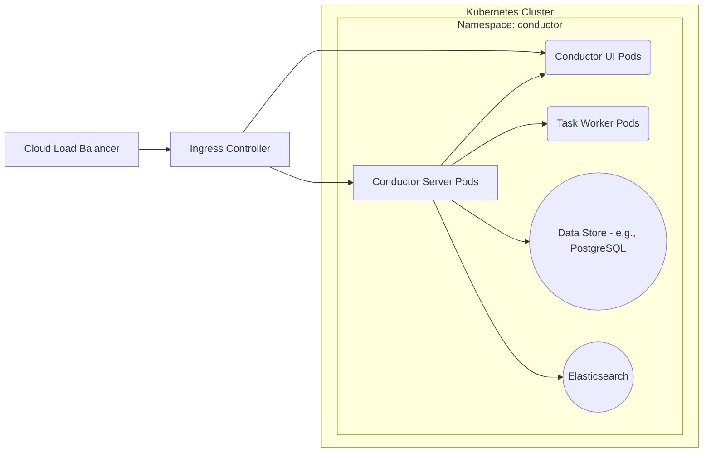
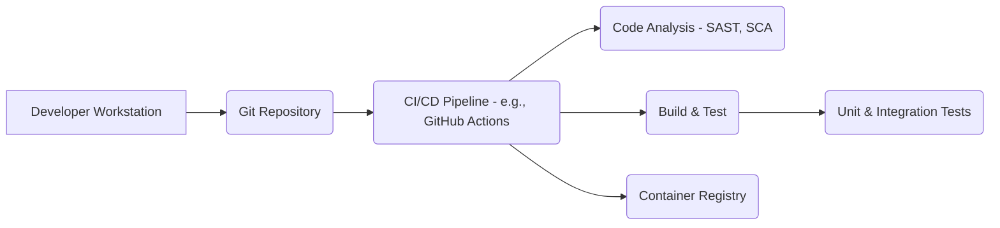

Okay, let's create a design document for the Conductor project, focusing on aspects relevant for threat modeling.

# BUSINESS POSTURE

Conductor is a workflow orchestration platform.  It's designed to manage and execute workflows that span multiple microservices.  The business priorities and goals that Conductor addresses are:

*   Reliability: Ensuring workflows execute reliably, even in the face of individual service failures.  This includes retries, error handling, and state management.
*   Scalability: Handling a large volume of concurrent workflows and tasks.  The system must scale to meet increasing demand.
*   Visibility: Providing a clear view of workflow execution, including status, progress, and any errors.  This is crucial for debugging and monitoring.
*   Maintainability: Allowing for easy modification and extension of workflows as business needs evolve.
*   Efficiency: Optimizing resource utilization and minimizing the time it takes to complete workflows.
*   Extensibility: Supporting a variety of task types and integration with different systems.

Based on these, the most important business risks are:

*   Workflow Execution Failure:  If Conductor fails, critical business processes that rely on orchestrated workflows could be disrupted.
*   Data Loss or Corruption:  Loss or corruption of workflow state data could lead to incomplete or incorrect execution.
*   Performance Bottlenecks:  Slow workflow execution or inability to handle peak loads could impact business operations.
*   Security Vulnerabilities:  Unauthorized access to Conductor or the data it manages could lead to data breaches or malicious manipulation of workflows.
*   Lack of Auditability: Inability to track who did what and when within the system.

# SECURITY POSTURE

Based on the provided GitHub repository, here's an assessment of the existing security controls and accepted risks.  Note that this is based on a review of the repository and may not be exhaustive.

*   security control: Authentication: Conductor supports authentication, details can be found in documentation.
*   security control: Authorization: Conductor supports role-based access control (RBAC), details can be found in documentation.
*   security control: Input Validation: Conductor performs input validation on workflow and task definitions, details can be found in documentation and code.
*   security control: Encryption: Communication between Conductor server and clients can be secured using TLS, details can be found in documentation.
*   security control: Secrets Management: Conductor documentation recommends using external secrets management solutions (e.g., HashiCorp Vault), details can be found in documentation.
*   security control: Auditing: Conductor provides auditing capabilities, details can be found in documentation.
*   security control: Dependency Management: Conductor uses build tools like Gradle, which help manage dependencies.
*   security control: Regular Updates: The project appears to be actively maintained, suggesting regular updates and security patches.
*   accepted risk: Supply Chain Security: While dependency management is in place, there's always a residual risk of vulnerabilities in third-party libraries. This is a common accepted risk, mitigated by regular updates and vulnerability scanning.
*   accepted risk: Deployment Security: The security of the Conductor deployment environment (e.g., Kubernetes cluster, cloud infrastructure) is largely the responsibility of the user.  Misconfigurations in the deployment environment could expose Conductor to risks.
*   accepted risk: Insider Threat: Like any software system, Conductor is vulnerable to malicious insiders with legitimate access. This is typically mitigated through access controls, auditing, and monitoring.

Recommended Security Controls (High Priority):

*   Implement robust vulnerability scanning (SAST, DAST, SCA) as part of the CI/CD pipeline.
*   Formalize a security review process for all code changes.
*   Implement a comprehensive monitoring and alerting system to detect and respond to security incidents.
*   Provide detailed security hardening guides for different deployment environments.

Security Requirements:

*   Authentication:
    *   Support for multiple authentication providers (e.g., LDAP, OAuth 2.0, OIDC).
    *   Strong password policies and enforcement.
    *   Multi-factor authentication (MFA) for privileged users.
*   Authorization:
    *   Fine-grained access control based on roles and permissions.
    *   Ability to restrict access to specific workflows, tasks, and data.
    *   Regular review and auditing of user permissions.
*   Input Validation:
    *   Strict validation of all inputs to prevent injection attacks (e.g., command injection, SQL injection).
    *   Validation of workflow and task definitions to prevent malicious code execution.
    *   Use of well-defined schemas and data types.
*   Cryptography:
    *   Use of strong, industry-standard cryptographic algorithms and protocols.
    *   Secure storage of sensitive data (e.g., API keys, passwords) using encryption at rest.
    *   Protection of data in transit using TLS/SSL.
    *   Proper key management practices.

# DESIGN

## C4 CONTEXT

Element Descriptions:

*   Element:
    *   Name: User
    *   Type: Person
    *   Description: Represents a user interacting with Conductor, either through a UI or API.
    *   Responsibilities: Defining workflows, starting executions, monitoring progress, managing tasks.
    *   Security controls: Authentication, Authorization.

*   Element:
    *   Name: Conductor
    *   Type: Software System
    *   Description: The core workflow orchestration engine.
    *   Responsibilities: Managing workflow definitions, scheduling tasks, tracking execution state, handling failures.
    *   Security controls: Authentication, Authorization, Input Validation, Auditing, Encryption.

*   Element:
    *   Name: Microservices
    *   Type: Software System
    *   Description: External services that perform individual tasks within a workflow.
    *   Responsibilities: Executing specific business logic.
    *   Security controls: Dependent on the individual microservice; Conductor should enforce secure communication (e.g., TLS).

*   Element:
    *   Name: Data Store
    *   Type: Software System
    *   Description: Persistent storage for workflow definitions, execution state, and other data.
    *   Responsibilities: Storing and retrieving data reliably.
    *   Security controls: Data encryption at rest, access controls, backups.

*   Element:
    *   Name: Metrics Store
    *   Type: Software System
    *   Description: Stores metrics related to workflow execution and system performance.
    *   Responsibilities: Collecting, storing, and providing access to metrics data.
    *   Security controls: Access controls, data integrity checks.

*   Element:
    *   Name: Task Workers
    *   Type: Software System
    *   Description: Processes that execute individual tasks defined in workflows.
    *   Responsibilities: Polling for tasks, executing them, and reporting results.
    *   Security controls: Authentication, Authorization, Input Validation (for task inputs).

## C4 CONTAINER

Element Descriptions:

*   Element:
    *   Name: API Server
    *   Type: Container (Web Application)
    *   Description: Provides a REST API for interacting with Conductor.
    *   Responsibilities: Handling requests from users and external systems, authenticating users, validating inputs.
    *   Security controls: Authentication, Authorization, Input Validation, Rate Limiting.

*   Element:
    *   Name: Workflow Engine
    *   Type: Container (Application)
    *   Description: The core logic for managing workflow execution.
    *   Responsibilities: Scheduling tasks, tracking state, handling retries and failures.
    *   Security controls: Internal access controls, input validation.

*   Element:
    *   Name: UI
    *   Type: Container (Web Application)
    *   Description: Provides a user interface for interacting with Conductor.
    *   Responsibilities: Displaying workflow definitions, execution status, and other information.
    *   Security controls: Authentication, Authorization (via API Server).

*   Element:
    *   Name: Task Queue
    *   Type: Container (Message Queue)
    *   Description: Queues tasks that are ready to be executed.
    *   Responsibilities: Storing tasks, delivering them to workers.
    *   Security controls: Access controls, message encryption (if sensitive data is included).

*   Element:
    *   Name: Data Store Interface
    *   Type: Container (Library/Module)
    *   Description: Provides an abstraction layer for interacting with the data store.
    *   Responsibilities: Handling database connections, performing queries, managing transactions.
    *   Security controls: Secure database connection configuration, parameterized queries (to prevent SQL injection).

*   Element:
    *   Name: Data Store
    *   Type: Database
    *   Description: Persistent storage (e.g., PostgreSQL, MySQL, Cassandra).
    *   Responsibilities: Storing and retrieving data.
    *   Security controls: Database-level security controls (e.g., user accounts, permissions, encryption).

*   Element:
    *   Name: Task Workers
    *   Type: Container (Application)
    *   Description: Processes that execute individual tasks.
    *   Responsibilities: Polling for tasks, executing them, reporting results.
    *   Security controls: Authentication, Authorization, Input Validation (for task inputs).

## DEPLOYMENT

Conductor can be deployed in various ways, including:

1.  Single-node deployment (for development and testing).
2.  Multi-node cluster deployment (for production, using Docker Compose or similar).
3.  Kubernetes deployment (for production, providing scalability and resilience).
4.  Cloud-based deployment (using managed services like AWS ECS, Google Kubernetes Engine, or Azure Kubernetes Service).

We'll describe the Kubernetes deployment in detail, as it's a common and recommended approach for production.

Element Descriptions:

*   Element:
    *   Name: Conductor Server Pods
    *   Type: Kubernetes Pod
    *   Description: Replicated instances of the Conductor server application.
    *   Responsibilities: Running the API server and workflow engine.
    *   Security controls: Kubernetes network policies, resource limits, pod security policies.

*   Element:
    *   Name: Conductor UI Pods
    *   Type: Kubernetes Pod
    *   Description: Replicated instances of the Conductor UI.
    *   Responsibilities: Serving the user interface.
    *   Security controls: Kubernetes network policies, resource limits.

*   Element:
    *   Name: Task Worker Pods
    *   Type: Kubernetes Pod
    *   Description: Replicated instances of the task worker application.
    *   Responsibilities: Executing tasks.
    *   Security controls: Kubernetes network policies, resource limits, pod security policies.

*   Element:
    *   Name: Data Store (e.g., PostgreSQL)
    *   Type: Kubernetes StatefulSet (or external managed database)
    *   Description: The persistent data store.
    *   Responsibilities: Storing workflow data.
    *   Security controls: Database-level security, Kubernetes network policies, persistent volume encryption.

*   Element:
    *   Name: Elasticsearch
    *   Type: Kubernetes StatefulSet (or external managed service)
    *   Description: Used for indexing and searching workflow data.
    *   Responsibilities: Providing search capabilities.
    *   Security controls: Elasticsearch security features, Kubernetes network policies.

*   Element:
    *   Name: Ingress Controller
    *   Type: Kubernetes Ingress Controller
    *   Description: Manages external access to the Conductor API and UI.
    *   Responsibilities: Routing traffic, TLS termination.
    *   Security controls: TLS configuration, access controls.

*   Element:
    *   Name: Cloud Load Balancer
    *   Type: Cloud Provider Load Balancer
    *   Description: Distributes traffic across multiple instances of the Ingress Controller.
    *   Responsibilities: Load balancing, health checks.
    *   Security controls: Cloud provider security features.

## BUILD

Conductor's build process involves several steps, from code compilation to container image creation.  Security controls are crucial at each stage.

Build Process Description:

1.  Developer commits code to the Git repository.
2.  A CI/CD pipeline (e.g., GitHub Actions, Jenkins) is triggered.
3.  Static Application Security Testing (SAST) tools scan the codebase for vulnerabilities.
4.  Software Composition Analysis (SCA) tools identify and analyze third-party dependencies for known vulnerabilities.
5.  The code is built and compiled.
6.  Unit and integration tests are executed.
7.  If all tests pass and security scans are clean, a container image is built.
8.  The container image is pushed to a container registry (e.g., Docker Hub, Google Container Registry).

Security Controls in Build Process:

*   security control: Code Review: All code changes should be reviewed by at least one other developer.
*   security control: SAST: Static analysis tools (e.g., SonarQube, FindBugs) should be integrated into the CI/CD pipeline.
*   security control: SCA: Dependency analysis tools (e.g., Snyk, OWASP Dependency-Check) should be used to identify vulnerable dependencies.
*   security control: Automated Testing: Comprehensive unit and integration tests should be executed to ensure code quality and prevent regressions.
*   security control: Container Image Scanning: Container images should be scanned for vulnerabilities before being deployed.
*   security control: Signed Commits: Developers should sign their commits to ensure authenticity.
*   security control: Least Privilege: Build systems and CI/CD pipelines should operate with the least privilege necessary.

# RISK ASSESSMENT

*   Critical Business Processes: Workflow orchestration is the critical business process. Failure of Conductor directly impacts the ability to execute automated workflows, potentially disrupting core business operations.

*   Data to Protect:
    *   Workflow Definitions: These define the steps and logic of business processes. Sensitivity: High (Confidentiality, Integrity).
    *   Workflow Execution State: This data tracks the progress of running workflows. Sensitivity: Medium (Integrity).
    *   Task Inputs and Outputs: These may contain sensitive business data. Sensitivity: Variable (depending on the specific workflow and data).
    *   Audit Logs: These record actions performed within Conductor. Sensitivity: Medium (Confidentiality, Integrity).
    *   Credentials and Secrets: Used to access external systems. Sensitivity: High (Confidentiality).

# QUESTIONS & ASSUMPTIONS

*   Questions:
    *   What specific compliance requirements (e.g., GDPR, HIPAA, PCI DSS) apply to the systems using Conductor?
    *   What is the expected scale of workflow executions (number of workflows, tasks per second)?
    *   What are the specific security requirements for integrating with external microservices?
    *   What is the existing infrastructure and tooling for security monitoring and incident response?
    *   Are there any specific threat actors or attack scenarios that are of particular concern?

*   Assumptions:
    *   BUSINESS POSTURE: The organization prioritizes reliability, scalability, and security of workflow execution.
    *   SECURITY POSTURE: The organization has a basic understanding of security best practices and is willing to invest in security controls.
    *   DESIGN: The Kubernetes deployment model is a suitable and preferred option for production deployments. The organization has the necessary infrastructure and expertise to manage a Kubernetes cluster. The organization will use a secure container registry and follow best practices for container image security.