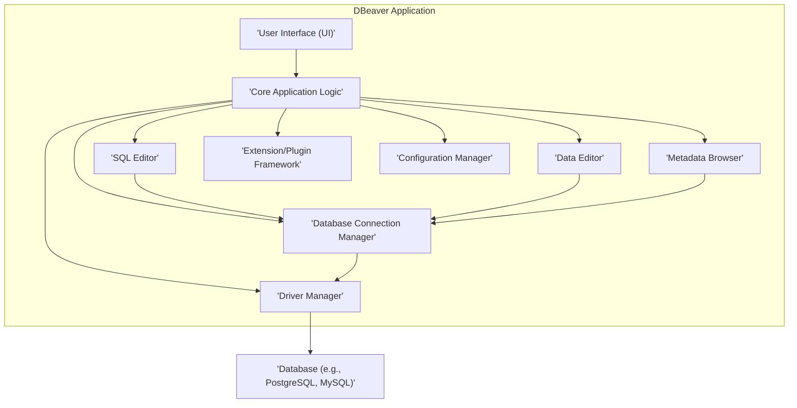
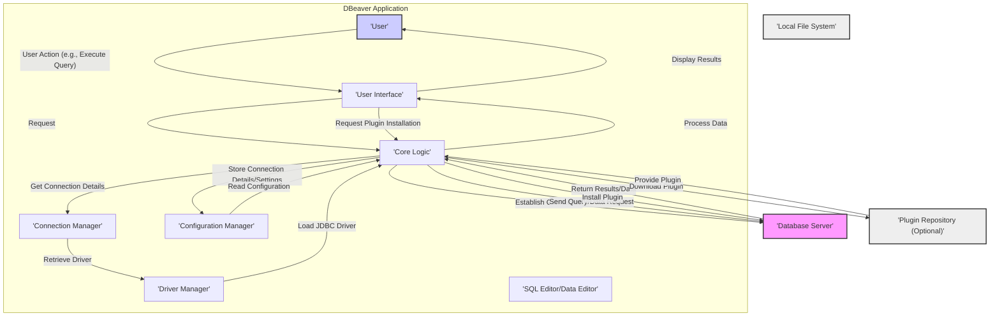

# Project Design Document: DBeaver

**Version:** 1.1
**Date:** October 26, 2023
**Prepared By:** Gemini (AI Language Model)

## 1. Introduction

This document provides an enhanced and more detailed architectural design of the DBeaver project, an open-source universal database tool. This refined design is specifically intended to serve as a robust foundation for subsequent threat modeling activities, enabling a deeper understanding of the system's components, interactions, data flows, and potential vulnerabilities.

### 1.1. Purpose

The primary purpose of this document is to provide a clear and comprehensive architectural blueprint of DBeaver to facilitate effective and targeted threat modeling. It aims to meticulously identify key components, delineate data flows, and illustrate interactions within the system, providing the granular context necessary for thorough security analysis and the identification of potential attack vectors.

### 1.2. Scope

This document covers the core architecture of the DBeaver desktop application, focusing on its internal components and their interactions relevant to security. It includes:

*   A detailed high-level system architecture breakdown.
*   In-depth descriptions of key components and their specific responsibilities.
*   A granular depiction of data flow within the application, including data transformations.
*   A clear illustration of interactions with external systems, specifically database servers.
*   Expanded initial security considerations, highlighting potential threat areas.

This document does not cover:

*   Fine-grained implementation details within individual modules or classes.
*   Specific internal workings of individual database drivers beyond their role as communication interfaces.
*   The architecture of any potential DBeaver Cloud offering or related services.
*   Low-level details of the plugin architecture's implementation, focusing instead on its role and potential security implications.

### 1.3. Target Audience

This document is intended for:

*   Security engineers and architects tasked with performing threat modeling on DBeaver.
*   Software developers contributing to the DBeaver project who require a detailed understanding of the system's architecture for development and security considerations.
*   Technical stakeholders seeking a comprehensive architectural overview of DBeaver.

## 2. System Overview

DBeaver is a feature-rich desktop application designed to empower users to connect to, manage, and interact with a wide array of database systems. It offers functionalities ranging from browsing database objects and executing complex SQL queries to editing data directly and managing multiple database connections simultaneously. The core functionality hinges on establishing connections to diverse database systems through their respective drivers, presenting a unified and intuitive interface for database management tasks.

## 3. Architectural Design

The DBeaver architecture is structured around several interconnected key components, each with specific responsibilities:

*   **User Interface (UI):** The primary point of interaction for the user, built using a framework like Eclipse SWT/JFace. It handles user input, displays data, and presents application controls.
*   **Core Application Logic:** The central orchestrator of the application. It manages the application lifecycle, coordinates interactions between components, handles user requests, and enforces business logic.
*   **Database Connection Manager:** Responsible for managing the lifecycle of database connections. This includes establishing new connections, storing connection details (potentially sensitive), retrieving existing connections, and handling connection pooling.
*   **SQL Editor:** Provides a dedicated environment for writing, editing, and executing SQL queries. Features include syntax highlighting, auto-completion, and query history. It interacts closely with the Database Connection Manager to execute queries on the selected database.
*   **Data Editor:** Allows users to view, modify, insert, and delete data within database tables. It handles data type conversions and interacts with the Database Connection Manager to perform data manipulation operations.
*   **Metadata Browser:** Enables users to explore the structure of connected databases, including schemas, tables, views, stored procedures, and other database objects. It retrieves metadata information from the database through the active connection.
*   **Driver Manager:** Manages the loading, registration, and utilization of database-specific JDBC drivers. It provides an abstraction layer for accessing different database types.
*   **Extension/Plugin Framework:** Facilitates the extension of DBeaver's core functionality through plugins. Plugins can add new features, support for additional databases, or customize existing behavior.
*   **Configuration Manager:** Handles the loading, saving, and management of application settings, user preferences, and potentially sensitive information like connection credentials. This data is typically stored in local files.

### 3.1. Component Diagram

### 3.2. Data Flow Diagram

### 3.3. Detailed Data Flow

The primary data flow within DBeaver involves user interaction, query execution, data retrieval, and configuration management:

1. **User Initiates Action:** The user interacts with the User Interface, for example, by typing an SQL query in the SQL Editor or requesting to view data in a table.
2. **UI Relays Request:** The User Interface sends the user's request, along with relevant data (e.g., the SQL query text, target table), to the Core Application Logic.
3. **Connection Management and Driver Retrieval:** The Core Logic interacts with the Database Connection Manager to identify the appropriate database connection. The Connection Manager then utilizes the Driver Manager to ensure the correct JDBC driver for the target database is loaded and available.
4. **Establishing Database Connection:** Using the retrieved driver and stored connection details, the Core Logic establishes a connection to the target Database Server. This may involve authentication and negotiation of connection parameters.
5. **Sending Request to Database:** The Core Logic, or a component like the SQL Editor or Data Editor, formats the user's request into a database-understandable format (e.g., an SQL query) and sends it to the Database Server via the established JDBC connection.
6. **Database Processing:** The Database Server receives the request, processes it according to its internal logic, and prepares a response containing the requested data or the result of the operation.
7. **Receiving Database Response:** The Database Server sends the response back to DBeaver through the JDBC connection.
8. **Core Logic Processing and Transformation:** The Core Application Logic receives the raw data from the database. It may perform transformations, filtering, or formatting of the data as needed.
9. **Data Presentation to User:** The Core Logic sends the processed data back to the User Interface for display to the user in a readable format (e.g., a table, a chart).
10. **Configuration Management:** Separately, the Configuration Manager reads application settings and user preferences from persistent storage (typically local files on the user's machine) during application startup. When users change settings, the Configuration Manager writes these updates back to the persistent storage. This may include sensitive information like encrypted connection credentials.
11. **Plugin Interaction:** If the user interacts with a plugin, the UI communicates with the Core Logic, which then interacts with the Extension/Plugin Framework to delegate tasks to the relevant plugin. Plugins may have their own data flows and interactions with other components or external systems.

### 3.4. Interaction with External Systems

DBeaver's primary interaction with external systems is with database servers and potentially plugin repositories:

*   **Database Systems:** DBeaver connects to a wide variety of database systems (e.g., PostgreSQL, MySQL, Oracle, SQL Server, SQLite) using their respective native protocols encapsulated within JDBC drivers.
*   **JDBC Drivers:** These drivers act as intermediaries, translating DBeaver's requests into the specific language and protocol understood by the target database.
*   **Plugin Repositories (Optional):** Users may interact with external plugin repositories (e.g., online marketplaces or direct download sites) to discover and install extensions for DBeaver. This interaction typically involves downloading plugin files.

## 4. Security Considerations (Expanded)

This section expands on the initial security considerations, providing a more detailed view of potential threats based on the architectural design.

*   **Credential Management and Storage:**
    *   **Threat:** Exposure of database connection credentials (usernames, passwords, connection strings) stored by the Configuration Manager.
    *   **Considerations:**  Encryption of stored credentials is crucial. The strength of the encryption algorithm and the security of the encryption key are paramount. Access controls on the configuration files are also important.
    *   **Potential Attack Vectors:**  Malware accessing local files, unauthorized access to user's machine, insecure storage of encryption keys.
*   **Data Transmission Security:**
    *   **Threat:** Interception or modification of data transmitted between DBeaver and the database server.
    *   **Considerations:**  Enforcing the use of secure connection protocols like TLS/SSL for database connections. Proper validation of server certificates to prevent man-in-the-middle attacks.
    *   **Potential Attack Vectors:**  Man-in-the-middle attacks on network traffic, eavesdropping on unencrypted connections.
*   **SQL Injection Vulnerabilities:**
    *   **Threat:** Execution of malicious SQL code injected by users, potentially leading to data breaches or unauthorized database modifications.
    *   **Considerations:**  The SQL Editor and Data Editor must be designed to prevent SQL injection. Utilizing parameterized queries or prepared statements is essential. Input validation and sanitization can provide additional layers of defense.
    *   **Potential Attack Vectors:**  Malicious users intentionally crafting harmful SQL, vulnerabilities in query building logic.
*   **Plugin Security Risks:**
    *   **Threat:** Installation of malicious or vulnerable plugins that could compromise DBeaver or the user's system.
    *   **Considerations:**  Implementing mechanisms for plugin verification and signing. Consider sandboxing plugins to limit their access to system resources and DBeaver's core functionality. Clear communication to users about the risks associated with installing third-party plugins.
    *   **Potential Attack Vectors:**  Users unknowingly installing malware disguised as plugins, vulnerabilities in plugin code.
*   **Local File System Security:**
    *   **Threat:** Unauthorized access to or modification of DBeaver's configuration files or other sensitive data stored locally.
    *   **Considerations:**  Implementing appropriate file system permissions to restrict access to configuration files. Avoiding storing highly sensitive information in plain text.
    *   **Potential Attack Vectors:**  Malware accessing local files, privilege escalation attacks.
*   **Authentication and Authorization within DBeaver:**
    *   **Threat:** Unauthorized access to DBeaver's settings or functionalities.
    *   **Considerations:** While database authentication is primary, consider internal authentication mechanisms for sensitive DBeaver operations or settings. Role-based access control within the application could be beneficial for enterprise deployments.
    *   **Potential Attack Vectors:**  Exploiting vulnerabilities in DBeaver's internal authentication, if present.
*   **Software Supply Chain Security:**
    *   **Threat:** Compromise of DBeaver's build process or dependencies, leading to the distribution of malicious software.
    *   **Considerations:**  Maintaining a secure build environment, verifying dependencies, and using code signing to ensure the integrity of DBeaver distributions.
    *   **Potential Attack Vectors:**  Compromised build servers, malicious dependencies.

## 5. Technologies Used

*   **Primary Programming Language:** Java.
*   **User Interface Toolkit:** Eclipse SWT (Standard Widget Toolkit) and JFace.
*   **Database Connectivity Standard:** JDBC (Java Database Connectivity).
*   **Plugin Framework:** Likely based on the Eclipse Equinox OSGi framework.
*   **Configuration Management:**  Utilizes Java properties files or XML files, potentially with encryption libraries for sensitive data.

## 6. Deployment Model

DBeaver is primarily deployed as a standalone desktop application installed directly on user machines.

*   **Installation Process:** Users download installer packages (e.g., .exe, .dmg, .deb) from the official website or trusted repositories and install the application locally.
*   **Execution Environment:** The application runs directly on the user's operating system, requiring a Java Runtime Environment (JRE).
*   **Update Mechanism:** DBeaver typically includes a built-in update mechanism that allows users to download and install new versions of the application. Updates can also be performed manually by downloading and installing new releases.

## 7. Future Considerations

*   **Enhanced Cloud Database Integration:**  Further development could focus on tighter integration with cloud-based database services, potentially involving direct API interactions or specialized connection workflows.
*   **Centralized Configuration and Policy Management:** For enterprise environments, features for centrally managing DBeaver configurations and security policies could be introduced.
*   **Advanced Security Features:**  Future enhancements might include features like multi-factor authentication for database connections, more granular access controls within the application, and improved auditing capabilities.

This enhanced design document provides a more comprehensive and detailed understanding of the DBeaver architecture, specifically tailored for effective threat modeling. The detailed component descriptions, data flow diagrams, and expanded security considerations offer a solid foundation for identifying and mitigating potential security vulnerabilities.