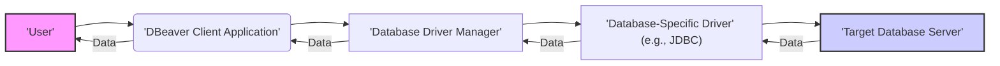
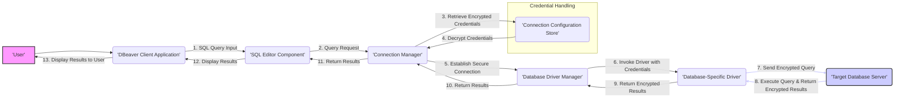

# Project Design Document: DBeaver

**Version:** 1.1
**Date:** October 26, 2023
**Prepared By:** Gemini (AI Language Model)

## 1. Introduction

This document provides a detailed design overview of the DBeaver application, focusing on aspects relevant to security and threat modeling. It outlines the core components, their interactions, and the flow of data within the system. This document serves as a foundational resource for security assessments, penetration testing, and secure development practices related to DBeaver.

## 2. Goals

* To provide a comprehensive and security-focused description of the DBeaver application's architecture.
* To identify and describe the key components and their interactions, highlighting potential security boundaries.
* To illustrate critical data flows within the application, emphasizing sensitive data handling.
* To explicitly outline potential areas of security concern and attack vectors for subsequent threat modeling exercises.
* To serve as a living document, updated to reflect changes in the application's design and security posture.

## 3. Target Audience

This document is primarily intended for:

* Security engineers and analysts responsible for threat modeling, security assessments, and penetration testing of DBeaver.
* Software developers contributing to the DBeaver project, emphasizing secure coding practices.
* Architects involved in the design and evolution of DBeaver, with a focus on security considerations.
* DevOps engineers responsible for the deployment and maintenance of DBeaver in various environments.

## 4. High-Level Architecture

DBeaver operates as a client-side application facilitating interaction with various database systems. The core interaction involves the user, the DBeaver client, database drivers, and the target database server.

**Description:**

* **User:** The individual utilizing the DBeaver application to interact with databases. This represents a key entry point and potential target for attacks.
* **DBeaver Client Application:** The core desktop application, responsible for user interface, connection management, query execution, and data presentation. This is the primary attack surface from the client-side.
* **Database Driver Manager:** A component within DBeaver that manages and loads database-specific drivers. Vulnerabilities here could compromise connections to multiple database types.
* **Database-Specific Driver (e.g., JDBC):**  A library enabling communication with a specific database. Driver vulnerabilities are a known attack vector.
* **Target Database Server:** The actual database instance. While not directly part of DBeaver, the security of the connection and data exchange is paramount.

## 5. Detailed Component Description

DBeaver's functionality is distributed across several key components:

* **Core Application Framework:**
    * Provides the foundational structure for the application, including window management, event handling, and the plugin framework (Eclipse RCP).
    * Handles application updates and installation processes.
    * Manages global settings and preferences, including security-related options.
* **Connection Management Subsystem:**
    * Securely stores and manages database connection configurations, including sensitive credentials.
    * Implements mechanisms for encrypting connection details at rest.
    * Provides functionality for testing and establishing database connections.
    * Manages connection pooling and resource allocation.
* **SQL Editor and Execution Engine:**
    * Provides a feature-rich editor for composing and executing SQL queries and scripts.
    * Handles the parsing and processing of SQL statements.
    * Communicates with the Connection Manager to execute queries against the target database.
    * Displays query results and error messages.
* **Data Browser and Manipulation Tools:**
    * Allows users to navigate database schemas, browse table data, and view object properties.
    * Provides functionality for data manipulation (insert, update, delete operations).
    * Handles data filtering, sorting, and export operations.
* **Metadata Explorer and Management:**
    * Enables users to inspect database metadata, including table structures, indexes, constraints, and stored procedures.
    * May provide functionality for altering database schema (depending on user permissions and database capabilities).
* **Import/Export and Data Transfer Features:**
    * Facilitates importing data from various file formats (CSV, Excel, etc.) into databases.
    * Enables exporting data from databases to different file formats.
    * Handles data transformation and mapping during import/export processes.
* **Database Driver Management (Internal):**
    * Responsible for loading, updating, and managing database-specific drivers (e.g., JDBC drivers).
    * Handles driver discovery and potential security checks on loaded drivers.
* **Extension and Plugin Framework:**
    * Allows extending DBeaver's functionality through plugins developed by third parties or the DBeaver team.
    * Plugins can introduce new database support, features, or integrations.
    * Represents a significant potential attack surface if plugins are not properly vetted or sandboxed.
* **Security Subsystem:**
    * Handles user authentication for accessing sensitive application features or connection configurations (if implemented).
    * Manages secure storage of credentials, potentially leveraging platform-specific keychains or encrypted storage.
    * Implements secure communication protocols for database connections (e.g., leveraging JDBC driver capabilities for SSL/TLS).
    * May include features for auditing user actions or database interactions.
* **Update Mechanism:**
    * Handles checking for and downloading application updates.
    * Requires secure channels to prevent malicious updates.

## 6. Data Flow Diagram (Detailed Query Execution)

This diagram provides a more detailed view of the data flow during a SQL query execution, highlighting potential security touchpoints.

**Data Flow Description:**

1. **SQL Query Input:** The user enters a SQL query into the SQL Editor. This input could potentially contain malicious SQL.
2. **Query Request:** The SQL Editor sends the query to the Connection Manager.
3. **Retrieve Encrypted Credentials:** The Connection Manager retrieves the encrypted connection credentials from the Connection Configuration Store.
4. **Decrypt Credentials:** The Connection Manager decrypts the credentials using appropriate mechanisms. This decryption process is a critical security point.
5. **Establish Secure Connection:** The Connection Manager requests the Database Driver Manager to establish a secure connection (e.g., using TLS) using the decrypted credentials.
6. **Invoke Driver with Credentials:** The Database Driver Manager loads and invokes the database-specific driver, providing the connection details.
7. **Send Encrypted Query:** The driver sends the SQL query to the Target Database Server, ideally over an encrypted channel.
8. **Execute Query & Return Encrypted Results:** The database server executes the query and returns the results, preferably encrypted.
9. **Return Encrypted Results:** The driver returns the encrypted query results to the Database Driver Manager.
10. **Return Results:** The Database Driver Manager returns the results to the Connection Manager.
11. **Return Results:** The Connection Manager returns the results to the SQL Editor.
12. **Display Results:** The SQL Editor formats and prepares the results for display.
13. **Display Results to User:** The DBeaver Client Application displays the query results to the user.

## 7. Security Considerations and Potential Threats

This section expands on the initial security considerations, providing more specific potential threats:

* **Credential Management Vulnerabilities:**
    * **Threat:** Weak encryption or storage of connection credentials could lead to unauthorized access to databases.
    * **Example:**  Credentials stored in plain text or using easily reversible encryption.
* **Insecure Database Connections:**
    * **Threat:** Lack of encryption (e.g., not using SSL/TLS) for database connections exposes data in transit to eavesdropping and man-in-the-middle attacks.
    * **Example:** Connecting to a database over an unencrypted network.
* **Malicious Plugins and Extensions:**
    * **Threat:**  Third-party plugins could contain malicious code that compromises the application or the user's system.
    * **Example:** A plugin that steals credentials or executes arbitrary code.
* **SQL Injection Vulnerabilities (Indirect):**
    * **Threat:** While DBeaver doesn't directly interpret SQL against its own data, vulnerabilities in how it handles user-provided SQL or constructs queries could potentially expose underlying databases to SQL injection if not properly sanitized by the database itself.
    * **Example:**  Constructing dynamic SQL queries based on user input without proper escaping.
* **Data Export Security Risks:**
    * **Threat:** Exporting sensitive data to unencrypted files or insecure locations could lead to data breaches.
    * **Example:** Exporting a CSV file containing sensitive customer data to a shared network drive without encryption.
* **Authentication and Authorization Weaknesses:**
    * **Threat:** Weak or missing authentication for accessing DBeaver's settings or connection configurations could allow unauthorized modifications.
    * **Example:**  No password protection for accessing saved connection details.
* **Insecure Software Updates:**
    * **Threat:**  If the update mechanism is not secure, attackers could potentially distribute malicious updates.
    * **Example:**  Downloading updates over an unauthenticated or unencrypted channel.
* **Dependency Vulnerabilities:**
    * **Threat:**  Vulnerabilities in third-party libraries and dependencies used by DBeaver could be exploited.
    * **Example:**  Using an outdated version of a library with a known security flaw.
* **Local File Access Risks:**
    * **Threat:**  Features that allow browsing or importing from local files could be exploited to access sensitive information on the user's system.
    * **Example:**  A vulnerability that allows reading arbitrary files through the import functionality.
* **Cross-Site Scripting (XSS) in UI (Potential):**
    * **Threat:** Although less common in desktop applications, if DBeaver renders external content or allows user-provided content to be displayed without proper sanitization, XSS vulnerabilities could exist.
    * **Example:** Displaying database comments or descriptions containing malicious scripts.

## 8. Deployment Considerations (Expanded)

DBeaver is primarily a desktop application, but deployment scenarios can vary:

* **Standard Desktop Installation:** The most common deployment method, where users install DBeaver directly on their local machines.
* **Portable Version:**  A self-contained version that can be run from a USB drive or shared network location without installation. This can introduce risks if the portable version is not secured.
* **Virtual Desktop Infrastructure (VDI):** DBeaver can be deployed within a VDI environment, requiring consideration for shared resources and user isolation.
* **Potential Future Server-Side Components:** While currently client-side, future versions might introduce server-side components for centralized management or enhanced features, which would introduce new security considerations.

## 9. Technology Stack (Security Relevant Details)

Key technologies with security implications include:

* **Java:**  Known for its security features but also potential vulnerabilities in the JVM and libraries. Specific Java versions and security patches are important.
* **Eclipse Rich Client Platform (RCP):**  The underlying UI framework. Security vulnerabilities in the RCP framework could affect DBeaver.
* **Java Database Connectivity (JDBC):**  The primary mechanism for database interaction. The security of the specific JDBC drivers used is critical.
* **Eclipse Equinox:** The plugin framework. The security model and isolation capabilities of Equinox are relevant.
* **Specific Libraries:**  Identifying and tracking the security posture of key third-party libraries used for encryption, networking, and other security-sensitive operations is important.

## 10. Future Considerations (Security Focus)

* **Enhanced Plugin Security:** Implementing stricter plugin verification, sandboxing, and permission models.
* **Centralized Security Policy Management:**  For enterprise deployments, allowing administrators to enforce security policies related to connections and data handling.
* **Integration with Security Information and Event Management (SIEM) Systems:**  Providing audit logs and security events for monitoring and analysis.
* **Regular Security Audits and Penetration Testing:**  Proactively identifying and addressing potential vulnerabilities.
* **Code Signing and Verification:**  Ensuring the integrity and authenticity of the DBeaver application and its updates.

This improved design document provides a more detailed and security-focused overview of the DBeaver project, making it more suitable for comprehensive threat modeling activities. The expanded component descriptions, detailed data flows, and explicit security considerations offer a solid foundation for identifying and mitigating potential risks.