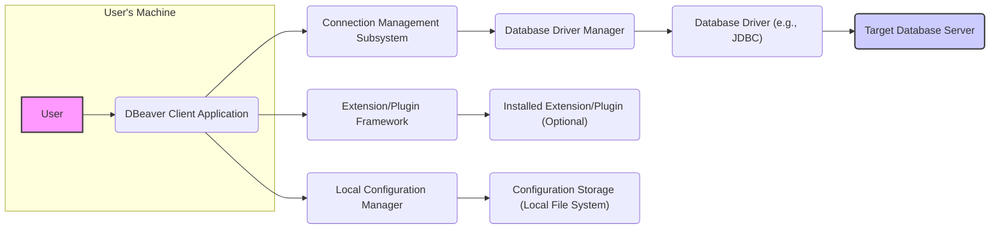

# Project Design Document: DBeaver

**Version:** 1.1
**Date:** October 26, 2023
**Author:** AI Software Architect

## 1. Introduction

This document provides an enhanced architectural design of the DBeaver project, an open-source universal database tool. This detailed design will serve as a robust foundation for subsequent threat modeling activities, offering a comprehensive understanding of the system's components, interactions, and data flows.

## 2. Project Overview

DBeaver is a free, open-source, multi-platform database tool designed for developers, SQL programmers, database administrators, and analysts. It offers broad support for a wide array of SQL and NoSQL databases, providing functionalities for browsing database objects, constructing and executing SQL queries, editing data directly, and managing database connections efficiently.

## 3. High-Level Architecture

**Description:**

*   **User:** The individual directly interacting with the DBeaver application to perform database-related tasks.
*   **DBeaver Client Application:** The core desktop application, providing the user interface and the primary functionalities for database interaction.
*   **Connection Management Subsystem:**  A dedicated part of the DBeaver client responsible for handling the lifecycle of database connections, including creation, storage, and management of connection parameters.
*   **Database Driver Manager:** A component within DBeaver that manages and loads the appropriate database drivers required for connecting to different database systems.
*   **Database Driver (e.g., JDBC):** A vendor-specific software library that implements the necessary communication protocols for DBeaver to interact with a particular type of database.
*   **Target Database Server:** The external database system (e.g., MySQL, PostgreSQL) where the data is stored and managed. DBeaver connects to this server to perform operations.
*   **Extension/Plugin Framework:** The architecture within DBeaver that allows for the integration of optional modules to extend its core functionality.
*   **Installed Extension/Plugin (Optional):**  Individual modules that add new features or enhance existing ones, installed by the user.
*   **Local Configuration Manager:**  The component responsible for managing DBeaver's configuration settings, including reading from and writing to the local file system.
*   **Configuration Storage (Local File System):** The location on the user's machine where DBeaver stores user preferences, connection details (potentially encrypted), and other configuration data.

## 4. Component Details

*   **DBeaver Client Application:**
    *   **User Interface (UI) Layer:** Built using the Eclipse Rich Client Platform (RCP), providing a rich graphical interface for user interaction. This includes windows, menus, toolbars, and editors.
    *   **Core Functionality Layer:**
        *   **Connection Manager:**  Handles the creation, modification, storage (including potential encryption of credentials), and testing of database connections.
        *   **SQL Editor:** Provides a feature-rich text editor for writing and executing SQL queries, with functionalities like syntax highlighting, auto-completion, and query formatting.
        *   **Data Editor:** Allows users to view, edit, insert, and delete data within database tables in a tabular format.
        *   **Database Navigator:** Presents a hierarchical view of connected databases, schemas, tables, views, procedures, and other database objects.
        *   **Import/Export Subsystem:** Manages the import and export of data to and from various file formats (e.g., CSV, JSON, XML).
        *   **Administration Tools (Database Specific):** Provides interfaces for managing database users, roles, permissions, and other administrative tasks, varying based on the connected database.
        *   **Plugin Management Subsystem:**  Handles the installation, uninstallation, enabling, and disabling of extensions and plugins.
    *   **Communication Layer:** Manages communication with database drivers and external resources.
*   **Connection Management Subsystem:**
    *   Stores connection configurations, potentially including sensitive information like passwords (ideally encrypted).
    *   Provides mechanisms for testing connections and managing connection states.
    *   May interact with credential storage mechanisms provided by the operating system.
*   **Database Driver Manager:**
    *   Maintains a list of supported database types and their corresponding drivers.
    *   Dynamically loads driver classes based on the selected connection type.
    *   May download drivers from external repositories or prompt the user to provide them.
*   **Database Driver (e.g., JDBC):**
    *   Implements the JDBC (or other relevant) API for a specific database vendor.
    *   Handles the low-level communication with the target database server, translating DBeaver's requests into the database's native protocol.
*   **Target Database Server:**
    *   The specific database system being managed (e.g., MySQL, PostgreSQL, Oracle, SQL Server, MongoDB, Cassandra).
    *   Responsible for authenticating incoming connections, authorizing user actions, and executing database operations.
*   **Extension/Plugin Framework:**
    *   Defines APIs and interfaces that plugins can implement to extend DBeaver's functionality.
    *   Provides mechanisms for plugins to interact with the core application and access its services.
*   **Installed Extension/Plugin (Optional):**
    *   Examples include: specialized data visualization tools, NoSQL database explorers, advanced SQL formatting tools, integration with version control systems.
    *   Can introduce their own dependencies and security considerations.
*   **Local Configuration Manager:**
    *   Reads and writes configuration data to files on the local file system.
    *   Handles user preferences, UI settings, and potentially cached data.
    *   May be responsible for encrypting sensitive configuration data.
*   **Configuration Storage (Local File System):**
    *   Typically located within the user's profile directory (e.g., `.dbeaver` on Linux/macOS, `AppData` on Windows).
    *   May contain files storing connection details, user preferences, and plugin configurations.

## 5. Data Flow

The primary data flow involves the user interacting with the DBeaver client to query or manipulate data within a target database. Here are a few specific scenarios:

*   **Establishing a Database Connection:**
    1. **User Input:** The user provides connection details (host, port, username, password) in the DBeaver client.
    2. **Connection Manager:** The Connection Management Subsystem receives the details and potentially encrypts the password.
    3. **Driver Request:** The Connection Manager requests the appropriate Database Driver from the Database Driver Manager.
    4. **Driver Loading:** The Database Driver Manager loads the required driver.
    5. **Connection Attempt:** DBeaver uses the driver to attempt a connection to the Target Database Server, sending authentication credentials.
    6. **Authentication:** The Target Database Server authenticates the credentials and establishes the connection.

*   **Executing a SELECT Query:**
    1. **User Input:** The user writes and executes an SQL SELECT query in the SQL Editor.
    2. **Query Submission:** The DBeaver client sends the SQL query to the Target Database Server via the active Database Driver.
    3. **Query Processing:** The Target Database Server parses, optimizes, and executes the query.
    4. **Result Retrieval:** The Target Database Server sends the query results back to the DBeaver client via the Database Driver.
    5. **Data Display:** The DBeaver client displays the retrieved data in the Data Editor or a results pane.

*   **Modifying Data (e.g., UPDATE Statement):**
    1. **User Action:** The user modifies data in the Data Editor or executes an SQL UPDATE statement.
    2. **Statement Submission:** The DBeaver client sends the data modification statement to the Target Database Server via the Database Driver.
    3. **Data Modification:** The Target Database Server executes the statement, modifying the data in the database.
    4. **Confirmation (Optional):** The Target Database Server may send a confirmation or status message back to DBeaver.

*   **Loading Plugin Configuration:**
    1. **Application Startup:** On startup, the DBeaver client's Plugin Management Subsystem identifies installed plugins.
    2. **Configuration Request:** The Plugin Management Subsystem requests configuration data for each plugin from the Local Configuration Manager.
    3. **Configuration Retrieval:** The Local Configuration Manager reads the plugin's configuration from the Configuration Storage (Local File System).
    4. **Configuration Loading:** The plugin's configuration is loaded into the DBeaver client.

## 6. Technology Stack

*   **Core Programming Language:** Java
*   **User Interface Framework:** Eclipse Rich Client Platform (RCP)
*   **Database Connectivity API:** Java Database Connectivity (JDBC) API as the primary mechanism, with support for other driver types like ODBC.
*   **Plugin Framework:** Eclipse Equinox for managing and loading plugins.
*   **Dependency Management:** Maven or Gradle for managing project dependencies.
*   **Configuration Storage Format:** Typically file-based, using formats like XML, JSON, or properties files.
*   **Operating System Support:** Cross-platform, supporting Windows, macOS, and Linux.

## 7. Deployment Model

DBeaver is primarily deployed as a desktop application. Common deployment methods include:

*   **Standalone Installer:** Users download an installer package (e.g., `.exe` for Windows, `.dmg` for macOS, `.deb` or `.rpm` for Linux) from the official website or trusted repositories.
*   **Portable Version:** A self-contained version that does not require installation and can be run directly from a directory.
*   **Package Managers:** Installation via operating system package managers (e.g., `apt`, `yum`, `brew`).
*   **Enterprise Deployment:**  Organizations may deploy DBeaver using software distribution tools or centralized management systems.

## 8. Security Considerations (Detailed for Threat Modeling)

This section provides a more detailed breakdown of security considerations, categorized for effective threat modeling.

*   **Authentication and Authorization:**
    *   **Threat:** Weak or default database credentials stored in connection configurations.
    *   **Threat:**  Man-in-the-middle attacks intercepting connection credentials during transmission if encryption is not enforced.
    *   **Threat:**  Insufficient protection of the local configuration file storing connection details.
    *   **Threat:**  Bypass of database authentication if DBeaver itself has vulnerabilities.
    *   **Mitigation:** Encourage strong, unique passwords. Enforce encrypted connections (SSL/TLS). Securely encrypt connection details in local storage.
*   **Data Security (Data at Rest and in Transit):**
    *   **Threat:** Sensitive data in database tables being accessed by unauthorized users through DBeaver.
    *   **Threat:**  Data leakage through insecure import/export processes.
    *   **Threat:**  Exposure of sensitive data in temporary files or logs created by DBeaver.
    *   **Threat:**  Data exfiltration through malicious plugins.
    *   **Mitigation:** Rely on database-level access controls. Implement secure import/export mechanisms. Minimize logging of sensitive data. Implement plugin sandboxing and verification.
*   **Plugin Security:**
    *   **Threat:** Malicious plugins injecting code or accessing sensitive data within DBeaver's context.
    *   **Threat:** Vulnerable plugins introducing security flaws into the application.
    *   **Threat:**  Plugins with excessive permissions compromising the user's system or data.
    *   **Mitigation:** Implement a plugin signing and verification process. Enforce a least-privilege model for plugins. Regularly review and audit plugin code.
*   **Local File Storage Security:**
    *   **Threat:** Unauthorized access to the local configuration file, revealing connection credentials or other sensitive information.
    *   **Threat:**  Malware on the user's machine accessing DBeaver's configuration files.
    *   **Mitigation:** Encrypt sensitive data in the configuration file. Recommend secure file system permissions.
*   **Software Updates and Dependency Management:**
    *   **Threat:**  Using outdated versions of DBeaver with known security vulnerabilities.
    *   **Threat:**  Vulnerabilities in third-party libraries and dependencies used by DBeaver.
    *   **Mitigation:** Implement an automatic update mechanism. Regularly update dependencies and address known vulnerabilities.
*   **Input Validation:**
    *   **Threat:** SQL injection vulnerabilities in the SQL Editor if user input is not properly sanitized.
    *   **Threat:**  Cross-site scripting (XSS) vulnerabilities if DBeaver renders untrusted data.
    *   **Mitigation:** Implement robust input validation and sanitization techniques. Use parameterized queries to prevent SQL injection.
*   **Connection Security:**
    *   **Threat:**  Unencrypted connections exposing data in transit.
    *   **Threat:**  Trusting self-signed certificates for database connections without proper verification.
    *   **Mitigation:** Enforce the use of encrypted connections (SSL/TLS). Provide clear warnings for untrusted certificates.

This enhanced design document provides a more granular and detailed view of the DBeaver project architecture, facilitating a more thorough and effective threat modeling process.