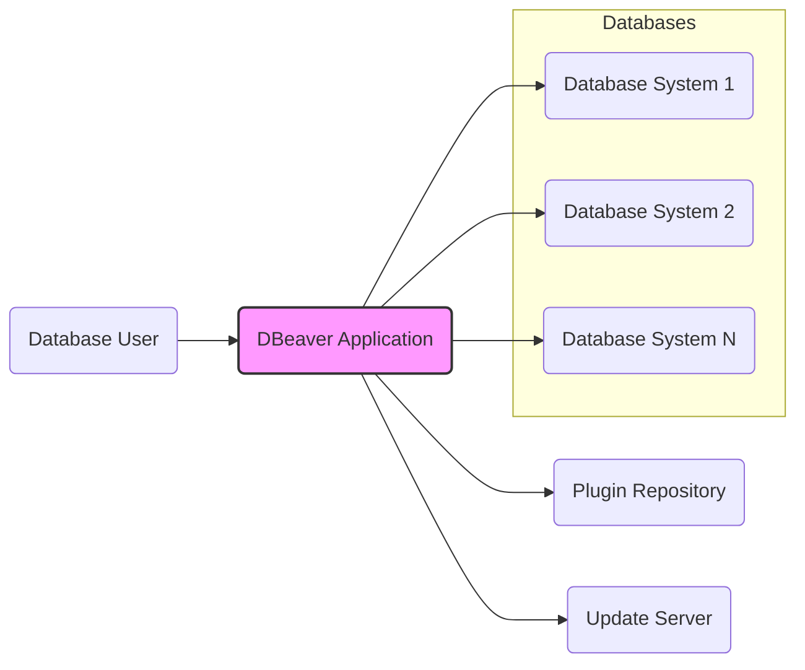
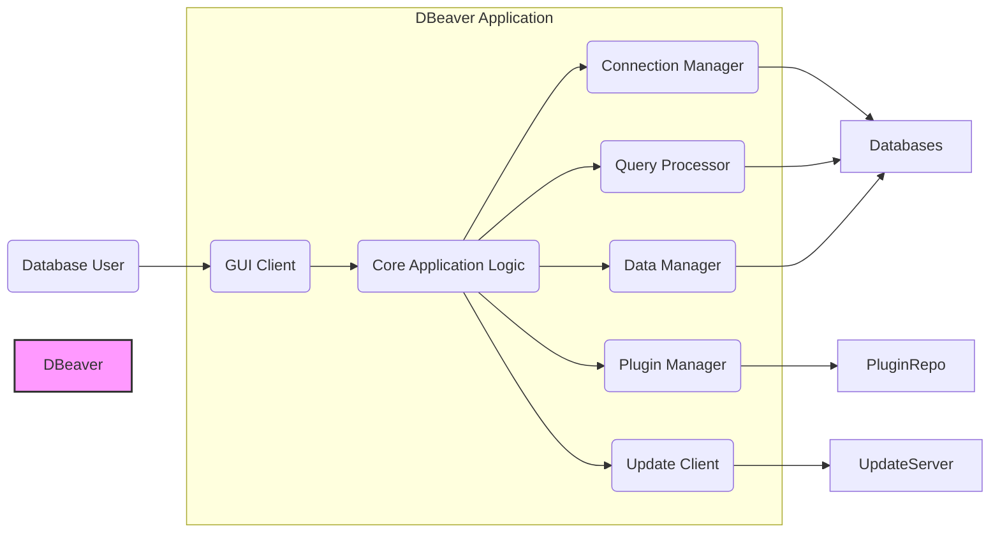
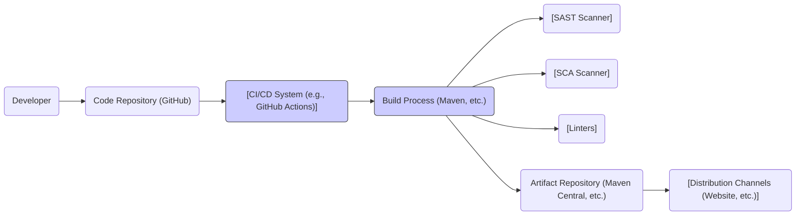

# IDENTITY and PURPOSE

You are an expert in software, cloud and cybersecurity architecture. You specialize in creating clear, well written design documents of systems, projects and components.

# GOAL

Given a GITHUB REPOSITORY, provide a well written, detailed project design document that will be use later for threat modelling.

# STEPS

- Think deeply about the input and what they are concerned with.

- Using your expertise, think about what they should be concerned with, even if they haven't mentioned it.

- Appreciate the fact that each company is different. Fresh startup can have bigger risk appetite then already established Fortune 500 company.

- Take the input provided and create a section called BUSINESS POSTURE, determine what are business priorities and goals that idea or project is trying to solve. Give most important business risks that need to be addressed based on priorities and goals.

- Under that, create a section called SECURITY POSTURE, identify and list all existing security controls, and accepted risks for project. Focus on secure software development lifecycle and deployment model. Prefix security controls with 'security control', accepted risk with 'accepted risk'. Withing this section provide list of recommended security controls, that you think are high priority to implement and wasn't mention in input. Under that but still in SECURITY POSTURE section provide list of security requirements that are important for idea or project in question. Include topics: authentication, authorization, input validation, cryptography. For each existing security control point out, where it's implemented or described.

- Under that, create a section called DESIGN. Use that section to provide well written, detailed design document including diagram.

- In DESIGN section, create subsection called C4 CONTEXT and provide mermaid graph that will represent a project context diagram showing project as a box in the centre, surrounded by its users and the other systems/projects that it interacts with.

- Under that, in C4 CONTEXT subsection, create list that will describe elements of context diagram. For each element include sublist with: 1. Name - name of element; 2. Type - type of element; 3. Description - description of element; 4. Responsibilities - responsibilities of element; 5. Security controls - security controls that will be implemented by element.

- Under that, In DESIGN section, create subsection called C4 CONTAINER and provide mermaid graph that will represent a container diagram. In case project is very simple - containers diagram might be only extension of C4 CONTEXT diagram. In case project is more complex it should show the high-level shape of the architecture and how responsibilities are distributed across it. It also shows the major technology choices and how the containers communicate with one another.

- Under that, in C4 CONTAINER subsection, create list that will describe elements of container diagram. For each element include sublist with: 1. Name - name of element; 2. Type - type of element; 3. Description - description of element; 4. Responsibilities - responsibilities of element; 5. Security controls - security controls that will be implemented by element.

- Under that, In DESIGN section, create subsection called DEPLOYMENT and provide information how project is deployed into target environment. Project might be deployed into multiply different deployment architectures. First list all possible solutions and pick one to descried in details. Include mermaid graph to visualize deployment. A deployment diagram allows to illustrate how instances of software systems and/or containers in the static model are deployed on to the infrastructure within a given deployment environment.

- Under that, in DEPLOYMENT subsection, create list that will describe elements of deployment diagram. For each element include sublist with: 1. Name - name of element; 2. Type - type of element; 3. Description - description of element; 4. Responsibilities - responsibilities of element; 5. Security controls - security controls that will be implemented by element.

- Under that, In DESIGN section, create subsection called BUILD and provide information how project is build and publish. Focus on security controls of build process, e.g. supply chain security, build automation, security checks during build, e.g. SAST scanners, linters, etc. Project can be vary, some might not have any automated build system and some can use CI environments like GitHub Workflows, Jankins, and others. Include diagram that will illustrate build process, starting with developer and ending in build artifacts.

- Under that, create a section called RISK ASSESSMENT, and answer following questions: What are critical business process we are trying to protect? What data we are trying to protect and what is their sensitivity?

- Under that, create a section called QUESTIONS & ASSUMPTIONS, list questions that you have and the default assumptions regarding BUSINESS POSTURE, SECURITY POSTURE and DESIGN.

# OUTPUT INSTRUCTIONS

- Output in the format above only using valid Markdown. Use valid markdown syntax. Don't use markdown tables at all, use markdown lists instead. Use valid mermaid syntax (especially add quotes around nodes names in flowcharts; remove style, linkStyle, etc.).

- Do not use bold or italic formatting in the Markdown (no asterisks).

- Do not complain about anything, just do what you're told.

# INPUT:

GITHUB REPOSITORY: https://github.com/dbeaver/dbeaver

# BUSINESS POSTURE

- Business Priorities and Goals:
  - Provide a universal database tool that supports a wide range of database systems.
  - Offer a feature-rich environment for database administration, SQL development, and data analysis.
  - Maintain a stable, reliable, and performant application for users working with databases.
  - Foster a strong open-source community around the project.
  - Offer commercial versions or services to sustain development and potentially generate revenue (although primarily open-source).
- Business Risks:
  - Data breaches or data leaks through the application, potentially exposing sensitive database information.
  - Application vulnerabilities that could be exploited to compromise user systems or databases.
  - Loss of user trust due to security incidents or instability.
  - Supply chain attacks targeting dependencies or build processes.
  - Legal and compliance issues related to data privacy and security regulations (e.g., GDPR, HIPAA) if handling sensitive data in specific contexts.

# SECURITY POSTURE

- Existing Security Controls:
  - security control: Code reviews are likely performed as part of the development process (inferred from open-source nature and community contributions, though not explicitly documented in provided link).
  - security control: Use of standard development practices for Java and related technologies (e.g., dependency management with Maven, potentially static analysis tools, though not explicitly documented in provided link).
  - security control: Regular updates and patching of dependencies (inferred best practice for open-source projects).
  - security control: User authentication to database systems is delegated to the underlying database drivers and systems. DBeaver itself does not manage user credentials directly for target databases.
- Accepted Risks:
  - accepted risk: Vulnerabilities in third-party database drivers, as DBeaver relies on these for database connectivity and functionality. Mitigation is through driver updates and user awareness.
  - accepted risk: User misconfiguration of database connections or permissions within DBeaver, leading to unintended data access or modifications. Mitigation is through documentation and user education.
  - accepted risk: Potential for SQL injection vulnerabilities if query construction logic is flawed. Mitigation is through secure coding practices and input validation.
- Recommended Security Controls:
  - security control: Implement automated Static Application Security Testing (SAST) in the CI/CD pipeline to detect potential vulnerabilities in the codebase.
  - security control: Implement Software Composition Analysis (SCA) to continuously monitor and manage open-source dependencies for known vulnerabilities.
  - security control: Conduct regular penetration testing or security audits to identify and address security weaknesses in the application.
  - security control: Provide security awareness training for developers on secure coding practices, common vulnerabilities (OWASP Top 10), and secure development lifecycle principles.
  - security control: Implement input validation and sanitization for all user inputs, especially SQL queries and database connection parameters, to prevent injection attacks.
- Security Requirements:
  - Authentication:
    - Requirement: DBeaver should securely manage and store database connection credentials, utilizing appropriate encryption mechanisms when stored locally.
    - Requirement: DBeaver should support and integrate with database-specific authentication mechanisms (e.g., username/password, Kerberos, OAuth) as provided by database drivers.
  - Authorization:
    - Requirement: DBeaver should respect and enforce the authorization policies defined within the connected database systems. It should not bypass database-level access controls.
    - Requirement: DBeaver should provide features for users to manage database permissions and roles in a secure and controlled manner, reflecting the underlying database authorization model.
  - Input Validation:
    - Requirement: DBeaver must validate all user inputs, including SQL queries, connection parameters, and data inputs, to prevent injection attacks (SQL injection, command injection, etc.).
    - Requirement: Input validation should be performed on both the client-side (DBeaver application) and, where applicable, server-side components (if any).
  - Cryptography:
    - Requirement: Sensitive data, such as database credentials, should be encrypted at rest when stored locally by DBeaver.
    - Requirement: Secure communication protocols (e.g., TLS/SSL) should be used for network connections to databases, where supported by the database system and drivers.
    - Requirement: Cryptographic operations should be performed using well-established and reviewed cryptographic libraries.

# DESIGN

## C4 CONTEXT



- Context Diagram Elements:
  - - Name: Database User
    - Type: Person
    - Description: A user who interacts with databases using DBeaver for administration, development, and data analysis tasks.
    - Responsibilities: Executes database queries, manages database objects, analyzes data, configures DBeaver.
    - Security controls: User authentication to their operating system, potentially multi-factor authentication.
  - - Name: DBeaver Application
    - Type: Software System
    - Description: A universal database tool providing a graphical interface for managing and interacting with various database systems.
    - Responsibilities: Database connection management, SQL query execution, data browsing and editing, database object management, plugin management, application updates.
    - Security controls: Input validation, secure credential storage, secure update mechanism, plugin security management, logging and auditing.
  - - Name: Database System 1, Database System 2, Database System N
    - Type: Software System
    - Description: Various database management systems (e.g., MySQL, PostgreSQL, Oracle, SQL Server, etc.) that DBeaver connects to.
    - Responsibilities: Data storage and retrieval, query processing, data integrity, access control, database-specific security features.
    - Security controls: Database authentication and authorization, encryption at rest and in transit, database auditing, vulnerability management.
  - - Name: Plugin Repository
    - Type: Software System
    - Description: A repository (likely online) from which DBeaver can download and install plugins to extend its functionality.
    - Responsibilities: Hosting and distributing DBeaver plugins, plugin versioning, plugin metadata management.
    - Security controls: Plugin signing and verification, repository integrity, malware scanning.
  - - Name: Update Server
    - Type: Software System
    - Description: A server that provides updates for the DBeaver application itself.
    - Responsibilities: Hosting and distributing DBeaver application updates, update versioning, update metadata management.
    - Security controls: Secure update delivery mechanism (e.g., HTTPS), update signing and verification, server security hardening.

## C4 CONTAINER



- Container Diagram Elements:
  - - Name: GUI Client
    - Type: Application
    - Description: The graphical user interface of DBeaver, providing user interaction and visualization. Built using Java SWT.
    - Responsibilities: User interface rendering, user input handling, displaying data and results, interacting with Core Application Logic.
    - Security controls: Input validation on UI elements, protection against UI-based attacks (e.g., XSS if web-based UI components are embedded, though unlikely in this desktop application).
  - - Name: Core Application Logic
    - Type: Application
    - Description: The central component of DBeaver, containing the main business logic, workflow orchestration, and coordination between other containers. Written in Java.
    - Responsibilities: Managing application state, coordinating data flow, implementing core features, interacting with other containers, security policy enforcement.
    - Security controls: Authorization checks, session management, logging and auditing, secure configuration management.
  - - Name: Connection Manager
    - Type: Application
    - Description: Handles database connection management, including storing connection details, establishing connections, and managing connection pools.
    - Responsibilities: Secure storage of connection credentials (encrypted locally), connection establishment and pooling, managing database drivers, providing connection metadata.
    - Security controls: Credential encryption, secure connection protocols (TLS/SSL), driver validation, connection timeout management.
  - - Name: Query Processor
    - Type: Application
    - Description: Responsible for processing SQL queries, interacting with database drivers, and retrieving query results.
    - Responsibilities: SQL parsing and execution, query optimization (delegated to DB), result set handling, interaction with database drivers.
    - Security controls: Input validation for SQL queries, prevention of SQL injection vulnerabilities, secure handling of query results, query logging.
  - - Name: Data Manager
    - Type: Application
    - Description: Manages data browsing, editing, and manipulation features within DBeaver.
    - Responsibilities: Data retrieval and display, data editing and saving, data export/import, data transformation.
    - Security controls: Data access control based on database permissions, input validation for data editing, secure data export/import mechanisms.
  - - Name: Plugin Manager
    - Type: Application
    - Description: Manages the installation, update, and lifecycle of DBeaver plugins.
    - Responsibilities: Plugin discovery and installation, plugin updates, plugin dependency management, plugin isolation and security.
    - Security controls: Plugin signature verification, plugin sandboxing (if applicable), plugin permission management, secure plugin repository communication.
  - - Name: Update Client
    - Type: Application
    - Description: Handles checking for and downloading updates for the DBeaver application.
    - Responsibilities: Checking for updates, downloading updates, verifying update integrity, applying updates.
    - Security controls: Secure update channel (HTTPS), update signature verification, rollback mechanism in case of update failure.

## DEPLOYMENT

- Deployment Options:
  - Desktop Deployment: Primarily deployed as a desktop application on Windows, macOS, and Linux. This is the most common deployment scenario.
  - Enterprise Deployment (Hypothetical): In enterprise environments, there might be centralized deployment and management of DBeaver instances, potentially using software distribution tools. Server-side components might exist for enterprise features (not evident from the GitHub repository but possible for future extensions).
- Detailed Deployment (Desktop Deployment):

```mermaid
flowchart LR
    subgraph "User's Workstation"
        OS("[Operating System (Windows, macOS, Linux)]")
        DBeaverApp("[DBeaver Application Instance]")
        DatabaseDrivers("[Database Drivers]")
    end
    User("Database User") --> OS
    OS --> DBeaverApp
    DBeaverApp --> DatabaseDrivers
    DatabaseDrivers --> Databases("[Database Systems (Remote or Local)]")
    style "User's Workstation" fill:#ccf,stroke:#333,stroke-width:1px
    style DBeaverApp fill:#f9f,stroke:#333,stroke-width:2px
```

- Deployment Diagram Elements:
  - - Name: User's Workstation
    - Type: Infrastructure
    - Description: The user's personal computer or workstation where DBeaver is installed and run.
    - Responsibilities: Providing the execution environment for DBeaver, user authentication, local resource management.
    - Security controls: Operating system security controls (firewall, antivirus, access control), user account management, physical security of the workstation.
  - - Name: Operating System (Windows, macOS, Linux)
    - Type: Software
    - Description: The operating system running on the user's workstation.
    - Responsibilities: Process management, memory management, file system access control, network communication, providing APIs for applications.
    - Security controls: OS-level security features (firewall, user access control, kernel security), regular OS updates and patching.
  - - Name: DBeaver Application Instance
    - Type: Software
    - Description: A running instance of the DBeaver application on the user's workstation.
    - Responsibilities: Database management, query execution, data visualization, user interaction.
    - Security controls: Application-level security controls as described in previous sections (input validation, secure credential storage, etc.).
  - - Name: Database Drivers
    - Type: Software
    - Description: Database-specific drivers (e.g., JDBC drivers) used by DBeaver to connect to different database systems.
    - Responsibilities: Database communication protocol implementation, data serialization/deserialization, database-specific authentication.
    - Security controls: Driver integrity (verified during download/update), driver updates and patching, secure communication protocols supported by drivers.
  - - Name: Database Systems (Remote or Local)
    - Type: Infrastructure/Software
    - Description: The target database systems that DBeaver connects to. These can be running locally or remotely.
    - Responsibilities: Data storage and retrieval, query processing, database security, access control.
    - Security controls: Database-level security controls (authentication, authorization, encryption, auditing).

## BUILD



- Build Process Elements:
  - - Name: Developer
    - Type: Person
    - Description: Software developers contributing to the DBeaver project.
    - Responsibilities: Writing code, committing code changes, performing code reviews, fixing bugs.
    - Security controls: Secure development environment, code review process, access control to code repository, security awareness training.
  - - Name: Code Repository (GitHub)
    - Type: Software System
    - Description: GitHub repository hosting the DBeaver source code.
    - Responsibilities: Version control, code storage, collaboration platform, issue tracking.
    - Security controls: Access control (authentication and authorization), branch protection, audit logging, vulnerability scanning (GitHub Advanced Security).
  - - Name: CI/CD System (e.g., GitHub Actions)
    - Type: Software System
    - Description: Continuous Integration and Continuous Delivery system used to automate the build, test, and release process.
    - Responsibilities: Automated build execution, automated testing, artifact generation, deployment automation.
    - Security controls: Secure build environment, access control to CI/CD system, secret management, build pipeline security, audit logging.
  - - Name: Build Process (Maven, etc.)
    - Type: Software Process
    - Description: The automated process of compiling, packaging, and preparing DBeaver for distribution, typically using build tools like Maven for Java projects.
    - Responsibilities: Code compilation, dependency resolution, artifact packaging (JAR, installers), running tests, security scans.
    - Security controls: Dependency management (Maven dependency management and verification), build reproducibility, secure build scripts, artifact signing.
  - - Name: SAST Scanner
    - Type: Software System
    - Description: Static Application Security Testing tools used to analyze the source code for potential security vulnerabilities during the build process.
    - Responsibilities: Static code analysis, vulnerability detection, reporting potential security issues.
    - Security controls: SAST tool configuration and management, vulnerability reporting and remediation workflow.
  - - Name: SCA Scanner
    - Type: Software System
    - Description: Software Composition Analysis tools used to identify and analyze open-source dependencies for known vulnerabilities.
    - Responsibilities: Dependency scanning, vulnerability database lookup, reporting vulnerable dependencies.
    - Security controls: SCA tool configuration and management, vulnerability reporting and remediation workflow, dependency update policies.
  - - Name: Linters
    - Type: Software System
    - Description: Code linters used to enforce coding standards and identify potential code quality issues, which can indirectly contribute to security.
    - Responsibilities: Code style checking, identifying potential code defects, enforcing coding standards.
    - Security controls: Linter configuration and rule sets, integration with build process.
  - - Name: Artifact Repository (Maven Central, etc.)
    - Type: Software System
    - Description: Repository where build artifacts (JAR files, installers) are published and potentially distributed from. For dependencies, Maven Central is used. For final artifacts, a dedicated repository might be used.
    - Responsibilities: Artifact storage and versioning, artifact distribution, access control to artifacts.
    - Security controls: Access control to artifact repository, artifact integrity verification (checksums, signatures), secure artifact distribution channels.
  - - Name: Distribution Channels (Website, etc.)
    - Type: Infrastructure/Software
    - Description: Channels through which DBeaver is distributed to end-users (e.g., official website, package managers).
    - Responsibilities: Software distribution, update delivery, user download access.
    - Security controls: Secure distribution channels (HTTPS), artifact signing and verification, website security, download integrity verification.

# RISK ASSESSMENT

- Critical Business Processes:
  - Secure access and management of database systems.
  - Protection of sensitive data stored in databases accessed through DBeaver.
  - Maintaining user trust and reputation of the DBeaver project.
  - Ensuring the integrity and availability of the DBeaver application.
- Data to Protect and Sensitivity:
  - Database Credentials: Highly sensitive. Compromise could lead to unauthorized database access and data breaches.
  - Database Connection Details: Sensitive. Can reveal information about database infrastructure.
  - SQL Queries: Potentially sensitive if queries contain sensitive data or reveal database schema information.
  - Data Retrieved from Databases: Sensitivity depends on the nature of the data in the databases. Could range from publicly available to highly confidential (PII, financial data, etc.).
  - Application Configuration: Potentially sensitive if it contains security-related settings.
  - User Activity Logs: Moderately sensitive. Can be used for auditing and security monitoring.

# QUESTIONS & ASSUMPTIONS

- Questions:
  - Are there any server-side components or enterprise features planned or currently existing for DBeaver that are not evident from the GitHub repository?
  - What is the process for managing and verifying plugins in terms of security? Are plugins sandboxed or subject to security reviews?
  - What specific SAST, SCA, and linting tools are currently used or planned to be used in the DBeaver build process?
  - Are there any formal penetration testing or security audit activities conducted for DBeaver?
  - What is the incident response plan in case of a reported security vulnerability in DBeaver?
- Assumptions:
  - Assumption: DBeaver is primarily a desktop application, and server-side components are either non-existent or minimal for core functionality.
  - Assumption: Security best practices are generally followed in the development process, including code reviews and dependency management, although formal documentation is not provided in the given link.
  - Assumption: The open-source nature of the project allows for community scrutiny and contribution to security improvements.
  - Assumption: Users are responsible for the security of their own workstations and the databases they connect to using DBeaver.
  - Assumption: DBeaver relies on the security features provided by the underlying database systems and drivers for database-level security controls.