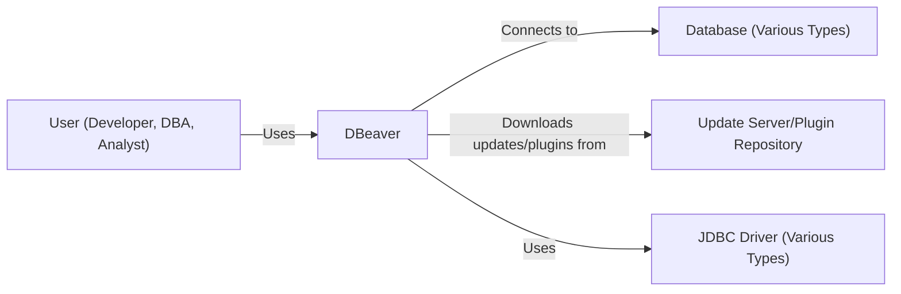
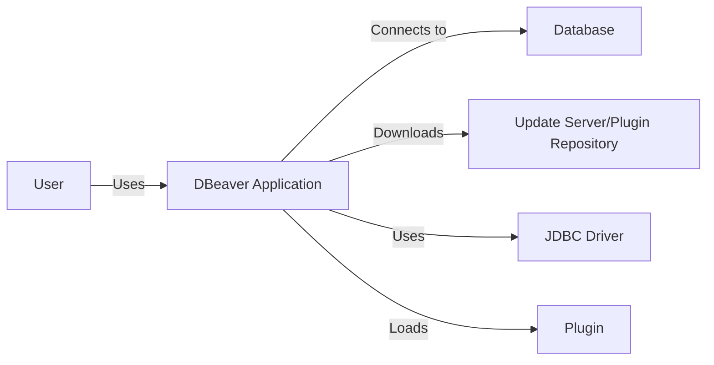
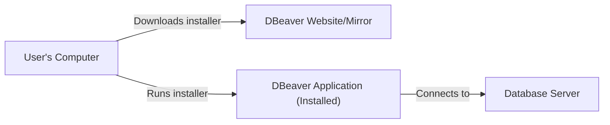
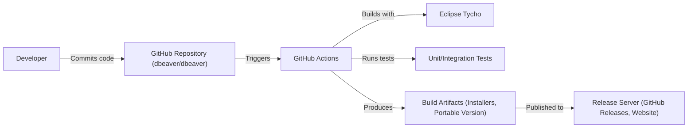

Okay, let's create a design document for DBeaver, focusing on aspects relevant for threat modeling.

# BUSINESS POSTURE

DBeaver is a universal database management tool. Its primary business goals revolve around providing a free, open-source, and feature-rich solution for developers, database administrators, and analysts to interact with various database systems.

Priorities:

*   User Adoption and Community Growth: Expanding the user base and fostering a strong community are crucial for DBeaver's continued development and support.
*   Feature Completeness: Offering a comprehensive set of features that rival or exceed commercial database tools.
*   Cross-Platform Compatibility: Supporting a wide range of operating systems and database systems.
*   Usability and User Experience: Providing an intuitive and efficient interface for users of varying skill levels.
*   Extensibility: Allowing users to extend DBeaver's functionality through plugins.

Business Risks:

*   Data Breaches: As a tool that directly interacts with databases, unauthorized access or data leakage is a major risk. This could stem from vulnerabilities within DBeaver itself, compromised user credentials, or exploits in the underlying database systems.
*   Malicious Plugins: The plugin architecture introduces a risk of malicious code being introduced, potentially compromising data or system security.
*   Supply Chain Attacks: Compromise of DBeaver's build or distribution process could lead to the distribution of a trojanized version of the software.
*   Reputational Damage: Security incidents or data breaches could severely damage DBeaver's reputation and erode user trust.
*   Lack of Funding/Resources: As an open-source project, maintaining consistent development and security efforts can be challenging due to resource constraints.
*   Compliance Violations: Users might use DBeaver to access databases containing sensitive data, making compliance with regulations like GDPR, HIPAA, or PCI DSS a concern. DBeaver itself doesn't store this data, but its misuse could lead to violations.

# SECURITY POSTURE

Existing Security Controls:

*   security control: Authentication Passthrough: DBeaver primarily relies on the underlying database system's authentication mechanisms. It doesn't store user credentials persistently unless explicitly configured by the user (e.g., saving passwords for convenience). (Implemented in database connection configuration)
*   security control: JDBC Driver Security: DBeaver uses JDBC drivers to connect to databases. The security of these drivers is crucial, and DBeaver relies on the driver vendors to provide secure implementations. (Implemented in JDBC driver configuration)
*   security control: SSH Tunneling: DBeaver supports SSH tunneling for secure connections to remote databases. (Implemented in connection settings)
*   security control: SSL/TLS Encryption: DBeaver supports SSL/TLS encryption for database connections, protecting data in transit. (Implemented in connection settings)
*   security control: Basic Input Validation: DBeaver performs some basic input validation to prevent common injection attacks, but it largely relies on the database system to handle SQL injection prevention. (Implemented in query editor and data editor)
*   security control: Plugin Verification (Limited): DBeaver has some basic mechanisms for verifying the integrity of plugins, but this is not a comprehensive security solution. (Implemented in plugin manager)
*   security control: Open Source Code: The open-source nature of DBeaver allows for community scrutiny and identification of potential vulnerabilities. (Described in GitHub repository)
*   security control: Regular Updates: DBeaver provides regular updates, which often include security fixes. (Described in release notes)

Accepted Risks:

*   accepted risk: User Credential Management: Users are responsible for securely managing their database credentials. DBeaver provides options for saving passwords, which introduces a risk if the user's system is compromised.
*   accepted risk: Plugin Security: While some verification is done, the plugin architecture inherently introduces a risk of malicious or vulnerable plugins.
*   accepted risk: SQL Injection (Partial): DBeaver relies heavily on the database system's built-in SQL injection prevention mechanisms. While it performs some basic input validation, it's not a complete defense.
*   accepted risk: Driver Security: DBeaver depends on the security of third-party JDBC drivers. Vulnerabilities in these drivers could be exploited.

Recommended Security Controls:

*   Implement a robust plugin signing and verification mechanism to ensure the integrity and authenticity of plugins.
*   Provide more comprehensive input validation and sanitization to mitigate the risk of SQL injection and other injection attacks.
*   Offer integration with secure credential storage solutions (e.g., password managers).
*   Conduct regular security audits and penetration testing.
*   Implement a Software Bill of Materials (SBOM) to track dependencies and identify potential vulnerabilities.
*   Enhance build process security to prevent supply chain attacks (see BUILD section).

Security Requirements:

*   Authentication:
    *   Support for various database authentication methods (e.g., username/password, Kerberos, LDAP).
    *   Option to use multi-factor authentication (MFA) where supported by the database system.
    *   Secure storage of connection settings (encryption at rest).
*   Authorization:
    *   Leverage the database system's authorization mechanisms (roles, permissions).
    *   Provide granular control over user access to features within DBeaver (e.g., restricting access to certain database objects or operations).
*   Input Validation:
    *   Implement robust input validation and sanitization to prevent SQL injection, cross-site scripting (XSS), and other injection attacks.
    *   Use parameterized queries or prepared statements whenever possible.
*   Cryptography:
    *   Use strong encryption algorithms for secure connections (SSL/TLS).
    *   Encrypt sensitive data at rest (e.g., saved connection settings).
    *   Use secure random number generators.

# DESIGN

## C4 CONTEXT

Element Descriptions:

*   Element:
    *   Name: User
    *   Type: Person
    *   Description: A developer, database administrator, data analyst, or any other individual who uses DBeaver to interact with databases.
    *   Responsibilities: Connects to databases, executes queries, manages data, administers database systems.
    *   Security controls: Strong password practices, multi-factor authentication (if supported by the database), awareness of phishing and social engineering attacks.

*   Element:
    *   Name: DBeaver
    *   Type: Software System
    *   Description: The DBeaver universal database tool.
    *   Responsibilities: Provides a user interface for interacting with databases, manages connections, executes queries, displays results, provides database administration tools.
    *   Security controls: Authentication passthrough, SSH tunneling, SSL/TLS encryption, basic input validation, plugin verification (limited).

*   Element:
    *   Name: Database
    *   Type: Software System
    *   Description: A database system (e.g., MySQL, PostgreSQL, Oracle, SQL Server, etc.).
    *   Responsibilities: Stores and manages data, enforces access control, executes queries.
    *   Security controls: Authentication, authorization, access control lists, encryption at rest, auditing, database firewall.

*   Element:
    *   Name: Update Server/Plugin Repository
    *   Type: Software System
    *   Description: A server or repository that hosts DBeaver updates and plugins.
    *   Responsibilities: Provides updates and plugins for download.
    *   Security controls: Code signing, integrity checks, secure hosting environment, vulnerability scanning.

*   Element:
    *   Name: JDBC Driver
    *   Type: Software Library
    *   Description: A Java Database Connectivity (JDBC) driver that allows DBeaver to connect to specific database systems.
    *   Responsibilities: Provides a standardized interface for interacting with databases.
    *   Security controls: Secure coding practices, vulnerability management, regular updates.

## C4 CONTAINER

Since DBeaver is a desktop application, the container diagram is relatively simple and closely mirrors the context diagram.

Element Descriptions:

*   Element:
    *   Name: User
    *   Type: Person
    *   Description: (Same as in Context Diagram)
    *   Responsibilities: (Same as in Context Diagram)
    *   Security controls: (Same as in Context Diagram)

*   Element:
    *   Name: DBeaver Application
    *   Type: Desktop Application
    *   Description: The main DBeaver application running on the user's desktop.
    *   Responsibilities: (Same as DBeaver in Context Diagram)
    *   Security controls: (Same as DBeaver in Context Diagram)

*   Element:
    *   Name: Database
    *   Type: Software System
    *   Description: (Same as in Context Diagram)
    *   Responsibilities: (Same as in Context Diagram)
    *   Security controls: (Same as in Context Diagram)

*   Element:
    *   Name: Update Server/Plugin Repository
    *   Type: Software System
    *   Description: (Same as in Context Diagram)
    *   Responsibilities: (Same as in Context Diagram)
    *   Security controls: (Same as in Context Diagram)

*   Element:
    *   Name: JDBC Driver
    *   Type: Software Library
    *   Description: (Same as in Context Diagram)
    *   Responsibilities: (Same as in Context Diagram)
    *   Security controls: (Same as in Context Diagram)

*   Element:
    *   Name: Plugin
    *   Type: Software Component
    *   Description: An optional plugin that extends DBeaver's functionality.
    *   Responsibilities: Provides additional features, such as support for specific database systems or data formats.
    *   Security controls: Plugin signing and verification (recommended).

## DEPLOYMENT

DBeaver is a desktop application, and its deployment is relatively straightforward.  It can be deployed in several ways:

1.  **Direct Download and Installation:** Users download the appropriate installer (e.g., .exe, .dmg, .deb, .rpm) for their operating system from the DBeaver website or a trusted mirror and run the installer.
2.  **Package Managers:**  DBeaver can be installed via package managers like `apt`, `yum`, `brew`, or `chocolatey`.
3.  **Portable Version:** A portable version of DBeaver is available, which doesn't require installation and can be run from a USB drive or other portable storage.
4.  **Enterprise Deployment:** In enterprise environments, DBeaver might be deployed using software distribution tools (e.g., SCCM, Group Policy).

We will describe the *Direct Download and Installation* in detail:

Element Descriptions:

*   Element:
    *   Name: User's Computer
    *   Type: Desktop Computer
    *   Description: The user's computer where DBeaver is installed and run.
    *   Responsibilities: Runs the DBeaver application, connects to databases.
    *   Security controls: Operating system security updates, antivirus software, firewall.

*   Element:
    *   Name: DBeaver Website/Mirror
    *   Type: Web Server
    *   Description: The official DBeaver website or a trusted mirror where users can download the installer.
    *   Responsibilities: Provides the DBeaver installer for download.
    *   Security controls: HTTPS, secure hosting environment, regular security updates, file integrity monitoring.

*   Element:
    *   Name: DBeaver Application (Installed)
    *   Type: Desktop Application
    *   Description: The installed DBeaver application on the user's computer.
    *   Responsibilities: (Same as DBeaver in Context Diagram)
    *   Security controls: (Same as DBeaver in Context Diagram)

*   Element:
    *   Name: Database Server
    *   Type: Server Computer
    *   Description: The server hosting the database system.
    *   Responsibilities: Hosts the database, manages data, enforces access control.
    *   Security controls: (Same as Database in Context Diagram)

## BUILD

DBeaver's build process is crucial for preventing supply chain attacks.  The project uses Eclipse Tycho and GitHub Actions for building and releasing.

Element Descriptions:

*    Element:
    *    Name: Developer
    *    Type: Person
    *    Description: A DBeaver developer who contributes code to the project.
    *    Responsibilities: Writes code, performs code reviews, submits pull requests.
    *    Security controls: Secure coding practices, two-factor authentication for GitHub account.

*    Element:
    *    Name: GitHub Repository (dbeaver/dbeaver)
    *    Type: Source Code Repository
    *    Description: The main DBeaver source code repository hosted on GitHub.
    *    Responsibilities: Stores the source code, tracks changes, manages pull requests.
    *    Security controls: Branch protection rules, code review requirements, access controls.

*    Element:
    *    Name: GitHub Actions
    *    Type: CI/CD Platform
    *    Description: The continuous integration and continuous delivery platform used by DBeaver.
    *    Responsibilities: Automates the build, test, and release process.
    *    Security controls: Secure configuration, access controls, secrets management.

*    Element:
    *    Name: Eclipse Tycho
    *    Type: Build Tool
    *    Description: A Maven plugin used for building Eclipse plugins and applications.
    *    Responsibilities: Compiles the code, resolves dependencies, packages the application.
    *    Security controls: Dependency verification, secure configuration.

*    Element:
    *    Name: Unit/Integration Tests
    *    Type: Test Suite
    *    Description: A set of automated tests that verify the functionality of DBeaver.
    *    Responsibilities: Detects bugs and regressions.
    *    Security controls: Test coverage for security-sensitive areas.

*    Element:
    *    Name: Build Artifacts (Installers, Portable Version)
    *    Type: Software Artifact
    *    Description: The output of the build process, including installers and the portable version of DBeaver.
    *    Responsibilities: Provides the distributable files for DBeaver.
    *    Security controls: Code signing (recommended), checksum verification.

*    Element:
    *    Name: Release Server (GitHub Releases, Website)
    *    Type: Web Server
    *    Description: The servers where the build artifacts are published for download.
    *    Responsibilities: Hosts the DBeaver releases.
    *    Security controls: HTTPS, secure hosting environment, regular security updates.

Security Controls in the Build Process:

*   GitHub Actions Security: Secure configuration of GitHub Actions workflows, including secrets management and access controls.
*   Dependency Management: Using Tycho and Maven for dependency management, but needs enhancement with SBOM and vulnerability scanning.
*   Automated Testing: Unit and integration tests are run as part of the build process.
*   Code Review: Pull requests are reviewed before being merged into the main branch.
*   Branch Protection: Branch protection rules are in place to prevent unauthorized changes to the main branch.

Recommended Enhancements:

*   Implement Software Bill of Materials (SBOM) generation to track dependencies and identify vulnerabilities.
*   Integrate static analysis security testing (SAST) tools into the build pipeline.
*   Implement code signing for build artifacts.
*   Regularly review and update dependencies to address known vulnerabilities.

# RISK ASSESSMENT

Critical Business Processes:

*   Database Connection and Interaction: The core functionality of DBeaver is connecting to and interacting with databases. Any disruption or compromise of this process is critical.
*   Data Querying and Manipulation: Users rely on DBeaver to query and manipulate data. Errors or vulnerabilities in this area could lead to data corruption or loss.
*   Software Updates and Plugin Management: The ability to update DBeaver and install plugins is essential for maintaining functionality and security.

Data Sensitivity:

*   Database Credentials: Highly sensitive. Compromise could lead to unauthorized access to databases.
*   Connection Settings: Sensitive. Could reveal information about the database infrastructure.
*   Query History: Potentially sensitive, depending on the queries executed.
*   Data Retrieved from Databases: Varies greatly in sensitivity. Could range from non-sensitive test data to highly confidential personal or financial information. DBeaver itself doesn't store this data persistently, but it handles it in transit and displays it to the user.

# QUESTIONS & ASSUMPTIONS

Questions:

*   What specific database systems are most commonly used with DBeaver by the target user base? This will help prioritize security testing and hardening efforts.
*   What is the current process for handling security vulnerabilities reported by users or researchers?
*   Are there any existing security audits or penetration tests that have been conducted on DBeaver?
*   What is the level of security expertise within the DBeaver development team?
*   What is the budget allocated for security improvements?
*   What level of logging and auditing is currently implemented within DBeaver?
*   What are the specific compliance requirements that DBeaver users are typically subject to (e.g., GDPR, HIPAA, PCI DSS)?

Assumptions:

*   BUSINESS POSTURE: DBeaver prioritizes user adoption and feature completeness, but also recognizes the importance of security.
*   SECURITY POSTURE: DBeaver has some basic security controls in place, but there is room for significant improvement.
*   DESIGN: The design is relatively simple, as DBeaver is primarily a desktop application. The main security concerns revolve around database connections, plugin security, and the build process.
*   The user base is diverse, ranging from individual developers to large enterprises.
*   Users are responsible for securing their own database systems and credentials.
*   DBeaver relies heavily on the security of third-party JDBC drivers and database systems.
*   The DBeaver development team is open to implementing security improvements.
*   Resources for security improvements may be limited, as DBeaver is an open-source project.