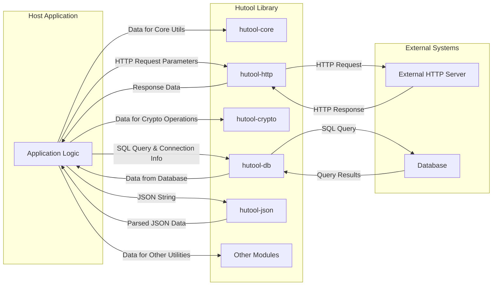

# Project Design Document: Hutool Utility Library

**Version:** 1.1
**Date:** October 26, 2023
**Author:** AI Software Architect

## 1. Introduction

This document provides a detailed design overview of the Hutool utility library, an open-source Java tool library that aims to be a "small but complete" tool set. This document will serve as the foundation for subsequent threat modeling activities. It outlines the key components, architecture, data flow, and external interactions of Hutool, with a focus on aspects relevant to security.

## 2. Goals

* Provide a comprehensive architectural overview of the Hutool library, emphasizing security-relevant aspects.
* Identify key components and their functionalities, with illustrative examples.
* Describe the data flow within the library, including the types of data handled.
* Highlight external interactions and dependencies, noting potential security implications.
* Serve as a basis for identifying potential security threats and vulnerabilities for effective threat modeling.

## 3. Overview

Hutool is a Java utility library designed to simplify common programming tasks. It provides a wide range of static methods, reducing the need for boilerplate code and enhancing developer productivity. Hutool is modular, allowing developers to include only the necessary components, and is intended to be embedded within other Java applications as a dependency.

## 4. Architecture

Hutool's architecture is based on a collection of static utility classes organized into logical modules. It operates as a passive library, meaning it doesn't run independently but is invoked by the host application.

### 4.1. Key Components

* **`hutool-core`:** Provides fundamental utilities.
    * Examples: String manipulation (e.g., `StrUtil.isBlank()`), date formatting (`DateUtil.format()`), collection handling (`CollUtil.isEmpty()`).
    * Functionality includes: Basic data type handling, string, date/time, collection, reflection, resource loading, encoding/decoding, random number generation, validation, and exception handling utilities.
* **`hutool-aop`:** Provides Aspect-Oriented Programming (AOP) support.
    * Example: Defining and applying method interceptors.
* **`hutool-beans`:** Provides utilities for working with Java Beans.
    * Example: Copying properties between beans (`BeanUtil.copyProperties()`).
* **`hutool-bloomfilter`:** Implements Bloom filter data structure.
    * Example: Checking if an element is potentially present in a set.
* **`hutool-cache`:** Provides various caching implementations.
    * Example: Using a LRU cache to store frequently accessed data.
* **`hutool-crypto`:** Offers cryptographic utilities.
    * Examples: Encrypting data with AES (`AES.encrypt()`), hashing passwords with SHA-256 (`SecureUtil.sha256()`).
    * Functionality includes: Encryption/decryption (AES, DES, RSA), hashing (MD5, SHA), MAC, signatures, and secure random number generation.
* **`hutool-db`:** Provides simplified database access utilities.
    * Example: Executing a SQL query and retrieving results.
* **`hutool-extra`:** Contains extended utilities for various purposes.
* **`hutool-http`:** Provides HTTP client functionality.
    * Example: Making a GET request to an external API (`HttpUtil.get()`).
* **`hutool-io`:** Offers Input/Output stream and file handling utilities.
    * Example: Reading the content of a file (`FileUtil.readString()`).
* **`hutool-json`:** Provides JSON processing capabilities.
    * Example: Parsing a JSON string into a Java object (`JSONUtil.toBean()`).
* **`hutool-jwt`:** Implements JSON Web Token (JWT) handling.
    * Example: Creating and verifying JWT tokens.
* **`hutool-log`:** Provides a logging abstraction layer.
* **`hutool-script`:** Supports scripting languages integration.
* **`hutool-setting`:** Provides configuration file handling.
* **`hutool-system`:** Offers system information retrieval.
* **`hutool-socket`:** Provides socket-related utilities.
* **`hutool-swing`:** Contains Swing UI utilities (less relevant for backend security).
* **`hutool-captcha`:** Provides CAPTCHA generation and verification.
* **`hutool-cron`:** Offers task scheduling functionality.
* **`hutool-dfa`:** Implements Deterministic Finite Automaton (DFA) for pattern matching.
* **`hutool-poi`:** Provides utilities for working with Microsoft Office files (e.g., Excel, Word).

### 4.2. Dependencies

Hutool aims for minimal external dependencies in its core module. However, specific modules introduce dependencies to provide their functionality.

* Examples:
    * `hutool-http` may use `okhttp` or the built-in `HttpURLConnection`.
    * `hutool-poi` depends on Apache POI.
    * `hutool-db` requires JDBC drivers.
    * `hutool-crypto` relies on the Java Cryptography Architecture (JCA) and potentially external providers.
    * `hutool-jwt` might depend on libraries for JWT encoding/decoding.

These dependencies are critical for security analysis as they represent potential sources of vulnerabilities. A thorough analysis should include scanning these dependencies for known vulnerabilities.

### 4.3. Deployment

Hutool is deployed as a library within other Java applications. It's typically included as a dependency managed by build tools like Maven or Gradle. The security context of Hutool is therefore the same as the application it's embedded in.

## 5. Data Flow

Data flow in Hutool typically involves the host application passing data to a static method within a Hutool utility class. The method processes the data, potentially using other internal Hutool utilities, and returns the result to the calling application.

Here are some data flow examples:

* **String Encoding:** The host application provides a plain text string to `cn.hutool.core.codec.Base64.encode(String)`. The method encodes the string using Base64 and returns the encoded string.
* **HTTP Request:** The host application provides a URL, headers, and potentially a request body to `HttpUtil.get(String, Map)`. `HttpUtil` uses an underlying HTTP client to send the request to an external server and receives the response. The response data is then returned to the host application.
* **Database Query:** The host application provides a SQL query and database connection details to a method in `hutool-db`. `hutool-db` uses JDBC to execute the query against the database and returns the result set.
* **JSON Parsing:** The host application provides a JSON string to `JSONUtil.parse(String)`. `JSONUtil` parses the string and returns a `JSONObject` or `JSONArray`.

## 6. Security Considerations

Hutool's security is paramount, especially given its widespread use. The following are key security considerations for different modules:

* **`hutool-core`:**
    * **Input Validation:** Ensure utilities handling external input (e.g., data conversion, validation) are robust against malformed or malicious data to prevent unexpected behavior or crashes.
    * **Random Number Generation:** If used for security-sensitive purposes (e.g., generating salts), ensure cryptographically secure random number generators are used.
* **`hutool-crypto`:**
    * **Algorithm Strength:**  Default to strong and modern cryptographic algorithms. Provide clear guidance on choosing appropriate algorithms and key sizes. Avoid or deprecate weak algorithms.
    * **Key Management:**  Hutool itself doesn't manage keys, but documentation should emphasize secure key generation, storage, and handling by the host application.
    * **Padding Schemes:** Use appropriate padding schemes for block ciphers to prevent padding oracle attacks.
    * **Salt Usage:**  Encourage the use of salts for password hashing.
* **`hutool-http`:**
    * **TLS/SSL Configuration:** Ensure secure defaults for HTTPS connections, including certificate validation. Allow configuration for specific security needs.
    * **Request Forgery (CSRF/SSRF):**  While Hutool itself doesn't directly prevent these, its usage in constructing requests needs careful consideration by the host application. Be mindful of constructing URLs from user input.
    * **Header Injection:**  Sanitize or validate headers if they are constructed from external input.
    * **Cookie Handling:**  Handle cookies securely, especially session cookies.
* **`hutool-db`:**
    * **SQL Injection:**  Emphasize the importance of using parameterized queries or prepared statements when constructing SQL queries from external input. Clearly document the risks of string concatenation for query building.
    * **Connection String Security:**  Advise against hardcoding database credentials in connection strings.
* **`hutool-json`:**
    * **Deserialization Vulnerabilities:** Be aware of potential vulnerabilities when deserializing JSON from untrusted sources. Consider using safe deserialization practices.
    * **JSON Injection:** If constructing JSON from external input, ensure proper encoding to prevent injection attacks.
* **`hutool-jwt`:**
    * **Secret Key Management:**  Securely store and manage the secret key used for signing JWTs.
    * **Algorithm Validation:**  Strictly validate the signing algorithm specified in the JWT header to prevent algorithm substitution attacks.
    * **Token Forgery:** Ensure proper verification of JWT signatures.
* **`hutool-io`:**
    * **Path Traversal:**  When handling file paths constructed from external input, implement robust validation to prevent path traversal vulnerabilities.
    * **File Permissions:**  Be mindful of file permissions when creating or modifying files.
* **Dependencies:** Regularly scan dependencies for known vulnerabilities and update them promptly.

## 7. External Interactions

Hutool interacts with external systems through specific modules:

* **External HTTP Servers/APIs (`hutool-http`):** Sends HTTP requests and receives responses. Data exchanged includes request parameters, headers, request bodies, response headers, and response bodies (potentially containing sensitive data).
* **Databases (`hutool-db`):** Connects to and interacts with database systems. Data exchanged includes SQL queries (potentially containing sensitive data), and database records.
* **File System (`hutool-io`, `hutool-poi`):** Reads and writes files. Data exchanged includes file content, file metadata, and file paths.
* **Operating System (indirectly through various modules):** May interact with the OS for tasks like retrieving system information or executing scripts. This interaction should be carefully scrutinized for potential security risks.
* **Other Libraries (via dependencies):**  Interactions are defined by the functionality of the dependent libraries.

## 8. Future Considerations

* **Regular Security Audits:** Conduct periodic security audits of the Hutool codebase by security experts.
* **Secure Defaults:**  Continuously review and improve default configurations for security-sensitive modules to ensure they are secure out-of-the-box.
* **Enhanced Security Documentation:** Provide comprehensive documentation on security best practices when using Hutool, including specific guidance for each module and common security pitfalls.
* **Vulnerability Reporting and Response:** Maintain a clear and responsive process for reporting and addressing security vulnerabilities. Encourage responsible disclosure.
* **Static Analysis Integration:** Integrate static analysis tools into the development process to automatically detect potential security flaws.
* **Consider Security-Focused APIs:** For critical security functions, consider providing higher-level APIs that enforce secure usage patterns.

This improved design document provides a more detailed and security-focused overview of the Hutool library, making it a more effective foundation for subsequent threat modeling activities.