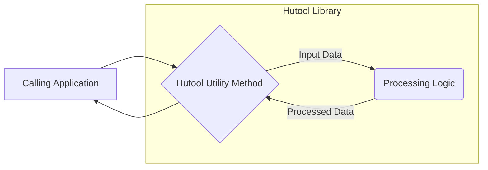

# Project Design Document: Hutool Utility Library (Threat Modeling Focus)

**Document Version:** 1.1
**Date:** October 26, 2023
**Author:** Gemini (AI Language Model)

## 1. Introduction

This document provides a detailed design overview of the Hutool utility library, an open-source Java tool library, specifically tailored to support threat modeling activities. It aims to provide a clear understanding of Hutool's architecture and functionalities to facilitate the identification of potential security vulnerabilities and attack vectors. This document will be used as a foundation for applying threat modeling methodologies like STRIDE to the Hutool library and systems that utilize it.

### 1.1. Purpose

The primary purpose of this document is to provide a comprehensive architectural understanding of the Hutool library from a security perspective, explicitly for threat modeling. It aims to:

* Clearly describe the structure and functionality of Hutool, highlighting security-relevant aspects.
* Identify key components and their interactions, focusing on potential attack surfaces.
* Illustrate data flow within and through the library, pinpointing where data manipulation or interception could occur.
* Explicitly highlight security considerations and potential vulnerabilities associated with different components.

### 1.2. Scope

This document covers the architectural design of the Hutool library as represented in the provided GitHub repository (https://github.com/dromara/hutool). It focuses on the logical components and their relationships, particularly concerning data handling and potential security implications. The scope includes how Hutool interacts with its environment (the calling application).

### 1.3. Target Audience

This document is intended for:

* Security architects and engineers performing threat modeling on systems using Hutool.
* Developers contributing to the Hutool library, emphasizing secure coding practices.
* Security auditors assessing the security posture of applications incorporating Hutool.
* Anyone seeking a security-focused understanding of Hutool's architecture.

## 2. Overview

Hutool is a Java utility library designed to simplify common programming tasks through a collection of static methods. Its modular design allows developers to selectively include necessary components. Understanding the breadth of Hutool's functionalities is crucial for identifying potential attack surfaces that might be exposed when integrating it into larger systems.

Hutool's key functional areas include:

* IO and File Operations: Facilitating file system interactions.
* Data Structures and Algorithms: Providing utility classes for data manipulation.
* Date and Time Handling: Simplifying date and time operations.
* Cryptography: Offering implementations for cryptographic functions.
* HTTP and Network Utilities: Enabling HTTP communication.
* JSON and XML Processing: Supporting data serialization and deserialization.
* Captcha Generation: Providing CAPTCHA creation capabilities.
* Setting and Configuration Management: Handling application settings.
* Bean Manipulation: Utilities for working with Java Beans.
* Scripting and Template Engines: Integrations with dynamic scripting.

Crucially, Hutool operates within the context of a calling Java application. Its security is intertwined with how the host application utilizes its functionalities.

## 3. Architectural Design

Hutool's architecture is characterized by its modular structure, organized into distinct packages. This modularity allows for targeted inclusion of functionalities but also requires careful consideration of the security implications of each included module.

### 3.1. Key Components (with Security Considerations)

The core of Hutool consists of utility classes grouped into logical packages. From a security perspective, the following component areas are particularly relevant:

* **`cn.hutool.core`:** Contains fundamental utilities. Potential security concerns include vulnerabilities in string manipulation functions or insecure default configurations if any exist.
* **`cn.hutool.io`:** Handles file operations. This is a critical area for potential path traversal vulnerabilities, insecure temporary file creation, and improper handling of file permissions.
* **`cn.hutool.util`:** General utilities. Security implications depend on the specific utility being used. For example, utilities involving reflection could be misused.
* **`cn.hutool.crypto`:** Provides cryptographic functions. Risks include using weak or outdated algorithms, improper key management (handled by the calling application, but Hutool's API must facilitate secure usage), and implementation flaws in the cryptographic algorithms themselves.
* **`cn.hutool.http`:** Facilitates HTTP communication. Potential vulnerabilities include insecure handling of cookies, improper validation of SSL certificates, and susceptibility to HTTP request smuggling if not used carefully.
* **`cn.hutool.json`:** Handles JSON processing. Risks include vulnerabilities related to deserialization of untrusted data, potentially leading to remote code execution if not handled securely by the calling application.
* **`cn.hutool.db`:** Provides database access utilities. Susceptible to SQL injection vulnerabilities if input is not properly sanitized *before* being passed to Hutool's database functions.
* **`cn.hutool.extra`:** Integrations with external libraries. Security depends on the security of the integrated libraries.
* **`cn.hutool.cache`:** Offers in-memory caching. Potential risks include storing sensitive data in the cache without proper protection or time-to-live configurations.
* **`cn.hutool.setting`:** Manages configuration. Insecure storage or handling of configuration data (especially secrets) is a concern.
* **`cn.hutool.captcha`:** Generates CAPTCHAs. Weak or predictable CAPTCHA generation can be a security vulnerability.

### 3.2. Dependencies (Security Implications)

Hutool relies on other Java libraries. These dependencies introduce potential security risks if they contain vulnerabilities.

* **Direct Dependencies:**  Libraries directly included by Hutool. These need to be monitored for vulnerabilities.
* **Transitive Dependencies:** Libraries that Hutool's direct dependencies rely on. The security of these must also be considered, although they are less directly controlled by Hutool.

Effective dependency management, including regular updates and vulnerability scanning, is crucial for maintaining the security of applications using Hutool.

### 3.3. Deployment Model (Impact on Security)

Hutool is deployed as a library within other Java applications. This deployment model has significant implications for security:

* **Shared Responsibility:** The security of Hutool usage is a shared responsibility between the Hutool library developers and the developers of the consuming application.
* **Context Matters:**  The specific security risks depend heavily on how Hutool is used within the application. For example, using the HTTP client to interact with untrusted external services introduces different risks than using string manipulation utilities.
* **Attack Surface:** The attack surface includes not only Hutool itself but also the ways in which the consuming application interacts with Hutool's functionalities.

### 3.4. Data Flow (Identifying Potential Interception Points)

Data flow within Hutool is generally initiated by the calling application, which provides input to Hutool's utility methods. Understanding this flow helps identify potential points where data could be manipulated or intercepted.

**Data Flow Description:**

* **Input from Calling Application:** The calling application provides data to Hutool methods. This data could originate from user input, external systems, or internal application logic. This is a critical point for input validation by the calling application *before* passing data to Hutool.
* **Processing within Hutool:** Hutool's utility methods operate on the input data. Potential vulnerabilities within Hutool's processing logic could lead to security issues.
* **Output to Calling Application:** Hutool returns processed data to the calling application. The calling application must handle this data securely.

**Specific Data Flow Examples and Security Considerations:**

* **File Operations (`cn.hutool.io`):** Data flows from the file system into Hutool and potentially back out. Security concerns include unauthorized access to files, manipulation of file contents, and disclosure of sensitive information.
* **HTTP Requests (`cn.hutool.http`):** Data flows from the calling application to external servers and back. Potential interception or manipulation of data in transit is a concern.
* **Cryptographic Operations (`cn.hutool.crypto`):** Sensitive data is processed for encryption or decryption. Secure handling of keys and proper algorithm usage are critical.
* **JSON Processing (`cn.hutool.json`):** Data is serialized or deserialized. Deserialization of untrusted data poses a significant security risk.

## 4. Security Considerations (Detailed Breakdown)

Hutool's design and usage present several security considerations that need careful evaluation during threat modeling.

* **Input Validation and Sanitization (Shared Responsibility):** While Hutool may perform some internal validation, the primary responsibility for validating and sanitizing input lies with the calling application *before* passing data to Hutool. Failure to do so can expose vulnerabilities within Hutool's processing logic.
* **Dependency Management (Critical for Upstream Security):** The security of Hutool is directly tied to the security of its dependencies. Regularly updating dependencies and scanning for vulnerabilities are essential.
* **Secure Cryptographic Practices (User Responsibility):** The `cn.hutool.crypto` module provides building blocks, but the secure usage of these functionalities (e.g., key generation, algorithm selection) is the responsibility of the developer using Hutool. Insecure defaults or improper usage can lead to weak cryptography.
* **HTTP Client Security (Configuration and Usage):** When using `cn.hutool.http`, developers must ensure secure configurations (e.g., proper SSL/TLS handling) and carefully handle responses from external servers to prevent vulnerabilities like cross-site scripting (XSS) or SSRF.
* **File System Security (Permissions and Path Handling):**  Using `cn.hutool.io` requires careful attention to file permissions and preventing path traversal vulnerabilities when constructing file paths based on user input.
* **Deserialization Risks (Handle with Caution):**  Deserializing data using `cn.hutool.json` (or other modules) from untrusted sources is inherently risky and can lead to remote code execution vulnerabilities. Secure deserialization practices must be employed by the calling application.
* **Error Handling and Information Disclosure (Minimize Sensitive Information):** Error handling within Hutool and the calling application should avoid revealing sensitive information in error messages or logs.
* **Logging and Auditing (Application Responsibility):** While Hutool may provide some logging, comprehensive logging and auditing of security-relevant events are primarily the responsibility of the application using Hutool.
* **Principle of Least Privilege (Application Design):**  The calling application should only grant the necessary permissions and access to Hutool's functionalities, following the principle of least privilege.

## 5. Threat Modeling Focus Areas (Specific Questions for Analysis)

When performing threat modeling on systems using Hutool, consider the following questions and areas of investigation:

* **Spoofing:**
    * Can an attacker spoof the source of data being processed by Hutool (e.g., manipulating file paths or HTTP request origins)?
    * Can an attacker spoof the identity of a user interacting with functionalities that utilize Hutool?
* **Tampering:**
    * Can an attacker tamper with data as it flows into, through, or out of Hutool's utility methods?
    * Can configuration settings managed by Hutool be tampered with to malicious effect?
* **Repudiation:**
    * Are actions performed by Hutool auditable? Can a user deny performing an action that involved Hutool?
* **Information Disclosure:**
    * Can Hutool inadvertently disclose sensitive information through error messages, logs, or insecure handling of data?
    * Are there vulnerabilities that could allow an attacker to extract sensitive data processed by Hutool (e.g., through insecure caching or temporary files)?
* **Denial of Service:**
    * Can an attacker cause a denial of service by providing malicious input to Hutool that leads to excessive resource consumption (e.g., very large files or requests)?
    * Can vulnerabilities in Hutool be exploited to crash the application?
* **Elevation of Privilege:**
    * Can an attacker leverage vulnerabilities in Hutool to gain elevated privileges within the application or the underlying system (e.g., through file system manipulation or insecure deserialization)?
* **Specific Module Vulnerabilities:**
    * For each Hutool module used, what are the known vulnerabilities or common attack patterns associated with that type of functionality (e.g., SQL injection for `cn.hutool.db`, path traversal for `cn.hutool.io`)?
    * How does the calling application mitigate these risks when using Hutool?
* **Dependency Chain Analysis:**
    * What are the security vulnerabilities present in Hutool's direct and transitive dependencies?
    * What processes are in place to monitor and update these dependencies?
* **Configuration Security:**
    * If Hutool is used to manage configuration, how are sensitive configuration values (like API keys or database credentials) protected?

## 6. Conclusion

This document provides a security-focused architectural overview of the Hutool utility library, designed to facilitate thorough threat modeling. By understanding Hutool's components, data flow, and inherent security considerations, security professionals and developers can proactively identify and mitigate potential vulnerabilities in systems that utilize this library. Effective threat modeling requires a deep understanding of how Hutool is integrated and used within the specific context of the application. This document should be considered a living document and updated as Hutool evolves and new security insights emerge.