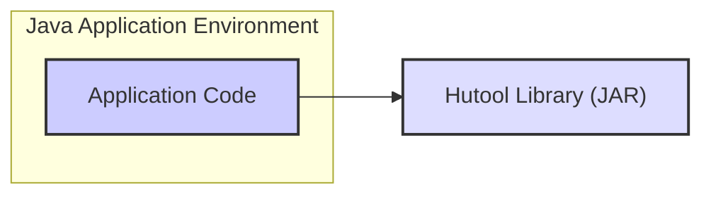
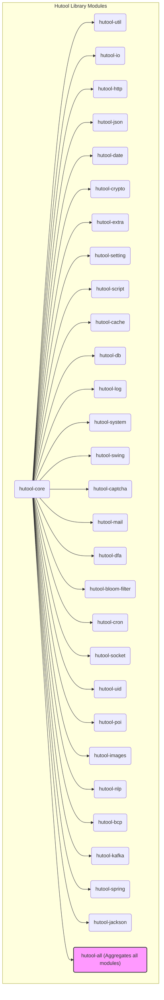
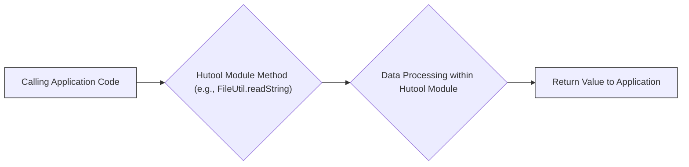

## Project Design Document: Hutool Utility Library (Improved)

**1. Introduction**

This document provides an enhanced design overview of the Hutool Java utility library project. It details the project's objectives, architecture, core components, data flow patterns, and the technologies it employs. This document is specifically crafted to serve as a foundational resource for subsequent threat modeling exercises.

**2. Goals and Objectives**

* **Core Objective:** To offer a robust, user-friendly, and meticulously documented collection of Java utility functions, thereby simplifying common programming tasks for developers.
* **Specific Objectives:**
    * **Broad Functionality:**  Encompass a wide spectrum of utility functions spanning diverse domains such as input/output operations, HTTP communication, JSON processing, date and time manipulation, and cryptographic functions.
    * **Modular Design:** Maintain a lightweight and modular architecture, allowing developers to selectively include only the necessary components.
    * **Performance Focus:** Ensure high levels of performance and efficiency in all utility functions.
    * **Comprehensive Documentation:** Provide clear, concise, and comprehensive documentation alongside illustrative examples for each utility.
    * **Community Engagement:** Foster an active and supportive community of users and contributors.

**3. High-Level Architecture**

Hutool is architected as a modular library intended for inclusion as a dependency within other Java projects. Its fundamental design principle revolves around providing static utility methods, logically grouped into distinct modules based on their functionality.

* **Description:** A Java application incorporates the Hutool library by declaring it as a dependency (typically within a `pom.xml` file for Maven projects or a `build.gradle` file for Gradle projects). The application's code then invokes static methods exposed by Hutool's various modules to perform specific utility operations. Hutool operates within the same Java Virtual Machine (JVM) as the application that utilizes it.

**4. Component Architecture**

Hutool is meticulously organized into a set of independent modules, each dedicated to a specific area of functionality. This modularity empowers developers to selectively include only the modules relevant to their project, thereby minimizing the application's overall size and potential dependency conflicts.

* **Description of Key Modules:**
    * **`hutool-core`:**  Provides foundational utility classes and functions that serve as building blocks for other modules. This includes essential data structures, string manipulation utilities, reflection capabilities, and basic type conversion tools.
    * **`hutool-util`:**  Offers a diverse collection of general-purpose utility methods that don't neatly fit into more specialized modules.
    * **`hutool-io`:**  Handles various input/output operations, encompassing file reading and writing, stream manipulation, resource handling (e.g., closing resources), and working with different character encodings.
    * **`hutool-http`:**  Provides a simplified API for making HTTP requests (GET, POST, PUT, DELETE, etc.) and processing HTTP responses, including handling headers and different content types.
    * **`hutool-json`:**  Facilitates the parsing of JSON strings into Java objects and the generation of JSON strings from Java objects. It supports various JSON libraries internally.
    * **`hutool-date`:**  Offers a comprehensive set of utilities for working with dates and times, including formatting, parsing, calculating differences, and manipulating date components.
    * **`hutool-crypto`:**  Provides cryptographic functionalities such as encryption (symmetric and asymmetric), decryption, hashing algorithms (MD5, SHA-256, etc.), and digital signature generation and verification.
    * **`hutool-extra`:**  Contains utility classes for integrating with external libraries and frameworks, often providing convenience wrappers or adapters.
    * **`hutool-setting`:**  Handles the loading and management of configuration files (e.g., properties files, INI files), providing a structured way to access application settings.
    * **`hutool-script`:**  Enables the execution of scripts written in languages like JavaScript within the Java environment.
    * **`hutool-cache`:**  Provides implementations of various caching mechanisms (e.g., in-memory caches, timed caches) for improving application performance.
    * **`hutool-db`:**  Offers simplified utilities for interacting with databases using JDBC, including query execution, data retrieval, and transaction management.
    * **`hutool-log`:**  Provides abstractions for logging frameworks, allowing developers to switch between different logging implementations without modifying their code extensively.
    * **`hutool-system`:**  Provides access to system-level information, such as operating system details, environment variables, and JVM properties.
    * **`hutool-swing`:**  Offers utility classes specifically for developing Swing-based graphical user interfaces.
    * **`hutool-captcha`:**  Generates and verifies CAPTCHA (Completely Automated Public Turing test to tell Computers and Humans Apart) images to protect against automated bots.
    * **`hutool-mail`:**  Provides functionalities for sending emails, including support for different protocols and authentication methods.
    * **`hutool-dfa`:**  Implements Deterministic Finite Automaton algorithms for efficient pattern matching and text searching.
    * **`hutool-bloom-filter`:**  Provides implementations of Bloom filters, a probabilistic data structure used for membership testing.
    * **`hutool-cron`:**  Offers scheduling capabilities, allowing developers to define and execute tasks at specific times or intervals.
    * **`hutool-socket`:**  Provides utilities for working with network sockets, enabling low-level network communication.
    * **`hutool-uid`:**  Generates unique identifiers (UIDs) using various algorithms.
    * **`hutool-poi`:**  Provides utilities for working with Microsoft Office files, particularly Excel spreadsheets (using the Apache POI library).
    * **`hutool-images`:**  Offers image processing utilities, such as resizing, cropping, and format conversion.
    * **`hutool-nlp`:**  Provides basic Natural Language Processing functionalities, such as text segmentation and keyword extraction.
    * **`hutool-bcp`:**  Utilities for handling the parsing of business card information from images or text.
    * **`hutool-kafka`:**  Provides utilities for interacting with Apache Kafka, a distributed streaming platform.
    * **`hutool-spring`:**  Offers integrations with the Spring Framework, providing utility classes that simplify common Spring-related tasks.
    * **`hutool-jackson`:**  Provides specific utilities for working with the Jackson JSON library.
    * **`hutool-all`:**  A convenience module that aggregates all other Hutool modules into a single dependency. While convenient, it increases the application's size.

**5. Data Flow Patterns**

Data flow within Hutool typically originates from the application code that invokes Hutool's static methods. Data is passed as arguments to these methods, undergoes processing within the relevant Hutool module, and the result is then returned to the calling application.

* **Common Data Flow Scenarios:**
    * **Data Transformation:** The application provides data in one format, and Hutool transforms it into another (e.g., converting a Java object to a JSON string using `hutool-json`).
    * **Data Access:** Hutool facilitates access to external resources (e.g., reading data from a file using `hutool-io`, making an HTTP request using `hutool-http`). The data flows from the external resource through Hutool to the application.
    * **Data Manipulation:** Hutool provides functions to manipulate data (e.g., string manipulation in `hutool-core`, date calculations in `hutool-date`). The application provides the data, Hutool performs the manipulation, and the modified data is returned.
    * **Cryptographic Operations:** The application provides data and cryptographic parameters (e.g., keys), and Hutool performs encryption, decryption, or hashing using `hutool-crypto`.
    * **Data Validation/Verification:** Hutool can be used to validate or verify data against certain criteria. The data flows into Hutool, and a boolean result (or an exception) is returned.

* **Examples of Data Flow in Specific Modules:**
    * **`hutool-io` (File Reading):** The application provides a file path (String). `FileUtil.readString()` reads the file content from the file system. The file content (String) is returned to the application.
    * **`hutool-http` (Making a GET Request):** The application provides a URL (String). `HttpUtil.get()` sends an HTTP GET request to the specified URL over the network. The HTTP response (including headers and body) is returned to the application.
    * **`hutool-json` (Parsing JSON):** The application provides a JSON string. `JSONUtil.parse()` parses the JSON string into a `JSONObject` or `JSONArray`. The parsed JSON object is returned to the application.
    * **`hutool-crypto` (Encrypting Data):** The application provides plaintext data (byte array or String) and an encryption key. `AESUtil.encrypt()` encrypts the data using the provided key. The ciphertext (byte array) is returned to the application.

**6. Technologies Used**

* **Primary Programming Language:** Java
* **Build Automation Tool:** Maven
* **Version Control System:** Git (hosted on GitHub)
* **Unit Testing Framework:** JUnit
* **Documentation Generation Tool:** Javadoc
* **Dependency Management:** Maven (utilizing transitive dependencies)

**7. Security Considerations**

Given its role as a utility library deeply integrated into various applications, Hutool's security posture is of paramount importance. Potential security considerations that need careful attention include:

* **Input Validation Vulnerabilities:**  Hutool methods must implement rigorous input validation to prevent vulnerabilities such as:
    * **Path Traversal:**  In `hutool-io`, improper validation of file paths could allow attackers to access files outside the intended directory.
    * **SQL Injection:** While less direct, if `hutool-db` is used with dynamically constructed queries, it could be susceptible to SQL injection if input is not sanitized.
    * **Cross-Site Scripting (XSS):** If Hutool is used to generate HTML (less common but possible), improper encoding could lead to XSS vulnerabilities in the consuming application.
    * **Command Injection:** If Hutool is used to execute external commands (less common), insufficient sanitization of input could lead to command injection.
* **Dependency Vulnerabilities:**  Vulnerabilities present in Hutool's own dependencies can indirectly impact applications using Hutool. Regular dependency updates and security scanning using tools like OWASP Dependency-Check are crucial.
* **Sensitive Data Handling Risks:** Modules dealing with sensitive data, particularly `hutool-crypto`, require adherence to secure coding practices:
    * **Weak Cryptographic Algorithms:**  Ensuring the use of strong and up-to-date cryptographic algorithms and avoiding deprecated or weak ones.
    * **Hardcoded Keys:**  Avoiding the storage of cryptographic keys directly within the code.
    * **Improper Key Management:**  Implementing secure key generation, storage, and rotation mechanisms.
* **Resource Handling Issues:**  Failure to properly manage resources can lead to:
    * **Resource Exhaustion:**  Not closing streams or releasing connections in modules like `hutool-io` and `hutool-http` can lead to resource exhaustion and denial-of-service.
* **Error Handling and Information Disclosure:**  Verbose error messages that reveal sensitive information about the application's internal workings should be avoided.
* **Configuration Security Weaknesses:** If Hutool modules rely on external configuration (e.g., `hutool-setting`), secure configuration practices are necessary to prevent unauthorized modification or access to sensitive settings.
* **Denial of Service (DoS) Potential:**  Care must be taken to avoid functionalities that could be easily exploited for DoS attacks, such as methods that perform computationally expensive operations without proper safeguards or rate limiting.
* **Code Injection Risks:** While less likely in a utility library, if Hutool handles any form of dynamic code execution (e.g., via `hutool-script`), robust sandboxing and security measures are essential to prevent malicious code execution.

**8. Deployment Considerations**

* Hutool is distributed as a JAR (Java Archive) file.
* Applications integrate Hutool by including the appropriate Hutool JAR(s) as dependencies in their build process (e.g., using Maven or Gradle).
* The specific deployment environment for Hutool is determined by the application that utilizes it. Hutool itself doesn't have a separate deployment process.
* Developers should carefully select the specific Hutool modules they need to minimize the application's dependency footprint.

**9. Future Considerations**

* **Continuous Improvement:** Ongoing refinement of existing modules with new features, performance optimizations, and bug fixes.
* **Expansion of Functionality:**  Addition of new modules to address emerging utility needs and expand the library's scope.
* **Maintenance and Bug Fixes:**  Regular maintenance activities to address reported issues and ensure the library's stability.
* **Security Audits:**  Periodic security audits and vulnerability assessments to proactively identify and address potential security weaknesses.
* **Community Engagement:**  Continued fostering of community involvement through contributions, feedback, and support.

This improved design document provides a more detailed and nuanced understanding of the Hutool project's architecture, data flow, and security considerations. This enhanced information will be invaluable for conducting comprehensive and effective threat modeling activities.