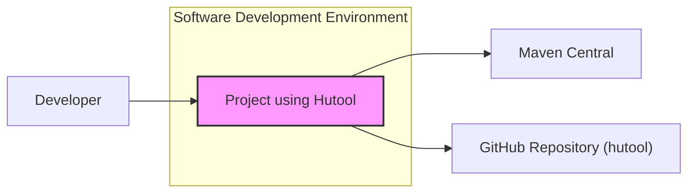
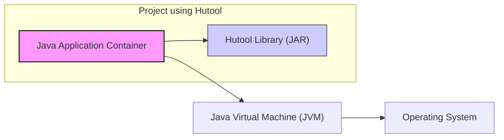
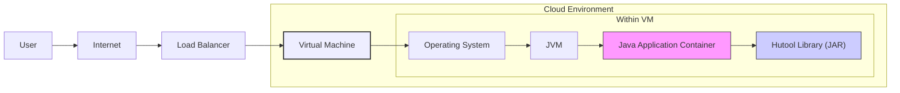

# BUSINESS POSTURE

This project design document is for the adoption and use of the 'hutool' library within a software development environment. Hutool is a Java library that provides a suite of utility functions and components, aiming to simplify Java development by offering reusable and efficient solutions for common tasks.

*   Business Priorities and Goals:
    *   Accelerate software development cycles by providing readily available and well-tested utility functions.
    *   Reduce development costs by minimizing the need to write boilerplate code for common tasks.
    *   Improve code quality and consistency by leveraging a standardized and widely used utility library.
    *   Enhance developer productivity by providing convenient and efficient APIs for common operations.
    *   Focus development efforts on business logic rather than infrastructure and utility code.

*   Business Risks:
    *   Dependency risk: Reliance on an external library introduces a dependency that needs to be managed and maintained.
    *   Security vulnerabilities: Potential vulnerabilities in the 'hutool' library could impact applications that depend on it.
    *   Compatibility issues:  Future updates to 'hutool' or the application's environment might introduce compatibility issues.
    *   Vendor lock-in (to open-source library): While open-source, heavy reliance on a specific library can create challenges if migration is needed in the future.
    *   Lack of in-house expertise:  Teams might need to learn and become proficient in using the 'hutool' library effectively.

# SECURITY POSTURE

*   Existing Security Controls:
    *   security control: Open Source Codebase: 'hutool' is an open-source project hosted on GitHub, allowing for community review and scrutiny of the code. (Implemented: GitHub Repository)
    *   security control: Dependency Management: Projects using 'hutool' will typically use dependency management tools like Maven or Gradle to include the library. (Implemented: Project Build Files - pom.xml, build.gradle)
    *   security control: Version Control: 'hutool' project and projects using it utilize Git for version control, enabling tracking of changes and potential security fixes. (Implemented: GitHub, Git)

*   Accepted Risks:
    *   accepted risk:  Vulnerability in Dependencies:  There is an inherent risk of vulnerabilities being discovered in 'hutool' or its transitive dependencies. Mitigation relies on timely updates and vulnerability scanning.
    *   accepted risk:  Maintainer Security Practices: Security of the 'hutool' project depends on the security practices of its maintainers and contributors. Reliance is placed on the open-source community and project reputation.

*   Recommended Security Controls:
    *   security control: Dependency Scanning: Implement automated dependency scanning tools in the build pipeline to detect known vulnerabilities in 'hutool' and its dependencies.
    *   security control: Software Composition Analysis (SCA): Regularly perform SCA to identify and manage open-source components, including 'hutool', and their associated risks.
    *   security control: Security Code Reviews: Conduct security-focused code reviews for applications using 'hutool', paying attention to how 'hutool' APIs are used and if they introduce any security concerns.
    *   security control:  Vulnerability Management Process: Establish a process for monitoring security advisories related to 'hutool' and its dependencies, and for patching vulnerabilities promptly.
    *   security control: Secure Development Training: Provide developers with training on secure coding practices, including secure usage of third-party libraries like 'hutool'.

*   Security Requirements:
    *   Authentication: Not directly applicable to 'hutool' library itself. Authentication is relevant for applications that use 'hutool', but 'hutool' does not handle authentication.
    *   Authorization: Not directly applicable to 'hutool' library itself. Authorization is relevant for applications that use 'hutool', but 'hutool' does not handle authorization.
    *   Input Validation: 'hutool' provides input validation utilities. Applications using 'hutool' MUST utilize these or other input validation mechanisms to prevent injection attacks and other input-related vulnerabilities. Security Requirement: Applications using 'hutool' must validate all external inputs using appropriate 'hutool' validation utilities or other secure validation methods before processing them.
    *   Cryptography: 'hutool' provides cryptography utilities. Applications using 'hutool' MAY utilize these utilities for encryption, decryption, hashing, and other cryptographic operations. Security Requirement: If cryptographic operations are needed, applications should prefer using 'hutool' cryptography utilities to ensure consistent and potentially reviewed implementations, but must ensure proper key management and algorithm selection.

# DESIGN

## C4 CONTEXT



*   Context Diagram Elements:
    *   Element:
        *   Name: Project using Hutool
        *   Type: Software System
        *   Description:  A software application or project that is being developed and utilizes the 'hutool' Java library to implement various functionalities. This is the central system in our context.
        *   Responsibilities:  To implement business logic and application features, leveraging 'hutool' for utility functions, and to deliver value to end-users or other systems.
        *   Security controls:  Input validation (using 'hutool' or other mechanisms), authorization checks, secure data handling, dependency scanning for 'hutool' and other libraries.
    *   Element:
        *   Name: Developer
        *   Type: Person
        *   Description: Software developers who write, test, and maintain the 'Project using Hutool'. They interact with the project codebase and integrate 'hutool' into the application.
        *   Responsibilities:  Developing application features, writing code that utilizes 'hutool', testing and debugging, and ensuring code quality and security.
        *   Security controls:  Secure coding practices, code reviews, access control to development environment and code repositories, security training.
    *   Element:
        *   Name: Maven Central
        *   Type: External System
        *   Description: A public repository for Maven artifacts, where the 'hutool' library and other Java libraries are published and can be downloaded from.
        *   Responsibilities:  Hosting and providing access to Java libraries, including 'hutool', for dependency management.
        *   Security controls:  Maven Central itself has security measures to ensure the integrity and availability of artifacts. Projects using 'hutool' rely on the security of Maven Central for dependency resolution.
    *   Element:
        *   Name: GitHub Repository (hutool)
        *   Type: External System
        *   Description: The public GitHub repository where the source code of the 'hutool' library is hosted and maintained.
        *   Responsibilities:  Storing and managing the source code of 'hutool', tracking issues and contributions, and releasing new versions of the library.
        *   Security controls:  GitHub's security features for code hosting, access control for contributors, and issue tracking. Open source nature allows for community security review.

## C4 CONTAINER



*   Container Diagram Elements:
    *   Element:
        *   Name: Java Application Container
        *   Type: Application Runtime Container
        *   Description: Represents the runtime environment for the 'Project using Hutool'. This is typically a Java application server (like Tomcat, Jetty, or Spring Boot embedded server) or a standalone Java application runtime. It executes the application code.
        *   Responsibilities:  Running the Java application, managing application lifecycle, handling requests and responses, and providing runtime environment for 'hutool' library.
        *   Security controls:  Application server security configuration, runtime environment security hardening, vulnerability scanning of application dependencies, logging and monitoring.
    *   Element:
        *   Name: Hutool Library (JAR)
        *   Type: Library
        *   Description:  The 'hutool' library packaged as a JAR (Java Archive) file. This is a dependency of the Java Application Container and provides utility functions used by the application code.
        *   Responsibilities:  Providing reusable utility functions and components to the Java Application Container, as defined by the 'hutool' library.
        *   Security controls:  Security of the 'hutool' library itself (as discussed in Security Posture), dependency scanning to detect vulnerabilities in the JAR, integrity checks (e.g., checksum verification during download).
    *   Element:
        *   Name: Java Virtual Machine (JVM)
        *   Type: Runtime Environment
        *   Description: The Java Virtual Machine that executes the Java Application Container and the 'hutool' library. It provides the platform for running Java bytecode.
        *   Responsibilities:  Executing Java bytecode, managing memory, providing core Java runtime functionalities, and isolating applications.
        *   Security controls:  JVM security features (e.g., sandboxing, security manager - though less common now), JVM security updates and patching, configuration of JVM security settings.
    *   Element:
        *   Name: Operating System
        *   Type: Infrastructure
        *   Description: The underlying operating system (e.g., Linux, Windows, macOS) on which the JVM and Java Application Container are running.
        *   Responsibilities:  Providing system resources (CPU, memory, disk), managing processes, handling system calls, and providing basic security features.
        *   Security controls:  Operating system hardening, access control, patching and updates, security monitoring, firewall, intrusion detection/prevention systems.

## DEPLOYMENT

For simplicity, we will consider a deployment scenario using a cloud-based virtual machine. Other deployment options could include containerized deployments (Docker, Kubernetes), serverless functions, or on-premise servers.



*   Deployment Diagram Elements:
    *   Element:
        *   Name: Virtual Machine
        *   Type: Infrastructure
        *   Description: A virtual server instance in a cloud environment (e.g., AWS EC2, Azure VM, Google Compute Engine). It provides the compute resources to run the application.
        *   Responsibilities:  Hosting the operating system, JVM, and Java Application Container. Providing network connectivity and compute resources.
        *   Security controls:  Cloud provider's infrastructure security, VM instance hardening, security groups/firewalls, access control to VM instances, security monitoring.
    *   Element:
        *   Name: Operating System (within VM)
        *   Type: Operating System
        *   Description: The operating system running on the Virtual Machine.
        *   Responsibilities:  Providing system resources, managing processes, and providing a platform for the JVM.
        *   Security controls:  OS hardening, patching, local firewalls, intrusion detection agents, access control.
    *   Element:
        *   Name: JVM (within VM)
        *   Type: Runtime Environment
        *   Description: The Java Virtual Machine running within the Virtual Machine's operating system.
        *   Responsibilities:  Executing the Java Application Container and 'hutool' library.
        *   Security controls:  JVM security configuration, security updates, potentially JVM sandboxing if applicable.
    *   Element:
        *   Name: Java Application Container (within VM)
        *   Type: Application Runtime Container
        *   Description: The Java application server or runtime environment running within the VM, containing the 'Project using Hutool' application.
        *   Responsibilities:  Running the application code, serving requests, utilizing 'hutool' library.
        *   Security controls:  Application server security configuration, web application firewall (WAF) if applicable, input validation, authorization, session management, secure coding practices.
    *   Element:
        *   Name: Hutool Library (JAR) (within VM)
        *   Type: Library
        *   Description: The 'hutool' JAR file deployed within the Java Application Container in the VM.
        *   Responsibilities:  Providing utility functions to the application.
        *   Security controls:  Dependency scanning, vulnerability management, secure usage by the application.
    *   Element:
        *   Name: Load Balancer
        *   Type: Network Component
        *   Description: Distributes incoming internet traffic to the Virtual Machine instances (in case of multiple VMs, though only one is shown here for simplicity).
        *   Responsibilities:  Traffic distribution, high availability, potentially SSL termination, and basic security filtering.
        *   Security controls:  Load balancer security configuration, SSL/TLS configuration, DDoS protection, rate limiting, access control lists.
    *   Element:
        *   Name: Internet
        *   Type: Network
        *   Description: The public internet.
        *   Responsibilities:  Public network for users to access the application.
        *   Security controls:  External network security is outside of direct project control, but reliance on secure communication protocols (HTTPS) and infrastructure security.
    *   Element:
        *   Name: User
        *   Type: Person
        *   Description: End-users who access and interact with the 'Project using Hutool' application over the internet.
        *   Responsibilities:  Using the application for its intended purpose.
        *   Security controls:  User-side security practices (strong passwords, avoiding phishing), but primarily relies on application-side security controls.

## BUILD

```mermaid
flowchart LR
    A["Developer"] --> B["Code Repository (Git)"]
    B --> C["CI/CD Pipeline (e.g., GitHub Actions, Jenkins)"]
    C --> D["Build Process"]
    D --> E["Dependency Resolution (Maven/Gradle - downloads Hutool from Maven Central)"]
    E --> F["Compilation & Packaging"]
    F --> G["Security Scans (SAST, Dependency Scan)"]
    G --> H{Artifact Repository (e.g., Nexus, Artifactory)}
    H --> I["Deployment Environment"]

    style C fill:#eef,stroke:#333,stroke-width:2px
    style G fill:#eef,stroke:#333,stroke-width:2px
```

*   Build Process Elements:
    *   Element:
        *   Name: Developer
        *   Type: Person
        *   Description: Software developers writing and committing code changes.
        *   Responsibilities:  Writing code, committing changes to the repository, initiating the build process through code commits.
        *   Security controls:  Secure coding practices, code reviews, local development environment security, access control to code repository.
    *   Element:
        *   Name: Code Repository (Git)
        *   Type: Version Control System
        *   Description:  A Git repository (e.g., GitHub, GitLab, Bitbucket) where the project's source code is stored and versioned.
        *   Responsibilities:  Storing source code, managing versions, tracking changes, triggering CI/CD pipelines on code changes.
        *   Security controls:  Access control (authentication and authorization), branch protection, audit logging, secure code storage.
    *   Element:
        *   Name: CI/CD Pipeline (e.g., GitHub Actions, Jenkins)
        *   Type: Automation System
        *   Description:  An automated CI/CD pipeline that orchestrates the build, test, and deployment processes.
        *   Responsibilities:  Automating build process, running tests, performing security scans, packaging artifacts, and deploying to environments.
        *   Security controls:  Secure pipeline configuration, access control to pipeline configuration and execution, secret management for credentials, audit logging of pipeline activities.
    *   Element:
        *   Name: Build Process
        *   Type: Build Tool
        *   Description:  The actual build process managed by tools like Maven or Gradle.
        *   Responsibilities:  Compiling code, managing dependencies (including 'hutool'), running tests, packaging application artifacts.
        *   Security controls:  Secure build tool configuration, dependency management security (verifying dependencies, using dependency lock files), build environment security.
    *   Element:
        *   Name: Dependency Resolution (Maven/Gradle - downloads Hutool from Maven Central)
        *   Type: Dependency Management
        *   Description:  Process of resolving and downloading project dependencies, including 'hutool' from Maven Central or a private repository.
        *   Responsibilities:  Fetching required libraries, managing dependency versions, ensuring dependencies are available for the build.
        *   Security controls:  Using secure dependency repositories (Maven Central over HTTPS), dependency verification (checksums, signatures), potentially using private repository managers for more control.
    *   Element:
        *   Name: Compilation & Packaging
        *   Type: Build Step
        *   Description:  Compiling the source code into bytecode and packaging it into deployable artifacts (e.g., JAR, WAR, executable).
        *   Responsibilities:  Transforming source code into executable artifacts.
        *   Security controls:  Secure compilation process, ensuring no malicious code injection during compilation, secure packaging of artifacts.
    *   Element:
        *   Name: Security Scans (SAST, Dependency Scan)
        *   Type: Security Tooling
        *   Description:  Automated security scans performed during the build process, including Static Application Security Testing (SAST) for code vulnerabilities and dependency scanning for known vulnerabilities in libraries like 'hutool'.
        *   Responsibilities:  Identifying potential security vulnerabilities in code and dependencies early in the development lifecycle.
        *   Security controls:  Configuration and maintenance of SAST and dependency scanning tools, integration into CI/CD pipeline, vulnerability reporting and remediation process.
    *   Element:
        *   Name: Artifact Repository (e.g., Nexus, Artifactory)
        *   Type: Artifact Management
        *   Description:  A repository for storing and managing build artifacts (e.g., JAR files, Docker images). Can be a private repository or a managed service.
        *   Responsibilities:  Storing build artifacts, managing versions, providing access control to artifacts, ensuring artifact integrity.
        *   Security controls:  Access control to artifact repository, secure artifact storage, artifact integrity checks, vulnerability scanning of stored artifacts.
    *   Element:
        *   Name: Deployment Environment
        *   Type: Target Environment
        *   Description:  The environment where the application artifacts are deployed and run (e.g., development, staging, production).
        *   Responsibilities:  Running the application, providing runtime environment, hosting application artifacts.
        *   Security controls:  Deployment environment security controls as described in the DEPLOYMENT section.

# RISK ASSESSMENT

*   Critical Business Processes:
    *   Software Development Lifecycle: The primary business process at risk is the efficiency and security of the software development lifecycle. Using 'hutool' aims to improve efficiency, but introduces dependency and potential security risks if not managed properly.
    *   Application Functionality:  If vulnerabilities are present in 'hutool' and exploited, the functionality of applications using 'hutool' could be compromised, impacting business operations that rely on those applications.

*   Data Sensitivity:
    *   Source Code: The source code of applications using 'hutool' is sensitive as it contains business logic and potentially secrets. Vulnerabilities in 'hutool' could indirectly expose source code vulnerabilities if exploited.
    *   Application Data: The sensitivity of data handled by applications using 'hutool' depends on the specific application. 'hutool' itself is a utility library and does not directly handle application data, but vulnerabilities could lead to data breaches in applications using it. Data sensitivity should be assessed in the context of each application using 'hutool'.
    *   Configuration Data: Configuration data for applications using 'hutool', including database credentials, API keys, etc., is highly sensitive. Vulnerabilities could lead to exposure of configuration data.

# QUESTIONS & ASSUMPTIONS

*   Questions:
    *   What type of applications will be using 'hutool'? (e.g., web applications, backend services, batch jobs). This will help refine the deployment and security requirements.
    *   What is the risk appetite of the organization adopting 'hutool'? (Startup vs. Fortune 500). This will influence the level of security controls to be implemented.
    *   Are there existing security policies and standards within the organization that need to be considered when using 'hutool'?
    *   What is the current level of security maturity in the software development lifecycle? (e.g., are there already automated security scans in place?).
    *   What are the specific use cases for 'hutool' within the projects? Understanding the use cases can help identify specific security concerns related to 'hutool' APIs.

*   Assumptions:
    *   The organization adopting 'hutool' is aiming to improve development efficiency and code quality.
    *   Security is a concern, and the organization wants to proactively address potential risks associated with using 'hutool'.
    *   The development team has basic familiarity with Java and dependency management tools like Maven or Gradle.
    *   The organization has or is willing to implement a CI/CD pipeline for software development.
    *   The deployment environment is assumed to be a cloud-based infrastructure for the purpose of the deployment diagram, but other environments are possible.