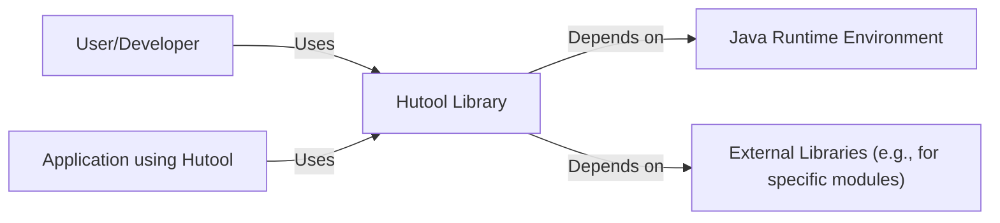
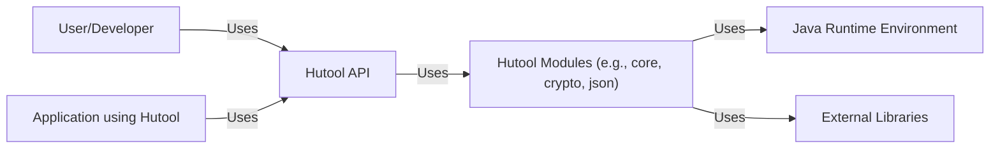
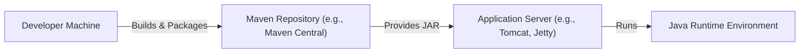
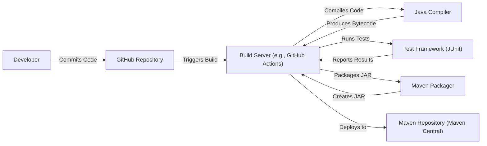

Okay, let's create a design document for the Hutool project, focusing on aspects relevant to threat modeling.

# BUSINESS POSTURE

Hutool is a set of Java tools that aims to simplify common Java development tasks.  It's an open-source project, widely used, and designed to be a general-purpose utility library.

Priorities and Goals:

*   Provide a comprehensive set of reusable, reliable, and well-tested utility functions.
*   Reduce boilerplate code in Java projects.
*   Improve developer productivity.
*   Maintain backward compatibility where possible.
*   Be easy to use and integrate into existing projects.
*   Be lightweight and have minimal external dependencies.

Business Risks:

*   Vulnerabilities in Hutool could be exploited in a large number of applications that depend on it, leading to widespread security issues.  This is the most significant risk.
*   Bugs or unexpected behavior in Hutool could cause application instability or data corruption in dependent projects.
*   Lack of maintenance or updates could lead to the library becoming obsolete or incompatible with newer Java versions.
*   Licensing issues (though Hutool uses the Apache 2.0 license, which is permissive) could arise if contributions are not properly managed.
*   Reputational damage due to security vulnerabilities or major bugs.

# SECURITY POSTURE

Existing Security Controls:

*   security control: Open Source: The code is publicly available for review and scrutiny by the community, which can help identify and fix vulnerabilities. (Described in the GitHub repository).
*   security control: Apache 2.0 License: A permissive license that allows for commercial use, modification, and distribution. (Described in the LICENSE file).
*   security control: Unit Tests: The project includes a suite of unit tests to ensure the correctness of the code. (Described in the `src/test/java` directory).
*   security control: Static Analysis (Likely): While not explicitly mentioned, it's highly probable that the project maintainers use static analysis tools to identify potential bugs and vulnerabilities.
*   security control: Dependency Management: The project uses Maven to manage its dependencies, allowing for tracking and updating of external libraries. (Described in the `pom.xml` file).
*   security control: Code Reviews: Contributions are likely reviewed by maintainers before being merged. (Implicit in the GitHub workflow).

Accepted Risks:

*   accepted risk: Reliance on community contributions: While beneficial, relying on community contributions means that the security of the code depends on the diligence of the contributors and reviewers.
*   accepted risk: Zero-day vulnerabilities: As with any software, there's always the risk of unknown vulnerabilities being discovered and exploited.
*   accepted risk: Supply chain attacks: Although Maven helps manage dependencies, there's a risk of compromised dependencies being introduced.

Recommended Security Controls:

*   security control: Implement a formal Security Development Lifecycle (SDL) process, including threat modeling, regular security reviews, and penetration testing.
*   security control: Integrate Static Application Security Testing (SAST) tools into the build process to automatically scan for vulnerabilities.
*   security control: Integrate Dynamic Application Security Testing (DAST) tools to test the running application for vulnerabilities.
*   security control: Implement Software Composition Analysis (SCA) to identify and track known vulnerabilities in third-party dependencies.
*   security control: Establish a clear vulnerability disclosure and response process.
*   security control: Use code signing to ensure the integrity of released artifacts.
*   security control: Consider using a bug bounty program to incentivize security researchers to find and report vulnerabilities.

Security Requirements:

*   Authentication: Not directly applicable, as Hutool is a library, not an application with user authentication.
*   Authorization: Not directly applicable, as Hutool is a library. Authorization is the responsibility of the applications that use it.
*   Input Validation:
    *   Hutool should validate input parameters to its functions to prevent unexpected behavior or vulnerabilities. This includes checking for null values, invalid ranges, and potentially malicious input (e.g., SQL injection, path traversal).
    *   Specific validation requirements depend on the function. For example, functions that handle file paths should validate those paths to prevent path traversal attacks.
*   Cryptography:
    *   If Hutool provides cryptographic functions (e.g., hashing, encryption), they should use strong, well-vetted algorithms and libraries (e.g., Bouncy Castle, Java Cryptography Architecture).
    *   Cryptographic keys should be handled securely, following best practices for key generation, storage, and management.  Hutool itself should not be responsible for storing keys; this is the responsibility of the calling application.
    *   Avoid implementing custom cryptographic algorithms.
*   Data validation:
    *   Hutool should provide clear documentation on the expected input and output formats for its functions.
    *   Functions that handle sensitive data should be clearly documented as such.

# DESIGN

## C4 CONTEXT

C4 Context Element List:

*   Element:
    *   Name: User/Developer
    *   Type: Person
    *   Description: A developer who integrates Hutool into their Java application.
    *   Responsibilities: Uses Hutool's functions in their application code.
    *   Security controls: Not directly applicable.
*   Element:
    *   Name: Hutool Library
    *   Type: Software System
    *   Description: The Hutool library itself, a collection of utility functions.
    *   Responsibilities: Provides utility functions for various tasks.
    *   Security controls: Input validation, secure coding practices, dependency management.
*   Element:
    *   Name: Java Runtime Environment
    *   Type: Software System
    *   Description: The JRE required to run Java applications and Hutool.
    *   Responsibilities: Executes Java bytecode.
    *   Security controls: JRE security updates, secure configuration.
*   Element:
    *   Name: External Libraries
    *   Type: Software System
    *   Description: External libraries that Hutool may depend on for specific modules (e.g., a JSON library for JSON processing).
    *   Responsibilities: Provide specific functionality required by some Hutool modules.
    *   Security controls: Dependency management, SCA, regular updates.
*   Element:
    *   Name: Application using Hutool
    *   Type: Software System
    *   Description: Any application that uses Hutool.
    *   Responsibilities: Implements business logic.
    *   Security controls: Application-specific security controls.

## C4 CONTAINER

Since Hutool is a library, the container diagram is essentially an expanded view of the context diagram.  It doesn't have separate deployable units in the traditional sense.

C4 Container Element List:

*   Element:
    *   Name: User/Developer
    *   Type: Person
    *   Description: A developer who integrates Hutool into their Java application.
    *   Responsibilities: Uses Hutool's functions in their application code.
    *   Security controls: Not directly applicable.
*   Element:
    *   Name: Hutool API
    *   Type: API
    *   Description: The public interface of the Hutool library.
    *   Responsibilities: Provides access to Hutool's functionality.
    *   Security controls: Input validation, secure coding practices.
*   Element:
    *   Name: Hutool Modules
    *   Type: Module
    *   Description: The various modules within Hutool (e.g., core, crypto, json, etc.).
    *   Responsibilities: Implement specific utility functions.
    *   Security controls: Input validation, secure coding practices, module-specific security measures.
*   Element:
    *   Name: Java Runtime Environment
    *   Type: Software System
    *   Description: The JRE required to run Java applications and Hutool.
    *   Responsibilities: Executes Java bytecode.
    *   Security controls: JRE security updates, secure configuration.
*   Element:
    *   Name: External Libraries
    *   Type: Software System
    *   Description: External libraries that Hutool may depend on.
    *   Responsibilities: Provide specific functionality.
    *   Security controls: Dependency management, SCA, regular updates.
*   Element:
    *   Name: Application using Hutool
    *   Type: Software System
    *   Description: Any application that uses Hutool.
    *   Responsibilities: Implements business logic.
    *   Security controls: Application-specific security controls.

## DEPLOYMENT

Hutool is typically deployed as a JAR file included in a Java application's classpath.  There are several deployment scenarios:

1.  **Direct Dependency:** The application includes Hutool as a direct dependency in its build system (e.g., Maven, Gradle).
2.  **Embedded in a Larger Library:** Hutool might be embedded within another library that the application uses.
3.  **Part of a Framework:** Some frameworks might include Hutool as a built-in utility.

We'll describe the most common scenario: Direct Dependency using Maven.

Deployment Element List:

*   Element:
    *   Name: Developer Machine
    *   Type: Infrastructure Node
    *   Description: The developer's workstation where the application code is written and built.
    *   Responsibilities: Code development, building the application.
    *   Security controls: Secure development environment, code signing.
*   Element:
    *   Name: Maven Repository
    *   Type: Infrastructure Node
    *   Description: A repository (e.g., Maven Central) that stores and provides JAR files.
    *   Responsibilities: Stores and serves Hutool JAR files.
    *   Security controls: Repository security, integrity checks.
*   Element:
    *   Name: Application Server
    *   Type: Infrastructure Node
    *   Description: The server where the application (which uses Hutool) is deployed.
    *   Responsibilities: Runs the application.
    *   Security controls: Server hardening, access controls, network security.
*   Element:
    *   Name: Java Runtime Environment
    *   Type: Software System
    *   Description: The JRE on the application server.
    *   Responsibilities: Executes Java bytecode.
    *   Security controls: JRE security updates, secure configuration.

## BUILD

Hutool uses Maven for its build process. The build process likely involves the following steps:

1.  **Code Checkout:** The developer checks out the code from the GitHub repository.
2.  **Compilation:** The Java code is compiled into bytecode.
3.  **Testing:** Unit tests are executed.
4.  **Packaging:** The compiled code and resources are packaged into a JAR file.
5.  **Deployment (to Maven Central):** The JAR file is deployed to a Maven repository (likely Maven Central).

Security Controls in the Build Process:

*   security control: Version Control (Git): Tracks changes to the code and allows for auditing.
*   security control: Build Automation (Maven): Ensures consistent and repeatable builds.
*   security control: Unit Testing (JUnit): Verifies the correctness of the code.
*   security control: Dependency Management (Maven): Tracks and manages dependencies.
*   security control: (Recommended) SAST: Integrate static analysis tools into the build process.
*   security control: (Recommended) SCA: Integrate software composition analysis tools.

# RISK ASSESSMENT

Critical Business Processes:

*   Providing reliable and secure utility functions for Java applications.
*   Maintaining the integrity and availability of the Hutool library.

Data to Protect:

*   Hutool itself doesn't handle sensitive data directly. It's a library of utility functions. However, the *applications that use Hutool* may handle sensitive data. The sensitivity of that data depends on the specific application.
*   The primary data to protect from a Hutool perspective is the *source code* itself.  Compromise of the source code could lead to the introduction of malicious code that would then be distributed to many applications.

# QUESTIONS & ASSUMPTIONS

Questions:

*   What specific static analysis tools are currently used (if any)?
*   What is the process for handling security vulnerabilities reported by external researchers?
*   Are there any specific security certifications or compliance requirements that Hutool aims to meet?
*   Are there any plans to implement a bug bounty program?
*   What is the frequency of releases and updates?
*   Is there a dedicated security team or individual responsible for security?
*   What is the process for reviewing and merging contributions from the community?
*   Are there any specific security guidelines for contributors?

Assumptions:

*   BUSINESS POSTURE: The maintainers of Hutool prioritize security and are committed to addressing vulnerabilities promptly.
*   SECURITY POSTURE: Code reviews are performed before merging contributions. Basic static analysis is likely used.
*   DESIGN: Hutool is primarily used as a direct dependency in Java applications via Maven. The build process is automated using Maven.