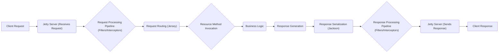

# Project Design Document: Dropwizard Framework

**Version:** 1.1
**Date:** October 26, 2023
**Author:** AI Software Architect

## 1. Introduction

This document provides an enhanced architectural design of the Dropwizard framework, building upon the previous version. It offers a more detailed explanation of the key components, their interactions, data flow, and crucial security considerations. This refined document is specifically intended to serve as a robust foundation for subsequent threat modeling activities.

Dropwizard is a production-ready, opinionated Java framework for rapidly developing high-performance, operationally friendly RESTful web services. It achieves this by bundling stable and mature libraries from the Java ecosystem into a cohesive and easy-to-use package, reducing boilerplate and promoting best practices.

## 2. Goals and Objectives

*   Provide a comprehensive and improved overview of the Dropwizard framework's architecture.
*   Clearly identify and describe the responsibilities of each key component with greater detail.
*   Illustrate the typical request flow within a Dropwizard application with more precision.
*   Highlight important security considerations with specific examples and potential threats, making it more actionable for threat modeling.
*   Serve as a definitive and detailed reference point for security analysis, risk assessment, and mitigation planning.

## 3. High-Level Architecture

The following diagram illustrates the high-level architecture of a typical Dropwizard application, emphasizing the configuration loading process:

```mermaid
graph LR
    subgraph "Client"
        A["Client Application"]
    end
    subgraph "Dropwizard Application"
        B["Configuration (YAML)"]
        C["Jetty Server"]
        D["Jersey (JAX-RS)"]
        E["Application Resources"]
        F["Jackson (JSON)"]
        G["Metrics"]
        H["Logging (Logback)"]
        I["Health Checks"]
    end

    A --> C
    B -- "Loads Configuration" --> C
    B -- "Loads Configuration" --> D
    B -- "Loads Configuration" --> E
    C --> D
    D --> E
    E --> F
    E --> G
    E --> H
    C --> I
    G --> "Metrics Reporting (e.g., JMX, Graphite)"
    H --> "Logging Destinations (e.g., Files, Syslog)"
```

## 4. Component Breakdown

This section provides a more detailed breakdown of the key components of the Dropwizard framework and their functionalities, with a focus on security-relevant aspects:

*   **Configuration (YAML):**
    *   Manages application configuration loaded from YAML files.
    *   Provides a structured way to define application settings, including network ports, database connections, logging levels, and security parameters.
    *   Security Consideration: Sensitive information within configuration files (e.g., database passwords, API keys) needs secure handling and storage, potentially using environment variables or dedicated secret management.

*   **Jetty Server:**
    *   A robust and high-performance embedded HTTP server.
    *   Responsible for accepting incoming HTTP requests and sending back responses.
    *   Manages connection pooling, thread management, and request lifecycle.
    *   Security Considerations:
        *   TLS/SSL configuration for secure HTTPS communication is crucial.
        *   Properly configuring connection timeouts and limits can mitigate denial-of-service attacks.
        *   Security headers (e.g., HSTS, X-Content-Type-Options) should be configured for enhanced browser security.

*   **Jersey (JAX-RS Implementation):**
    *   The framework for building RESTful APIs in Java, adhering to the JAX-RS specification.
    *   Handles request routing, mapping incoming requests to specific resource methods based on annotations.
    *   Manages request and response entity providers for serialization and deserialization.
    *   Provides interceptors and filters for request/response processing.
    *   Security Considerations:
        *   Input validation should be implemented within resource methods or using Jersey's validation features to prevent injection attacks.
        *   Authentication and authorization logic are often implemented using Jersey's filters or interceptors.
        *   Careful handling of exceptions and error responses is necessary to avoid leaking sensitive information.

*   **Application Resources:**
    *   User-defined Java classes that implement the application's API endpoints and business logic.
    *   Annotated with JAX-RS annotations to define request mappings, supported media types, and request/response parameters.
    *   Security Considerations:
        *   This is where the core business logic resides, making it a prime target for vulnerabilities if not developed securely.
        *   Authorization checks should be performed before executing sensitive operations.
        *   Secure coding practices are essential to prevent common vulnerabilities like injection flaws and insecure deserialization.

*   **Jackson (JSON Processing):**
    *   A high-performance Java library for serializing Java objects to JSON and deserializing JSON to Java objects.
    *   Used by Jersey for handling JSON request and response bodies.
    *   Security Considerations:
        *   Insecure deserialization vulnerabilities can arise if Jackson is not configured correctly or if untrusted data is deserialized.
        *   Ensure Jackson is updated to the latest version to patch known vulnerabilities.
        *   Consider using Jackson's security features to restrict the types of objects that can be deserialized.

*   **Metrics:**
    *   A library for collecting and reporting various application metrics (e.g., request rates, error counts, resource utilization).
    *   Provides different metric types (counters, gauges, histograms, timers).
    *   Allows reporting metrics to external systems for monitoring and analysis.
    *   Security Considerations:
        *   Metrics endpoints can expose sensitive operational information. Access to these endpoints should be restricted.
        *   Ensure that the metrics reporting mechanism itself is secure.

*   **Logging (Logback):**
    *   A flexible and powerful logging framework for Java applications.
    *   Handles application logging to various destinations (files, console, databases, etc.).
    *   Configurable logging levels and formatting options.
    *   Security Considerations:
        *   Avoid logging sensitive information (e.g., passwords, API keys) in plain text.
        *   Implement proper log rotation and secure storage to prevent unauthorized access or modification.
        *   Consider using structured logging for easier security analysis.

*   **Health Checks:**
    *   Components that expose the health status of different parts of the application (e.g., database connectivity, external service availability).
    *   Used for monitoring and automated recovery.
    *   Security Considerations:
        *   Health check endpoints can reveal information about the application's internal state. Access should be restricted, especially for detailed health checks.
        *   Ensure health checks themselves do not introduce vulnerabilities.

## 5. Data Flow

The typical request flow within a Dropwizard application is as follows, with more detail on intermediate steps:



**Detailed Steps:**

1. **Client Request:** A client application initiates an HTTP request targeting a specific endpoint of the Dropwizard application.
2. **Jetty Server (Receives Request):** The embedded Jetty server accepts the incoming request.
3. **Request Processing Pipeline (Filters/Interceptors):** Jetty passes the request through a series of configured filters and interceptors. These can perform tasks like:
    *   Authentication and authorization checks.
    *   Logging request details.
    *   Modifying request headers.
    *   Handling cross-origin requests (CORS).
    *   Security Consideration: Ensure filters and interceptors are correctly implemented and configured to enforce security policies.
4. **Request Routing (Jersey):** Jersey analyzes the request URI and HTTP method to determine the appropriate resource method to invoke based on JAX-RS annotations.
5. **Resource Method Invocation:** The identified resource method within the application code is executed.
6. **Business Logic:** The resource method executes the core business logic, potentially interacting with databases, external services, or other components.
7. **Response Generation:** The resource method generates a response object containing the data to be returned to the client.
8. **Response Serialization (Jackson):** Jackson serializes the response object into a format like JSON, based on the requested or default content type.
9. **Response Processing Pipeline (Filters/Interceptors):** Before sending the response, Jetty passes it through another set of filters and interceptors. These can perform tasks like:
    *   Adding security headers.
    *   Logging response details.
    *   Modifying the response body.
    *   Security Consideration: Ensure response filters do not inadvertently expose sensitive information.
10. **Jetty Server (Sends Response):** Jetty sends the serialized response back to the client.
11. **Client Response:** The client application receives the HTTP response.

## 6. Security Considerations

This section provides a more granular view of security considerations, categorized for clarity and with examples of potential threats:

*   **Authentication and Authorization:**
    *   Mechanisms to verify user identity and control access to resources.
    *   Potential Threats: Brute-force attacks, credential stuffing, privilege escalation, insecure direct object references.
    *   Mitigation Strategies: Implement strong password policies, multi-factor authentication, role-based access control (RBAC), OAuth 2.0, JWT.

*   **Input Validation and Data Sanitization:**
    *   Ensuring that data received from clients is valid and safe to process.
    *   Potential Threats: SQL injection, cross-site scripting (XSS), command injection, path traversal.
    *   Mitigation Strategies: Use input validation libraries, parameterized queries, output encoding, content security policy (CSP).

*   **Secure Communication (TLS/SSL):**
    *   Encrypting communication between the client and the server.
    *   Potential Threats: Man-in-the-middle attacks, eavesdropping.
    *   Mitigation Strategies: Enforce HTTPS, use strong cipher suites, configure HSTS.

*   **Dependency Management and Vulnerability Scanning:**
    *   Keeping track of and updating third-party libraries to patch known vulnerabilities.
    *   Potential Threats: Exploitation of known vulnerabilities in dependencies.
    *   Mitigation Strategies: Use dependency management tools, perform regular vulnerability scans, automate dependency updates.

*   **Logging and Auditing:**
    *   Recording significant events for security monitoring and incident response.
    *   Potential Threats: Insufficient logging, logging sensitive information, log tampering.
    *   Mitigation Strategies: Log authentication attempts, authorization failures, critical actions; use secure log storage; implement log rotation.

*   **Error Handling and Exception Management:**
    *   Handling errors gracefully without exposing sensitive information.
    *   Potential Threats: Information leakage through error messages.
    *   Mitigation Strategies: Implement generic error pages, log detailed errors securely, avoid displaying stack traces to end-users.

*   **Configuration Security:**
    *   Protecting sensitive configuration parameters.
    *   Potential Threats: Exposure of credentials, API keys, and other secrets.
    *   Mitigation Strategies: Use environment variables, secure secret management solutions (e.g., HashiCorp Vault), avoid storing secrets in version control.

*   **Cross-Site Request Forgery (CSRF) Protection:**
    *   Preventing malicious websites from making unauthorized requests on behalf of authenticated users.
    *   Potential Threats: Unauthorized actions performed by a victim's browser.
    *   Mitigation Strategies: Implement anti-CSRF tokens, use the SameSite cookie attribute.

*   **Cross-Origin Resource Sharing (CORS):**
    *   Controlling which origins are allowed to access the application's resources.
    *   Potential Threats: Unauthorized access to API endpoints from malicious websites.
    *   Mitigation Strategies: Configure CORS policies restrictively, avoid using wildcard origins in production.

*   **Rate Limiting and Throttling:**
    *   Limiting the number of requests a client can make within a given timeframe.
    *   Potential Threats: Denial-of-service attacks, brute-force attacks.
    *   Mitigation Strategies: Implement rate limiting based on IP address or user credentials.

*   **Health Check and Metrics Security:**
    *   Securing access to endpoints that expose application health and performance data.
    *   Potential Threats: Information disclosure, potential for exploiting vulnerabilities in monitoring systems.
    *   Mitigation Strategies: Restrict access to health check and metrics endpoints, use authentication for these endpoints.

## 7. Deployment Considerations

*   Dropwizard applications are typically packaged as self-contained, executable JAR files (fat JARs) containing all necessary dependencies.
*   Deployment environments significantly impact security. Consider the following:
    *   **Virtual Machines (VMs):** Ensure VMs are hardened, patched, and properly configured with firewalls and access controls.
    *   **Containers (e.g., Docker, Kubernetes):** Use secure base images, implement resource limits, and manage container orchestration security.
    *   **Cloud Platforms (e.g., AWS, Azure, GCP):** Leverage cloud-specific security services (e.g., security groups, IAM roles, WAFs).
*   Security considerations during deployment include:
    *   Securely managing and injecting environment variables containing sensitive information.
    *   Implementing network segmentation to isolate the application.
    *   Using secure container registries and scanning images for vulnerabilities.
    *   Regularly patching the underlying operating system and runtime environment.

## 8. Technologies Used

*   Java (Programming Language)
*   Jetty (Embedded HTTP Server)
*   Jersey (JAX-RS Implementation for RESTful APIs)
*   Jackson (JSON Processing Library)
*   Metrics (Application Metrics Library)
*   Logback (Logging Framework)
*   YAML (Configuration Language)

## 9. Future Considerations

*   Exploring integration with API Gateways for centralized security enforcement, authentication, and rate limiting.
*   Adopting more advanced authentication and authorization frameworks like OpenID Connect.
*   Implementing automated security testing and static/dynamic analysis tools in the CI/CD pipeline.
*   Developing comprehensive security guidelines and best practices specifically for Dropwizard applications within the organization.
*   Investigating the use of security-focused libraries and frameworks to further enhance application security.
