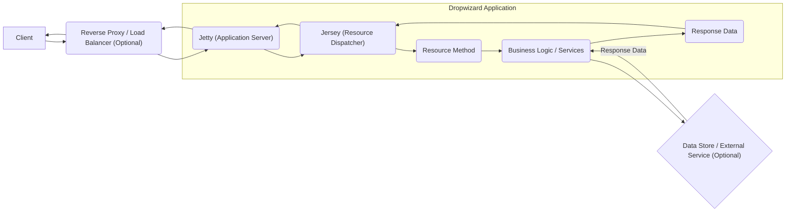
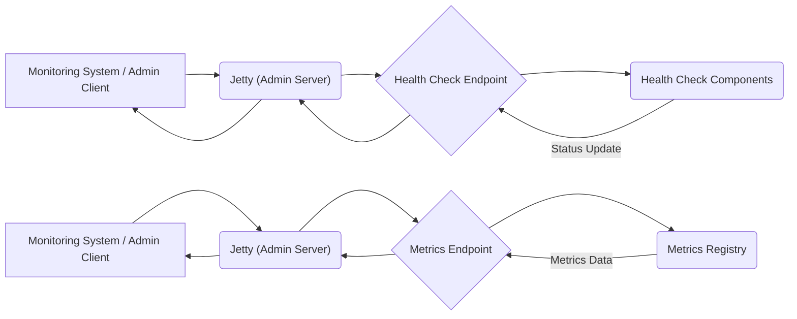

# Project Design Document: Dropwizard Framework

**Version:** 1.1
**Date:** October 26, 2023
**Author:** AI Software Architect

## 1. Introduction

This document provides an enhanced design overview of the Dropwizard framework, an opinionated open-source Java framework specifically designed for building production-ready, high-performance RESTful web services with operational ease. The primary focus of this document is to facilitate thorough threat modeling by providing a clear and detailed understanding of the framework's architecture, components, and data flow. This understanding is crucial for identifying potential security vulnerabilities and attack vectors within systems built upon Dropwizard.

### 1.1. Purpose

The core purpose of this document is to serve as a comprehensive architectural blueprint of the Dropwizard framework, explicitly tailored for security analysis and threat modeling. It aims to equip security professionals, developers, and operations teams with the necessary information to proactively identify and mitigate security risks associated with Dropwizard-based applications.

### 1.2. Scope

This document comprehensively covers the fundamental components and functionalities of the Dropwizard framework as represented in its official GitHub repository: [https://github.com/dropwizard/dropwizard](https://github.com/dropwizard/dropwizard). The scope is limited to the framework itself and does not include the design or security considerations of specific applications built *using* Dropwizard. However, it provides the foundational knowledge required to effectively threat model such applications.

### 1.3. Target Audience

This document is primarily intended for:

*   Security Architects and Engineers responsible for assessing the security of Dropwizard-based systems.
*   Threat Modeling Teams tasked with identifying potential vulnerabilities and attack vectors.
*   Software Developers utilizing Dropwizard for building RESTful services.
*   DevOps Engineers involved in the deployment and operation of Dropwizard applications.

## 2. Overview

Dropwizard adopts an "opinionated batteries-included" approach, bundling a curated set of stable and mature Java libraries into a cohesive framework. This simplifies the development of robust, production-ready RESTful web services by providing sensible defaults and integrated support for essential functionalities like configuration management, metrics collection, structured logging, and health monitoring. The framework's design emphasizes operational visibility and ease of deployment.

### 2.1. Key Features

*   **Integrated and Curated Dependencies:**  Seamlessly integrates well-established and widely used libraries such as Jetty for the HTTP server, Jersey for JAX-RS implementation, Jackson for JSON processing, Metrics for comprehensive monitoring, and Logback for structured logging.
*   **Convention-over-Configuration:**  Emphasizes sensible defaults and convention-based configuration using YAML, streamlining setup and reducing boilerplate code.
*   **Comprehensive Metrics and Monitoring:** Provides out-of-the-box metrics collection and reporting capabilities, exposing valuable insights into application performance and health.
*   **Built-in Health Checks:** Facilitates the definition and execution of health checks to monitor the application's status and the health of its dependencies, crucial for automated monitoring and recovery.
*   **Separation of Concerns (Application and Admin Environments):**  Distinctly separates the main application server from an administrative server, providing dedicated endpoints for management and monitoring tasks without impacting the core application.
*   **Command-Line Interface (CLI):** Offers a built-in CLI for managing the application lifecycle (e.g., starting, stopping) and executing administrative commands.

## 3. Architecture

The architecture of Dropwizard revolves around a central application runtime environment that orchestrates the interaction of several key, bundled components.

### 3.1. Components

*   **Jetty (Embedded HTTP Server):** The foundational component responsible for handling all incoming HTTP requests and dispatching responses. It manages connections, threading, and the overall HTTP protocol.
*   **Jersey (JAX-RS Implementation):** Implements the Java API for RESTful Web Services (JAX-RS), enabling the definition and management of RESTful endpoints (Resources). It handles request routing, parameter binding, and response serialization.
*   **Jackson (JSON Processing Library):**  Used for the serialization and deserialization of JSON data, facilitating the exchange of structured data between the application and clients. It handles the conversion of Java objects to JSON and vice versa.
*   **Metrics (Monitoring Library):**  Collects and exposes various application metrics, such as request rates, error counts, database connection pool usage, and custom metrics. These metrics are crucial for monitoring application health and performance.
*   **Logback (Logging Framework):**  Provides a robust and flexible logging framework for recording application events in a structured manner. It supports various appenders for directing logs to different destinations.
*   **Configuration (YAML-based):** Manages the loading and parsing of application configuration, typically from YAML files. It provides a structured way to configure the application and its bundled dependencies.
*   **Health Checks (Monitoring Components):**  Implementations of specific checks that assess the health and operational status of the application and its dependencies (e.g., database connectivity, external service availability).
*   **Managed Objects (Lifecycle-Managed Services):** Background tasks or services that are managed by the Dropwizard application lifecycle. These objects are started and stopped along with the application.
*   **Lifecycle Management (Startup and Shutdown):** Manages the initialization and shutdown sequences of the application and its constituent components, ensuring a clean and orderly startup and termination process.
*   **Admin Server (Separate Jetty Instance):** A distinct Jetty server instance that hosts administrative endpoints. These endpoints expose functionalities like health checks, metrics, thread dumps, and other management information, isolated from the main application traffic.

### 3.2. Data Flow

The typical request flow within a Dropwizard application proceeds through a series of interconnected components:

**Detailed Application Request Data Flow:**

*   **Client Request Initiation:** A client (e.g., web browser, mobile app, another service) initiates an HTTP request targeting the Dropwizard application.
*   **Optional Reverse Proxy/Load Balancer:** The request may optionally traverse a reverse proxy or load balancer for purposes such as routing, SSL termination, security filtering, or distributing traffic across multiple instances.
*   **Jetty Reception (Application Server):** The embedded Jetty server within the Dropwizard application receives the incoming HTTP request.
*   **Jersey Routing and Dispatch:** Jetty forwards the request to Jersey, the JAX-RS implementation. Jersey analyzes the request URI and HTTP method to determine the appropriate resource method responsible for handling the request.
*   **Resource Method Invocation:** The identified resource method within the application code is invoked. This method contains the specific logic to process the request.
*   **Business Logic Execution:** The resource method interacts with underlying business logic components or services to perform the necessary operations based on the request.
*   **Optional Data Store/External Service Interaction:** The business logic may interact with a database, external API, or other data storage or service layers to retrieve or persist data.
*   **Response Data Generation:** The business logic generates the response data to be sent back to the client.
*   **Jersey Response Handling:** Jersey handles the serialization of the response data, typically converting Java objects to JSON format using the Jackson library.
*   **Jetty Response Transmission:** Jetty transmits the HTTP response back to the client, potentially passing through the reverse proxy/load balancer if present.

**Admin Server Data Flow for Monitoring and Management:**

**Detailed Admin Server Request Data Flow:**

*   **Monitoring/Admin Request:** A monitoring system or an administrator client sends a request to the dedicated admin server (e.g., to query application health or retrieve performance metrics).
*   **Jetty Reception (Admin Server):** The separate Jetty instance for the admin server receives the incoming request.
*   **Admin Endpoint Routing:** The request is routed to the appropriate administrative endpoint based on the request path (e.g., `/health`, `/metrics`).
*   **Health Check Execution:** For requests to the `/health` endpoint, the admin server invokes the registered health check components. These components perform their respective checks and return their status.
*   **Metrics Retrieval:** For requests to the `/metrics` endpoint, the admin server retrieves the current metrics data from the central Metrics Registry.
*   **Admin Response Generation:** The admin server aggregates the results (health status, metrics data) and generates the response.
*   **Response Transmission:** The admin server sends the response back to the monitoring system or administrator client.

### 3.3. Dependencies

Dropwizard relies on a set of well-defined and managed external libraries:

*   `io.dropwizard:dropwizard-core`:  The core module containing the fundamental framework components and bootstrapping logic.
*   `io.dropwizard:dropwizard-jetty`:  Provides the embedded Jetty server integration for handling HTTP requests.
*   `io.dropwizard:dropwizard-jersey`:  Integrates the Jersey JAX-RS implementation for building RESTful APIs.
*   `io.dropwizard:dropwizard-jackson`:  Offers seamless integration with the Jackson library for JSON serialization and deserialization.
*   `io.dropwizard:dropwizard-metrics-core`:  Includes the core Metrics library for collecting and reporting application metrics.
*   `io.dropwizard:dropwizard-logging`:  Provides integration with the Logback logging framework for structured logging.
*   `io.dropwizard:dropwizard-configuration`:  Handles the loading and management of application configuration, typically from YAML files.
*   `ch.qos.logback:logback-classic`:  The underlying logging implementation used by Dropwizard.
*   `com.fasterxml.jackson.core:jackson-databind`:  The core Jackson library for JSON data binding.
*   `org.eclipse.jetty:jetty-server`:  The underlying Jetty server implementation.
*   `org.glassfish.jersey.core:jersey-server`:  The core Jersey JAX-RS server implementation.

Understanding these dependencies is critical for security assessments, as vulnerabilities in these libraries can potentially impact Dropwizard applications.

## 4. Security Considerations

This section details key security considerations relevant to the Dropwizard framework and applications built upon it.

### 4.1. Authentication and Authorization

*   **Framework Agnostic:** Dropwizard itself does not enforce a specific authentication or authorization mechanism, providing flexibility for application developers.
*   **Implementation Responsibility:**  Authentication and authorization are the responsibility of the application developer. Common strategies include:
    *   **Basic Authentication:** Simple username/password-based authentication.
    *   **OAuth 2.0:**  A widely adopted authorization framework for granting limited access to resources.
    *   **JWT (JSON Web Tokens):**  A standard for securely transmitting information between parties as a JSON object.
    *   **API Keys:**  Simple tokens used to identify and authorize API clients.
*   **Enforcement Points:** Authorization can be implemented at various points:
    *   **Resource Method Level:** Applying authorization checks within individual resource methods.
    *   **Filters/Interceptors:** Using JAX-RS filters or interceptors to enforce authorization before a request reaches the resource method.

### 4.2. Input Validation

*   **Developer Responsibility:** Dropwizard relies on developers to implement robust input validation within resource methods to prevent various attacks.
*   **Potential Vulnerabilities:** Lack of proper input validation can lead to:
    *   **Injection Attacks (SQL, Command):**  Malicious code injected through input fields can be executed by the application's backend.
    *   **Cross-Site Scripting (XSS):**  Malicious scripts injected into web pages viewed by other users.
    *   **Denial of Service (DoS):**  Crafted input can overwhelm the application, making it unavailable.

### 4.3. Output Encoding

*   **XSS Prevention:** Proper output encoding is crucial when rendering data in responses, especially for web UIs, to prevent XSS vulnerabilities.
*   **Context-Specific Encoding:** Encoding should be context-aware (e.g., HTML encoding for HTML output, JavaScript encoding for JavaScript output).
*   **Jackson's Role:** Jackson handles JSON encoding by default, mitigating XSS risks in JSON responses. However, developers must handle encoding for other output formats.

### 4.4. Data Protection

*   **Data in Transit (HTTPS):**  Secure communication using HTTPS (TLS/SSL) is essential to protect data transmitted between clients and the Dropwizard application. Jetty's configuration handles TLS/SSL setup.
*   **Data at Rest Encryption:** Dropwizard does not inherently manage data persistence. Applications storing sensitive data must implement encryption at the data storage layer.
*   **Sensitive Data Handling:**
    *   **Logging:** Avoid logging sensitive information. Configure Logback to filter out sensitive data.
    *   **Configuration:** Store sensitive configuration values (e.g., database credentials, API keys) securely using environment variables, dedicated secrets management solutions, or encrypted configuration files.

### 4.5. Logging and Auditing

*   **Logback Capabilities:** Logback provides robust logging capabilities for recording application events.
*   **Security Auditing:** Log security-relevant events for auditing and security monitoring:
    *   Authentication attempts (successes and failures)
    *   Authorization failures
    *   Data modification events
    *   Security configuration changes
*   **Sensitive Data Masking:** Implement mechanisms to mask or redact sensitive data before logging.

### 4.6. Dependency Management

*   **Vulnerability Risk:** Outdated dependencies can contain known security vulnerabilities.
*   **Regular Updates:** Regularly update Dropwizard and its dependencies to patch security flaws.
*   **Vulnerability Scanning:** Utilize dependency scanning tools to identify and address potential vulnerabilities in the project's dependencies.

### 4.7. Error Handling

*   **Information Leakage:** Avoid exposing sensitive information in error responses (e.g., stack traces, internal server details).
*   **Generic Error Messages:** Return generic error messages to clients while logging detailed error information securely for debugging purposes.

### 4.8. Rate Limiting and DoS Protection

*   **External Implementation:** Dropwizard does not include built-in rate limiting or DoS protection.
*   **Mitigation Strategies:** Implement these functionalities using:
    *   Reverse proxies or API gateways.
    *   Custom filters or interceptors within the application.

### 4.9. Security Headers

*   **Client-Side Security:** Configure appropriate security headers to enhance client-side security:
    *   `Content-Security-Policy` (CSP)
    *   `Strict-Transport-Security` (HSTS)
    *   `X-Frame-Options`
    *   `X-Content-Type-Options`
    *   `Referrer-Policy`
*   **Jetty Configuration:** Security headers can be configured within the Jetty server configuration.

### 4.10. Secrets Management

*   **Secure Storage:** Avoid hardcoding secrets in configuration files or source code.
*   **Recommended Practices:**
    *   **Environment Variables:** Store secrets as environment variables.
    *   **Secrets Management Tools:** Utilize dedicated secrets management tools like HashiCorp Vault or cloud provider secrets managers.
    *   **Encrypted Configuration:** Encrypt sensitive sections of configuration files.

## 5. Deployment

Dropwizard applications are typically packaged as executable JAR files containing the embedded Jetty server, simplifying deployment. Common deployment environments include:

*   **Virtual Machines (VMs):** Deploying directly onto virtual machines. Security considerations include OS hardening, network segmentation, and access control.
*   **Containers (Docker, Kubernetes):** Deploying within containerized environments. Security considerations include container image security, orchestration platform security, and network policies.
*   **Cloud Platforms (AWS, Azure, GCP):** Deploying on cloud platforms. Security considerations include leveraging cloud-native security services, IAM policies, and network security groups.

The deployment environment introduces its own set of security considerations that must be addressed in addition to the framework-level security measures.

## 6. Technologies Used

*   **Primary Language:** Java
*   **Embedded HTTP Server:** Jetty
*   **RESTful API Implementation:** Jersey (JAX-RS)
*   **JSON Processing Library:** Jackson
*   **Metrics and Monitoring Library:** Metrics
*   **Structured Logging Framework:** Logback
*   **Configuration Management:** YAML

## 7. Diagrams

The data flow diagrams illustrating the request processing within the application and admin server are included in section 3.2.

## 8. Conclusion

This enhanced design document provides a comprehensive and detailed overview of the Dropwizard framework, specifically tailored for threat modeling purposes. By understanding the framework's architecture, components, data flow, and inherent security considerations, security professionals and development teams can effectively identify and mitigate potential security risks in Dropwizard-based applications. Proactive security measures, combined with a thorough understanding of the framework, are essential for building robust and resilient web services.