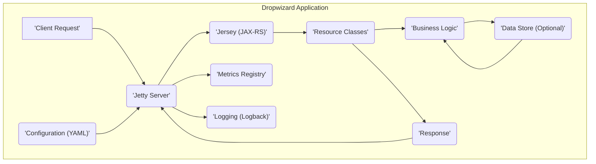
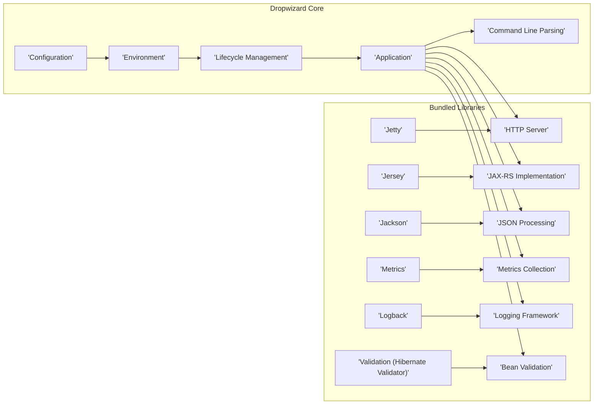
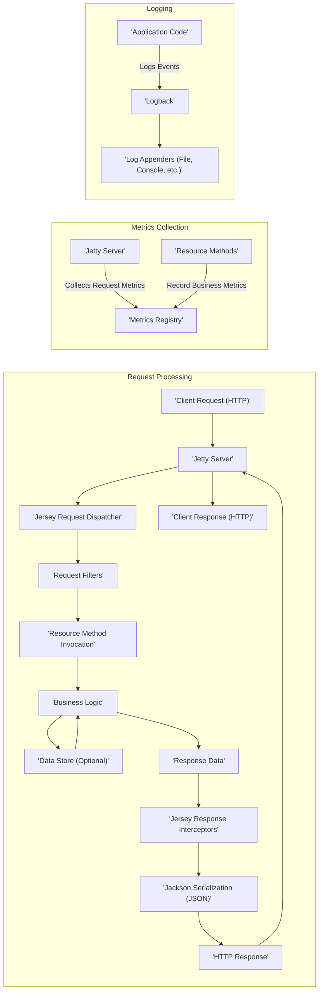

# Project Design Document: Dropwizard Framework

**Version:** 1.1
**Date:** October 26, 2023
**Author:** AI Software Architect

## 1. Introduction

This document provides an enhanced and detailed architectural design of the Dropwizard framework. It elaborates on the key components, their interactions, data flow, and security considerations. This document serves as a robust foundation for subsequent threat modeling activities, offering a deeper understanding of the framework's inner workings.

Dropwizard is a Java framework specifically designed for building operationally mature, high-performance RESTful web services. It achieves this by carefully selecting and integrating stable, well-regarded libraries from the Java ecosystem into a cohesive and opinionated platform. This design document focuses on the intrinsic architectural elements of the Dropwizard framework itself, rather than the specific design of applications built utilizing it.

## 2. Goals and Objectives

The fundamental goals driving the design of the Dropwizard framework are:

* **Accelerated Development:** To provide a streamlined and efficient development experience tailored for building RESTful APIs quickly.
* **Operational Excellence:** To offer built-in, first-class support for critical operational aspects such as monitoring, metrics collection, and comprehensive logging.
* **High Performance:** To leverage performant and efficient underlying libraries capable of handling significant web traffic.
* **Proven Stability:** To bundle together mature, widely adopted, and reliable libraries, minimizing the risk of unexpected issues.
* **Simplified Configuration:** To provide a robust, flexible, and easily manageable configuration mechanism.

## 3. System Architecture

### 3.1. High-Level Architecture

**Description:**

* **'Client Request'**: An incoming HTTP request initiated by a client application.
* **'Jetty Server'**: The embedded HTTP server component responsible for accepting and managing incoming client requests.
* **'Jersey (JAX-RS)'**: The implementation of the JAX-RS (Java API for RESTful Web Services) specification, handling request routing to appropriate resource classes and managing the serialization/deserialization of request and response data.
* **'Resource Classes'**: User-defined Java classes that are annotated to define specific API endpoints and contain the application's core business logic for handling those endpoints.
* **'Business Logic'**: The core application logic within the resource classes that processes incoming requests, performs necessary operations, and interacts with data sources.
* **'Data Store (Optional)'**: An external persistent storage mechanism, such as a database, that the application may interact with to store or retrieve data.
* **'Response'**: The HTTP response generated by the application after processing a request.
* **'Metrics Registry'**: A central component for collecting, storing, and exposing various application metrics, providing insights into the application's performance and health.
* **'Logging (Logback)'**: The logging framework integrated into Dropwizard, responsible for recording application events, errors, and informational messages.
* **'Configuration (YAML)'**: An external configuration file, typically in YAML format, used to define and customize the behavior of the Dropwizard application and its components.

### 3.2. Detailed Component Architecture

**Description:**

* **Dropwizard Core:**
    * **'Configuration'**: The component responsible for loading, parsing, and managing the application's configuration, typically from YAML files, but also supporting environment variables and system properties. It provides a structured and type-safe way to access configuration parameters.
    * **'Environment'**: Provides access to the runtime environment of the Dropwizard application, including information about the application's configuration and lifecycle.
    * **'Lifecycle Management'**: Manages the startup and shutdown processes of the Dropwizard application and its constituent components, ensuring proper initialization and resource cleanup.
    * **'Application'**: The central entry point and orchestrator for the Dropwizard application. It initializes and wires together the various components, including the bundled libraries and user-defined resources.
    * **'Command Line Parsing'**: Handles the parsing of command-line arguments passed to the application during startup, allowing for customization of application behavior.

* **Bundled Libraries:**
    * **'Jetty'**: The embedded, high-performance HTTP server that listens for and handles incoming network requests. Dropwizard leverages Jetty's robust capabilities for managing connections and processing HTTP traffic.
    * **'Jersey'**: The chosen JAX-RS implementation within Dropwizard. It facilitates the development of RESTful APIs by handling request routing, parameter extraction, and content negotiation based on JAX-RS annotations.
    * **'Jackson'**: A powerful and widely used Java library for serializing Java objects to JSON (and other data formats) and deserializing JSON back into Java objects. Dropwizard relies on Jackson for handling request and response body transformations.
    * **'Metrics'**: A library for collecting and exposing various application metrics. Dropwizard integrates Metrics to provide insights into application performance, health, and resource utilization. These metrics can be exposed through various reporters.
    * **'Logback'**: The logging framework used by Dropwizard for recording application events. Logback offers features like configurable logging levels, appenders for directing log output to different destinations, and flexible log formatting.
    * **'Validation (Hibernate Validator)'**: The implementation of the Bean Validation (JSR 303/349/380) specification used for validating data. Dropwizard integrates Hibernate Validator to enable declarative validation of request parameters and data objects.

## 4. Key Components and Interactions

* **'Configuration'**:
    * Loads application settings from YAML files, environment variables, and system properties, with precedence rules.
    * Provides a type-safe configuration tree, allowing developers to access configuration values as strongly-typed objects.
    * Optionally supports watching configuration files for changes and dynamically reloading the application with new settings.

* **'Jetty Server'**:
    * Listens for incoming HTTP requests on a configurable port and IP address.
    * Manages a pool of threads to handle concurrent requests efficiently.
    * Supports secure communication via TLS/SSL, configurable through the application's YAML file.
    * Integrates with Dropwizard's health check mechanism to report the server's status.

* **'Jersey (JAX-RS)'**:
    * Receives requests from Jetty and routes them to the appropriate resource methods based on the request URI and HTTP method.
    * Handles the extraction of request parameters from the URI, query parameters, and request body.
    * Performs content negotiation to determine the appropriate format for request and response bodies (e.g., JSON, XML).
    * Applies request and response filters and interceptors to modify or inspect requests and responses.

* **'Resource Classes'**:
    * Annotated with JAX-RS annotations (e.g., `@Path`, `@GET`, `@POST`) to define API endpoints and the HTTP methods they handle.
    * Contain the core business logic for processing requests, often interacting with other services or data stores.
    * Return Java objects that are then serialized into the response body by Jackson.

* **'Jackson'**:
    * Serializes Java objects into JSON format for sending responses to clients.
    * Deserializes JSON request bodies into Java objects for processing by resource methods.
    * Can be customized with custom serializers and deserializers to handle specific data types or formatting requirements.
    * Supports data binding and object mapping.

* **'Metrics'**:
    * Provides a registry for storing various metrics, such as counters, gauges, histograms, and meters.
    * Automatically collects metrics about HTTP requests handled by Jetty.
    * Allows developers to instrument their code to record custom application-specific metrics.
    * Exposes metrics through various reporters, including JMX, console output, and HTTP endpoints (e.g., `/metrics`).

* **'Logback'**:
    * Allows developers to log events at different severity levels (e.g., DEBUG, INFO, WARN, ERROR).
    * Configurable through XML or Groovy configuration files.
    * Supports various appenders for directing log output to different destinations, such as files, the console, or remote logging services.
    * Provides features like log rotation and filtering.

* **'Validation (Hibernate Validator)'**:
    * Enables declarative validation of request data by annotating Java bean properties with validation constraints (e.g., `@NotNull`, `@Size`, `@Min`).
    * Automatically validates request parameters and request bodies before they reach the resource method.
    * Provides detailed validation error messages when constraints are violated.

## 5. Data Flow

**Description:**

* **Request Processing:**
    * **'Client Request (HTTP)'**: An HTTP request is initiated by a client and sent to the Dropwizard application.
    * **'Jetty Server'**: The embedded Jetty server receives the incoming HTTP request.
    * **'Jersey Request Dispatcher'**: Jetty forwards the request to the Jersey request dispatcher, which is responsible for routing the request to the appropriate resource method.
    * **'Request Filters'**: Jersey applies any configured request filters, which can modify or inspect the request before it reaches the resource method.
    * **'Resource Method Invocation'**: The appropriate resource method in a resource class is invoked based on the request URI and HTTP method.
    * **'Business Logic'**: The business logic within the resource method is executed, potentially involving interactions with external services or a data store.
    * **'Data Store (Optional)'**: The business logic may interact with a data store to retrieve or persist data.
    * **'Response Data'**: The business logic generates the data that will be sent back to the client in the response.
    * **'Jersey Response Interceptors'**: Jersey applies any configured response interceptors, which can modify or inspect the response before it is sent.
    * **'Jackson Serialization (JSON)'**: The response data is serialized into JSON format using the Jackson library.
    * **'HTTP Response'**: Jersey constructs the HTTP response, including headers and the JSON response body.
    * **'Jetty Server'**: Jetty sends the HTTP response back to the client.
    * **'Client Response (HTTP)'**: The client receives the HTTP response.

* **Metrics Collection:**
    * **'Jetty Server'**: The Jetty server automatically collects metrics related to incoming requests, such as request rates, response times, and error counts.
    * **'Metrics Registry'**: Jetty pushes these collected metrics to the central Metrics Registry.
    * **'Resource Methods'**: Developers can instrument their resource methods to record custom business-specific metrics.
    * **'Metrics Registry'**: These custom metrics are also stored in the Metrics Registry.

* **Logging:**
    * **'Application Code'**: Throughout the application code, developers use the Logback API to log events at various severity levels.
    * **'Logback'**: Logback receives these log events.
    * **'Log Appenders (File, Console, etc.)'**: Logback routes the log events to the configured appenders, which determine where the logs are written (e.g., to a file, the console, or a remote logging system).

## 6. Security Considerations

This section details potential security considerations inherent within the Dropwizard framework itself. Security aspects of applications built *using* Dropwizard are addressed by the developers of those applications and are outside the direct scope of this document.

* **Dependency Vulnerabilities:**
    * Dropwizard relies on numerous third-party libraries. Security vulnerabilities discovered in these dependencies could potentially impact Dropwizard applications.
    * **Mitigation:** Regularly update Dropwizard to benefit from security patches in its dependencies. Employ dependency scanning tools to identify known vulnerabilities.

* **Configuration Management Security:**
    * Sensitive information, such as database credentials, API keys, and secrets, may be present in configuration files.
    * **Mitigation:** Store sensitive configuration data securely using environment variables, secrets management services (e.g., HashiCorp Vault, AWS Secrets Manager), or encrypted configuration files. Implement strict access control for configuration files. Avoid hardcoding sensitive information.

* **Jetty Server Security Configuration:**
    * Misconfiguration of the embedded Jetty server can introduce security risks.
    * **Mitigation:** Properly configure TLS/SSL for encrypted communication. Set appropriate timeouts to prevent denial-of-service attacks. Limit request sizes to prevent resource exhaustion. Disable unnecessary features and protocols.

* **Jersey (JAX-RS) Security:**
    * Improper handling of user input can lead to injection vulnerabilities (e.g., SQL injection, cross-site scripting).
    * **Mitigation:** Implement robust input validation and sanitization. Utilize Jersey's security features, such as authentication and authorization mechanisms. Be aware of potential vulnerabilities in the JAX-RS implementation itself.

* **Jackson Deserialization Vulnerabilities:**
    * Deserializing untrusted data with Jackson can lead to remote code execution vulnerabilities if polymorphic type handling is not configured securely.
    * **Mitigation:** Configure Jackson to only deserialize expected types. Avoid enabling default typing without careful consideration. Implement custom deserializers with security in mind.

* **Metrics Endpoint Security:**
    * The metrics endpoint exposes valuable information about the application's internal state, which could be exploited by attackers.
    * **Mitigation:** Secure access to the metrics endpoint using authentication and authorization. Consider exposing metrics only on internal networks.

* **Logging Sensitive Information:**
    * Logging sensitive data can expose it to unauthorized access.
    * **Mitigation:** Avoid logging sensitive information. If necessary, implement redaction or masking of sensitive data in logs. Secure access to log files.

* **Command Line Argument Exposure:**
    * Passing sensitive information as command-line arguments can expose it in process listings.
    * **Mitigation:** Avoid passing sensitive information as command-line arguments. Use environment variables or configuration files instead.

## 7. Deployment Model

Dropwizard applications are typically packaged and deployed as self-executable JAR files (often referred to as "fat JARs" or "uber JARs") that bundle all necessary dependencies, including the embedded Jetty server. This simplifies deployment and eliminates dependency conflicts.

Common deployment options include:

* **Deployment on Bare Metal or Virtual Machines:** The JAR file can be directly executed on a physical server or a virtual machine with a Java Runtime Environment (JRE) installed. This is a straightforward approach for simple deployments.
    * **Considerations:** Requires manual management of the underlying operating system and JRE. Scaling can be more complex.

* **Containerization (Docker, Kubernetes):** Packaging the Dropwizard application into a Docker container allows for consistent and reproducible deployments across different environments. Orchestration platforms like Kubernetes can manage and scale containerized Dropwizard applications.
    * **Considerations:** Requires familiarity with containerization technologies. Adds a layer of abstraction but simplifies scaling and management.

* **Cloud Platform Deployment (AWS, Azure, GCP):** Cloud providers offer various services for deploying and managing Java applications, such as virtual machines, container services (e.g., AWS ECS, Azure Container Instances, Google Kubernetes Engine), and platform-as-a-service (PaaS) offerings.
    * **Considerations:** Leverages the scalability and reliability of cloud infrastructure. Requires understanding of the specific cloud platform's services and deployment models.

## 8. Technologies Used

* **Java (Programming Language):** The primary language for developing Dropwizard applications.
* **YAML (Configuration Language):** Used for defining application configuration.
* **Jetty (Embedded HTTP Server):** Handles incoming HTTP requests.
* **Jersey (JAX-RS Implementation):** Facilitates the development of RESTful APIs.
* **Jackson (JSON Processing Library):** Used for serializing and deserializing JSON data.
* **Metrics (Metrics Collection Library):** Provides tools for collecting and exposing application metrics.
* **Logback (Logging Framework):** Manages application logging.
* **Hibernate Validator (Bean Validation Library):** Enables declarative data validation.

## 9. Future Considerations

* **Adoption of newer Java versions and language features.**
* **Exploration of reactive programming paradigms for improved concurrency and performance.**
* **Further enhancements to the built-in metrics and health check capabilities.**
* **Improved support for distributed tracing and observability.**
* **Continued focus on security best practices and integration of security-focused libraries.**

This enhanced design document provides a more in-depth understanding of the Dropwizard framework's architecture, components, data flow, and security considerations. This detailed information is crucial for conducting thorough threat modeling exercises and building secure and robust applications with Dropwizard.