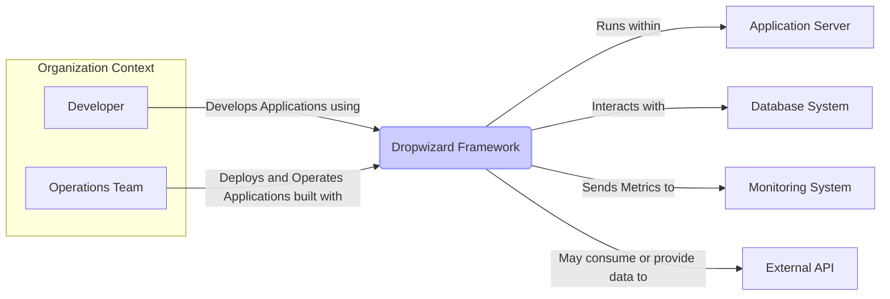
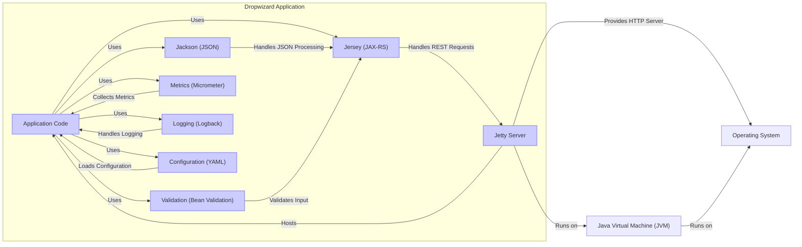
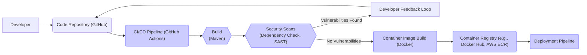

# BUSINESS POSTURE

- Business Priorities and Goals:
  - Goal: To provide a robust, efficient, and developer-friendly framework for building RESTful web services in Java.
  - Priority: Ease of development and operation, focusing on convention over configuration to accelerate development cycles.
  - Priority: Production readiness, including built-in support for metrics, logging, configuration management, and operational tools.
  - Priority: Performance and scalability for handling web service requests.
  - Priority: Stability and reliability of the framework itself and applications built with it.

- Business Risks:
  - Risk: Security vulnerabilities in the framework or its dependencies could compromise applications built with Dropwizard.
  - Risk: Operational issues due to misconfiguration or lack of understanding of Dropwizard's features.
  - Risk: Performance bottlenecks in applications if not properly designed or configured within the Dropwizard framework.
  - Risk: Compatibility issues with newer Java versions or other libraries over time if the framework is not actively maintained.
  - Risk: Adoption risk if developers find the framework too opinionated or lacking in specific features compared to alternative frameworks.

# SECURITY POSTURE

- Existing Security Controls:
  - security control: Dependency Management: Dropwizard uses Maven for dependency management, allowing for control over included libraries and versions. (Implemented in pom.xml)
  - security control: Secure Defaults: Dropwizard aims to provide secure defaults for configurations, reducing the likelihood of common security misconfigurations. (Described in documentation and framework design)
  - security control: Logging: Integrated logging framework (Logback) allows for security event logging and auditing. (Implemented in Dropwizard core and application configuration)
  - security control: Metrics: Integrated metrics framework (Micrometer) can be used to monitor application behavior and detect anomalies that might indicate security issues. (Implemented in Dropwizard core and application configuration)
  - security control: HTTPS Support: Dropwizard supports configuring Jetty to use HTTPS for secure communication. (Described in documentation and Jetty configuration)
  - security control: Input Validation: Encourages input validation within application code, although not enforced by the framework itself. (Best practice, application developer responsibility)
  - security control: Authentication and Authorization: Provides building blocks and guidance for implementing authentication and authorization within applications. (Described in documentation and examples)

- Accepted Risks:
  - accepted risk: Reliance on Third-Party Libraries: Dropwizard depends on numerous third-party libraries, inheriting their vulnerabilities and requiring ongoing monitoring and updates.
  - accepted risk: Developer Security Awareness: Security of applications built with Dropwizard heavily relies on the security awareness and practices of the developers using the framework.
  - accepted risk: Configuration Security: Misconfiguration of Dropwizard applications can lead to security vulnerabilities, requiring careful configuration management.
  - accepted risk: Application-Level Security: Dropwizard provides the foundation, but application-specific security measures (like business logic security, data protection) are the responsibility of the application developers.

- Recommended Security Controls:
  - security control: Automated Dependency Scanning: Implement automated scanning of dependencies for known vulnerabilities as part of the build process.
  - security control: Static Application Security Testing (SAST): Integrate SAST tools into the build pipeline to identify potential security flaws in the application code.
  - security control: Dynamic Application Security Testing (DAST): Perform DAST on deployed Dropwizard applications to identify runtime vulnerabilities.
  - security control: Security Code Reviews: Conduct regular security code reviews to identify and address security issues in application code.
  - security control: Security Training for Developers: Provide security training to developers using Dropwizard to promote secure coding practices.
  - security control: Penetration Testing: Perform periodic penetration testing of deployed Dropwizard applications to identify exploitable vulnerabilities.

- Security Requirements:
  - Authentication:
    - Requirement: Support for various authentication mechanisms (e.g., OAuth 2.0, JWT, Basic Auth) should be easily implementable within Dropwizard applications.
    - Requirement: Framework should provide clear guidance and examples for implementing secure authentication.
    - Requirement: Consider integration with existing identity providers for centralized authentication.
  - Authorization:
    - Requirement: Support for role-based access control (RBAC) or attribute-based access control (ABAC) should be easily implementable within Dropwizard applications.
    - Requirement: Framework should provide clear guidance and examples for implementing secure authorization.
    - Requirement: Authorization decisions should be consistently enforced across the application.
  - Input Validation:
    - Requirement: Framework should encourage and facilitate input validation at all application boundaries.
    - Requirement: Provide mechanisms to easily validate request parameters, headers, and request bodies.
    - Requirement: Protect against common input validation vulnerabilities like injection attacks (SQL injection, XSS, etc.).
  - Cryptography:
    - Requirement: Support for secure storage of sensitive data (e.g., passwords, API keys) using strong encryption algorithms.
    - Requirement: Support for secure communication using TLS/SSL.
    - Requirement: Provide libraries or integrations for common cryptographic operations (e.g., hashing, encryption, digital signatures).
    - Requirement: Guidance on proper key management practices within Dropwizard applications.

# DESIGN

## C4 CONTEXT



- Context Diagram Elements:
  - - Name: Developer
    - Type: Person
    - Description: Software developers who use the Dropwizard framework to build web applications and services.
    - Responsibilities: Writing application code, configuring Dropwizard, building and testing applications.
    - Security controls: Code reviews, secure coding training, access control to development environments.
  - - Name: Operations Team
    - Type: Person
    - Description: Team responsible for deploying, managing, and monitoring applications built with Dropwizard in production environments.
    - Responsibilities: Deploying applications, managing infrastructure, monitoring application performance and health, incident response.
    - Security controls: Access control to production environments, infrastructure security hardening, monitoring and alerting systems.
  - - Name: Dropwizard Framework
    - Type: Software System
    - Description: A Java framework for building RESTful web services, providing bundled libraries and conventions for development and operations.
    - Responsibilities: Providing a foundation for building web applications, handling HTTP requests, routing, configuration management, metrics, logging.
    - Security controls: Secure defaults, dependency management, HTTPS support, logging and metrics capabilities.
  - - Name: Application Server
    - Type: Software System
    - Description: The runtime environment where Dropwizard applications are deployed and executed, typically a Java application server like Jetty (embedded in Dropwizard) or a standalone server.
    - Responsibilities: Hosting and running Dropwizard applications, managing application lifecycle, providing resources (CPU, memory, network).
    - Security controls: Server hardening, access control, security patching, resource management.
  - - Name: Database System
    - Type: Software System
    - Description: Databases used by Dropwizard applications to store and retrieve data, such as relational databases (PostgreSQL, MySQL) or NoSQL databases (MongoDB, Cassandra).
    - Responsibilities: Data persistence, data retrieval, data integrity, data security.
    - Security controls: Database access control, encryption at rest and in transit, database hardening, regular backups.
  - - Name: Monitoring System
    - Type: Software System
    - Description: Systems used to monitor the health, performance, and security of Dropwizard applications, such as Prometheus, Grafana, or cloud-based monitoring solutions.
    - Responsibilities: Collecting metrics, logs, and traces, providing dashboards and alerts, enabling observability.
    - Security controls: Access control to monitoring data, secure data transmission, audit logging of monitoring activities.
  - - Name: External API
    - Type: Software System
    - Description: External services or APIs that Dropwizard applications may interact with to consume data or perform actions, such as third-party APIs, microservices, or legacy systems.
    - Responsibilities: Providing external functionalities or data, integration with other systems.
    - Security controls: API authentication and authorization, secure communication (HTTPS), input validation of external data, rate limiting.

## C4 CONTAINER



- Container Diagram Elements:
  - - Name: Application Code
    - Type: Container - Code
    - Description: The custom Java code developed for the specific application, including resource classes, services, data access objects, and business logic.
    - Responsibilities: Implementing application-specific functionalities, handling business logic, interacting with data storage, defining REST endpoints.
    - Security controls: Input validation, authorization checks, secure coding practices, vulnerability scanning (SAST).
  - - Name: Jetty Server
    - Type: Container - Web Server
    - Description: An embedded Jetty web server that hosts the Dropwizard application, handles HTTP requests and responses, and manages network connections.
    - Responsibilities: HTTP request handling, web server functionalities, TLS/SSL termination, connection management.
    - Security controls: HTTPS configuration, security hardening, access logging, rate limiting (can be configured).
  - - Name: Jersey (JAX-RS)
    - Type: Container - Framework
    - Description: The JAX-RS implementation used by Dropwizard for building RESTful APIs, handling request routing, resource management, and content negotiation.
    - Responsibilities: REST endpoint management, request routing, JAX-RS features, integration with other Dropwizard components.
    - Security controls: Input validation (through Bean Validation), exception handling, secure configuration.
  - - Name: Jackson (JSON)
    - Type: Container - Library
    - Description: A Java library for JSON processing, used by Dropwizard for serializing and deserializing JSON data in REST requests and responses.
    - Responsibilities: JSON serialization and deserialization, data binding, JSON processing.
    - Security controls: Protection against JSON vulnerabilities (e.g., denial of service), secure configuration.
  - - Name: Validation (Bean Validation)
    - Type: Container - Library
    - Description: Bean Validation (JSR 380) implementation used for validating input data based on annotations, ensuring data integrity and preventing injection attacks.
    - Responsibilities: Input validation, data integrity, enforcing data constraints.
    - Security controls: Input validation rules, error handling, preventing invalid data from being processed.
  - - Name: Metrics (Micrometer)
    - Type: Container - Library
    - Description: A metrics collection library used by Dropwizard to gather application metrics, providing insights into performance and health, and enabling monitoring and alerting.
    - Responsibilities: Metrics collection, exposing metrics data, integration with monitoring systems.
    - Security controls: Access control to metrics endpoints, secure transmission of metrics data.
  - - Name: Logging (Logback)
    - Type: Container - Library
    - Description: A logging library used by Dropwizard for application logging, recording events, errors, and audit trails for debugging, monitoring, and security auditing.
    - Responsibilities: Logging application events, error logging, audit logging, log management.
    - Security controls: Secure logging configuration, log rotation, protection of log data, secure transmission of logs to central logging systems.
  - - Name: Configuration (YAML)
    - Type: Container - Configuration
    - Description: YAML-based configuration management in Dropwizard, allowing for externalized configuration of application settings, including security parameters.
    - Responsibilities: Application configuration, managing settings, externalizing configuration.
    - Security controls: Secure storage of configuration files, access control to configuration files, secure configuration parameters (e.g., encrypted passwords).
  - - Name: Operating System
    - Type: Infrastructure
    - Description: The underlying operating system on which the JVM and Dropwizard application run (e.g., Linux, Windows).
    - Responsibilities: Providing system resources, process management, file system access, network access.
    - Security controls: OS hardening, security patching, access control, firewall configuration.
  - - Name: Java Virtual Machine (JVM)
    - Type: Infrastructure
    - Description: The Java Virtual Machine that executes the Dropwizard application code, providing a runtime environment and managing memory and resources.
    - Responsibilities: Executing Java bytecode, memory management, garbage collection, runtime environment.
    - Security controls: JVM security settings, security updates, resource management.

## DEPLOYMENT

- Deployment Options:
  - Option 1: On-Premise Servers: Deploying Dropwizard applications on physical or virtual servers within an organization's own data center.
  - Option 2: Cloud Platforms (IaaS): Deploying Dropwizard applications on cloud infrastructure as a service (IaaS) platforms like AWS EC2, Azure VMs, or Google Compute Engine.
  - Option 3: Containerized Deployment (PaaS/CaaS): Deploying Dropwizard applications as Docker containers on container orchestration platforms like Kubernetes, AWS ECS, or Azure Kubernetes Service.

- Detailed Deployment Architecture (Containerized Deployment on Kubernetes):

```mermaid
flowchart LR
    subgraph "Kubernetes Cluster"
        subgraph "Nodes"
            A["Node 1"]
            B["Node 2"]
        end
        C["Load Balancer"]
        D[("Dropwizard Application Pod 1")]
        E[("Dropwizard Application Pod 2")]
        F[("Dropwizard Application Pod 3")]
        G["Database Service"]
        H["Monitoring Agent"]
    end
    I["External User"]

    style D fill:#ccf,stroke:#99f,stroke-width:2px
    style E fill:#ccf,stroke:#99f,stroke-width:2px
    style F fill:#ccf,stroke:#99f,stroke-width:2px

    C -- "Forwards Requests to" --> D & E & F
    I -- "Accesses Application via" --> C
    D & E & F -- "Connects to" --> G
    A -- "Runs" --> D & H
    B -- "Runs" --> E & F & H
    H -- "Sends Metrics to" --> "Monitoring System"

    subgraph "Node 1"
        D
        H1["Monitoring Agent Instance"]
    end
    H --> H1
    subgraph "Node 2"
        E
        F
        H2["Monitoring Agent Instance"]
    end
    H --> H2

    classDef highlight fill:#fdd,stroke:#f99,stroke-width:2px
```

- Deployment Diagram Elements:
  - - Name: Kubernetes Cluster
    - Type: Environment
    - Description: A Kubernetes cluster providing a container orchestration platform for deploying and managing Dropwizard applications.
    - Responsibilities: Container orchestration, application scaling, service discovery, load balancing, infrastructure management.
    - Security controls: Kubernetes RBAC, network policies, pod security policies, cluster security hardening, regular security audits.
  - - Name: Nodes (Node 1, Node 2)
    - Type: Infrastructure - Server
    - Description: Worker nodes in the Kubernetes cluster where Dropwizard application pods and other containers are deployed and executed.
    - Responsibilities: Running containers, providing compute resources, network connectivity, storage access.
    - Security controls: OS hardening, container runtime security, node security patching, access control, network segmentation.
  - - Name: Load Balancer
    - Type: Infrastructure - Network
    - Description: A load balancer distributing incoming traffic across multiple instances of the Dropwizard application pods, ensuring high availability and scalability.
    - Responsibilities: Traffic distribution, load balancing, health checks, TLS termination (optional).
    - Security controls: HTTPS termination, DDoS protection, access control, security configuration.
  - - Name: Dropwizard Application Pods (Pod 1, Pod 2, Pod 3)
    - Type: Container - Application Instance
    - Description: Instances of the Dropwizard application running as containers within Kubernetes pods, providing the application's functionalities.
    - Responsibilities: Handling application requests, executing business logic, interacting with databases and other services.
    - Security controls: Container image security scanning, least privilege container configuration, application-level security controls (authentication, authorization, input validation).
  - - Name: Database Service
    - Type: Service - Data Storage
    - Description: A database service (e.g., PostgreSQL, MySQL) running within or outside the Kubernetes cluster, used by the Dropwizard application for data persistence.
    - Responsibilities: Data storage, data retrieval, data management, data security.
    - Security controls: Database access control, encryption at rest and in transit, database hardening, regular backups, network segmentation.
  - - Name: Monitoring Agent
    - Type: Agent - Monitoring
    - Description: Monitoring agents (e.g., Prometheus exporters, Datadog agent) running on Kubernetes nodes, collecting metrics and logs from the Dropwizard application pods and the cluster.
    - Responsibilities: Metrics collection, log aggregation, monitoring data export.
    - Security controls: Secure agent configuration, access control to monitoring data, secure data transmission to monitoring systems.
  - - Name: External User
    - Type: Person/System
    - Description: Users or external systems accessing the Dropwizard application through the load balancer.
    - Responsibilities: Interacting with the application, consuming API endpoints.
    - Security controls: Authentication, authorization, rate limiting, input validation (from the application perspective).

## BUILD



- Build Process Description:
  - Developer commits code changes to the Code Repository (e.g., GitHub).
  - CI/CD Pipeline (e.g., GitHub Actions, Jenkins) is triggered automatically on code commits or pull requests.
  - Build Stage: The pipeline uses Maven to build the Dropwizard application, compile code, run unit tests, and package the application into a deployable artifact (e.g., JAR file).
  - Security Scans Stage: Automated security scans are performed:
    - Dependency Check: Scans project dependencies for known vulnerabilities.
    - Static Application Security Testing (SAST): Analyzes the application source code for potential security flaws.
  - Vulnerability Feedback Loop: If vulnerabilities are found during security scans, the pipeline fails, and feedback is provided to the developer to fix the issues.
  - Container Image Build Stage: If no vulnerabilities are found, a Docker container image is built, packaging the application artifact and necessary runtime environment.
  - Container Registry Stage: The built container image is pushed to a Container Registry (e.g., Docker Hub, AWS ECR) for storage and distribution.
  - Deployment Pipeline: The container image from the registry is then used by the deployment pipeline to deploy the application to target environments (e.g., Kubernetes cluster).

- Build Process Security Controls:
  - security control: Secure Code Repository: Using a secure code repository (e.g., GitHub) with access controls and audit logging.
  - security control: CI/CD Pipeline Security: Securing the CI/CD pipeline infrastructure, access controls, and pipeline configurations.
  - security control: Automated Build Process: Automating the build process to ensure consistency and repeatability, reducing manual errors.
  - security control: Dependency Scanning: Automated dependency scanning to identify and mitigate known vulnerabilities in third-party libraries.
  - security control: Static Application Security Testing (SAST): Integrating SAST tools to detect potential security flaws in the application code early in the development lifecycle.
  - security control: Container Image Scanning: Scanning container images for vulnerabilities before deployment.
  - security control: Secure Container Registry: Using a secure container registry with access controls and vulnerability scanning capabilities.
  - security control: Code Signing: Signing build artifacts and container images to ensure integrity and authenticity.
  - security control: Build Artifact Integrity Checks: Verifying the integrity of build artifacts and container images during deployment.

# RISK ASSESSMENT

- Critical Business Processes:
  - Business Process: Providing RESTful APIs for core business functionalities (e.g., user management, order processing, data access).
  - Business Process: Data processing and data exchange with external systems or partners.
  - Business Process: Internal application functionalities supporting business operations.

- Data Sensitivity:
  - Data Type: User Credentials (passwords, API keys) - Sensitivity: Highly Sensitive - Requires strong encryption and access control.
  - Data Type: Personal Identifiable Information (PII) - Sensitivity: Sensitive - Requires protection according to privacy regulations (e.g., GDPR, CCPA).
  - Data Type: Business Transaction Data - Sensitivity: Medium to High - Sensitivity depends on the nature of the business and data. Requires appropriate access control and data integrity measures.
  - Data Type: Application Logs and Metrics - Sensitivity: Low to Medium - May contain sensitive information depending on logging configuration. Requires access control and secure storage.
  - Data Type: Configuration Data (including database credentials, API keys) - Sensitivity: Highly Sensitive - Requires secure storage and access control.

# QUESTIONS & ASSUMPTIONS

- Questions:
  - What specific type of applications will be built using Dropwizard? (e.g., public facing APIs, internal microservices, data processing applications).
  - What are the specific security compliance requirements for applications built with Dropwizard? (e.g., PCI DSS, HIPAA, SOC 2).
  - What is the organization's risk appetite regarding security vulnerabilities in applications?
  - What existing security infrastructure and tools are already in place within the organization? (e.g., identity providers, security monitoring systems, vulnerability scanners).
  - What is the expected scale and performance requirements for applications built with Dropwizard?

- Assumptions:
  - Assumption: Dropwizard will be used to build RESTful web services.
  - Assumption: Security is a significant concern for applications built with Dropwizard.
  - Assumption: Applications will handle sensitive data, requiring appropriate security measures.
  - Assumption: The organization has a need for a structured and secure software development lifecycle.
  - Assumption: The target deployment environment will be a modern infrastructure, potentially including containerization and cloud platforms.